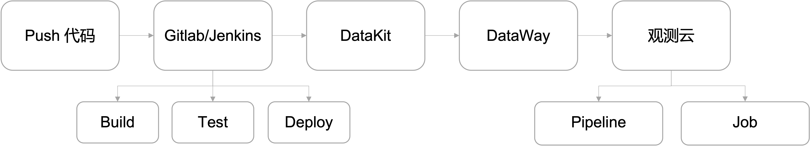

# 数据采集
---

## 简介

观测云支持为 Gitlab/Jenkins 内置的 CI 的过程和结果进行可视化，把 Gitlab/Jenkins 的 CI 过程通过开启采集器，将 Build、Test、Deploy 的过程产生的结果上报到 DataKit，通过 DataWay 数据网关处理后再上报到观测云。

## 前提条件

你需要先创建一个 [观测云账号](https://auth.guance.com/register?channel=帮助文档)，并在你的主机上 [安装 DataKit](../datakit/datakit-install.md)。

## 数据采集

DataKit 安装完成后，您可以在 DataKit 安装目录开启 [Gitlab](../integrations/gitlab.md)  / [Jenkins](../integrations/jenkins.md) 采集器，重启 DataKit 以后，即可获取 CI 相关数据。

