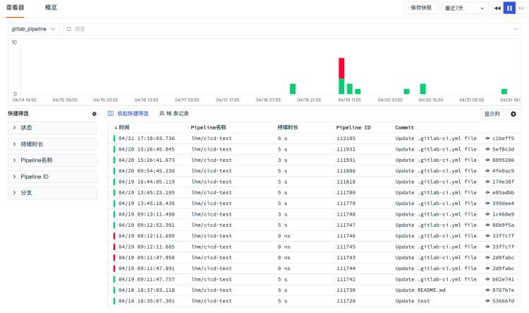
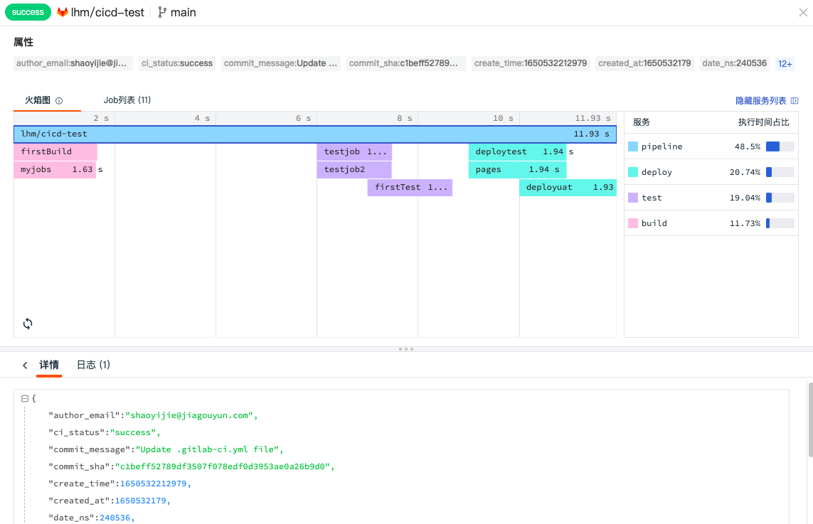
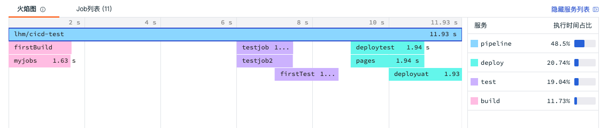
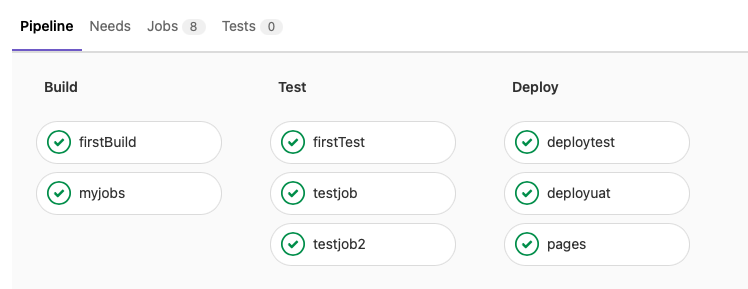
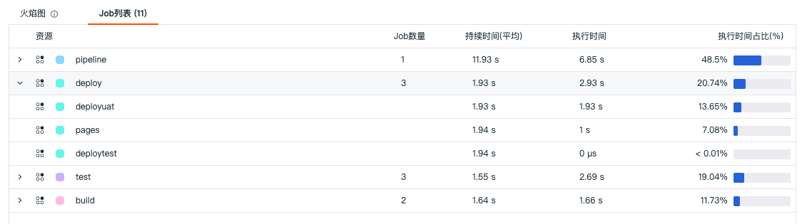
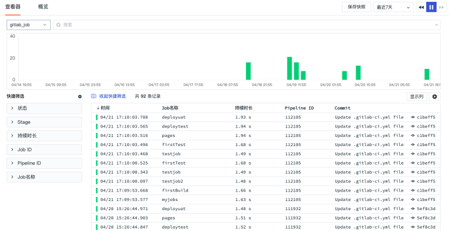
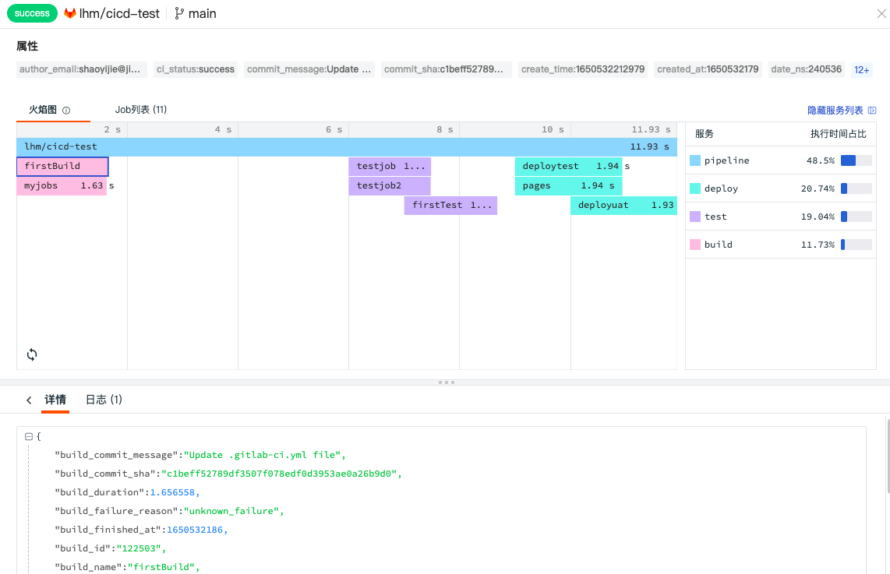
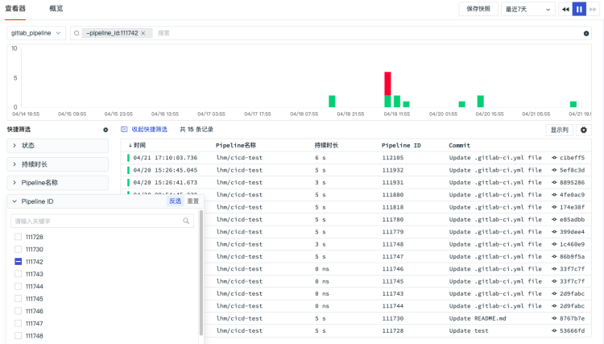
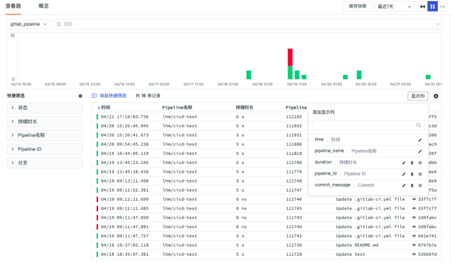
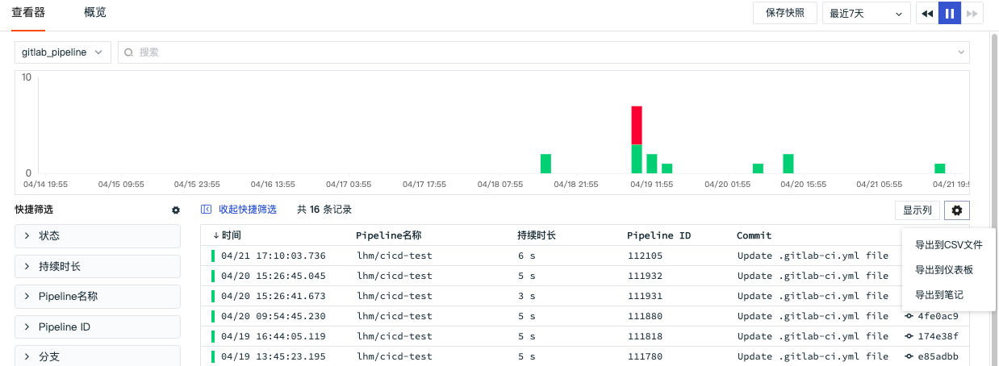

# CI 查看器
---

## 简介

观测云支持为 Gitlab 内置的 CI 的过程和结果进行可视化，您可以通过观测云的 CI 可视化功能直接查看在 Gitlab 的 CI 结果，包括 pipeline 和 job 的成功率、失败原因、具体失败环节，帮助您提供代码更新保障。

## Pipeline 查看器

通过左上角的数据类型筛选栏，您可以切换至「Pipeline 查看器」对CI Pipeline 的过程进行查询和分析，包括 Pipeline ID、名称、持续时长、提交内容、提交时间等等。

### Pipeline 详情页

点击 Pipeline 列表中的您需要查看的数据，在划出详情页中显示 Pipeline  和 Job  的详情，包括属性、火焰图、Job列表、内容详情、以及关联日志等。

#### 火焰图

火焰图可清晰展示 CI 过程中 Pipeline 整条链路中每个 Job 的流转和执行时间。你可以在火焰图右侧查看对应的服务列表及执行时间占比。点击火焰图的 pipeline 和 job ，在「详情」可查看对应的 Json 内容。

#### 火焰图说明

CI 可视化主要采集的是 CI 过程中 Pipeline 和 Job 的数据，Pipeline 的整个过程分成 Build、Test、Deploy 三个阶段（stage），每个阶段会有不同的任务（Job）。

- 当每个阶段的任务都正常完成，那这个 Pipeline 就成功执行完成，在火焰图上会列出整个 Pipeline 的执行时间和每个 Job 的执行时间。
- 当第一个阶段 Build 的任务执行发生错误，则会提示任务失败及错误原因。

为了方便理解，下图是 Gitlab CI 的 Pipeline 过程示例，对照以上火焰图，我们可以清楚的看到每个 Job 的执行时间，整个 Pipeline 完成的执行时间。

#### Job列表

展示 Pipeline 整条链路中所有的阶段及其 Job 数量，包括“资源名”、“ Job 数量” 、“执行时间”以及“执行时间占比”。点击任一 Job ，可在「详情」可查看对应的Json内容，若有错误，在 Job 的前显示错误提示。

## Job 查看器

通过左上角的数据类型筛选栏，您可以切换至「Job 查看器」对 CI Pipeline 的 Job 过程进行查询和分析，包括 Pipeline ID、Job 名称、持续时长、提交内容、提交时间等等。

### Job 详情页

点击 Job 列表中的您需要查看的数据，在划出详情页中显示 Pipeline 和 Job 的详情，包括属性、火焰图、Job列表、内容详情、以及关联日志等。

## 查询和分析

观测云支持通过选择时间范围、搜索关键字，筛选等方式查询和分析 Pipeline 和 Job。

- 时间范围：通过右上角的时间筛选组件，您可以筛选数据展示的时间范围
- 搜索：通过列表上方的搜索栏，您可以基于字段、文本进行关键词搜索、字段筛选、关联搜索，更多可参考 [查看器搜索说明](https://www.yuque.com/dataflux/doc/wi8yz6) 。
- 快捷筛选：您可以通过勾选快捷筛选的字段快速筛选数据，支持自定义添加筛选字段，支持通过“反选”进行快捷筛选，支持通过“重置”快速清除快捷筛选条件。

**注意：**

- 快速筛选的「持续时间」默认进度条最小值、最大值为链路数据列表里最小和最大的持续时间
- 支持拖动进度条调整最大/最小值，输入框中的值同步变化
- 支持手动输入最大/最小值，"按回车键"或"点击输入框外"进行过滤搜索
- 输入不规范时输入框变红，不进行搜索，正确格式：纯“数字”或“数字+ns/μs/ms/s/min”
- 若没有输入单位进行搜索，默认直接在输入的数字后面填入"s"然后进行过滤搜索
- 若手动输入单位，则直接进行搜索

## 自定义显示列

在查看器列表，通过「显示列」自定义添加、编辑、删除显示列。

## 数据导出

在查看器列表，您可以先筛选出想要的数据导出后进行查看和分析，支持导出到CSV文件、仪表板和笔记

