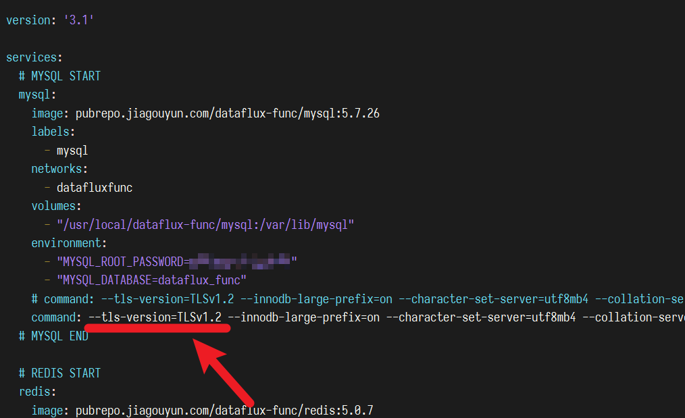

# 变更记录
---


## 1.6.12（2022-07-19 发布）

- *【重要】*从本版本开始，许可协议改为 AGPLv3
- 优化函数执行输出，增加内存分配峰值信息
- 编辑器参数支持多行编辑
- 修正简介页面文案
- 优化编辑器侧边栏行为
- UI 优化

## 1.6.11（2022-06-28 发布）

- 更新 CodeMirror 版本，修复代码滚动卡顿问题
- 调整部分页面

## 1.6.10（2022-06-21 发布）

- 修复文件上传相关处理失败的问题（此问题在`1.6.9`版本引入）

## 1.6.9（2022-06-17 发布）

- 授权链接调用提交非 JSON、文本数据类型时，改为使用 Base64 编码二进制数据

## 1.6.8（2022-06-17 发布）

优化`DataKit.query(...)`方法

## 1.6.7（2022-06-17 发布）

- 修复 API 示例生成的 curl 代码错误的问题

## 1.6.6（2022-06-17 发布）

- 授权链接调用支持非 JSON 数据类型

## 1.6.5（2022-06-15 发布）

- 修复 Helm 部署问题
- 部分代码调整
- 修复日志页面未能正确着色的问题

## 1.6.4（2022-06-14 发布）

- 修复全新安装时，数据库 DDL 不是最新版的问题

## 1.6.3（2022-06-14 发布）

- 修复 Helm 部署问题
- 优化配置文件兼容性
- 优化日志类表的回卷删除处理逻辑

## 1.6.2（2022-06-08 发布）

- 修复添加/修改数据源时，如数据源无响应导致队列堵塞的问题

## 1.6.1（2022-06-07 发布）

- 调整`docker-stack.yaml`文件，增加配置限制容器日志量

### 从旧版本升级

由于 DataFlux Func 升级程序不会修改已经安装的`docker-stack.yaml`文件，
因此，对于从旧版本升级到此版本的用户，需要自行在`{安装目录}/docker-stack.yaml`中添加相关的日志配置并重启系统。
参考配置如下：

```yaml
services:
  # 此处为示例，其他服务都要添加下述 logging 配置
  server:
    image : xxxxx
    labels: xxxxx
    # ... 其他配置不变的情况下，【增加】logging 配置
    logging:
      driver: json-file
      options:
        max-size: 10m # 容器最大保存 10MB 数据
        max-file: 10  # 切分为 10 个文件

# 其他部分略
```

*注意：在修改`docker-stack.yaml`前，请务必备份此文件*

## 1.6.0（2022-05-23 发布）

- 优化脚本市场 UI
- 优化`DFF.STORE`和`DFF.CACHE`处理
- 优化日志表回卷删除处理性能
- 优化缓存、包导入策略
- 调整脚本日志输出格式（去除年份、添加毫秒）
- 优化编辑器侧栏高亮跳转逻辑
- 授权链接支持调整任务记录数量
- 修复其他已知问题

## 1.5.17 ~ 1.5.18（2022-05-07 发布）

- 添加 Helm 相关配置

## 1.5.16（2022-05-05 发布）

- 添加`DFF.CACHE.keys(...)`用于获取缓存得键列表
- 调整部分 UI 样式
- 修复已知问题

## 1.5.14 ~ 1.5.15（2022-05-01 发布）

- 添加 markdown 库
- 修复 API 接口与配置文件中，有关`任务记录数量限制`不一致的问题

## 1.5.13（2022-04-26 发布）

- 修复数据库备份文件中时间和备份文件内时间不一致的问题
- 重构数据库自动备份处理
- 调整安装界面
- admin 用户 passwordHash 默认为空，且支持在 passwordHash 为 NULL 时使用用户名作为密码登录
- 添加开源组件说明文档（OPENSOURCE.md）

## 1.5.12（2022-04-23 发布）

- 授权链接增加近期任务记录
- 自动触发配置、批处理列表展示优化
- 近期任务记录优化

## 1.5.11（2022-04-22 发布）

- 搜素框允许不改变搜索内容的情况下点击图标执行再次搜索
- 修复搜索框历史记录回卷错误的问题
- 不同日志量用不同颜色展示
- 任务记录增加日志行数展示
- 调整依赖包
- 修复已知问题
- 调整部分 UI 样式

## 1.5.10（2022-04-12 发布）

- PIP 工具中，使用中科大为默认镜像

## 1.5.9（2022-04-11 发布）

- 修复安装/导入脚本集的问题

## 1.5.8（2022-04-11 发布）

- *【新功能】*系统管理员可以强制编辑被锁定的脚本、脚本集
- 被锁定的脚本、脚本集提供锁定者信息
- 去除代码编辑器页面的状态栏

## 1.5.7（2022-04-10 发布）

- 修复任务记录没有按照配置保留的问题
- 优化部分 UI

## 1.5.5 ~ 1.5.6（2022-03-30 发布）

- `docker-stack.yaml`配置文件中，`mysql`服务添加`--tls-version=TLSv1.2`选项
- 修复函数返回空 list，dict 时，实际授权链接返回空内容的问题
- 修复创建脚本时，脚本 ID 红字提示过长的问题
- 调整非 SA 用户页面权限控制
- 优化部分 UI

### 有关发布脚本/执行函数时发生`ERROR 2026 (HY000)`错误的解决

由于 Ubuntu 20.04 对 SSL 版本最低要求为 v1.2，旧版本 DataFlux Func 升级到此版本后，在发布/运行脚本时，可能会出现如下异常：

```
ERROR 2026 (HY000): SSL connection error: error:1425F102:SSL routines:ssl_choose_client_version:unsupported protocol
```

DataFlux Func 1.5.5 及以后版本已经内置了自动修改配置的处理，正常升级即可。

如果问题依然存在，可以尝试以下手动方式修复：

1. 打开`<安装目录>/docker-stack.yaml`文件（默认位置为`/usr/local/dataflux-func/docker-stack.yaml`）
2. 在 yaml 文件中找到`service` - `mysql` - `command`部分配置，添加`--tls-version=TLSv1.2`参数

参考修改方式如下：

```
# 将
command: --innodb-large-prefix=on （... 后略）

# 修改为
command: --tls-version=TLSv1.2 --innodb-large-prefix=on （... 后略）
```



## 1.5.4（2022-01-20 发布）

- 优化代码，提高自动触发配置列表/批处理列表页面打开速度

## 1.5.3（2022-01-19 发布）

- 任务记录数由原先最大值 10000 改为 500（过大的任务记录可能导致性能问题）

## 1.5.2（2022-01-19 发布）

- *【新功能】*容器内增加`HOST_HOSTNAME`环境变量，用于在脚本中获取宿主机 Hostname
- 修复已知集成 Crontab 执行问题

### 关于`HOST_HOSTNAME`环境变量

在脚本中，可以使用以下代码获取宿主机的 Hostname：

~~~python
import os
print(os.environ.get('HOST_HOSTNAME'))
~~~

*本功能通过在 Docker Stack YAML 文件中配置环境变量实现。如果从旧版本的 DataFlux Func 升级，则需要手动修改 YAML 文件才会有此环境变量。*

旧版本 DataFlux Func 也可以通过直接修改 Docker Stack YAML 文件实现上述功能，修改方法如下：

1. 打开 DataFlux Func 的 Docker Stack 配置文件

~~~shell
sudo vim <DataFlux Func 安装目录>/docker-stack.yaml
~~~

2. 为*所有`worker`*添加如下`environment`配置（[参考代码](https://gitee.com/dataflux/dataflux-func/blob/dev/docker-stack.example.yaml#L57)）：

~~~yaml
HOST_HOSTNAME: '{{.Node.Hostname}}'
~~~

3. 重启 DataFlux Func

## 1.5.1（2022-01-18 发布）

- 优化部分 UI 界面
- 修复批处理无法使用 POST 简化形式调用的问题

## 1.5.0（2022-01-18 发布）

*注意：如果您在 DataFlux Func 中使用到了「批处理」模块，请尽快升级到此版本*

- *【新功能】*自动触发任务、批处理任务支持指定任务记录数（默认 10，可选 1～10000）
- *【新功能】*`DFF.API(...)`增加`fixed_task_info_limit`参数（默认 10，可选 1～10000），配置了此参数的函数作为自动触发配置或批处理执行时，会固定保留所配置的任务记录数（与`fixed_crontab`类似）

### 子任务的任务记录数

当所执行函数包含大量子任务时，系统会确保最后一次主函数以及其下所有子任务的任务记录都会被记录。

> 假设：配置了自动触发配置任务记录数为 3，且当前已经记录了 3 个任务记录，所执行的函数会通过`DFF.FUNC(...)`调用额外的 10 个子函数

> 那么：最终任务记录数为`3 + 10 = 13`个任务记录

用户无需担心任务记录设置过小而导致子任务记录不全的问题（仅限最后一次主任务）

## 1.4.15（2022-01-05 发布）

- UI 调整：出于性能考虑，「函数缓存管理器」、「函数存储管理器」界面只支持预览小于 20KB 的数据
- 修复已知 UI 问题

## 1.4.13 ~ 1.4.14（2021-12-30 发布）

- UI 调整：任务记录 Exception 信息简介直接展示在列表中
- 脚本执行：调整 import 用户脚本的行为以符合 Python 原生 import 语句处理

## 1.4.12（2021-12-21 发布）

- 修复已知 UI 问题

## 1.4.11（2021-12-20 发布）

- 修复部分版本 MySQL 无法连接的问题

## 1.4.10（2021-12-15 发布）

- 修复系统指标中部分图表展示不合理的问题

## 1.4.9（2021-12-14 发布）

- 修复代码编辑器输出框中无法正确输出 emoji 的问题

## 1.4.8（2021-12-13 发布）

- 调整自动触发配置/批处理的任务记录：
    1. 每行日志最长 5 千字符（超过会被截断）
    2. 每次任务日志总量最长 5 万字符（超过会保留前 1 万、后 4 万个字符）
    3. 通过 API 接口创建的自动触发任务/批处理（如观测云监控处理），最多保留最近 10 次任务记录
    4. 通过 DataFlux Func 界面手工创建的自动触发任务/批处理，最多保留最近 300 次任务记录
- 自动触发配置/批处理的任务记录支持清空

> 参考：《老人与海》中文版全文约 4 万字

## 1.4.5 ~ 1.4.7（2021-12-09 发布）

- 修复自动触发配置/批处理任务记录中无法展示日志的问题
- 优化脚本市场展示
- 优化 UI

## 1.4.2 ~ 1.4.4（2021-12-02 发布）

- 优化 UI

## 1.4.1（2021-12-01 发布）

- 完善自动触发任务、批处理任务增加关联任务查看支持

## 1.4.0（2021-12-01 发布）

- *【新功能】*自动触发任务、批处理任务增加关联任务查看支持
- 优化 UI

## 1.3.14（2021-11-25 发布）

- 增加 arm64 下 Oracle 支持

## 1.3.13（2021-11-25 发布）

- SQL 类数据源不再提供数据库一级的浏览，改为直接展示数据库表

## 1.3.12（2021-11-25 发布）

- *【新功能】*新增异常请求记录功能
- 不再使用自定义中文字体
- 完善部分中英文翻译
- 修复 GET /api/v1/func-list 接口未能正确组装函数调用 URL 地址的问题
- 修复页面内存泄漏问题
- 修复其他已知问题

## 1.3.11（2021-11-11 发布）

- 优化在文件管理器，支持直接安装 Wheel 包，同时支持选择 PIP 镜像

## 1.3.10（2021-11-11 发布）

- *【新功能】*文件管理器中支持直接安装`.whl`包
- *【新功能】*新增`GET /api/v1/metrics`接口，用于输出符合 OpenMetric 协议的指标数据
- 修复在返回大量数据时产生的性能问题
- 修复 PIP 工具中无法安装包名带下划线的第三方包
- 默认 sa 用户名称改为`Administrator`
- 编辑器中直接运行函数的超时时间从 60 秒改为 45 秒，保证短于 nginx 默认的超时时间
- 函数运行记录表新增自动删除过时内容处理，减少数据库磁盘占用
- 调整部分 UI
- 修复其他已知问题
- 提示 Worker 基础处理性能

## 1.3.9（2021-10-27 发布）

- 修复无法正确对 DataKit 数据源保存、测试连通性的问题
- 部分 UI 调整

## 1.3.7 ~ 1.3.8（2021-10-20 发布）

- 优化了部分 UI 在 1280px 宽度展示下的效果

## 1.3.5 ~ 1.3.6（2021-10-19 发布）

- *【新功能】*新增「DataFlux Func Sidecar」功能

## 1.3.4（2021-10-15 发布）

- 修复 DFF.FUNC(...) 处理无法记录日志的问题
- 部分代码调整
- 部分 UI 调整

## 1.3.3（2021-10-14 发布）

- API 认证：固定字段 Header 字段认证时，不区分字段名大小写
- 调整 UI 展示，页面最小宽度为 1280；并增加了授权链接、自动触发配置；批处理的函数信息展示宽度
- 修复简单调试面板无法正确显示错误信息的问题
- API 认证配置中，认证函数配置添加示例代码提示

## 1.3.2（2021-10-07 发布）

- *【新功能】*新增「API 认证」模块功能，支持：
    - 验证请求中 Header、Query 或 Body 中的字段值
    - HTTP Basic 认证
    - HTTP Digest 认证
    - 自定义函数认证
- 修复 UI 侧栏项目点击范围过大，导致容易误点到相邻项目的问题
- 调整部分文案
- 优化内部 JSON 处理
- 补充测试用例，修复已知问题

## 1.3.1（2021-09-22 发布）

- 修复首次安装界面卡死的问题

## 1.3.0（2021-09-17 发布）

- *【新功能】* 新增 DFF.RESP_LARGE_DATA(...) 内置功能，在向客户端返回大型数据时提升性能
- 修复文件上传会产生`undefined`文件夹的问题
- 文件上传重名时，改为自动附带-2, -3 尾缀

## 1.2.1（2021-09-16 发布）

- 配合「DataFlux」产品更名为「观测云」进行文案、域名等调整（补充更新）

## 1.2.0（2021-09-16 发布）

- 配合「DataFlux」产品更名为「观测云」进行文案、域名等调整（DataFlux Func 本身并不参与更名）

## 1.1.17（2021-09-15 发布）

- 更换观测云版 Logo

## 1.1.16（2021-09-15 发布）

- 修复函数存储内容展示错误问题
- 为避免前端性能问题，函数缓存/存储管理器不再进行代码高亮
- 优化长文本查看处理逻辑

## 1.1.15（2021-09-15 发布）

- 优化函数缓存管理器 UI

## 1.1.14（2021-09-15 发布）

- 修复「在函数缓存键名中包含冒号时，函数缓存管理器无法正常使用」的问题

## 1.1.13（2021-09-14 发布）

- `InfluxDBHelper`开放`write_point(...)`和`write_points(...)`方法，用于写入数据点

## 1.1.12（2021-09-11 发布）

- 修复批处理任务信息未能正确保存的问题
- 修复自动触发配置列表中，将「禁用」写为「隐藏」的文案错误
- Celery Beat 内置输出日志级别改为`error`

## 1.1.11（2021-09-09 发布）

- `DFF.ENV(...)`函数添加默认值参数`default`
- `DFF.CONFIG(...)`函数添加默认值参数`default`

## 1.1.10（2021-09-08 发布）

- 修复已知问题

## 1.1.9（2021-09-07 发布）

- 配置文件增加`REDIS_USE_TLS`选项（`true`/`false`），用于满足 AWS ElasitCache 在配置密码后必须使用 TLS 方式连接的要求

## 1.1.8（2021-09-06 发布）

- 修复已知问题

## 1.1.7（2021-09-04 发布）

- 修复已知问题

## 1.1.6（2021-09-03 发布）

- 数据库 JSON 处理部分优化与 Mariadb 的兼容性
- 日志增加`hostname`字段输出；增加`LOG_TIMEZONE`配置可指定日志中时间的时区
- 优化自定义 ID 配置展示，增加 ID 只能为英数字中下划线和点的检查
- 优化网络错误提示，防止连续弹出网络错误提示
- 优化猴子补丁提示
- 清除缓存可以清除提示状态

## 1.1.5（2021-08-25 发布）

- 修复部分文案错误

## 1.1.4（2021-08-24 发布）

- 安装脚本增加自动检查上一次安装目录的功能

## 1.1.3（2021-08-24 发布）

- 修复页面被 Chrome 浏览器识别为英文的问题

## 1.1.2（2021-08-24 发布）

- 增加`aarch64`架构支持

## 1.1.0rc1 ~ 1.1.0rc72（2021-08-19 发布）

- 发布稳定预备版
- 导入/导出附带的授权链接、自动触发配置、批处理仅替换具有相同 ID 的数据
- API 调用示例不再提供「扁平」形式传参
- 增加页面级代码编辑器锁
- 增加文件服务功能
- 修复已知问题
- 优化 UI 展示
- 解决部分浏览器兼容问题
- 自动触发配置不再限制重复的配置
- 优化管理员工具，目前支持：

| 命令                                        | 用途               |
| ------------------------------------------- | ------------------ |
| `python admin-tool.py reset_admin`          | 重置管理员账号     |
| `python admin-tool.py reset_db_upgrade_seq` | 重置数据库更新序号 |
| `python admin-tool.py clear_redis`          | 清空 Redis         |

- 重构订阅处理，提高更强扩展订阅功能。目前支持订阅：
    - MQTT
    - Redis
- UI 界面支持为授权链接、自动触发配置和批处理添加/删除标签
- 添加 DataKit 数据源，并自动发现本地 DataKit
- 优化自带 MySQL 内存使用量
- 优化工作单元内存使用量
- 适配 MySQL 8.0
- 去除无用的包
- 优化文件上传处理
- 去除 Python 包在线查询（性能问题）
- 基础镜像改为`ubuntu:20.04`
- Python 版本改为`3.8`
- PIP 工具优化
- 脚本编辑器添加有关猴子补丁的提示说明
- 增加脚本市场功能
- 支持使用`import __<脚本名>`代替`import <本脚本集名>__<脚本名>`进行导入
- 增加脚本集克隆功能
- 自动触发配置支持手动执行
- 优化环境变量缓存处理
- 添加函数缓存管理器
- 添加函数存储管理器
- 添加系统日志查看器

## 1.0.59 ~ 1.0.60（2021-03-29 发布）

- `DFF.RESP(...)`分拆为 2 个函数：
    - 返回数据：`DFF.RSEP(data, status_code=None, content_type=None, headers=None, allow_304=False)`
    - 返回文件：`DFF.RESP_FILE(file_path, status_code=None, headers=None, allow_304=False, auto_delete=False, download=True)`
- 其他细节优化

## 1.0.58（2021-03-25 发布）

- 优化「文件工具」

## 1.0.57（2021-03-25 发布）

- 导出脚本集功能支持同时导出授权链接、自动触发配置、批处理
- 优化 UI 展示
- 增加国际化支持
    - 部分内容提供英文版界面
- 增加`reset-admin.py`脚本，用于重置 admin 用户密码（使用方式：`python reset-admin.py`）
- 添加 PIP 工具，支持在 UI 界面安装 Python 包
- 添加文件工具，支持在 UI 界面浏览等基本操作
- 添加更多`DFF.*`功能
    - `DFF.RSRC(...)`生成资源目录下文件的绝对路径
    - `DFF.RESP(...)`生成自定义 API 返回结果
- 导出的函数 API 支持自定义返回格式/内容（如返回 html 页面、下载文件等）
- 导出的函数 API 支持文件上传
- 调整额外安装第三方 Python 包的存放位置（现在为`{安装目录}/data/resources/extra-python-packages`）

## 1.0.55 ~ 1.0.56（2021-01-12 发布）

- Worker 添加内置库
    - Jinja2==2.11.2
    - Mako==1.1.3

## 1.0.51 ~ 1.0.54（2021-01-08 发布）

- 减少导入/导出脚本包，脚本库还原点时间线展示数量（最多 50）

## 1.0.47 ~ 1.0.50（2021-01-07 发布）

- 增加 MQTT 数据源支持
- 自动部署脚本优化，增加多个选项，详情见项目 README.md
- 修复已知 Bug

## 1.0.44（2020-12-10 发布）

- 修复在修改「授权链接」、「批处理」时，意外再次传递 ID 导致请求失败的问题

## 1.0.42 ~ 1.0.43（2020-12-10 发布）

- 增加内置脚本集的提示标签

## 1.0.41（2020-12-09 发布）

- 通过环境变量进行配置时，需要添加`DFF_`前缀。（如：环境变量`DFF_MYSQL_HOST`对应配置为`MYSQL_HOST`）

## 1.0.39 ~ 1.0.40（2020-12-09 发布）

- 修复文案问题

## 1.0.37 ~ 1.0.38（2020-12-04 发布）

- 缩减 0（系统）、7（调试）队列并发量，减少基础资源消耗

## 1.0.35 ~ 1.0.36（2020-12-03 发布）

- 为携带版提供 gzip 压缩

## 1.0.32 ~ 1.0.34（2020-12-03 发布）

- 配置项`MODE`值为`prod`（默认）时，不再输出 MySQL 和 Redis 的具体操作 SQL/命令
- 函数超时错误不再输出日志
- 脚本日志/脚本故障模块默认关闭
- 缩减错误堆栈信息数据，默认不输出每一帧的本地变量信息
- 自动部署脚本自动创建 logrotate 配置，并支持更换安装路径

## 1.0.31（2020-12-01 发布）

- 修复`DFF.FUNC(...)`未能正确传递变量的 BUG

## 1.0.30（2020-12-01 发布）

- DEBUG 任务现在默认发送到 7 号队列
- Docker Stack 文件中 Worker 拆分为 4 个：

| 队列编号 | 用途     |
| -------- | -------- |
| `0`      | 系统     |
| `1 ~ 6`  | 通用     |
| `7`      | 调试     |
| `8 ~ 9`  | CPU 密集 |

## 1.0.29（2020-12-01 发布）

- `@DFF.API`装饰器添加`hint`选项，可填写任意可序列化为 JSON 的内容，并在函数列表的`extraConfigJSON`字段中出现。

## 1.0.28（2020-11-29 发布）

- 修复自动备份功能意外将迁移数据一同备份的问题

## 1.0.25 ~ 1.0.27（2020-11-29 发布）

- 增加数据库自动备份功能
- 修复已知问题

## 1.0.24（2020-11-27 发布）

- 「授权链接」在添加时支持指定自定义 ID（但必须以`auln-`开头）
- 「批处理」在添加时支持指定自定义 ID（但必须以`bat-`开头）

## 1.0.23（2020-11-27 发布）

- 修复已知问题

## 1.0.21 ~ 1.0.22（2020-11-27 发布）

- 「成员管理」、「AccessKey 管理」移动到管理版块

## 1.0.20（2020-11-26 发布）

- 不再使用`DataFlux.f(x)`命名，统一使用`DataFlux Func`

## 1.0.19（2020-11-26 发布）

- 废除`EXTRA_PYTHON_IMPORT_PATH_LIST`配置，改为`EXTRA_PYTHON_IMPORT_PATH`（仅支持一个地址）。
- 修复已知故障

## 1.0.18（2020-11-20 发布）

- 添加队列压力计算模块，保护队列（仅针对同步调用）
    - 压力 <= 100 时：正常处理
    - 100 < 压力 < 200 时：按照 {压力 - 100}% 概率随机丢弃同步调用请求
- 「管理-总览」页面添加队列压力展示
- ID 字段改为`utf8mb4`编码
- 已添加的数据源可以测试连通性（添加「测试」按钮）
- 脚本上下文添加`_DFF_HTTP_REQUEST`，用于保存 HTTP 请求详情
- UI 调整/优化
- 修复已知问题

*注意：本次更新虽然修改了数据库修改编码，但不提供自动迁移功能。如保持 ID 字段为`ascii`编码不会影响系统运行，但列表页面的搜索功能将无法使用*

## 1.0.15 ~ 1.0.17（2020-11-06 发布）

- 调整 CD/CI 配置
- 调整任务队列命名及逻辑：
    - 去除`default`队列
    - `0`作为整个系统兜底默认队列，主要执行系统级任务
    - `1`作为函数执行的默认队列，函数默认在此队列中执行
    - 添加`WORKER_QUEUE_ALIAS_MAP`参数，支持队列别名，如：`cpu=9`表示，指定`queue='cpu'`时，函数运行在`9`队列
- 配置载入时，允许以`CUSTOM_`开头添加自定义配置。且脚本内可以访问`CUSTOM_`开头的配置
- 增强`DFF`对象：
    - 添加`DFF.STORE(key, scope=None)`访问方式
    - 添加`DFF.CACHE(key, scope=None)`访问方式
    - 增强`DFF.SRC`，添加以下功能
        - `DFF.SRC.list()`列出数据源
        - `DFF.SRC.save(...)`保存数据源
        - `DFF.SRC.delete(...)`删除数据源
    - 增强`DFF.ENV`，添加以下功能
        - `DFF.ENV.list()`列出环境变量
        - `DFF.ENV.save(...)`保存环境变量
        - `DFF.ENV.delete(...)`删除环境变量
    - 添加`DFF.CONFIG`用于访问自定义配置（`CUSTOM_`开头的配置项），包含
        - `DFF.CONFIG(...)` / `DFF.get(...)`获取配置
        - `DFF.list()`列出配置
    - 添加`DFF.API(integration='autoRun', integration_config={...})`配置，允许函数自动运行
        - `integration_config={ 'crontab': '* * * * *' }`函数定期自动执行
        - `integration_config={ 'onPublish': True }`函数发布后自动执行
        - `integration_config={ 'onLaunch': True }`系统启动时，函数自动执行
- 授权链接列表页面增加统计信息视图，包含
    - 近日调用次数
    - 近期响应速度（min, max, avg, mid）
    - 近期响应速度分布（p75, p95, p99)
- 添加`NSQ`数据源
- 调整编辑器左侧树状列表样式
- 脚本预览页面添加下载按钮（支持下载草稿、已发布、和 DIFF）
- 在函数使用了命名参数`**kwargs`时，API 示例、授权链接/批处理配置页面会展示相应允许自定义参数的提示
- 升级 WAT SDK，支持配置 HTTP 认证头
- 修复已知问题，优化代码

## 1.0.11 ~ 1.0.14（2020-10-20 发布）

- 修复已知问题

## 1.0.10（2020-10-20 发布）

- 调整任务队列命名及逻辑：
    - `default`作为整个系统兜底默认队列，主要执行系统级任务
    - `0`作为函数执行的默认队列，函数默认在此队列中执行
    - `1`～`9`作为扩展队列，允许函数指定在这些队列中执行
    - 编辑器中调试执行函数，固定在`0`队列执行
- `@DFF.API`装饰器添加`queue`参数，允许指定函数被执行时，指定队列
- `@DFF.API`装饰器添加`api_timeout`参数，允许指定函数作为 API 调用时的 HTTP 超时时间
- 各项默认超时时间调整：
    - 编辑器调试运行函数时，固定超时时间为 60 秒
    - 函数默认执行超时时间为 30 秒（可通过`@DFF.API`装饰器`timeout`参数指定 1～3600 秒之间的值）
    - 函数默认 API 超时时间为 10 秒（可通过`@DFF.API`装饰器`api_timeout`参数指定 1～180 秒之间的值）

## 1.0.8 ~ 1.0.9（2020-10-15 发布）

- 调整函数执行超时、API 接口调用超时、工作单元数量等配置
- 函数允许使用`**kwargs`命名参数，系统不再拒绝向函数传递不在参数列表中的函数。

## 1.0.7（2020-10-13 发布）

- 修复无法导入额外 Python 包的问题

## 1.0.6（2020-10-13 发布）

- 代码编辑器添加搜索功能
- 代码编辑器增加 Python 关键字、DataFlux Func 内置功能语句等自动补全
- 添加《包学包会》文档链接
- 添加`EXTRA_PYTHON_IMPORT_PATH_LIST`配置，支持额外 Python import 路径列表。
- 修复已知故障

## 1.0.5（2020-09-22 发布）

- 添加用于重置管理员账号的环境变量（`RESET_ADMIN_USERNAME`、`RESET_ADMIN_PASSWORD`）

## 1.0.3 ~ 1.0.4（2020-09-20 发布）

- 更新 README 文案

## 1.0.2（2020-09-20 发布）

- 更新自动化部署脚本

## 1.0.1（2020-09-20 发布）

- 更新 GitLab CI 文件
- 更新数据库初始化文件

## 1.0.0（2020-09-19 发布）

- 初版发布
