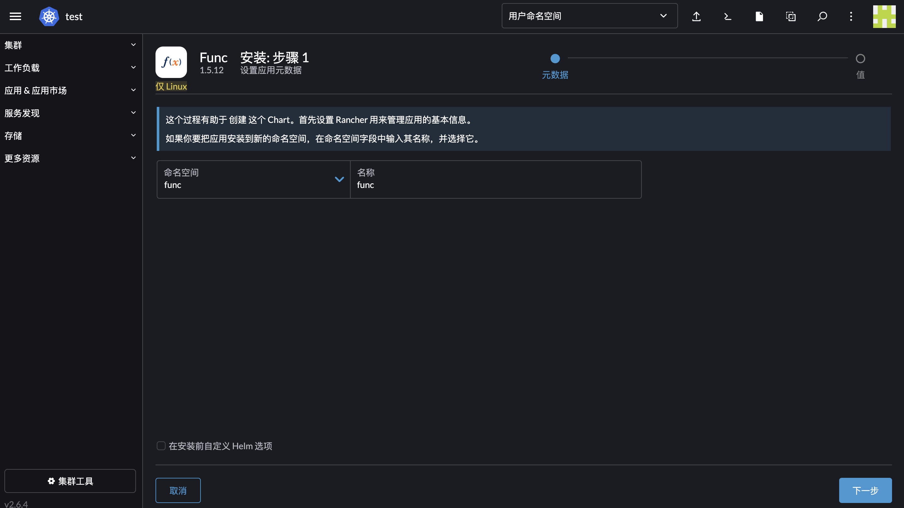

# 通过 Helm 部署
---


本文档主要介绍如何通过 Helm 部署 DataFlux Func。

## 1. 系统及环境要求

安装 DataFlux Func 之前，请务必确认环境已经满足以下条件。

### 1.1 系统要求

运行 DataFlux Func 的集群需要满足以下条件：

- Kubernetes > 1.14
- *Helm >= 3.0*
- 网络带宽 >= 10Mbps
- 内存容量 >= 4GB
- CPU 核心数 >= 2
- 使用外部 MySQL 时，MySQL 版本必须为 5.7 以上
- 使用外部 Redis 时，Redis 版本必须为 4.0 以上，且*不是*集群版

*注意：DataFlux Func 不支持集群版 Redis，有高可用需要请选择主从版*

*注意：DataFlux Func 的存储尽量使用共享存储，hostPath 存在弊端*

## 2. 命令行方式部署

### 2.1 获取集群存储类

执行命令：

```bash
kubectl get sc
```

输出如下：

```text
NAME         PROVISIONER                                     RECLAIMPOLICY   VOLUMEBINDINGMODE   ALLOWVOLUMEEXPANSION   AGE
nfs-client   cluster.local/nfs-subdir-external-provisioner   Delete          Immediate           true                   77d
```

### 2.2 添加 Func Helm 仓库

执行命令：

```bash
helm repo add func https://pubrepo.guance.com/chartrepo/func && helm repo update
```

### 2.3 执行安装

```bash
helm install {Release Name} func/func -n {Namespace} --create-namespace  \
    --set storage.pvc.enabled=true,storage.pvc.storageClass="{Storage Class}" \
    --set ingress.enabled=true,ingress.hostName="{Host Name}"
```

*注意：{Release Name} 为 Helm 别名，{Namespace} 如果没有会被创建，{Storage Class} 为步骤一的存储类名称，{Host Name} 为 ingress 的域名，安装成功可以访问*

> 提示：Helm 部署默认会安装 MySQL 和 MySQL。您也可以使用外部的 redis 和 mysql。详细部署方式见 charts 包中的 README 文档


### 2.4 验证安装

执行命令：

```bash
helm ls -n {Namespace}
```


> 提示：STATUS 为 `deployed` 表示成功

也可以通过浏览器访问你所指定的 {Host Name}

### 2.5 初始化系统

浏览器访问设置的 ingress 域名，可以直接使用默认配置进行初始化 自定义你的配置，也可以默认保存和初始化数据库。


## 3. Rancher 可视化方式部署

### 3.1 部署前提条件

- 集群已注册 [Rancher](https://rancher.com/quick-start) 容器管理平台
- Rancher 用户具有管理应用市场的权限

### 3.2 添加 Chart 仓库

登录 Rancher 平台，`应用&应用市场 - Chart 仓库`, 创建仓库，仓库地址为 [https://pubrepo.guance.com/chartrepo/func](https://pubrepo.guance.com/chartrepo/func)


### 3.3 配置和安装

选择「`Charts` - `Func`」


点击安装


设置命名空间



设置存储


设置访问方式


### 3.4 验证安装

选择 `应用&应用市场`-`已安装的应用`


### 3.5 初始化系统

> 提示：此步骤与「命令行方式部署 - 初始化系统」相同

## 4. 其他问题

### 4.1 浏览器返回 502

如果 Helm 状态显示 `deployed`, 可以按照如下步骤进行排查：

#### 检查 Ingress 是否创建成功

查看 ingress 信息：

```bash
kubectl get ing -n {Namespace}
```

#### 检查 `pod` 状态

一般为 `pvc` 创建失败引起，请根据实际情况解决问题

查看 Pod 状态：

```bash
kubectl get pods -n {Namespace}
```

输出如下：

```text
NAME                                READY   STATUS    RESTARTS   AGE
func-mysql-575d576db7-zclcr         1/1     Running   0          13m
func-redis-fc8f8b95f-c27b2          1/1     Running   0          13m
func-server-7d44fc4dc6-d4gp8        1/1     Running   0          13m
func-worker-0-cb64778bc-q6vts       1/1     Running   2          13m
func-worker-1-6-597668777f-lnmbb    1/1     Running   2          13m
func-worker-7-8f976bfd9-fz7jf       1/1     Running   2          13m
func-worker-8-9-656fdb9bd9-rcbph    1/1     Running   1          13m
func-worker-beat-67c995968c-znq2r   1/1     Running   1          13m
```

查看 PVC 状态：

```bash
kubectl get pvc -n {Namespace}
```

输出如下：

```text
func-mysql       Pening    pvc-0a3db9c5-0b60-428b-9b19-4ff827d155fe   50G    RWX    nfs-client    15m
func-redis       Pening    pvc-cfceb581-c711-4e1d-9ae9-8063ca1ee1a9   10G    RWX    nfs-client    15m
func-resources   Bound     pvc-0cc6f1df-666c-4512-bea9-baa40461c81c   10G    RWX    nfs-client    15m
```

### 4.2 产生`cannot re-use a name that is still in use`错误

如果部署发现`cannot re-use a name that is still in use` 的错误，说明当前 namespace 已经有了 `{Release Name}`,。

你可以将旧的 `{Release Name}` 删除后安装，也可以更换 `{Release Name}`。

### 4.3 产生`连接到数据源超时`错误

如果创建数据源发现`连接到数据源超时` 的错误，请*重启所有*与 func 相关的 pod。

以下为 func 相关的 deployment：

- func-server
- func-worker-0
- func-worker-1-6
- func-worker-7
- func-worker-8-9
- func-worker-beat

> 提示：func-server 的 func 为` {Release Name}`，会随`{Release Name}`的更改而改变。


