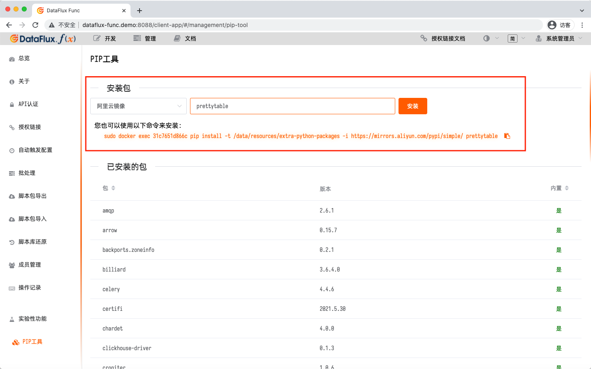
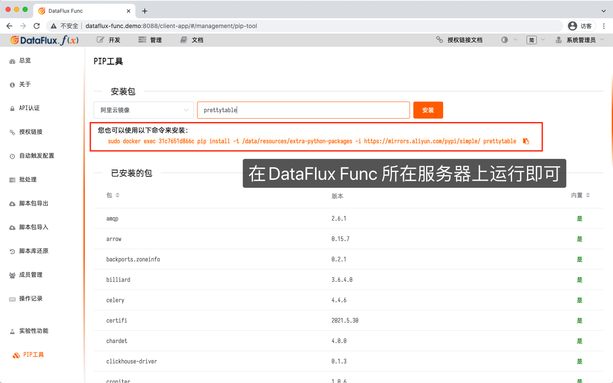
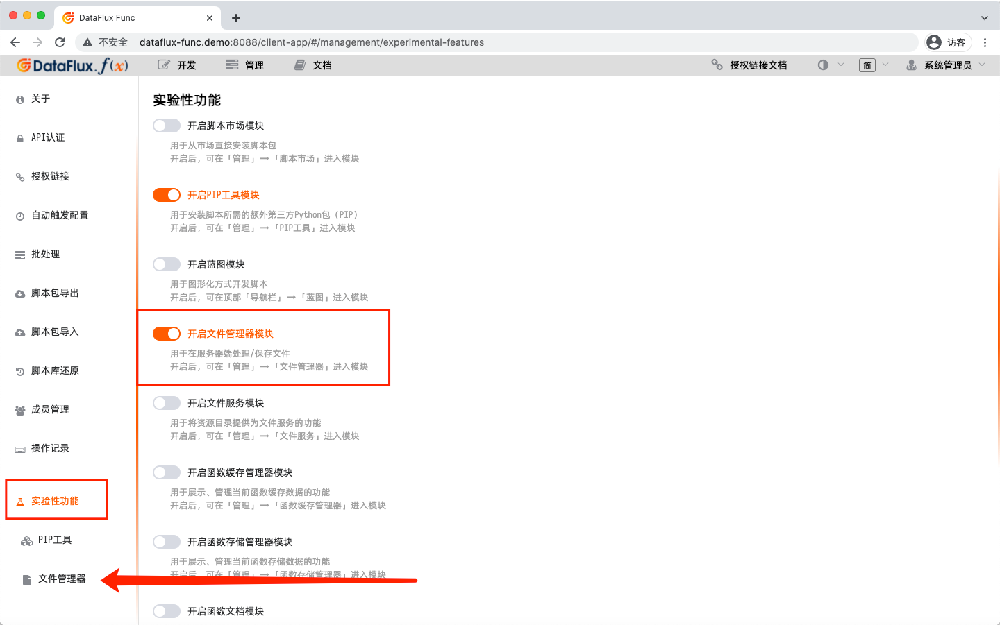
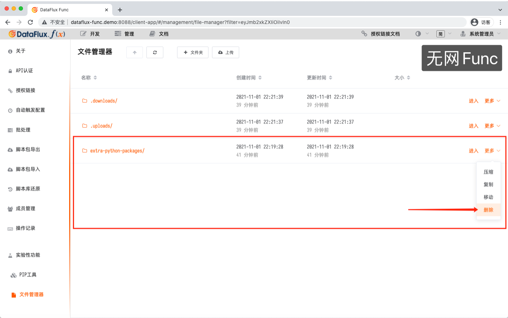
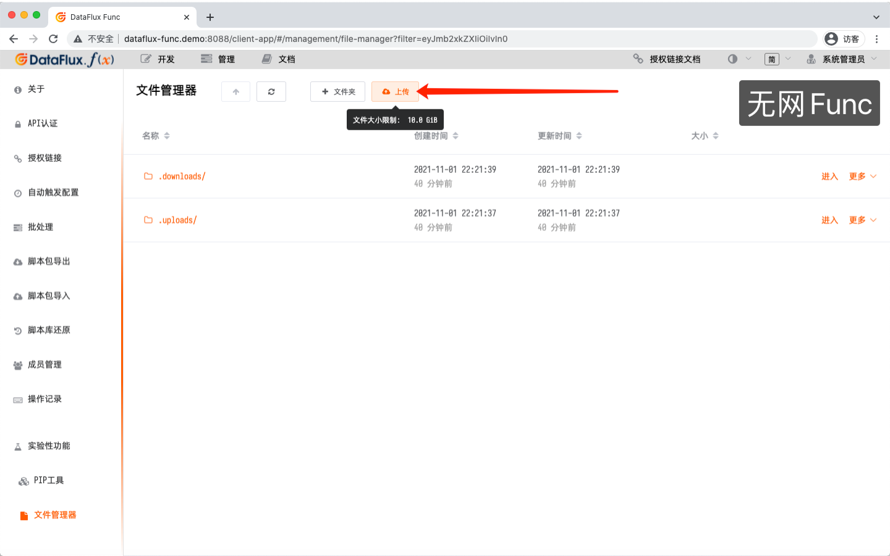

# 开发手册 - 第三方包
---

DataFlux Func 安装完毕后，由于 DataFlux Func 本身就需要第三方包，因此这些包可以在脚本中直接使用，无需另外安装。

具体预装的第三方包列表，可以在「管理 - PIP 工具」中查看，其中「内置」列标记为`是`的即为预装的第三方包。

用户如果需要额外安装第三方包，也可以在「管理 - PIP 工具」中进行安装。

## 1. 可以访问公网时，安装 Pypi 中的包

如果需要额外第三方包的 DataFlux Func 可以直接访问公网，那么可以直接使用系统自带的「PIP 工具」进行安装。

### 第 1 步：开启「PIP 工具」

在「管理 - 实验性功能」中开启「PIP 工具」。

### 第 2 步：使用「PIP 工具」安装第三方包

在「PIP 工具」中，可以选择 Pypi 镜像，输入包名后，即可安装。

如果需要指定版本号，可以使用`package==1.2.3`的格式来安装。

### 注意事项

由于浏览器限制，在安装一些特别巨大，或者耗时较长的第三方包（如各种 AI 库、机器学习库等），可能会产生页面超时的问题。

此时，可以选择登录 DataFlux Func 所在服务器，使用命令进行安装。

具体安装命令在「PIP 工具」中会给出提示：

## 2. 无法访问公网时，安装 Pypi 中的包

如果 DataFlux Func 所在服务器因各种原因，无法访问外网，那么通常的 PIP 方式无法安装第三方包。

此时，需要另外一个*相同架构*，且可以访问公网的 DataFlux Func，用来安装第三方包。安装完成后，将安装后的内容拷贝至无法访问公网的 DataFlux Func 中即可。

下文中，可以访问公网的 DataFlux Func 简称「有网 Func」；无法访问公网的 DataFlux Func 简称「无网 Func」

### 第 1 步：部署「有网 Func」，并安装所需第三方包

此步骤请参考上文「可以访问公网时，安装 Pypi 中的包」

### 第 2 步：开启「文件管理器模块」

在「管理 - 实验性功能」中开启「文件管理器模块」。

### 第 3 步：使用「文件管理器」下载第三方包存放目录

找到`extra-python-packages`目录（所有额外安装的 Python 包内容都会存放于此），选择「更多 - 压缩」，并下载 zip 文件。

### 第 4 步：在「无网 Func」中，上传第三方包存放目录

前往「无网 Func」，删除原先的第三方包存放目录，并上传上一步中下载的 zip 文件，并解压。

### 第 5 步：重启 DataFlux Func

此步骤请参考上文「维护文档 - 日常维护 - 重启系统」

### 注意事项

DataFlux Func 运行在 Docker 中，Python 的运行环境也依赖容器中的环境。

*因此，请勿将本机，或其他非 DataFlux Func 容器内的 Python 安装后的内容拷贝至 DataFlux Func 中。否则往往会产生奇怪的问题。*

*此外：「有网 Func」和「无网 Func」必须保证为相同的硬件架构，如均为`x86_64`或`aarch64`*

## 3. 上传 Wheel 包进行安装

> 敬请期待

## 4. 上传 Python 文件供脚本引入

> 敬请期待

## 5. 为什么？

### 为什么不建议通过上传 Wheel 包的方式直接安装 Python 包？

向服务器上传 Wheel 包后，直接通过 PIP 安装的方式，理论上是可行的，但实际绝大多数情况下并不能成功。

原因在于所上传的 Wheel 包本身可能还依赖其他包，单纯上传代码中直接使用的 Wheel 包无法满足依赖关系。越是功能强大的包，一般来说所依赖的其他包更多，依赖层级更深。最终可能让操作者陷入依赖地狱。

因此，除非所需安装的包不依赖其他任何包，否则一般不建议使用上传 Wheel 包的方式安装 Python 第三方包。
