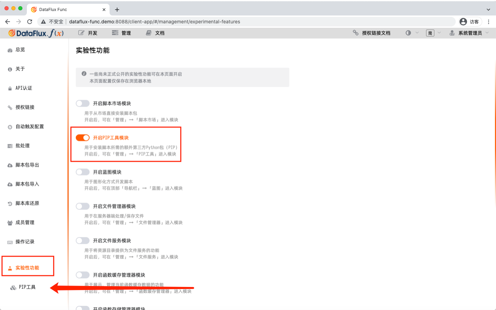
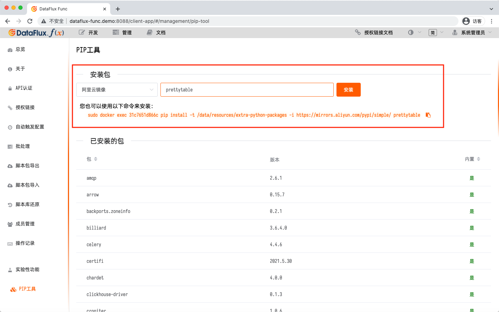
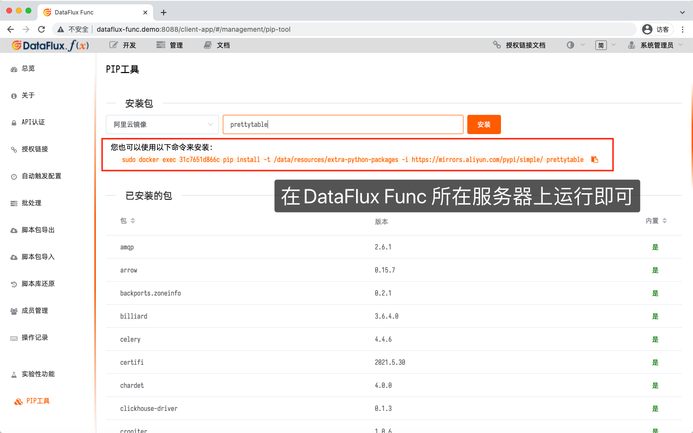
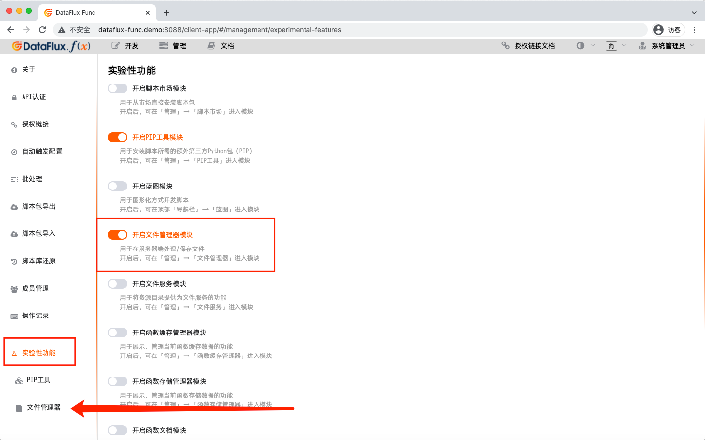
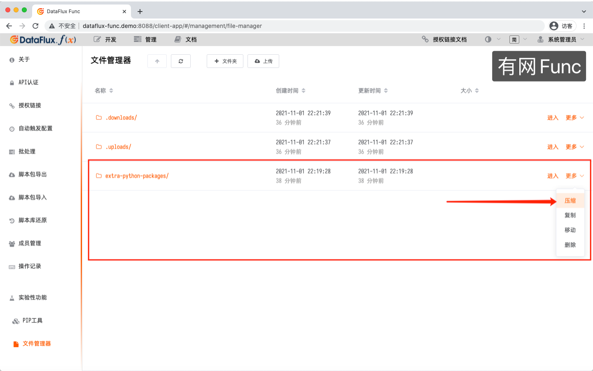
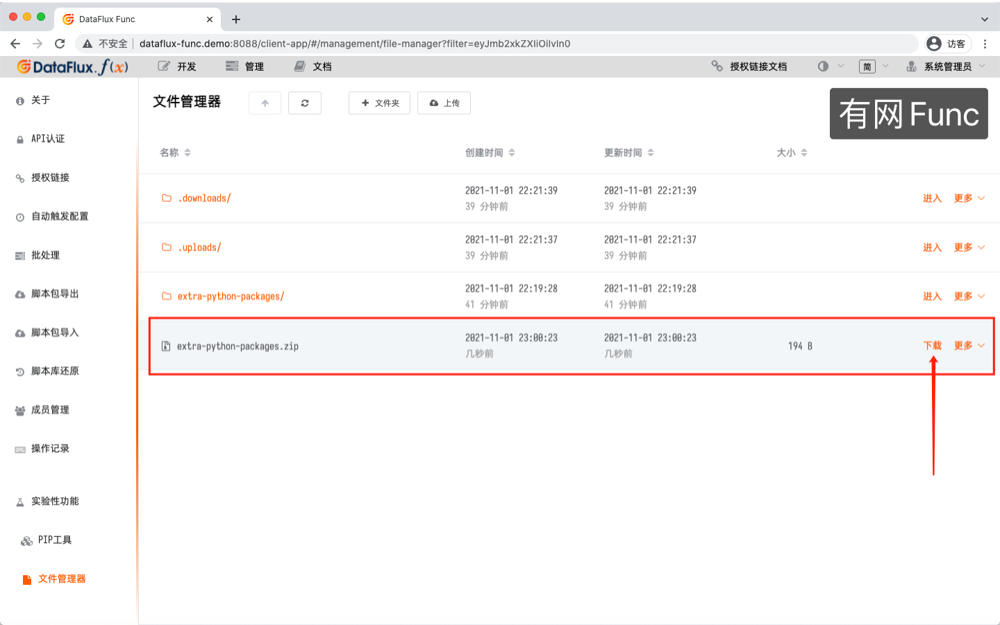
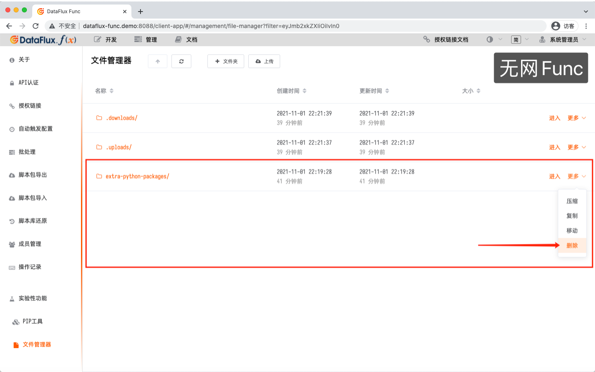
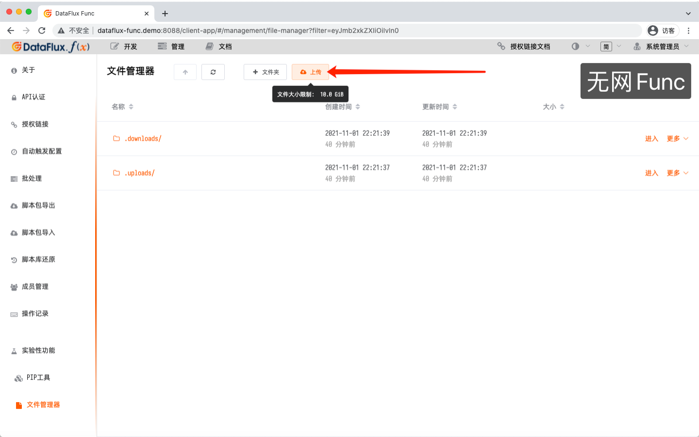
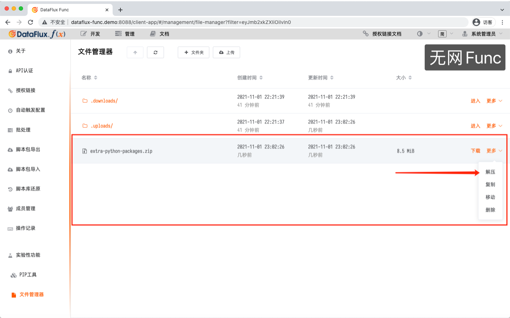
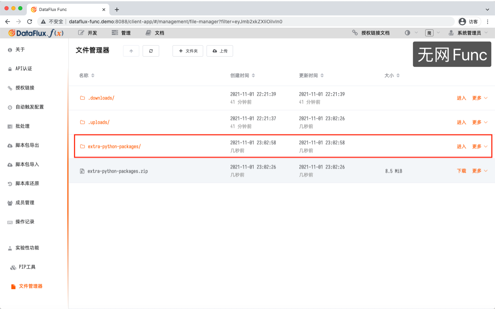

# 开发手册
---


本文档主要面向开发者，提供有关DataFlux Func 代码编写等相关介绍。

在阅读本文档前，请确保已经阅读过「DataFlux Func 用户手册」，
且已经对DataFlux Func 以及在DataFlux Func 中编写脚本有了初步的了解。

## A. 重要提示

*在DataFlux Func 的使用过程中，*

*请勿多人登录同一个账号，也不要多人同时编辑同一份代码。*

*以免造成代码相互覆盖、丢失的问题*

## B. 一般约定

DataFlux Func 中，存在脚本集、脚本、函数等概念，当提及这些概念的ID时，具体如下：

假设存在一个脚本集，ID为`demo`；其下有脚本，ID为`demo__test`；包含一个函数`def hello(...)`。那么：

|   项目   |         ID         |
|----------|--------------------|
| 脚本集ID | `demo`             |
| 脚本ID   | `demo__test`       |
| 函数ID   | `demo__test.hello` |

## C. 内置功能的参数传递

本文档中所有出现的*可选参数*，应当使用命名方式传递，如：

```python
some_func(opt_arg=value)
```

## 1. 开始编写第一个函数

在DataFlux Func 中编写代码，与正常编写Python 代码并无太大区别。
对于需要导出为API的函数，添加内置的`@DFF.API(...)`装饰器即可实现。

函数的返回值即接口的返回值，当返回值为`dict`、`list`时，系统会自动当作JSON 返回。

一个典型的函数如下：

```python
@DFF.API('Hello, world')
def hello_world(message=None):
    ret = {
        'message': message
    }
    return ret
```

此时，为本函数创建一个授权链接，即可实现在公网通过HTTP 的方式调用本函数。

### 1.1 支持文件上传的函数

DataFlux Func 也支持向授权链接接口上传文件。

需要处理上传的文件时，可以为函数添加`files`参数接收上传的文件信息。
文件在上传后，DataFlux Func 会自动将文件存储到一个临时上传目录供脚本进行后续处理。

具体Python代码示例如下：

```python
# 接收Excel文件，并将Sheet1内容返回
from openpyxl import load_workbook

@DFF.API('读取Excel')
def read_excel(files=None):
    excel_data = []
    if files:
        workbook = load_workbook(filename=files[0]['filePath'])
        for row in workbook['Sheet1'].iter_rows(min_row=1, values_only=True):
            excel_data.append(row)

    return excel_data
```

`files`参数由DataFlux Func 系统自动填入，内容如下：

```json
[
    {
        "filePath"    : "<文件临时存放地址>",
        "originalname": "<文件原始文件名>",
        "encoding"    : "<编码>",
        "mimetype"    : "<MIME类型>",
        "size"        : "<文件大小>"
    },
    ...
]
```

> 上传文件的示例命令见「调用授权链接 - `POST`简化传参」


## 2. 调用函数

DataFlux Func 平台提供了多种执行功能用于调用被`DFF.API(...)`修饰的函数：

| 执行功能 |                        特点                        |                  适用场景                  |
|----------|----------------------------------------------------|--------------------------------------------|
| 授权链接 | 生成同步HTTP API。调用后直接返回处理结果           | 处理时间较短，客户端需要立刻获得结果的情况 |
| 自动触发 | 基于Crontab 语法自动执行                           | 定期同步/缓存数据，定时任务等情况          |
| 批处理   | 生成异步HTTP API。调用后立刻响应，但不返回处理结果 | 处理时间较长，接口调用仅作为启动信号的场景 |

用户可以在「管理」中的对应入口，创建上述配置。

### 2.1 通过授权链接调用

为函数创建授权链接后，支持多种不同的调用方式。
授权链接支持`GET`、`POST`两种方式。两种不同方式的参数传递同时支持「简化形式」、「标准形式」。

此外，`POST`方式的「简化」形式还支持文件上传，以下是各种调用方式的功能支持列表：

|    调用方式    | 传递`kwargs` |  `kwargs`中参数类型  | 传递`options` | 文件上传 |
|----------------|--------------|----------------------|---------------|----------|
| `GET`简化形式  | 支持         | *只能传递字符串*     | *不支持*      | *不支持* |
| `GET`标准形式  | 支持         | 支持JSON中的数据类型 | 支持          | *不支持* |
| `POST`简化形式 | 支持         | *只能传递字符串*     | *不支持*      | 支持     |
| `POST`标准形式 | 支持         | 支持JSON中的数据类型 | 支持          | *不支持* |

> 提示：对于*`kwargs`中参数只能传递字符串*的调用方式，需要在函数中对参数进行类型转换

> 在授权链接列表，可以点击「API调用示例」来查看具体调用方式

#### 详细示例

假设存在如下函数：

```python
@DFF.API('我的函数')
def my_func(x, y):
    pass
```

为此函数创建的授权链接ID为`auln-xxxxx`，传递的参数为`x` = `100`（整数）, `y` = `"hello"`（字符串）。

那么，各种不同的调用方式如下：

##### `GET`简化形式传参

如果函数的参数比较简单，可以使用`GET`简化形式传递参数，接口将更加直观。

由于URL中传递参数时，无法区分字符串的`"100"`和整数的`100`，
所以函数在被调用时，接收到的参数都是字符串。
函数需要自行对参数进行类型转换。

```
GET /api/v1/al/auln-xxxxx/simplified?x=100&y=hello
```

*注意：为了便于阅读，示例为URLEncode之前的内容，实际URL参数需要进行URLEncode*

##### `GET`标准形式传参

在某些情况下，如果无法发送POST请求，也可以使用GET方式调用接口。

`GET`标准形式传参时，将整个`kwargs`进行JSON序列化后，作为URL参数传递即可。
由于参数实际还是以JSON格式发送，因此参数的原始类型都会保留。
函数无需再对参数进行类型转换。

如本例中，函数接收到的`x`参数即为整数，无需类型转换。

```
GET /api/v1/al/auln-xxxxx?kwargs={"x":100,"y":"hello"}
```

*注意：为了便于阅读，示例为URLEncode之前的内容，实际URL参数需要进行URLEncode*

##### `POST`简化形式传参

在某些情况下，如果无法发送请求体为JSON的HTTP请求，
那么也可以类似Form表单的形式传递参数，各字段名即为参数名。

由于Form表单提交数据时，无法区分字符串的`"100"`和整数的`100`，
所以函数在被调用时，接收到的参数都是字符串。
函数需要自行对参数进行类型转换。

```
POST /api/v1/al/auln-xxxxx/simplified
Content-Type: x-www-form-urlencoded

x=100&y=hello
```

此外，`POST`简化形式传参还额外支持文件上传（参数/字段名必须为`files`），
需要使用`form-data/multipart`方式进行处理。

页面`HTML`代码示例如下：

```html
<html>
    <body>
        <h1>文件上传</h1>
        <input id="file" type="file" name="files" required />
        <input id="submit" type="submit" value="上传"/>
    </body>
    <script>
        // 授权链接地址（如本页面与DataFlux Func 不在同一个域名下，需要写全 http://域名:端口/api/v1/al/auln-xxxxx/simplified
        // 注意：上传文件必须使用简化形式授权链接
        var AUTH_LINK_URL = '/api/v1/al/auln-xxxxx/simplified';

        document.querySelector('#submit').addEventListener('click', function(event) {
            // 点击上传按钮后，生成FormData 对象后作为请求体发送请求
            var data = new FormData();
            data.append('x', '100');
            data.append('y', 'hello');
            data.append('files', document.querySelector('#file').files[0]);

            var xhr = new XMLHttpRequest();
            xhr.open('POST', AUTH_LINK_URL);
            xhr.send(data);
        });
    </script>
</html>
```

##### `POST`标准形式传参

`POST`标准形式传参是最常见的调用方式。
由于参数以JSON格式通过请求体发送，因此参数的原始类型都会保留。
函数无需再对参数进行类型转换。

如本例中，函数接收到的`x`参数即为整数，无需类型转换。

```
POST /api/v1/al/auln-xxxxx
Content-Type: application/json

{
    "kwargs": {
        "x": 100,
        "y": "hello"
    }
}
```

### 2.2 通过自动触发配置调用

为函数创建自动触发配置后，函数则会所指定的Crontab 表达式定时执行，不需要外部进行调用。

正因为如此，所执行的函数的所有参数必须都已满足，即：

1. 函数不需要输入参数
2. 函数需要输入参数，但都是可选参数
3. 函数需要必选参数，并在自动触发配置中为其配置具体的值

#### 区分函数运行时所属执行功能

如果函数同时配置了「自动触发配置」和其他执行功能，并且希望在不同的执行功能中进行区分处理，可以判断内置变量`_DFF_CRONTAB`区分：

```python
@DFF.API('我的函数')
def my_func(x, y):
    result = x + y

    if _DFF_CRONTAB:
        # 只在自动触发配置时输出日志
        print(f'x + y = {result}')

    return
```

### 2.3 通过批处理调用

> 批处理除了不返回处理结果外，调用方式与「授权链接」相同，请参考上文「通过授权链接调用」进行操作。

### 2.4 额外的API认证

> `1.3.2`版本新增

对于「授权链接」和「批处理」所生成的HTTP API，可以额外添加接口认证。

目前支持的接口认证如下：

|   认证类型  |                            说明                            |
|-------------|------------------------------------------------------------|
| 固定字段    | 验证请求的Header, Query 或 Body 中必须包含具有特定值的字段 |
| HTTP Basic  | 标准HTTP Basic 认证（在浏览器中访问可弹出登录框）          |
| HTTP Digest | 标准HTTP Digest 认证（在浏览器中访问可弹出登录框）         |
| 认证函数    | 指定自行编写的函数作为认证函数                             |

用户可以在「管理 - API认证」添加认证配置，随后在「授权链接/批处理 配置」中指定所添加的认证配置。

*注意：如对安全性有较高要求，请务必使用HTTPS 方式访问接口*

#### 固定字段认证

固定字段认证是最简单的认证方式，即客户端与DataFlux Func 约定在请求的某处（Header、Query 或 Body）包含一个特定的字段和字段值，在每次调用时附带此内容以完成认证。

假设约定每次请求中，请求头必须包含`x-auth-token`=`"my-auth-token"`，那么按照以下方式调用即可完成认证：

```
GET /api/v1/al/auln-xxxxx
x-auth-token: my-auth-token
```

*注意：配置多个固定字段认证时，有一个匹配即认为通过认证*

*注意：对于Query 和Body 中用于认证的字段，认证通过后系统会自动将其删除，不会传递到函数*

#### HTTP Basic / HTTP Digest

浏览器直接支持的认证方式。

使用此方式认证的接口，在浏览器地址栏中直接访问时，浏览器会弹出用户名/密码框供用户填写。

如需要使用编程方式访问，请参考如下代码：

```python
import requests
from requests.auth import HTTPBasicAuth, HTTPDigestAuth

# HTTP Basic 认证
resp = requests.get(url_1, auth=HTTPBasicAuth('user', 'password'))

# HTTP Digest 认证
resp = requests.get(url_2, auth=HTTPDigestAuth('user', 'password'))
```

#### 认证函数

如果接口认证方式复杂或特殊（如需要对接业务系统等），可以选择自行编写函数方式认证。

用于认证的函数必须满足「有且只有一个`req`参数，作为请求」，返回`True`或`False`表示认证成功或失败。

参数`req`是一个`dict`，具体结构如下：

|   字段名    | 字段值类型 |                                              说明                                              |
|-------------|------------|------------------------------------------------------------------------------------------------|
| method      | `str`      | 请求方法（大写）<br>如：`"GET"`、`"POST"`                                                      |
| originalUrl | `str`      | 请求原始URL。包含`?`后的部分<br>如：`/api/v1/al/auln-xxxxx?q=1`                                |
| url         | `str`      | 请求URL。不包含`?`后的部分<br>如：`/api/v1/al/auln-xxxxx`                                      |
| headers     | `dict`     | 请求Header，字段名均为小写                                                                     |
| query       | `dict`     | 请求Query，字段名和字段值都为字符串                                                            |
| body        | `dict`     | 请求Body                                                                                       |
| hostname    | `str`      | 请求访问的主机名。不包含端口号部分<br>如：`example.com`                                        |
| ip          | `str`      | 客户端IP<br>*注意：此字段需要Nginx、阿里云SLB等正确配置才有意义*                               |
| ips         | `list`     | 客户端IP及所有中间代理服务器IP地址列表<br>*注意：此字段需要Nginx、阿里云SLB等正确配置才有意义* |
| ips[#]      | `str`      | 中间代理服务器IP                                                                               |
| xhr         | `bool`     | 是否为ajax 请求                                                                                |

一个简单的示例如下：

```python
@DFF.API('认证函数')
def my_auth_func(req):
    return req['headers']['x-auth-token'] == 'my-auth-token'
```

## 3. 使用内置功能

为了方便脚本编写，以及在脚本中使用各种DataFlux Func提供的功能。
DataFlux Func在脚本运行上下文注入了一些额外功能。

这些功能都封装在DFF对象中（如上文出现的`@DFF.API(...)`）

### 3.1 输出日志 `print(...)`

由于脚本编辑器是Web应用程序，
不同于一般意义上的IDE，不支持进行单步调试等操作。
因此，调试可以依靠运行时输出日志进行。

为了让日志输出能够被DataFlux Func搜集并显示到脚本编辑器中，
DataFlux Func重新封装了`print(...)`函数，
使其可以将输出内容通过Web页面展现出来。如：

```python
print('Some log message')
```

### 3.2 导出函数 `DFF.API(...)`

一个装饰器，用于将被修饰的函数对外开放，允许使用API方式调用。

详细参数列表如下：

|         参数         |         类型        | 是否必须 |   默认值    |                                     说明                                     |
|----------------------|---------------------|----------|-------------|------------------------------------------------------------------------------|
| `title`              | str                 | 必须     |             | 函数导出的展示名，主要用于在展示                                             |
| `catetory`           | str                 |          | `general`   | 函数所属类别，主要用于函数列表的分类/筛选                                    |
| `tags`               | list                |          | `None`      | 函数标签列表，主要用于函数列表的分类/筛选                                    |
| `tags[#]`            | str                 | 必须     |             | 函数标签                                                                     |
| `timeout`            | int                 |          | `30`/`3600` | 函数超时时间。<br>单位：秒，取值范围`1 ~ 3600`                               |
| `api_timeout`        | int                 |          | `10`        | 通过API调用函数时，API调用超时时间。<br>单位：秒，取值范围`1 ~ 180`          |
| `cache_result`       | int                 |          | `None`      | 缓存结果数据时长。<br>单位：秒，`None`表示不缓存                             |
| `fixed_crontab`      | str(Crontab-format) |          | `None`      | 当函数由自动触发执行时，强制固定的Crontab配置。<br>最小支持分钟级            |
| `delayed_crontab`    | list                |          | `None`      | 当函数由自动触发执行时，启动后延迟执行时间，设置多个表示按照不同延迟多次执行 |
| `delayed_crontab[#]` | int                 | 必须     |             | 延迟执行秒数。<br>单位：秒                                                   |

各参数的详解见下文：

#### 参数`title`

函数标题支持中文，方便在DataFlux Func 各种操作界面/文档中展示函数名称。

示例如下：

```python
@DFF.API('我的函数')
def my_func():
    pass
```

#### 参数`category`/`tags`

函数所属分类、标签列表，本身并不参与也不控制函数的运行，主要用于方便分类管理函数。
分别使用或者各自单独使用都可以。

示例如下：

```python
@DFF.API('我的函数', category='demo', tags=['tag1', 'tag2']):
def my_func():
    pass
```

指定后，可通过指定筛选参数来过滤函数列表，如：

```
# 根据category筛选
GET /api/v1/func-list?category=demo

# 根据tags筛选（指定多个tag表示「同时包含」）
GET /api/v1/func-list?tags=tag1,tag2
```

#### 参数`timeout`/`api_timeout`

为了保护系统，所有在DataFlux Func 中运行的函数都有运行时长限制，不允许无限制地运行下去。
其中，`timeout`控制「函数本身的运行时长」，而`api_timeout`控制在「授权链接中，API返回的超时时长」。

以下是两者控制范围：

|     场景     |                                        `timeout`参数，默认值                                        |      `api_timeout`参数      |
|--------------|-----------------------------------------------------------------------------------------------------|-----------------------------|
| 授权链接     | 默认值`30`<br>当大于`api_timeout`时，自动缩短到与`api_timeout`相同<br>即`MIN(timeout, api_timeout)` | 控制API返回超时，默认值`10` |
| 自动触发配置 | 默认值`30`                                                                                          | *不起作用*                  |
| 批处理       | 默认值`3600`                                                                                        | *不起作用*                  |

授权链接`timeout`详细取值逻辑如下：

|     `timeout`      |   `api_timeout`    | 最终`timeout`取值 |
|--------------------|--------------------|-------------------|
| 未指定（默认`30`） | 未指定（默认`10`） | `10`              |
| `3`                | 未指定（默认`10`） | `3`               |
| 未指定（默认`30`） | `3`                | `3`               |
| `3`                | `10`               | `3`               |
| `10`               | `3`                | `3`               |

示例如下：

```python
@DFF.API('我的函数', timeout=30, api_timeout=15):
def my_func():
    # 此函数
    # 1. 在「授权链接」中最多运行15秒
    # 2. 在「自动触发配置」「批处理」中最多运行30秒
    pass
```

*注意：一个HTTP接口响应时间超过3秒即可认为非常缓慢。应当注意不要为函数配置无意义的超长超时时间*

*注意：大量长耗时授权链接请求会导致任务队列堵塞，必要时应使用缓存技术*

#### 参数`cache_result`

DataFlux Func 内置了API层面的缓存处理。
在指定的缓存参数后，当调用完全相同的函数和参数时，系统会直接返回缓存的结果。

示例如下：

```python
@DFF.API('我的函数', cache_result=30):
def my_func():
    pass
```

*注意：命中缓存后，API会直接返回结果，而函数并不会实际执行*

命中缓存后，返回的HTTP 请求头会添加如下标示：

```
X-Dataflux-Func-Cache: Cached
```

#### 参数`fixed_crontab`

对于某些会用于自动触发配置的函数，函数编写者可能会对自动运行的频率有要求。
此时，可以指定本参数，将属于本函数的自动触发配置固定为指定的Crontab 表达式。

示例如下：

```python
@DFF.API('我的函数', fixed_crontab='*/5 * * * *'):
def my_func():
    pass
```

#### 参数`delayed_crontab`

对于某些用于自动触发配置的函数，函数编写者可能希望以更精确的时间运行（如在`* * * * *`的基础上，延迟10秒运行）。
此时，可以指定本参数，在指定延迟的秒数。同时，也可以传入秒数的数组，到达各个指定延迟时运行。

*注意：本参数只能保证在指定的时间后运行，并不能保证到达指定的时间后一定运行*

*注意：本参数不适用于「存在长时间自动触发任务」的情况，无论这些长时间任务是否与延迟执行有关*

示例如下：

```python
@DFF.API('我的函数', delayed_crontab=10):
def my_func():
    '''
    延迟10秒执行
    '''
    pass

@DFF.API('我的函数2', delayed_crontab=[0, 10]):
def my_func_2():
    '''
    延迟0、10秒执行，共执行2次
    '''
    pass
```

### 3.3 操作数据源 `DFF.SRC(...)`

一个函数，用于返回指定的数据源操作对象。

示例如下：

```python
@DFF.API('InfluxDB操作演示')
def influxdb_demo():
    db = DFF.SRC('demo_influxdb')
    return db.query('SELECT * FROM demo LIMIT 3')
```

如数据源配置了默认数据库，则查询会在默认数据库进行。

如数据源没有配置默认数据库，或在查询时需要查询不同的数据库，可在获取数据源操作对象时，指定数据库database参数，如：

```python
db = DFF.SRC('demo_influxdb', database='my_database')
```

*注意：某些数据库不支持查询时更换数据库。需要操作不同数据库时，可以创建多个数据源来进行操作。*

对于DataWay，可以获取数据源操作对象时指定`rp`和`token`参数，如：

```python
dataway = DFF.SRC('df_dataway', token='xxxxx', rp='rp0')
```

由于数据源具有不同类型，使用`DFF.SRC(...)`时，各个数据源操作对象的可选参数，支持方法并不相同。

具体不同类型数据源的详细API接口见下文

### 3.4 获取环境变量 `DFF.ENV(...)`

在脚本编辑器左侧边栏配置的所有环境变量，
都可以在脚本中使用配置的ID获取对应的环境变量值。

示例代码如下：

```python
company_name = DFF.ENV('companyName')
# '上海驻云信息科技有限公司'

company_name = DFF.ENV('不存在的环境变量')
# None
```

如环境变量在配置时指定了类型，
取出时会自动转换为特定类型，不必额外进行类型转换。

但由于类型转换可能会因为配置错误而转换失败，
因此考虑到程序健壮性，应当加入默认值处理，如：

```python
page_size = 10
try:
    page_size = DFF.ENV('pageSize') or page_size
except Exception as e:
    pass
```

### 3.5 接口响应控制（数据） `DFF.RESP(...)`

函数的返回值，除了以往直接返回字符串、JSON外，可使用`DFF.RESP(...)`进行细节控制。

|      参数      |      类型     | 是否必须 | 默认值  |                                        说明                                        |
|----------------|---------------|----------|---------|------------------------------------------------------------------------------------|
| `data`         | str/dict/list | 必须     |         | 指定返回的数据                                                                     |
| `status_code`  | int           |          | `200`   | 指定响应状态码                                                                     |
| `content_type` | str           |          | `None`  | 指定响应体类型，如`json`, `text`, `html`等                                         |
| `headers`      | dict          |          | `None`  | 指定HTTP响应头（此处不需要重复填写`Content-Type`）                                 |
| `allow_304`    | bool          |          | `False` | 指定为`True`时，允许浏览器304缓存                                                  |
| `download`     | str           |          | `False` | 指定下载文件名，并将数据作为文件下载<br>*指定本参数后，`content_type`参数不再起效* |

*注意：如果开启`allow_304`，允许浏览器304缓存，可以实现接口性能提升。但也可能会因为缓存导致客户端无法及时从接口获取最新内容*

*注意：指定`download`参数后，系统会自动根据文件扩展名填充`Content-Type`，而`content_type`参数会被忽略*

常见用例如下：

```python
@DFF.API('用例1')
def case_1():
    '''
    返回一个由函数内生成的HTML页面
    '''
    data = '''<h1>Hello, World!</h1>'''
    return DFF.RESP(data, content_type='html')

@DFF.API('用例2')
def case_2():
    '''
    返回由函数生成的JSON数据
    与 return {"hello": "world"} 等价
    '''
    data = '''{"hello": "world"}'''
    return DFF.RESP(data, content_type='json')

@DFF.API('用例3')
def case_3():
    '''
    下载由函数生成的文件，并命名为`文章.txt`
    '''
    data = '''Some text'''
    return DFF.RESP(data, download='文章.txt')

@DFF.API('用例4')
def case_4():
    '''
    指定额外的响应头
    '''
    data = '''<h1>Hello, World!</h1>'''
    headers = {
        'X-Author': 'Tom',
    }
    return DFF.RESP(data, content_type='html', headers=headers)
```

### 3.6 接口响应控制（文件） `DFF.RESP_FILE(...)`

当返回的内容为「磁盘上的文件」时，可使用`DFF.RESP_FILE(...)`进行细节控制。

|      参数     |   类型   | 是否必须 | 默认值  |                                                               说明                                                              |
|---------------|----------|----------|---------|---------------------------------------------------------------------------------------------------------------------------------|
| `file_path`   | str      | 必须     |         | 指定返回文件的路径（相对于资源文件目录）                                                                                        |
| `status_code` | int      |          | `200`   | *与`DFF.RESP(...)`同名参数相同*                                                                                                 |
| `headers`     | dict     |          | `None`  | *与`DFF.RESP(...)`同名参数相同*                                                                                                 |
| `allow_304`   | bool     |          | `False` | *与`DFF.RESP(...)`同名参数相同*                                                                                                 |
| `auto_delete` | bool     |          | `False` | 指定为`True`时，文件下载后自动从磁盘中删除                                                                                      |
| `download`    | bool/str |          | `True`  | 默认下载文件且保存名与原始文件名相同<br>指定为`False`时，让浏览器尽可能直接打开文件<br>指定为字符串时，按指定的值作为下载文件名 |

> 提示：`DFF.RESP_FILE(...)`会自动根据文件扩展名填充HTTP的`Content-Type`头，默认以`file_path`为准，指定`download`字符串时则以`download`值作为文件名下载

> 提示：「资源文件目录」指的是容器内的`/data/resources`文件夹，正常部署后此文件夹会挂载到宿主机磁盘实现持久化存储

示例如下：

```python
@DFF.API('用例1')
def case_1():
    '''
    下载资源文件目录下user-guide.pdf文件
    '''
    return DFF.RESP_FILE('user-guide.pdf')

@DFF.API('用例2')
def case_2():
    '''
    让浏览器在线打开资源目录下的`user-guide.pdf`文件
    '''
    return DFF.RESP_FILE('user-guide.pdf', download=False)

@DFF.API('用例3')
def case_3():
    '''
    浏览器打开资源目录下index.html页面
    '''
    return DFF.RESP_FILE('index.html', download=False)

@DFF.API('用例4')
def case_4():
    '''
    下载资源文件目录下的servey.xlsx文件，并保存为「调查表.xlsx」
    '''
    return DFF.RESP_FILE('servey.xlsx', download='调查表.xlsx')

@DFF.API('用例5')
def case_5():
    '''
    指定额外的响应头
    '''
    headers = {
        'X-Author': 'Tom',
    }
    return DFF.RESP_FILE('user-guide.pdf', headers=headers)
```

### 3.7 接口响应控制（大量数据） `DFF.RESP_LARGE_DATA(...)`

> `1.3.0`版本新增

当需要返回大量内容（MB级别及以上）时，直接通过`return`方式返回可能会因系统内部通讯处理等导致性能大幅下降。
此时，可使用`DFF.RESP_LARGE_DATA(...)`提升性能。

|      参数      |      类型     | 是否必须 | 默认值 |                    说明                    |
|----------------|---------------|----------|--------|--------------------------------------------|
| `data`         | str/dict/list | 必须     |        | 指定返回的数据                             |
| `content_type` | str           |          | `None` | 指定响应体类型，如`json`, `text`, `html`等 |

*注意：使用此方法时，必须保证资源目录配置、挂载正确，所有的Web服务器和工作单元都能正常访问到同一个共享目录*

常见用例如下：

```python
@DFF.API('用例1')
def case_1():
    data = {} # 大量数据（MB级别及以上）

    return DFF.RESP_LARGE_DATA(data)
```

#### 原理说明

DataFlux Func 底层由Web服务器和工作单元通过作为消息队列的Redis组合而成。直接`return`的数据，会被序列化后送入消息队列，再由Web服务器返回给调用方。

由于JSON的序列化/反序列化，Redis上进行的入队出队、内部网络通讯等，都会因为单个JSON数据尺寸过大而导致性能下降。

本函数在底层实质上做了如下操作：
1. 将需要返回的数据作为文件保存到资源目录`download`目录下
2. 将请求作为「文件下载」响应（即上文中的`DFF.RESP_FILE`）
3. Web服务器直接从资源目录中读取上述1. 中保存的文件返回给客户端

通过此「绕行」的方法，使得系统内部通讯层面的处理轻量化以提升性能。

#### 性能对比

以下是同样返回大约3.5MB大小的JSON时的性能对比：

- 通过`return data`直接返回JSON时，耗费18秒时间

```shell
$ time wget http://172.16.35.143:8089/api/v1/al/auln-Ljo3y8HMUl91
--2021-09-16 22:40:09--  http://172.16.35.143:8089/api/v1/al/auln-Ljo3y8HMUl91
正在连接 172.16.35.143:8089... 已连接。
已发出 HTTP 请求，正在等待回应... 200 OK
长度：3363192 (3.2M) [application/json]
正在保存至: “auln-Ljo3y8HMUl91”

auln-Ljo3y8HMUl91            100%[=============================================>]   3.21M  --.-KB/s  用时 0.06s

2021-09-16 22:40:27 (50.4 MB/s) - 已保存 “auln-Ljo3y8HMUl91” [3363192/3363192])

wget http://172.16.35.143:8089/api/v1/al/auln-Ljo3y8HMUl91  0.00s user 0.02s system 0% cpu 18.321 total
```

- 通过`return DFF.RESP_LARGE_DATA(data)`返回JSON时，仅耗费不足1秒时间

```shell
$ time wget http://172.16.35.143:8089/api/v1/al/auln-HPrfGRKIhYET
--2021-09-16 22:40:50--  http://172.16.35.143:8089/api/v1/al/auln-HPrfGRKIhYET
正在连接 172.16.35.143:8089... 已连接。
已发出 HTTP 请求，正在等待回应... 200 OK
长度：3687382 (3.5M) [application/json]
正在保存至: “auln-HPrfGRKIhYET”

auln-HPrfGRKIhYET            100%[=============================================>]   3.52M  --.-KB/s  用时 0.02s

2021-09-16 22:40:50 (183 MB/s) - 已保存 “auln-HPrfGRKIhYET” [3687382/3687382])

wget http://172.16.35.143:8089/api/v1/al/auln-HPrfGRKIhYET  0.00s user 0.02s system 12% cpu 0.174 total
```

### 3.8 内置简易Scope-Key-Value 存储 `DFF.STORE`

DataFlux Func 内置了简易的持久化存储功能。
对于一些有数据存储需求，同时需求并不复杂的场景，可以直接使用本内置存储功能。

存储功能为`Scope-Key-Value`结构，不同命名空间下，允许存在相同的Key。

> 提示：写入的数据会自动序列化，同时读取时也会自动反序列化。使用时无需手工做序列化处理

#### `DFF.STORE.set(...)`

`DFF.STORE.set(...)`方法用于存储数据，参数如下：

|     参数     |         类型         | 是否必须 |   默认值   |                     说明                     |
|--------------|----------------------|----------|------------|----------------------------------------------|
| `key`        | str                  | 必须     |            | 键名                                         |
| `value`      | 任意可JSON序列化对象 | 必须     |            | 数据                                         |
| `scope`      | str                  |          | 当前脚本名 | 命名空间                                     |
| `expire`     | int                  |          | `None`     | 过期时间。<br>单位：秒<br>`None`表示永不过期 |
| `not_exists` | bool                 |          | `False`    | 是否仅在数据不存在时写入                     |

示例如下：

```python
DFF.STORE.set('user:user-001', { 'name': '张三' }, scope='users')
```

#### `DFF.STORE.get(...)`

`DFF.STORE.get(...)`方法用于获取存储的数据，参数如下：

|   参数  | 类型 | 是否必须 |   默认值   |   说明   |
|---------|------|----------|------------|----------|
| `key`   | str  | 必须     |            | 键名     |
| `scope` | str  |          | 当前脚本名 | 命名空间 |

> 提示：当尝试获取的内容不存在时，返回值为`None`

示例如下：

```python
DFF.STORE.set('user:user-001', { 'name': '张三' }, scope='users')
DFF.STORE.get('user:user-001', scope='users')
# { 'name': '张三' }
```

#### `DFF.STORE.delete(...)`

`DFF.STORE.delete(...)`方法用于删除存储的数据，参数如下：

|   参数  | 类型 | 是否必须 |   默认值   |   说明   |
|---------|------|----------|------------|----------|
| `key`   | str  | 必须     |            | 键名     |
| `scope` | str  |          | 当前脚本名 | 命名空间 |

> 提示：删除不存在的内容也不会报错

示例如下：

```python
DFF.STORE.delete('user:user-001', scope='users')
```

### 3.9 内置简易Scope-Key-Value 缓存 `DFF.CACHE`

DataFlux Func 内置了基于Redis的简易缓存功能。
对于一些有缓存需求，同时需求并不复杂的场景，可以直接使用本内置缓存功能。

存储功能为`Scope-Key-Value`结构，不同命名空间下，允许存在相同的Key。

> 提示：写入/读取数据不会自动自动序列化/反序列化，使用时需要在脚本中自行处理

#### `DFF.CACHE.set(...)`

`DFF.CACHE.set(...)`方法用于建立缓存，参数如下：

|     参数     |      类型     | 是否必须 |   默认值   |                     说明                     |
|--------------|---------------|----------|------------|----------------------------------------------|
| `key`        | str           | 必须     |            | 键名                                         |
| `value`      | str/int/float | 必须     |            | 数据                                         |
| `scope`      | str           |          | 当前脚本名 | 命名空间                                     |
| `expire`     | int           |          | `None`     | 过期时间。<br>单位：秒<br>`None`表示永不过期 |
| `not_exists` | bool          |          | `False`    | 是否仅在数据不存在时写入                     |

示例如下：

```python
DFF.CACHE.set('user:count', 100, scope='stat')
# 此时缓存值为：'100'
```

#### `DFF.CACHE.get(...)`

`DFF.CACHE.get(...)`方法用于获取缓存，参数如下：

|   参数  | 类型 | 是否必须 |   默认值   |   说明   |
|---------|------|----------|------------|----------|
| `key`   | str  | 必须     |            | 键名     |
| `scope` | str  |          | 当前脚本名 | 命名空间 |

示例如下：

```python
DFF.CACHE.set('user:count', 100, scope='stat')
DFF.CACHE.get('user:count', scope='stat')
# '100'
```

#### `DFF.CACHE.getset(...)`

`DFF.CACHE.getset(...)`方法用于设置缓存的同时，获取之前的值，参数如下：

|   参数  |      类型     | 是否必须 |   默认值   |   说明   |
|---------|---------------|----------|------------|----------|
| `key`   | str           | 必须     |            | 键名     |
| `value` | str/int/float | 必须     |            | 数据     |
| `scope` | str           |          | 当前脚本名 | 命名空间 |

示例如下：

```python
DFF.CACHE.set('user:count', 100, scope='stat')
DFF.CACHE.getset('user:count', 200, scope='stat')
# '100'
# 此时缓存值为：'200'
```

#### `DFF.CACHE.expire(...)`

`DFF.CACHE.expire(...)`方法用于设置缓存的过期时间，参数如下：

|   参数   | 类型 | 是否必须 |   默认值   |                     说明                     |
|----------|------|----------|------------|----------------------------------------------|
| `key`    | str  | 必须     |            | 键名                                         |
| `expire` | int  |          | `None`     | 过期时间。<br>单位：秒<br>`None`表示永不过期 |
| `scope`  | str  |          | 当前脚本名 | 命名空间                                     |

示例如下：

```python
DFF.CACHE.expire('user:count', 3600, scope='stat')
```

#### `DFF.CACHE.delete(...)`

`DFF.CACHE.delete(...)`方法用于删除存储的数据，参数如下：

|   参数  | 类型 | 是否必须 |   默认值   |   说明   |
|---------|------|----------|------------|----------|
| `key`   | str  | 必须     |            | 键名     |
| `scope` | str  |          | 当前脚本名 | 命名空间 |

示例如下：

```python
DFF.CACHE.delete('user:count', scope='stat')
```

#### `DFF.CACHE.incr(...)`

`DFF.CACHE.incr(...)`方法用于对缓存值增加步进，参数如下：

|   参数  | 类型 | 是否必须 |   默认值   |   说明   |
|---------|------|----------|------------|----------|
| `key`   | str  | 必须     |            | 键名     |
| `step`  | int  |          | `1`        | 步进值   |
| `scope` | str  |          | 当前脚本名 | 命名空间 |

示例如下：

```python
DFF.CACHE.incr('user:count', scope='stat')
DFF.CACHE.incr('user:count', scope='stat')
# 此时缓存值为：'2'
```

#### `DFF.CACHE.hkeys(...)`

`DFF.CACHE.hkeys(...)`方法用于获取哈希结构字段列表，参数如下：

|    参数   | 类型 | 是否必须 |   默认值   |     说明     |
|-----------|------|----------|------------|--------------|
| `key`     | str  | 必须     |            | 键名         |
| `pattern` | str  |          | `"*"`      | 字段匹配模式 |
| `scope`   | str  |          | 当前脚本名 | 命名空间     |

示例如下：

```python
DFF.CACHE.hmset('user:001', { 'name': 'Tom', 'city': 'Beijing' }, scope='cachedInfo')
DFF.CACHE.hkeys('user:001', scope='userCache')
# ['name', 'city']
```

#### `DFF.CACHE.hget(...)`

`DFF.CACHE.hget(...)`方法用于获取哈希结构中一个/多个/全部字段值，参数如下：

|   参数  |       类型      | 是否必须 |   默认值   |        说明       |
|---------|-----------------|----------|------------|-------------------|
| `key`   | str             | 必须     |            | 键名              |
| `field` | `None`/str/list |          |            | 字段名/字段名列表 |
| `scope` | str             |          | 当前脚本名 | 命名空间          |

示例如下：

```python
DFF.CACHE.hmset('user:001', { 'name': 'Tom', 'city': 'Beijing' }, scope='cachedInfo')
DFF.CACHE.hget('user:001', scope='cachedInfo')
# {'name': 'Tom', 'city': 'Beijing'}
DFF.CACHE.hget('user:001', ['name', 'city'], scope='cachedInfo')
# {'name': 'Tom', 'city': 'Beijing'}
DFF.CACHE.hget('user:001', 'name', scope='cachedInfo')
# 'Tom'
```
#### `DFF.CACHE.hset(...)`

`DFF.CACHE.hset(...)`方法用于设置哈希结构中的某个字段值，参数如下：

|     参数     |      类型     | 是否必须 |   默认值   |           说明           |
|--------------|---------------|----------|------------|--------------------------|
| `key`        | str           | 必须     |            | 键名                     |
| `field`      | str           | 必须     |            | 字段名                   |
| `value`      | str/int/float | 必须     |            | 数据                     |
| `scope`      | str           |          | 当前脚本名 | 命名空间                 |
| `not_exists` | bool          |          | `False`    | 是否仅在字段不存在时写入 |

示例如下：

```python
DFF.CACHE.hset('user:001', 'name', 'Tom', scope='cachedInfo')
# 此时缓存值为：{ 'name': 'Tom' }
```

#### `DFF.CACHE.hmset(...)`

`DFF.CACHE.hmset(...)`方法用于设置哈希结构中的多个字段值，参数如下：

|   参数  | 类型 | 是否必须 |   默认值   |   说明   |
|---------|------|----------|------------|----------|
| `key`   | str  | 必须     |            | 键名     |
| `obj`   | dict | 必须     |            | 数据     |
| `scope` | str  |          | 当前脚本名 | 命名空间 |

```python
DFF.CACHE.hmset('user:001', { 'name': 'Tom', 'city': 'Beijing' }, scope='cachedInfo')
# 此时缓存值为：{ 'name': 'Tom', 'city': 'Beijing' }
```

#### `DFF.CACHE.hincr(...)`

`DFF.CACHE.hincr(...)`方法用于对哈希结构中的字段增加步进，参数如下：

|   参数  | 类型 | 是否必须 |   默认值   |   说明   |
|---------|------|----------|------------|----------|
| `key`   | str  | 必须     |            | 键名     |
| `field` | str  | 必须     |            | 字段名   |
| `step`  | int  |          | `1`        | 步进值   |
| `scope` | str  |          | 当前脚本名 | 命名空间 |

示例如下：

```python
DFF.CACHE.hincr('user:001', 'signCount', scope='cachedInfo')
DFF.CACHE.hincr('user:001', 'signCount', scope='cachedInfo')
# 此时缓存值为：{ 'signCount': '2' }
```

#### `DFF.CACHE.hdel(...)`

`DFF.CACHE.hdel(...)`方法用于删除哈希结构中的某个字段，参数如下：

|   参数  | 类型 | 是否必须 |   默认值   |   说明   |
|---------|------|----------|------------|----------|
| `key`   | str  | 必须     |            | 键名     |
| `field` | str  | 必须     |            | 字段名   |
| `scope` | str  |          | 当前脚本名 | 命名空间 |

示例如下：

```python
DFF.CACHE.hmset('user:001', { 'name': 'Tom', 'city': 'Beijing' }, scope='cachedInfo')
DFF.CACHE.hdel('user:001', 'city', scope='cachedInfo')
# 此时缓存值为：{ 'name': 'Tom' }
```

#### `DFF.CACHE.lpush(...)`

`DFF.CACHE.lpush(...)`方法用于从*左侧*向列表结构添加元素，参数如下：

|   参数  |      类型     | 是否必须 |   默认值   |   说明   |
|---------|---------------|----------|------------|----------|
| `key`   | str           | 必须     |            | 键名     |
| `value` | str/int/float | 必须     |            | 数据     |
| `scope` | str           |          | 当前脚本名 | 命名空间 |

示例如下：

```python
DFF.CACHE.lpush('userQueue', '001', scope='queue')
DFF.CACHE.lpush('userQueue', '002', scope='queue')
# 此时缓存值为：[ '002', '001' ]
```

#### `DFF.CACHE.rpush(...)`

`DFF.CACHE.rpush(...)`方法用于从*右侧*向列表结构添加元素，参数如下：

|   参数  |      类型     | 是否必须 |   默认值   |   说明   |
|---------|---------------|----------|------------|----------|
| `key`   | str           | 必须     |            | 键名     |
| `value` | str/int/float | 必须     |            | 数据     |
| `scope` | str           |          | 当前脚本名 | 命名空间 |

示例如下：

```python
DFF.CACHE.rpush('userQueue', '001', scope='queue')
DFF.CACHE.rpush('userQueue', '002', scope='queue')
# 此时缓存值为：[ '001', '002' ]
```

#### `DFF.CACHE.lpop(...)`

`DFF.CACHE.lpop(...)`方法用于从*左侧*从列表结构中弹出元素，参数如下：

|   参数  | 类型 | 是否必须 |   默认值   |   说明   |
|---------|------|----------|------------|----------|
| `key`   | str  | 必须     |            | 键名     |
| `scope` | str  |          | 当前脚本名 | 命名空间 |

示例如下：

```python
DFF.CACHE.lpush('userQueue', '001', scope='queue')
DFF.CACHE.lpush('userQueue', '002', scope='queue')
DFF.CACHE.lpop('userQueue', scope='queue')
# '002'
```

#### `DFF.CACHE.rpop(...)`

`DFF.CACHE.rpop(...)`方法用于从*右侧*从列表结构中弹出元素，参数如下：

|   参数  | 类型 | 是否必须 |   默认值   |   说明   |
|---------|------|----------|------------|----------|
| `key`   | str  | 必须     |            | 键名     |
| `scope` | str  |          | 当前脚本名 | 命名空间 |

示例如下：

```python
DFF.CACHE.lpush('userQueue', '001', scope='queue')
DFF.CACHE.lpush('userQueue', '002', scope='queue')
DFF.CACHE.rpop('userQueue', scope='queue')
# '001'
```

#### `DFF.CACHE.llen(...)`

`DFF.CACHE.llen(...)`方法用于获取列表结构元素数量，参数如下：

|   参数  | 类型 | 是否必须 |   默认值   |   说明   |
|---------|------|----------|------------|----------|
| `key`   | str  | 必须     |            | 键名     |
| `scope` | str  |          | 当前脚本名 | 命名空间 |

示例如下：

```python
DFF.CACHE.lpush('userQueue', '001', scope='queue')
DFF.CACHE.lpush('userQueue', '002', scope='queue')
DFF.CACHE.llen('userQueue', scope='queue')
# 2
```

#### `DFF.CACHE.lrange(...)`

`DFF.CACHE.lrange(...)`方法用于获取列表结构内元素列表（不弹出），参数如下：

|   参数  | 类型 | 是否必须 |   默认值   |                说明                |
|---------|------|----------|------------|------------------------------------|
| `key`   | str  | 必须     |            | 键名                               |
| `start` | int  |          | `0`        | 起始索引（包含）                   |
| `stop`  | int  |          | `-1`       | 结束索引（包含，`-1`表示最后一个） |
| `scope` | str  |          | 当前脚本名 | 命名空间                           |

示例如下：

```python
DFF.CACHE.rpush('userQueue', '001', scope='queue')
DFF.CACHE.rpush('userQueue', '002', scope='queue')
DFF.CACHE.rpush('userQueue', '003', scope='queue')
DFF.CACHE.rpush('userQueue', '004', scope='queue')
DFF.CACHE.lrange('userQueue', 0, 1, scope='queue')
# [ '001', '002' ]
DFF.CACHE.lrange('userQueue', 0, -1, scope='queue')
# [ '001', '002', '003', '004' ]
```

#### `DFF.CACHE.ltrim(...)`

`DFF.CACHE.ltrim(...)`方法用于从*左侧*开始，保留列表结构内元素，参数如下：

|   参数  | 类型 | 是否必须 |   默认值   |                说明                |
|---------|------|----------|------------|------------------------------------|
| `key`   | str  | 必须     |            | 键名                               |
| `start` | int  | 必须     |            | 起始索引（包含）                   |
| `stop`  | int  | 必须     |            | 结束索引（包含，`-1`表示最后一个） |
| `scope` | str  |          | 当前脚本名 | 命名空间                           |

示例如下：

```python
DFF.CACHE.rpush('userQueue', '001', scope='queue')
DFF.CACHE.rpush('userQueue', '002', scope='queue')
DFF.CACHE.rpush('userQueue', '003', scope='queue')
DFF.CACHE.rpush('userQueue', '004', scope='queue')
DFF.CACHE.ltrim('userQueue', 0, 1, scope='queue')
# 此时缓存值为：[ '001', '002' ]
```

小技巧：限制队列长度（回卷）

```python
limit = 3
for i in range(100):
    DFF.CACHE.lpush('userQueue', i, scope='queue')
    DFF.CACHE.ltrim('userQueue', 0, limit, scope='queue')

# 此时缓存值为：[ '99', '98', '97' ]
```

#### `DFF.CACHE.rpoplpush(...)`

`DFF.CACHE.rpoplpush(...)`方法用于在一个列表结构*右侧*弹出元素，同时向另一个列表结构*左侧*推入元素，同时返回此元素，参数如下：

|     参数     | 类型 | 是否必须 |    默认值     |       说明       |
|--------------|------|----------|---------------|------------------|
| `key`        | str  | 必须     |               | 键名（来源）     |
| `dest_key`   | str  |          | 与`key`相同   | 键名（目标）     |
| `scope`      | str  |          | 当前脚本名    | 命名空间（来源） |
| `dest_scope` | str  |          | 与`scope`相同 | 命名空间（目标） |

示例如下：

```python
DFF.CACHE.lpush('userQueue', '001', scope='queue')
DFF.CACHE.lpush('userQueue', '002', scope='queue')
DFF.CACHE.lpush('userQueue', '003', scope='queue')

DFF.CACHE.rpoplpush('userQueue', 'userQueue2', scope='queue')
# '001'
# 此时userQueue 缓存值为：[ '003', '002' ]
# 此时userQueue2缓存值为：[ '001' ]
```

小技巧：队列滚动

```python
DFF.CACHE.lpush('userQueue', '001', scope='queue')
DFF.CACHE.lpush('userQueue', '002', scope='queue')
DFF.CACHE.lpush('userQueue', '003', scope='queue')
# 此时缓存值为：[ '003', '002', '001' ]

DFF.CACHE.rpoplpush('userQueue', scope='queue')
# '001'
# 此时缓存值为：[ '001', '003', '002' ]

DFF.CACHE.rpoplpush('userQueue', scope='queue')
# '002'
# 此时缓存值为：[ '002', '001', '003' ]
```

### 3.10 SQL语句格式化 `DFF.SQL(...)`

使用`DFF.SQL(...)`可以方便地生成动态SQL语句，避免手工拼接SQL导致SQL注入问题。

|     参数     | 类型 | 是否必须 | 默认值 |                                        说明                                        |
|--------------|------|----------|--------|------------------------------------------------------------------------------------|
| `sql`        | str  | 必须     |        | SQL语句，可包含参数占位符。<br>`?`表示需要转义的参数；<br>`??`表示不需要转义的参数 |
| `sql_params` | list |          | `None` | SQL参数                                                                            |

> 提示：绝大多数通过`DFF.SRC(...)`创建的，支持SQL语句的数据源操作对象都已经内置了此功能，可以直接使用

示例如下：

```python
sql = 'SELECT * FROM ?? WHERE id = ?'
sql_params = [ 'users', 'user-001' ]
print(DFF.SQL(sql, sql_params))
# SELECT * FROM users WHERE id = 'user-001'

sql = 'SELECT * FROM ?? WHERE name IN (?)'
sql_params = [ 'class', ['语文', '数学', '英语'] ]
print(DFF.SQL(sql, sql_params))
# SELECT * FROM class WHERE name IN ('语文', '数学', '英语')
```

### 3.11 获取资源文件路径 `DFF.RSRC(...)`

资源文件可以在「管理 - 文件工具」中查看和管理，
当需要在脚本中操作资源文件时，需要使用`DFF.RSRC(...)`获取资源文件的真实路径。

|     参数    | 类型 | 是否必须 | 默认值 |       说明       |
|-------------|------|----------|--------|------------------|
| `file_path` | str  | 必须     |        | 资源文件相对路径 |

*注意：使用`DFF.RESP_FILE(...)`时，`file_path`参数直接填写资源文件的相对路径即可，无需使用`DFF.RSRC(...)`获取真实路径*

示例如下：

```python
with open(DFF.RSRC('demo/data.txt')) as f:
    # 打开真实路径为 /data/resources/demo/data.txt 的文件
    pass
```

### 3.12 内置变量 `_DFF_XXX`

为了方便脚本在运行时获取相关运行状态的信息，DataFlux Func 在脚本上下文中直接内置了一些可以直接使用的变量。

|        内置变量        | 类型 |     适用范围     |           说明           |           示例值            |
|------------------------|------|------------------|--------------------------|-----------------------------|
| `_DFF_SCRIPT_SET_ID`   | str  | 全部             | 脚本集ID                 | `"demo"`                    |
| `_DFF_SCRIPT_ID`       | str  | 全部             | 脚本ID                   | `"demo__basic"`             |
| `_DFF_FUNC_ID`         | str  | 全部             | 函数ID                   | `"demo__basic.hello_world"` |
| `_DFF_FUNC_NAME`       | str  | 全部             | 函数名                   | `"hello_world"`             |
| `_DFF_START_TIME`      | int  | 全部             | 实际启动时间             | `1625651910`                |
| `_DFF_START_TIME_MS`   | int  | 全部             | 实际启动时间（毫秒版本） | `1625651910630`             |
| `_DFF_TRIGGER_TIME`    | int  | 全部             | 计划启动时间             | `1625651909`                |
| `_DFF_TRIGGER_TIME_MS` | int  | 全部             | 计划启动时间（毫秒版本） | `1625651909582`             |
| `_DFF_CRONTAB`         | str  | 自动触发配置     | Crontab表达式            | `* * * * *`                 |
| `_DFF_HTTP_REQUEST`    | dict | 授权链接、批处理 | 接口调用时请求体         | 见下文                      |

#### `_DFF_START_TIME`和`_DFF_TRIGGER_TIME`区别

`_DFF_START_TIME`指的是函数实际启动的时间，相当于在函数入口处执行的`time.time()`，会因为队列拥堵等因素延后。

而`_DFF_TRIGGER_TIME`指的是函数触发时间，不会因为队列拥堵而改变，可以认为是「计划启动的时间」，取值如下：

| 函数调用方式 |               取值              |
|--------------|---------------------------------|
| UI执行函数   | 后端API服务接收到HTTP请求的时间 |
| 授权链接     | 后端API服务接收到HTTP请求的时间 |
| 自动触发配置 | Crontab表达式所对应的整点时间   |
| 批处理       | 后端API服务接收到HTTP请求的时间 |

> 提示：当使用自动触发配置按照固定时间间隔获取时序数据时，应当以`_DFF_TRIGGER_TIME`和`_DFF_TRIGGER_TIME_MS`为基准，*不要*自行在代码中使用`time.time()`获取当前时间

#### `_DFF_HTTP_REQUEST`数据结构

`_DFF_HTTP_REQUEST`内容为请求体详情，如：

```json
{
    "method"     : "GET",
    "originalUrl": "/api/v1/al/auln-xxxxx/simplified?arg1=value1&arg2=value2",
    "url"        : "/api/v1/al/auln-xxxxx/simplified",
    "headers": {
        "host"                     : "172.16.35.143:8089",
        "connection"               : "keep-alive",
        "cache-control"            : "max-age=0",
        "dnt"                      : "1",
        "upgrade-insecure-requests": "1",
        "user-agent"               : "Mozilla/5.0 (Macintosh; Intel Mac OS X 10_15_7) AppleWebKit/537.36 (KHTML, like Gecko) Chrome/91.0.4472.114 Safari/537.36",
        "accept"                   : "text/html,application/xhtml+xml,application/xml;q=0.9,image/avif,image/webp,image/apng,*/*;q=0.8,application/signed-exchange;v=b3;q=0.9",
        "referer"                  : "http://172.16.35.143:8080/",
        "accept-encoding"          : "gzip, deflate",
        "accept-language"          : "zh-CN,zh;q=0.9,en;q=0.8,zh-TW;q=0.7"
    },
    "hostname": "172.16.35.143",
    "ip"      : "172.16.35.1",
    "ips"     : [],
    "protocol": "http",
    "xhr"     : false
}
```

> 提示：`headers`字段类型是`IgnoreCaseDict`类型数据。`IgnoreCaseDict`继承`dict`，用法基本相同但不区分键名的大小写，如以下几行代码都能获得相同的值：

```python
_DFF_HTTP_REQUEST['headers']['user-agent']
_DFF_HTTP_REQUEST['headers']['User-Agent']
_DFF_HTTP_REQUEST['headers']['USER-AGENT']
```

## 4. `DFF.SRC(...)`数据源对象API

不同的数据源对象具有不同的API及操作方式，使用时应以实际情况为准。

此外，DataWay 和DataKit 由于迭代更新较快，其本身的接口也存在变化的情况。因此本文档始终以最新版为准。

### 4.1 DataWay

DataWay数据源操作对象主要提供数据写入方法。

`DFF.SRC(...)`参数如下：

|       参数       | 类型 | 是否必须 | 默认值 |    说明   |
|------------------|------|----------|--------|-----------|
| `data_source_id` | str  | 必须     |        | 数据源ID  |
| `token`          | str  |          | `None` | 指定Token |
| `rp`             | str  |          | `None` | 制定rp    |

#### `DataWay.write_point(...)`/`write_metric(...)`

`write_point(...)`方法用于向DataWay写入数据点，参数如下：

|      参数     |      类型      | 是否必须 |   默认值   |                               说明                              |
|---------------|----------------|----------|------------|-----------------------------------------------------------------|
| `measurement` | str            | 必须     |            | 指标集名称                                                      |
| `tags`        | dict           | 必须     |            | 标签。键名和键值必须都为字符串                                  |
| `fields`      | dict           | 必须     |            | 指标。键名必须为字符串，键值可以为字符串/整数/浮点数/布尔值之一 |
| `timestamp`   | int/long/float |          | {当前时间} | 时间戳，支持秒/毫秒/微秒/纳秒。                                 |

示例如下：

```python
status_code, result = dw.write_point(measurement='主机监控', tags={'host': 'web-01'}, fields={'cpu': 10})
```

#### `DataWay.write_points(...)`/`write_metrics(...)`

`write_point(...)`的批量版本，参数如下：

|           参数          |      类型      | 是否必须 |   默认值   |                               说明                              |
|-------------------------|----------------|----------|------------|-----------------------------------------------------------------|
| `points`                | list           | 必须     |            | 数据点列表                                                      |
| `points[#].measurement` | str            | 必须     |            | 指标集名称                                                      |
| `points[#].tags`        | dict           | 必须     |            | 标签。键名和键值必须都为字符串                                  |
| `points[#].fields`      | dict           | 必须     |            | 指标。键名必须为字符串，键值可以为字符串/整数/浮点数/布尔值之一 |
| `points[#].timestamp`   | int/long/float |          | {当前时间} | 时间戳，支持秒/毫秒/微秒/纳秒。                                 |

示例如下：

```python
points = [
    { 'measurement': '主机监控',
        'tags': {'host': 'web-01'}, 'fields': {'value': 10} },
    { 'measurement': '主机监控',
        'tags': {'host': 'web-02'}, 'fields': {'value': 20} },
]
status_code, result = dw.write_points(points)
```

#### `DataWay.get(...)`

`get(...)`方法用于向DataWay发送一个GET请求，参数如下：

|    参数   | 类型 | 是否必须 | 默认值 |      说明      |
|-----------|------|----------|--------|----------------|
| `path`    | str  | 必须     |        | 请求路径       |
| `query`   | dict |          | `None` | 请求URL参数    |
| `headers` | dict |          | `None` | 请求Header参数 |

> 本方法为通用处理方法，具体参数格式、内容等请参考DataWay官方文档

#### `DataWay.post_line_protocol(...)`

`post_line_protocol(...)`方法用于向DataWay以行协议格式发送一个POST请求，参数如下：

|           参数          |      类型      | 是否必须 |   默认值   |                               说明                              |
|-------------------------|----------------|----------|------------|-----------------------------------------------------------------|
| `points`                | list           | 必须     |            | 数据点格式的数据列表                                            |
| `points[#].measurement` | str            | 必须     |            | 指标集名称                                                      |
| `points[#].tags`        | dict           | 必须     |            | 标签。键名和键值必须都为字符串                                  |
| `points[#].fields`      | dict           | 必须     |            | 指标。键名必须为字符串，键值可以为字符串/整数/浮点数/布尔值之一 |
| `points[#].timestamp`   | int/long/float |          | {当前时间} | 时间戳，支持秒/毫秒/微秒/纳秒。                                 |
| `path`                  | str            |          | `None`     | 请求路径                                                        |
| `query`                 | dict           |          | `None`     | 请求URL参数                                                     |
| `headers`               | dict           |          | `None`     | 请求Header参数                                                  |
| `with_rp`               | bool           |          | `False`    | 是否自动将配置的rp信息附在query中作为参数一起发送               |

> 本方法为通用处理方法，具体参数格式、内容等请参考DataWay官方文档

#### `DataWay.post_json(...)`

`post_json(...)`方法用于向DataWay以JSON格式发送一个POST请求，参数如下：

|    参数    |    类型   | 是否必须 | 默认值  |                        说明                       |
|------------|-----------|----------|---------|---------------------------------------------------|
| `json_obj` | dict/list | 必须     |         | 需要发送的JSON对象                                |
| `path`     | str       | 必须     |         | 请求路径                                          |
| `query`    | dict      |          | `None`  | 请求URL参数                                       |
| `headers`  | dict      |          | `None`  | 请求Header参数                                    |
| `with_rp`  | bool      |          | `False` | 是否自动将配置的rp信息附在query中作为参数一起发送 |

> 本方法为通用处理方法，具体参数格式、内容等请参考DataWay官方文档

### 4.2 DataKit

DataKit数据源操作对象主要提供数据写入方法。

`DFF.SRC(...)`参数如下：

|       参数       | 类型 | 是否必须 | 默认值 |                               说明                              |
|------------------|------|----------|--------|-----------------------------------------------------------------|
| `data_source_id` | str  | 必须     |        | 数据源ID                                                        |
| `source`         | str  |          | `None` | 指定Source（注意不要填写`"mysql"`等，防止与其他采集器冲突混淆） |

#### `DataKit.write_by_category(...)`

`write_by_category(...)`方法用于向DataKit写入特定类型的数据，参数如下：

|      参数     |      类型      | 是否必须 |   默认值   |                                                 说明                                                 |
|---------------|----------------|----------|------------|------------------------------------------------------------------------------------------------------|
| `category`    | str            | 必须     |            | 数据类型，详见[DataKit API 文档，`/v1/write/:category`](https://www.yuque.com/dataflux/datakit/apis) |
| `measurement` | str            | 必须     |            | 指标集名称                                                                                           |
| `tags`        | dict           | 必须     |            | 标签。键名和键值必须都为字符串                                                                       |
| `fields`      | dict           | 必须     |            | 指标。键名必须为字符串，键值可以为字符串/整数/浮点数/布尔值之一                                      |
| `timestamp`   | int/long/float |          | {当前时间} | 时间戳，支持秒/毫秒/微秒/纳秒。                                                                      |

示例如下：

```python
status_code, result = dk.write_by_category(category='metric', measurement='主机监控', tags={'host': 'web-01'}, fields={'cpu': 10})
```

#### `DataKit.write_by_category_many(...)`

`write_by_category(...)`的批量版本，参数如下：

|          参数         |      类型      | 是否必须 |   默认值   |                                                 说明                                                 |
|-----------------------|----------------|----------|------------|------------------------------------------------------------------------------------------------------|
| `category`            | str            | 必须     |            | 数据类型，详见[DataKit API 文档，`/v1/write/:category`](https://www.yuque.com/dataflux/datakit/apis) |
| `data`                | list           | 必须     |            | 数据点列表                                                                                           |
| `data[#].measurement` | str            | 必须     |            | 指标集名称                                                                                           |
| `data[#].tags`        | dict           | 必须     |            | 标签。键名和键值必须都为字符串                                                                       |
| `data[#].fields`      | dict           | 必须     |            | 指标。键名必须为字符串，键值可以为字符串/整数/浮点数/布尔值之一                                      |
| `data[#].timestamp`   | int/long/float |          | {当前时间} | 时间戳，支持秒/毫秒/微秒/纳秒。                                                                      |

示例如下：

```python
data = [
    { 'measurement': '主机监控',
        'tags': {'host': 'web-01'}, 'fields': {'value': 10} },
    { 'measurement': '主机监控',
        'tags': {'host': 'web-02'}, 'fields': {'value': 20} },
]
status_code, result = dk.write_by_category_many(category='metric', data=data)
```

#### `DataKit.write_metric(...)`

`write_metric(...)`方法用于向DataKit写入指标数据，参数如下：

|      参数     |      类型      | 是否必须 |   默认值   |                               说明                              |
|---------------|----------------|----------|------------|-----------------------------------------------------------------|
| `measurement` | str            | 必须     |            | 指标集名称                                                      |
| `tags`        | dict           | 必须     |            | 标签。键名和键值必须都为字符串                                  |
| `fields`      | dict           | 必须     |            | 指标。键名必须为字符串，键值可以为字符串/整数/浮点数/布尔值之一 |
| `timestamp`   | int/long/float |          | {当前时间} | 时间戳，支持秒/毫秒/微秒/纳秒。                                 |

示例如下：

```python
status_code, result = dk.write_metric(measurement='主机监控', tags={'host': 'web-01'}, fields={'cpu': 10})
```

#### `DataKit.write_metric_many(...)`

`write_metric(...)`的批量版本，参数如下：

|          参数         |      类型      | 是否必须 |   默认值   |                               说明                              |
|-----------------------|----------------|----------|------------|-----------------------------------------------------------------|
| `data`                | list           | 必须     |            | 数据点列表                                                      |
| `data[#].measurement` | str            | 必须     |            | 指标集名称                                                      |
| `data[#].tags`        | dict           | 必须     |            | 标签。键名和键值必须都为字符串                                  |
| `data[#].fields`      | dict           | 必须     |            | 指标。键名必须为字符串，键值可以为字符串/整数/浮点数/布尔值之一 |
| `data[#].timestamp`   | int/long/float |          | {当前时间} | 时间戳，支持秒/毫秒/微秒/纳秒。                                 |

示例如下：

```python
data = [
    { 'measurement': '主机监控',
        'tags': {'host': 'web-01'}, 'fields': {'value': 10} },
    { 'measurement': '主机监控',
        'tags': {'host': 'web-02'}, 'fields': {'value': 20} },
]
status_code, result = dk.write_metric_many(data=data)
```

#### `DataKit.write_logging(...)`/`DataKit.write_logging_many(...)`

用于向DataKit写入日志数据，参数与`DataKit.write_metric(...)`/`DataKit.write_metric_many(...)`相同

#### `DataKit.query(...)`

`query(...)`方法用于通过DataKit执行DQL语句，参数如下：

|           参数           |  类型  | 是否必须 | 默认值  |                                                                                 说明                                                                                 |
|--------------------------|--------|----------|---------|----------------------------------------------------------------------------------------------------------------------------------------------------------------------|
| `dql`                    | str    | 必须     |         | DQL语句                                                                                                                                                              |
| `dict_output`            | bool   |          | `False` | 是否自动转换数据为`dict`。                                                                                                                                           |
| `raw`                    | bool   |          | `False` | 是否返回原始响应。开启后`dict_output`参数无效。                                                                                                                      |
| `all_series`             | bool   |          | `False` | 是否自动通过`slimit`和`soffset`翻页以获取全部时间线。                                                                                                                                           |
| `conditions`             | str    |          | `None`  | 【DataKit原生参数】额外添加DQL语法的条件表达式。<br>与原查询语句的条件表达式成`AND`关系，且会在最外层添加括号避免与其混乱。                                          |
| `time_range`             | [int]  |          | `None`  | 【DataKit原生参数】限制时间范围，格式为`[{开始时间戳}, {结束时间戳}]`，单位为`毫秒`。<br>如果只有一个元素则认为是起始时间。此参数会覆盖原查询语句中的查询时间区间。  |
| `max_duration`           | str    |          | `"1y"`  | 【DataKit原生参数】限制最大查询时间，支持单位 `ns`/`us`/`ms`/`s`/`m`/`h`/`d`/`w`/`y` 。<br>如：`3d`表示3天，`2w`表示2周，`1y`表示1年。此参数会限制`time_range`参数。 |
| `max_point`              | int    |          | `None`  | 【DataKit原生参数】限制聚合最大点数。<br>在使用聚合函数时，如果聚合密度过小导致点数太多，则会以`({结束时间} - {开始时间}) / max_point`得到新的聚合间隔将其替换。     |
| `orderby`                | [dict] |          | `None`  | 【DataKit原生参数】指定`order by`参数，格式为 `[{"字段名":"ASC/DESC"}]`<br>此参数会替换原查询语句中的 order by。                                                     |
| `disable_slimit`         | bool   |          | `False` | 【DataKit原生参数】是否禁用默认`SLimit`。<br>当为`True`时，将不添加默认`SLimit`值，否则会强制添加`SLimit 20`。                                                       |
| `disable_multiple_field` | bool   |          | `False` | 【DataKit原生参数】是否禁用多字段。<br>当为`True`时，只能查询单个字段的数据（不包括`time`字段）。                                                                    |

示例如下：

```python
import time
import json

@DFF.API('Run DQL via DataKit')
def run_dql_via_datakit():
    datakit = DFF.SRC('datakit')

    # 使用time_range参数，限制最近1小时数据
    time_range = [
        int(time.time() - 3600) * 1000,
        int(time.time()) * 1000,
    ]
    status_code, result = datakit.query(dql='O::HOST:(host,load,create_time)', time_range=time_range, dict_output=True)
    print(json.dumps(result))
```

输出示例：

```json
{
  "statement_id": 0,
  "series": [
    [
      {
        "time": 1622463105293,
        "host": "iZbp152ke14timzud0du15Z",
        "load": 2.18,
        "create_time": 1622429576363,
        "tags": {}
      },
      {
        "time": 1622462905921,
        "host": "ubuntu18-base",
        "load": 0.08,
        "create_time": 1622268259114,
        "tags": {}
      },
      {
        "time": 1622461264175,
        "host": "shenrongMacBook.local",
        "load": 2.395508,
        "create_time": 1622427320834,
        "tags": {}
      }
    ]
  ]
}
```

示例如下：

```python
import time
import json

@DFF.API('Run DQL via DataKit')
def run_dql_via_datakit():
    datakit = DFF.SRC('datakit')

    # 添加raw参数，获取DQL查询原始值
    time_range = [
        int(time.time() - 3600) * 1000,
        int(time.time()) * 1000,
    ]
    status_code, result = datakit.query(dql='O::HOST:(host,load,create_time)', time_range=time_range, raw=True)
    print(json.dumps(result, indent=2))
```

输出示例：

```json
{
  "content": [
    {
      "series": [
        {
          "name": "HOST",
          "columns": [
            "time",
            "host",
            "load",
            "create_time"
          ],
          "values": [
            [
              1622463165152,
              "iZbp152ke14timzud0du15Z",
              1.92,
              1622429576363
            ],
            [
              1622462905921,
              "ubuntu18-base",
              0.08,
              1622268259114
            ],
            [
              1622461264175,
              "shenrongMacBook.local",
              2.395508,
              1622427320834
            ]
          ]
        }
      ],
      "cost": "1ms",
      "total_hits": 3
    }
  ]
}
```

#### `DataKit.get(...)`

`get(...)`方法用于向DataKit发送一个GET请求，参数如下：

|    参数   | 类型 | 是否必须 | 默认值 |      说明      |
|-----------|------|----------|--------|----------------|
| `path`    | str  | 必须     |        | 请求路径       |
| `query`   | dict |          | `None` | 请求URL参数    |
| `headers` | dict |          | `None` | 请求Header参数 |

> 本方法为通用处理方法，具体参数格式、内容等请参考[DataKit官方文档](https://www.yuque.com/dataflux/datakit/apis)

#### `DataKit.post_line_protocol(...)`

`post_line_protocol(...)`方法用于向DataKit以行协议格式发送一个POST请求，参数如下：

|           参数          |      类型      | 是否必须 |   默认值   |                               说明                              |
|-------------------------|----------------|----------|------------|-----------------------------------------------------------------|
| `points`                | list           | 必须     |            | 数据点格式的数据列表                                            |
| `points[#].measurement` | str            | 必须     |            | 指标集名称                                                      |
| `points[#].tags`        | dict           | 必须     |            | 标签。键名和键值必须都为字符串                                  |
| `points[#].fields`      | dict           | 必须     |            | 指标。键名必须为字符串，键值可以为字符串/整数/浮点数/布尔值之一 |
| `points[#].timestamp`   | int/long/float |          | {当前时间} | 时间戳，支持秒/毫秒/微秒/纳秒。                                 |
| `path`                  | str            |          | `None`     | 请求路径                                                        |
| `query`                 | dict           |          | `None`     | 请求URL参数                                                     |
| `headers`               | dict           |          | `None`     | 请求Header参数                                                  |

> 本方法为通用处理方法，具体参数格式、内容等请参考[DataKit官方文档](https://www.yuque.com/dataflux/datakit/apis)

#### `DataKit.post_json(...)`

`post_json(...)`方法用于向DataKit以JSON格式发送一个POST请求，参数如下：

|    参数    |    类型   | 是否必须 | 默认值  |                        说明                       |
|------------|-----------|----------|---------|---------------------------------------------------|
| `json_obj` | dict/list | 必须     |         | 需要发送的JSON对象                                |
| `path`     | str       | 必须     |         | 请求路径                                          |
| `query`    | dict      |          | `None`  | 请求URL参数                                       |
| `headers`  | dict      |          | `None`  | 请求Header参数                                    |

> 本方法为通用处理方法，具体参数格式、内容等请参考[DataKit官方文档](https://www.yuque.com/dataflux/datakit/apis)

### 4.3 Sidecar

使用Sidecar 数据源操作对象允许用户调用Sidecar 执行Shell 命令。

`DFF.SRC(...)`参数如下：

|       参数       | 类型 | 是否必须 | 默认值 |   说明   |
|------------------|------|----------|--------|----------|
| `data_source_id` | str  | 必须     |        | 数据源ID |

> 有关Sidecar 的完整使用文档，请参考「Sidecar手册」

#### SidecarHelper.shell(...)

`shell(...)`方法用于执行调用Sidecar 执行Shell 命令，参数如下：

|      参数      | 类型 | 是否必须 | 默认值 |                                                                           说明                                                                           |
|----------------|------|----------|--------|----------------------------------------------------------------------------------------------------------------------------------------------------------|
| `cmd`          | str  | 必须     |        | 需要执行的Shell命令<br>如：`"ls -l"`                                                                                                                     |
| `wait`         | bool |          | `True` | 是否等待执行完成<br>设置为`False`时，本函数会立刻返回，并且不会返回终端输出                                                                              |
| `workdir`      | str  |          | `None` | Shell命令执行的工作目录<br>如：`"/home/dev"`                                                                                                             |
| `envs`         | dict |          | `None` | 环境变量，键和值都为字符串<br>如：`{"MY_NAME": "Tom"}`                                                                                                   |
| `callback_url` | str  |          | `None` | 回调地址，命令执行后，将`stdout`和`stderr`使用POST方式发送至指定URL<br>一般和`wait=False`参数一起使用，实现异步回调                                      |
| `timeout`      | int  |          | 3      | 请求超时时间<br>*注意：本参数并不是Shell命令的超时时间，而是Func请求Sidecar的超时时间*<br>即Func请求Sidecar可能会超时，但所执行的Shell命令并不会因此停止 |

#### 执行后回调

调用`SidecarHelper.shell(...)`并指定`callback_url`参数后，Sidecar 会在执行完Shell 命令后将标准输出`stdout`和标准错误`stderr`以POST方式发送至此地址。

具体结构如下：

```
POST {callback_url}
Content-Type: application/json

{
    "kwargs": {
        "stdout": "<标准输出文本>",
        "stderr": "<标准错误文本>"
    }
}
```

> 此结构与DataFlux Func 的「授权链接*标准POST方式*」匹配，可直接使用「授权链接」接收执行后的回调。

### 4.4 InfluxDB

InfluxDB数据源操作对象为Python第三方包influxdb（版本5.2.3）的封装，主要提供一些用于查询InfluxDB的方法。
本数据源兼容以下数据库：

- 阿里云时序数据库InfluxDB 版

`DFF.SRC(...)`参数如下：

|       参数       | 类型 | 是否必须 | 默认值 |    说明    |
|------------------|------|----------|--------|------------|
| `data_source_id` | str  | 必须     |        | 数据源ID   |
| `database`       | str  |          | `None` | 指定数据库 |

#### `InfluxDBHelper.query(...)`

`query(...)`方法用于执行InfluxQL语句，参数如下：

|      参数     | 类型 | 是否必须 | 默认值  |                          说明                         |
|---------------|------|----------|---------|-------------------------------------------------------|
| `sql`         | str  | 必须     |         | InfluxQL语句，可包含绑定参数占位符，形式为`$var_name` |
| `bind_params` | dict |          | `None`  | 绑定参数                                              |
| `database`    | str  |          | `None`  | 本次查询指定数据库                                    |
| `dict_output` | dict |          | `False` | 返回数据自动转换为{列名:值}形式                       |

示例如下：

```python
sql = 'SELECT * FROM demo WHERE city = $city LIMIT 5'
bind_params = {'city': 'hangzhou'}
db_res = db.query(sql, bind_params=bind_params, database='demo')
# {'series': [{'columns': ['time', 'city', 'hostname', 'status', 'value'], 'name': 'demo', 'values': [['2018-12-31T16:00:10Z', 'hangzhou', 'webserver', 'UNKNOW', 90], ['2018-12-31T16:00:20Z', 'hangzhou', 'jira', 'running', 40], ['2018-12-31T16:00:50Z', 'hangzhou', 'database', 'running', 50], ['2018-12-31T16:01:00Z', 'hangzhou', 'jira', 'stopped', 40], ['2018-12-31T16:02:00Z', 'hangzhou', 'rancher', 'UNKNOW', 90]]}], 'statement_id': 0}

sql = 'SELECT * FROM demo WHERE city = $city LIMIT 5'
bind_params = {'city': 'hangzhou'}
db_res = db.query(sql, bind_params=bind_params, database='demo', dict_output=True)
# {'series': [[{'city': 'hangzhou', 'hostname': 'webserver', 'status': 'UNKNOW', 'time': '2018-12-31T16:00:10Z', 'value': 90}, {'city': 'hangzhou', 'hostname': 'jira', 'status': 'running', 'time': '2018-12-31T16:00:20Z', 'value': 40}, {'city': 'hangzhou', 'hostname': 'database', 'status': 'running', 'time': '2018-12-31T16:00:50Z', 'value': 50}, {'city': 'hangzhou', 'hostname': 'jira', 'status': 'stopped', 'time': '2018-12-31T16:01:00Z', 'value': 40}, {'city': 'hangzhou', 'hostname': 'rancher', 'status': 'UNKNOW', 'time': '2018-12-31T16:02:00Z', 'value': 90}]], 'statement_id': 0}
```

#### `InfluxDBHelper.query2(...)`

`query2(...)`方法同样用于执行InfluxQL语句，但参数占位符不同，使用问号`?`作为参数占位符。参数如下：

|      参数     | 类型 | 是否必须 | 默认值  |                                           说明                                          |
|---------------|------|----------|---------|-----------------------------------------------------------------------------------------|
| `sql`         | str  | 必须     |         | InfluxQL语句，可包含参数占位符。<br>`?`表示需要转义的参数；<br>`??`表示不需要转义的参数 |
| `sql_params`  | list |          | `None`  | InfluxQL参数                                                                            |
| `database`    | str  |          | `None`  | 本次查询指定数据库                                                                      |
| `dict_output` | dict |          | `False` | 返回数据自动转换为`{"列名": "值"}`形式                                                  |

示例如下：

```python
sql = 'SELECT * FROM ?? WHERE city = ? LIMIT 5'
sql_params = ['demo', 'hangzhou']
db_res = db.query2(sql, sql_params=sql_params, dict_output=True)
```

#### `InfluxDBHelper.write_point(...)`

> `1.1.13`版本新增

`write_point(...)`方法用于写入单个数据点。参数如下：

|      参数     |              类型             | 是否必须 | 默认值 |                                    说明                                   |
|---------------|-------------------------------|----------|--------|---------------------------------------------------------------------------|
| `measurement` | str                           | 是       |        | 指标集                                                                    |
| `fields`      | dict{str: str/int/float/bool} | 是       |        | 字段<br>键名必须为str<br>键值可以为str/int/float/bool                     |
| `tags`        | dict{str: str}                |          | `None` | 标签<br>键名、键值必须为都为str                                           |
| `timestamp`   | str/int                       |          | `None` | 时间<br>ISO格式，如：`2020-01-01T01:02:03Z`<br>UNIX时间戳如：`1577840523` |
| `database`    | str                           |          | `None` | 本次写入指定数据库                                                        |

示例如下：

```python
fields = { 'cpu': 100, 'mem': 0.5 }
tags   = { 'host': 'web001' }
db_res = db.write_point(measurement='host_monitor', fields=fields, tags=tags)
```

#### `InfluxDBHelper.write_points(...)`

> `1.1.13`版本新增

`write_points(...)`方法用于批量写入数据点。参数如下：

|            参数            |              类型             | 是否必须 | 默认值 |                                    说明                                   |
|----------------------------|-------------------------------|----------|--------|---------------------------------------------------------------------------|
| `points`                   | list                          | 是       |        | 数据点数组                                                                |
| `points[#]['measurement']` | str                           | 是       |        | 指标集                                                                    |
| `points[#]['fields']`      | dict{str: str/int/float/bool} | 是       |        | 字段<br>键名必须为str<br>键值可以为str/int/float/bool                     |
| `points[#]['tags']`        | dict{str: str}                |          | `None` | 标签<br>键名、键值必须为都为str                                           |
| `points[#]['time']`        | str/int                       |          | `None` | 时间<br>ISO格式，如：`2020-01-01T01:02:03Z`<br>UNIX时间戳如：`1577840523` |
| `database`                 | str                           |          | `None` | 本次写入指定数据库                                                        |

```python
points = [
    {
        'measurement': 'host_monitor',
        'fields'     : { 'cpu': 100, 'mem': 0.5 },
        'tags'       : { 'host': 'web001' },
    }
]
db_res = db.write_points(points)
```

### 4.5 MySQL

MySQL数据源操作对象主要提供一些操作MySQL的方法。
本数据源以下数据库：

- MariaDB
- Percona Server for MySQL
- 阿里云PolarDB MySQL
- 阿里云OceanBase
- 阿里云分析型数据库(ADB) MySQL 版

`DFF.SRC(...)`参数如下：

|       参数       | 类型 | 是否必须 | 默认值 |    说明    |
|------------------|------|----------|--------|------------|
| `data_source_id` | str  | 必须     |        | 数据源ID   |
| `database`       | str  |          | `None` | 指定数据库 |

#### MySQLHelper.query(...)

`query(...)`方法用于执行SQL语句，参数如下：

|     参数     | 类型 | 是否必须 | 默认值 |                                        说明                                        |
|--------------|------|----------|--------|------------------------------------------------------------------------------------|
| `sql`        | str  | 必须     |        | SQL语句，可包含参数占位符。<br>`?`表示需要转义的参数；<br>`??`表示不需要转义的参数 |
| `sql_params` | list |          | `None` | SQL参数                                                                            |

示例如下：

```python
sql = 'SELECT * FROM ?? WHERE seq > ?'
sql_params = ['demo', 1]
db_res = db.query(sql, sql_params=sql_params)
```

#### MySQLHelper.non_query(...)

`non_query(...)`方法用于执行增、删、改等SQL语句，返回影响行数。参数如下：

|     参数     | 类型 | 是否必须 | 默认值 |                                        说明                                        |
|--------------|------|----------|--------|------------------------------------------------------------------------------------|
| `sql`        | str  | 必须     |        | SQL语句，可包含参数占位符。<br>`?`表示需要转义的参数；<br>`??`表示不需要转义的参数 |
| `sql_params` | list |          | `None` | SQL参数                                                                            |

示例如下：

```python
sql = 'DELETE FROM ?? WHERE id = ?'
sql_params = ['demo', 1]
effected_rows = db.non_query(sql, sql_params=sql_params)
```

### 4.6 Redis

Redis数据源操作对象主要提供Redis的操作方法。

`DFF.SRC(...)`参数如下：

|       参数       | 类型 | 是否必须 | 默认值 |    说明    |
|------------------|------|----------|--------|------------|
| `data_source_id` | str  | 必须     |        | 数据源ID   |
| `database`       | str  |          | `None` | 指定数据库 |

#### `RedisHelper.query(...)`

`query(...)`方法用于执行Redis命令，参数如下：

|   参数  |  类型 | 是否必须 | 默认值 |       说明      |
|---------|-------|----------|--------|-----------------|
| `*args` | [str] | 必须     |        | Redis命令及参数 |

示例如下：

```python
db.query('SET', 'myKey', 'myValue', 'nx')
db_res = db.query('GET', 'myKey')
# b'myValue'
```

*注意：Redis返回的值类型为`bytes`。实际操作时，可以根据需要进行类型转换*

```python
db_res = db.query('GET', 'intValue')
print(int(db_res))

db_res = db.query('GET', 'strValue')
print(str(db_res))

db_res = db.query('GET', 'jsonValue')
print(json.loads(db_res))
```

### 4.7 Memcached

Memcached数据源操作对象主要提供Memcached的操作方法。

`DFF.SRC(...)`参数如下：

|       参数       | 类型 | 是否必须 | 默认值 |   说明   |
|------------------|------|----------|--------|----------|
| `data_source_id` | str  | 必须     |        | 数据源ID |

#### `MemcachedHelper.query(...)`

`query(...)`方法用于执行Memcached命令，参数如下：

|   参数  |  类型 | 是否必须 | 默认值 |         说明        |
|---------|-------|----------|--------|---------------------|
| `*args` | [str] | 必须     |        | Memcached命令及参数 |

示例如下：

```python
db.query('SET', 'myKey', 'myValue')
db_res = db.query('GET', 'myKey')
# 'myValue'
```

### 4.8 ClickHouse

ClickHouse数据源操作对象主要提供一些数据方法。

`DFF.SRC(...)`参数如下：

|       参数       | 类型 | 是否必须 | 默认值 |    说明    |
|------------------|------|----------|--------|------------|
| `data_source_id` | str  | 必须     |        | 数据源ID   |
| `database`       | str  |          | `None` | 指定数据库 |

#### `ClickHouseHelper.query(...)`

`query(...)`方法用于执行SQL语句，参数如下：

|     参数     | 类型 | 是否必须 | 默认值 |                                        说明                                        |
|--------------|------|----------|--------|------------------------------------------------------------------------------------|
| `sql`        | str  | 必须     |        | SQL语句，可包含参数占位符。<br>`?`表示需要转义的参数；<br>`??`表示不需要转义的参数 |
| `sql_params` | list |          | `None` | SQL参数                                                                            |

示例如下：

```python
sql = 'SELECT * FROM ?? WHERE age > ?'
sql_params = ['demo_table', 50]
db_res = helper.query(sql, sql_params=sql_params)
```

### 4.9 Oracle Database

Oracle Database数据源操作对象主要提供Oracle Database的操作方法。

`DFF.SRC(...)`参数如下：

|       参数       | 类型 | 是否必须 | 默认值 |    说明    |
|------------------|------|----------|--------|------------|
| `data_source_id` | str  | 必须     |        | 数据源ID   |
| `database`       | str  |          | `None` | 指定数据库 |

#### `OracleDatabaseHelper.query(...)`

`query(...)`方法用于执行SQL语句，参数如下：

|     参数     | 类型 | 是否必须 | 默认值 |                                        说明                                        |
|--------------|------|----------|--------|------------------------------------------------------------------------------------|
| `sql`        | str  | 必须     |        | SQL语句，可包含参数占位符。<br>`?`表示需要转义的参数；<br>`??`表示不需要转义的参数 |
| `sql_params` | list |          | `None` | SQL参数                                                                            |

示例如下：

```python
sql = 'SELECT * FROM ?? WHERE seq > ?'
sql_params = ['demo', 1]
db_res = db.query(sql, sql_params=sql_params)
```

### 4.10 Microsoft SQL Server

Microsoft SQL Server数据源操作对象主要提供Microsoft SQL Server的操作方法。

`DFF.SRC(...)`参数如下：

|       参数       | 类型 | 是否必须 | 默认值 |    说明    |
|------------------|------|----------|--------|------------|
| `data_source_id` | str  | 必须     |        | 数据源ID   |
| `database`       | str  |          | `None` | 指定数据库 |

#### `SQLServerHelper.query(...)`

`query(...)`方法用于执行SQL语句，参数如下：

|     参数     | 类型 | 是否必须 | 默认值 |                                        说明                                        |
|--------------|------|----------|--------|------------------------------------------------------------------------------------|
| `sql`        | str  | 必须     |        | SQL语句，可包含参数占位符。<br>`?`表示需要转义的参数；<br>`??`表示不需要转义的参数 |
| `sql_params` | list |          | `None` | SQL参数                                                                            |

示例如下：

```python
sql = 'SELECT * FROM ?? WHERE seq > ?'
sql_params = ['demo', 1]
db_res = db.query(sql, sql_params=sql_params)
```

### 4.11 PostgreSQL

PostgreSQL数据源操作对象主要提供一些操作PostgreSQL的方法。
本数据源以下数据库：

- Greenplum Database
- 阿里云PolarDB MySQL
- 阿里云分析型数据库(ADB) PostgreSQL 版

`DFF.SRC(...)`参数如下：

|       参数       | 类型 | 是否必须 | 默认值 |    说明    |
|------------------|------|----------|--------|------------|
| `data_source_id` | str  | 必须     |        | 数据源ID   |
| `database`       | str  |          | `None` | 指定数据库 |

#### `PostgreSQLHelper.query(...)`

`query(...)`方法用于执行SQL语句，参数如下：

|     参数     | 类型 | 是否必须 | 默认值 |                                        说明                                        |
|--------------|------|----------|--------|------------------------------------------------------------------------------------|
| `sql`        | str  | 必须     |        | SQL语句，可包含参数占位符。<br>`?`表示需要转义的参数；<br>`??`表示不需要转义的参数 |
| `sql_params` | list |          | `None` | SQL参数                                                                            |

示例如下：

```python
sql = 'SELECT * FROM ?? WHERE seq > ?'
sql_params = ['demo', 1]
db_res = db.query(sql, sql_params=sql_params)
```

### 4.12 mongoDB

mongoDB数据源操作对象主要提供一些操作mongoDB的方法。

`DFF.SRC(...)`参数如下：

|       参数       | 类型 | 是否必须 | 默认值 |    说明    |
|------------------|------|----------|--------|------------|
| `data_source_id` | str  | 必须     |        | 数据源ID   |
| `database`       | str  |          | `None` | 指定数据库 |

#### `MongoDBHelper.db(...)`

`db(...)`方法用于获取数据库操作对象，参数如下：

|    参数   | 类型 | 是否必须 | 默认值 |                       说明                       |
|-----------|------|----------|--------|--------------------------------------------------|
| `db_name` | str  |          | `None` | 数据库名。未传递名称时，返回默认数据库操作对象。 |

示例如下：

```python
# 获取默认数据库对象
db = helper.db()
# 获取指定数据库对象
db = helper.db('some_db')
# 获取集合对象
collection = db['some_collection']
# 查询处理
data = collection.find_one()
# 写成一行
data = helper.db('some_db')['some_collection'].find_one()
```

#### `MongoDBHelper.run_method(...)`

run_method()方法用于获取数据库列表或集合列表，参数如下：

|    参数   | 类型 | 是否必须 | 默认值 |                                                 说明                                                |
|-----------|------|----------|--------|-----------------------------------------------------------------------------------------------------|
| `method`  | str  | 必须     |        | 执行方法，枚举：<br>`list_database_names`：列出数据库<br>`list_collection_names`：列出集合          |
| `db_name` | str  |          | `None` | 执行`list_collection_names`时可传递，指定数据库；<br>不传递则为默认数据库<br>必须以命名参数方式传递 |

示例如下：

```python
db_list = helper.run_method('list_database_names')
collection_list = helper.run_method('list_collection_names')
collection_list = helper.run_method('list_collection_names', db_name='some_db')
```

具体查询语法、格式等，请参考mongoDB官方文档

### 4.13 elasticsearch

elasticsearch数据源操作对象主要提供一些操作elasticsearch的方法。

`DFF.SRC(...)`参数如下：

|       参数       | 类型 | 是否必须 | 默认值 |   说明   |
|------------------|------|----------|--------|----------|
| `data_source_id` | str  | 必须     |        | 数据源ID |

#### `ElasticSearchHelper.query(...)`

`query(...)`方法用于向elasticsearch发送HTTP请求，参数如下：

|   参数   | 类型 | 是否必须 | 默认值 |            说明           |
|----------|------|----------|--------|---------------------------|
| `method` | str  | 必须     |        | 请求方法：`GET`，`POST`等 |
| `path`   | str  |          | `None` | 请求路径                  |
| `query`  | dict |          | `None` | 请求URL参数               |
| `body`   | dict |          | `None` | 请求体                    |

示例如下：

```python
db_res = db.query('GET', '/some_index/_search?q=some_field:something')
db_res = db.query('GET', '/some_index/_search', query={...})
db_res = db.query('GET', '/some_index/_search', body={...})
```

具体查询语法、格式等，请参考elasticsearch官方文档


## 5. 脚本集、脚本规划设计

脚本集、脚本、函数应当按照一定逻辑编排组织，而不是将代码随意堆砌在一起。
合理编排脚本集和脚本有利于代码的维护以及系统运行效率。

### 5.1 按照用途、类型合理划分脚本集和脚本

一般来说，推荐选用以下几种代码组织方式：

- 为业务处理脚本按照行业、项目、组织等方式建立单独的脚本集，如：`eShop`、`IoT`、`monitor`、`sales`、`marketing`等
- 代码量过多时，根据使用频率划分低频使用的脚本和高频使用的脚本，如`prediction`、`advanced_prediction`

### 5.2 调用另一个脚本中的函数

脚本可以根据功能、用途等不同需求划分到不同的脚本或脚本集中，而位于不同脚本的代码可以相互调用。
需要调用另一个脚本中的函数时，只需要`import`对应脚本即可。

导入另一个脚本时，必须按照固定写法：

```python
# import <脚本集ID>__<脚本ID>
import demo__script

# 或使用别名缩短长度
# import <脚本集ID>__<脚本ID> as 别名
import demo__script as script
```

> 可以在脚本编辑器中，可以将鼠标指向左侧栏中的问号图表，直接复制相关语句

*注意：如果需要导出脚本集，那么，这个脚本集中依赖的其他脚本也需要一起导出。
否则导出的脚本集会因为缺少函数而实际无法运行！*

*注意：脚本或脚本集并不是Python模块，原本不能import导入。
但DataFlux Func内部实现了动态加载机制，并允许使用import语句加载动态代码。
因此，以下写法都是错误的。*

```python
# 错误写法1：将脚本集当作模块导入
import demo

# 错误写法2：将脚本当作模块导入
import demo.script
from demo import script

# 错误写法3：只导入某个函数
from demo__script import some_func
```

此外，在导入脚本时，应当注意不要产生循环引用，如：

```python
# 脚本集 demo 下的脚本 script2
import demo__script2

# 脚本集 demo 下的脚本 script3
import demo__script3

# 脚本集 demo 下的脚本 script1
import demo__script1
```

*注意，在同时编辑多个脚本时，如果当前导入了另一个脚本，
那么被引用的脚本实际会以已发布的版本执行，
系统在任何时候都不会导入草稿版本！*

### 5.3 单个脚本的代码量及依赖链

由于DataFlux Func运行脚本时，采用动态加载需要的脚本执行。
如果其中一个脚本导入了另一个脚本，被导入的脚本也会被动态加载。

因此，如果某个脚本中的某些函数会被特别频繁地调用，可以考虑将其单独提取为独立的脚本，减少加载消耗。
单个脚本大小建议控制在1000行以内。

此外，也要尽量避免过长的依赖链，导致无意义的性能损耗。如：

- 脚本1依赖脚本2
- 脚本2依赖脚本3
- 脚本3依赖脚本4
- 脚本4依赖脚本5
- ...

Python内置模块和第三方模块不受此限制影响

### 5.4 不划分脚本的情况

上文虽然提到了脚本的合理规划以及脚本之间调用的方法，
但在某些特定情况下（如实际使用到的公共函数很少也很简单时），
可以考虑不划分脚本，将所有代码都放在同一个脚本中。

这种方式，虽然代码产生了一点冗余，但也额外带来了一些好处：

- 单脚本即可运行，减少了加载消耗
- 不会因为公共函数的改变而受到影响
- 不用考虑脚本导出时的依赖关系

请根据实际情况选择最合理的方式规划脚本

### 5.5 相同脚本集下脚本之间相互引用的简写

*此功能在`1.1.0rc51`版本引入*

在同一个脚本集下，脚本之间引用可以不写脚本集ID部分（即只写`__`开头部分）。

方便在脚本集克隆，改变了脚本集ID后，内部函数之间依然可以正确引用。

如：

~~~python
# 脚本：demo__utils

def echo(msg):
    return msg
~~~

~~~python
# 脚本：demo__test

# 等价于 import demo__utils as utils
import __utils as utils

def my_func(msg):
    return utils.echo(msg)
~~~

### 5.6 避免过度封装

Python 是一门多范式的编程语言，可以使用简单的过程式编程，同样也能够使用面向对象的方式编程。

但在DataFlux Func 中，为了方便调试，`建议使用偏向过程式的编程方式`编写代码，避免过度封装。

如，同样的功能，可以使用2中不同的方式实现：

~~~python
import requests

# 过程式
def query_some_api(url, params):
    r = requests.get(url, params)
    return r.json()

# 面向对象
class APIQuery(object):
    def __init__(self, url):
        self.url = url

    def do(self, params):
        r = requests.get(self.url, params)
        return r.json()

def test_api_query(url, params):
    api_query = APIQuery(url)
    api_query.do(params)
~~~

在上述例子中，虽然两者都能够实现同样的功能，但由于`query_some_api(...)`是一个可以直接调用的函数，因此在编辑器中，可以选择此函数后，直接填入参数运行。

而如果要调试运行`APIQuery`类的`do(...)`方法，必须先要实例化对象才能够调用，因此只能另外编写测试函数`test_api_query(...)`来调用。

具体使用何种方式，请根据实际情况酌情选择。

## 6. 常见代码处理方式

Python是相当便捷的语言，特定的问题都有比较套路化的处理方式。
以下是一些常见问题的处理方式：

### 6.1 使用列表生成器语法

Python的列表生成器语法可以快速生成列表，在逻辑相对简单时，非常适合。
但要注意的是，过分复杂的处理逻辑会使代码难以阅读。
因此复杂逻辑建议直接使用`for`循环处理。

示例如下：

```python
# 按时间生成dps数据
import time
dps = [ [(int(time.time()) + i) * 1000, i ** 2] for i in range(5) ]
dps = list(dps)
print(dps)
# [[1583172382000, 0], [1583172383000, 1], [1583172384000, 4], [1583172385000, 9], [1583172386000, 16]]

# 将输入的dps乘方
dps = [
    [1583172563000, 0],
    [1583172564000, 1],
    [1583172565000, 2],
    [1583172566000, 3],
    [1583172567000, 4]
]
dps = [ [d[0], d[1] ** 2] for d in dps ]
dps = list(dps)
print(dps)
# [[1583172563000, 0], [1583172564000, 1], [1583172565000, 4], [1583172566000, 9], [1583172567000, 16]]
```


### 6.2 使用内置`map`函数处理列表

Python内置的`map`函数是另一个方便处理列表的函数。
逻辑简单时，可以使用lambda表达式；
逻辑复杂时，可以先定义函数后作为参数传入。

示例如下：

```python
# 使用lambda表达式将输入的dps乘方
dps = [
    [1583172563000, 0],
    [1583172564000, 1],
    [1583172565000, 2],
    [1583172566000, 3],
    [1583172567000, 4]
]
dps = map(lambda x: [x[0], x[1] ** 2], dps)
dps = list(dps)
print(dps)
# [[1583172563000, 0], [1583172564000, 1], [1583172565000, 4], [1583172566000, 9], [1583172567000, 16]]

# 使用传入函数将输入的dps乘方
dps = [
    [1583172563000, 0],
    [1583172564000, 1],
    [1583172565000, 2],
    [1583172566000, 3],
    [1583172567000, 4]
]
def get_pow(x):
    timestamp = x[0]
    value     = x[1] ** 2
    return [timestamp, value]

dps = map(get_pow, dps)
dps = list(dps)
print(dps)
# [[1583172563000, 0], [1583172564000, 1], [1583172565000, 4], [1583172566000, 9], [1583172567000, 16]]
```

### 6.3 获取JSON数据中多层嵌套中的值

有时函数会获取到一个嵌套层数较多的JSON，同时需要获取某个层级下的值。
可以使用`try`语法快速获取。

示例如下：

```python
# 获取level3的值
input_data = {
    'level1': {
        'level2': {
            'level3': 'value'
        }
    }
}
value = None
try:
    value = input_data['level1']['level2']['level3']
except Exception as e:
    pass

print(value)
# value
```

*注意：使用此方法时，`try`代码块中不要添加其他任何无关代码，否则可能导致应当抛出的异常被跳过*

### 6.4 使用`arrow`库正确处理时间

Python内置的日期处理模块在使用上有一定复杂度，并且对时区的支持并不好。
在处理时间时，建议使用第三方`arrow`模块。

> `arrow`模块已经内置，可直接`import`后使用

示例如下：

```python
import arrow

# 获取当前Unix时间戳
print(arrow.utcnow().timestamp)
# 1583174345

# 获取当前北京时间字符串
print(arrow.now('Asia/Shanghai').format('YYYY-MM-DD HH:mm:ss'))
# 2020-03-03 02:39:05

# 获取当前北京时间的ISO8601格式字符串
print(arrow.now('Asia/Shanghai').isoformat())
# 2020-03-03T02:39:05.013290+08:00
#
# 从Unix时间戳解析，并输出北京时间字符串
print(arrow.get(1577808000).to('Asia/Shanghai').format('YYYY-MM-DD HH:mm:ss'))
# 2020-01-01 00:00:00

# 从ISO8601时间字符串解析，并输出北京时间字符串
print(arrow.get('2019-12-31T16:00:00Z').to('Asia/Shanghai').format('YYYY-MM-DD HH:mm:ss'))
# 2020-01-01 00:00:00

# 从非标准时间字符串解析，并作为北京时间字符串
print(arrow.get('2020-01-01 00:00:00', 'YYYY-MM-DD HH:mm:ss').replace(tzinfo='Asia/Shanghai').format('YYYY-MM-DD HH:mm:ss'))
# 2020-01-01 00:00:00

# 时间运算：获取前一天，并输出北京时间字符串
print(arrow.get('2019-12-31T16:00:00Z').shift(days=-1).to('Asia/Shanghai').format('YYYY-MM-DD HH:mm:ss'))
# 2019-12-31 00:00:00
```

更详细内容，请参考`arrow`官方文档：
[https://arrow.readthedocs.io/](https://arrow.readthedocs.io/)

### 6.5 向外部发送HTTP请求

Python内置的`http`处理模块在使用上有一定复杂度。
在发送http请求时，建议使用第三方`requests`模块。

示例如下：

```python
import requests

# 发送GET请求
r = requests.get('https://api.github.com/')
print(r.status_code)
print(r.json())

# form方式发送POST请求
r = requests.post('https://httpbin.org/post', data={'key':'value'})
print(r.status_code)
print(r.json())

# json方式发送POST请求
r = requests.post('https://httpbin.org/post', json={'key':'value'})
print(r.status_code)
print(r.json())
```

更详细内容，请参考`requests`官方文档：
[https://requests.readthedocs.io/](https://requests.readthedocs.io/)

### 6.6 发送钉钉机器人消息

钉钉自定义机器人可以简单的通过POST请求将消息推送到群中，是作为消息提示的不二选择。
由于只需要发送HTTP请求即可，因此可以直接使用`requests`模块。

示例如下：

```python
import requests

url = 'https://oapi.dingtalk.com/robot/send?access_token=xxxxx'
body = {
    'msgtype': 'text',
    'text': {
        'content': '钉钉机器人提示信息 @180xxxx0000'
    },
    'at': {
        'atMobiles': [
            '180xxxx0000'
        ]
    }
}
requests.post(url, json=body)
```

*注意：新版的钉钉群机器人添加了相关安全验证处理，具体请参考官方文档*

更详细内容，请参考钉钉机器人官方文档：
[https://developers.dingtalk.com/document/app/custom-robot-access](https://developers.dingtalk.com/document/app/custom-robot-access)

### 6.7 避免SQL注入

当需要将函数的传入参数作为SQL语句的参数时，需要注意避免SQL注入问题。
应当始终使用内置的数据源操作对象提供的`sql_params`参数，而不要直接拼接SQL语句字符串。

以下为正确示例：

```python
helper.query('SELECT * FROM table WHERE id = ?', sql_params=[target_id])
```

*以下错误示范：*

```python
helper.query("SELECT * FROM table WHERE id = '{}'".format(target_id))
helper.query("SELECT * FROM table WHERE id = '%s'" % target_id)
```

实际各类型的数据源操作对象使用方法略有不同，请参考「操作数据源 `DFF.SRC(...)`」章节

百度百科「SQL注入」词条：
[https://baike.baidu.com/item/sql%E6%B3%A8%E5%85%A5](https://baike.baidu.com/item/sql%E6%B3%A8%E5%85%A5)

W3Cschool「MySQL 及 SQL 注入」章节：
[https://www.w3cschool.cn/mysql/mysql-sql-injection.html](https://www.w3cschool.cn/mysql/mysql-sql-injection.html)


## 7. 对接外部黑盒系统

某些情况下，开发者需要从第三方获取数据，但第三方又不提供标准HTTP的访问接口，如：

1. 第三方接口是HTTP接口，但是需要签名认证，且签名方法不公开的
2. 第三方接口为订阅接口，需要程序长时间监听的
3. 第三方接口为私有协议，必须使用第三方提供的客户端才能访问的
4. 第三方接口无法提供Python版的SDK，或提供的Python版SDK只支持Python 2.7的
5. 其他无法直接在DataFlux Func 函数中访问的情况

在这些情况下，如果依然需要DataFlux Func 来处理数据的话，
可以使用适配器`adapter`方式来实现DataFlux Func 间接支持第三方接口。

### 7.1 对方接口为「请求-响应」模式

「请求-响应」模式指的是，服务端不会主动向客户端发送数据，
一次数据请求必须是由客户端发起请求，服务端对这个请求进行响应的流程。
典型例子：HTTP协议。

那么，可以使用以下流程实现对接：

```

   +--------+
   | Client |
   +--------+
        |
        | AuthLink
        v
+---------------+            +---------+           +---------------------+
|               |            |         |           |                     |
| DataFlux Func |<== HTTP ==>| Adapter |<== ??? ==>| Third Party Service |
|               |            |         |           |                     |
+---------------+            +---------+           +---------------------+

```

适配器`Adapter`在上述流程中，扮演协议转换器的角色，
将标准HTTP协议和第三方黑盒协议相互转换，以实现对接目的。

### 7.2 对方接口为「订阅-发布」模式

「订阅-发布」模式指的是，客户端长连接到服务器，并订阅特定主题，
之后即可接收来自服务器端，或者其他客户端发布到这个主题的数据。
典型例子为：Redis的PubSub功能、Kafka、各种消息队列。

那么，可以使用以下流程实现对接：

```

   +--------+
   | Client |
   +--------+
        |
        | AuthLink
        v
+---------------+            +---------+                 +---------------------+
|               |            |         |--- subscribe -->|                     |
| DataFlux Func |<== HTTP ==>| Adapter |---  publish  -->| Third Party Service |
|               |            |         |<-- on message --|                     |
+---------------+            +---------+                 +---------------------+

```

适配器`Adapter`在上述流程中，扮演第三方服务客户端和数据转发者的角色，
并在启动后，直接向第三方服务注册/订阅。

- DataFlux Func 发布消息：函数中调用适配器的HTTP接口，适配器将数据发布到第三方服务
- DataFlux Func 接收消息：适配器在收到特定消息后，调用DataFlux Func 的对应授权链接

## 8. 在DataFlux Func 中使用第三方包

DataFlux Func 安装完毕后，由于DataFlux Func 本身就需要第三方包，因此这些包可以在脚本中直接使用，无需另外安装。

|      预装的Python包     |   版本  |          备注          |
|-------------------------|---------|------------------------|
| arrow                   | 0.15.7  |                        |
| celery[redis]           | 4.4.6   |                        |
| clickhouse-driver       | 0.1.3   |                        |
| croniter                | 1.0.6   |                        |
| cx-Oracle               | 7.3.0   | *`aarch64`架构不支持*  |
| DBUtils                 | 1.3     |                        |
| funcsigs                | 1.0.2   |                        |
| influxdb                | 5.2.3   |                        |
| mysqlclient             | 2.0.3   |                        |
| nanoid                  | 2.0.0   |                        |
| paho-mqtt               | 1.5.1   |                        |
| psutil                  | 5.8.0   |                        |
| psycopg2                | 2.8.5   |                        |
| pycryptodomex           | 3.8.0   |                        |
| pylru                   | 1.2.0   |                        |
| pymongo                 | 3.10.1  |                        |
| pymssql                 | 2.2.1   | *`aarch64`架构不支持*  |
| python-dateutil         | 2.7.2   |                        |
| python3-memcached       | 1.51    |                        |
| PyYAML                  | 5.4.1   |                        |
| redis                   | 3.5.3   |                        |
| requests                | 2.25.1  |                        |
| retry                   | 0.9.2   |                        |
| simplejson              | 3.17.0  |                        |
| six                     | 1.12.0  |                        |
| ujson                   | 4.2.0   |                        |
| xmltodict               | 0.9.2   |                        |
| Jinja2                  | 2.11.2  | 仅在观测云捆绑版中预装 |
| Mako                    | 1.1.3   | 同上                   |
| aliyun-python-sdk-core  | 2.13.31 | 同上                   |
| aliyun-python-sdk-ecs   | 4.23.10 | 同上                   |
| tencentcloud-sdk-python | 3.0.355 | 同上                   |
| boto3                   | 1.9.142 | 同上                   |
| numpy                   | 1.19.5  | 同上                   |
| adtk                    | 0.6.2   | 同上                   |
| pandas                  | 1.3.1   | 同上                   |
| statsmodels             | 0.12.2  | 同上                   |
| mailer                  | 0.8.1   | 同上                   |
| openpyxl                | 3.0.7   | 同上                   |
| jsonpath2               | 0.4.4   | 同上                   |

用户如果需要额外安装第三方包，可以根据具体情况进行选择

### 8.1 可以访问公网时，安装Pypi中的包

如果需要额外第三方包的DataFlux Func 可以直接访问公网，那么可以直接使用系统自带的「PIP工具」进行安装。

#### 第1步：开启「PIP工具」

在「管理 - 实验性功能」中开启「PIP工具」。



#### 第2步：使用「PIP工具」安装第三方包

在「PIP工具」中，可以选择Pypi镜像，输入包名后，即可安装。

如果需要指定版本号，可以使用`package==1.2.3`的格式来安装。



#### 注意事项

由于浏览器限制，在安装一些特别巨大，或者耗时较长的第三方包（如各种AI库、机器学习库等），可能会产生页面超时的问题。

此时，可以选择登录DataFlux Func 所在服务器，使用命令进行安装。

具体安装命令在「PIP工具」中会给出提示：



### 8.2 无法访问公网时，安装Pypi中的包

如果DataFlux Func 所在服务器因各种原因，无法访问外网，那么通常的PIP 方式无法安装第三方包。

此时，需要另外一个*相同架构*，且可以访问公网的DataFlux Func，用来安装第三方包。安装完成后，将安装后的内容拷贝至无法访问公网的DataFlux Func中即可。

下文中，可以访问公网的DataFlux Func 简称「有网Func」；无法访问公网的DataFlux Func 简称「无网Func」

#### 第1步：部署「有网Func」，并安装所需第三方包

此步骤请参考上文「可以访问公网时，安装Pypi中的包」

#### 第2步：开启「文件管理器模块」

在「管理 - 实验性功能」中开启「文件管理器模块」。



#### 第3步：使用「文件管理器」下载第三方包存放目录

找到`extra-python-packages`目录（所有额外安装的Python 包内容都会存放于此），选择「更多 - 压缩」，并下载zip 文件。





#### 第4步：在「无网Func」中，上传第三方包存放目录

前往「无网Func」，删除原先的第三方包存放目录，并上传上一步中下载的zip文件，并解压。









#### 第5步：重启DataFlux Func

此步骤请参考上文「维护文档 - 日常维护 - 重启系统」

#### 注意事项

DataFlux Func 运行在Docker 中，Python 的运行环境也依赖容器中的环境。

*因此，请勿将本机，或其他非DataFlux Func 容器内的Python 安装后的内容拷贝至DataFlux Func 中。否则往往会产生奇怪的问题。*

*此外：「有网Func」和「无网Func」必须保证为相同的硬件架构，如均为`x86_64`或`aarch64`*

### 8.3 上传Wheel 包进行安装

> 敬请期待

### 8.4 上传Python 文件供脚本引入

> 敬请期待

### 8.5 为什么？

#### 为什么不建议通过上传Wheel包的方式直接安装Python包？

向服务器上传Wheel包后，直接通过PIP安装的方式，理论上是可行的，但实际绝大多数情况下并不能成功。

原因在于所上传的Wheel包本身可能还依赖其他包，单纯上传代码中直接使用的Wheel包无法满足依赖关系。越是功能强大的包，一般来说所依赖的其他包更多，依赖层级更深。最终可能让操作者陷入依赖地狱。

因此，除非所需安装的包不依赖其他任何包，否则一般不建议使用上传Wheel包的方式安装Python第三方包。
