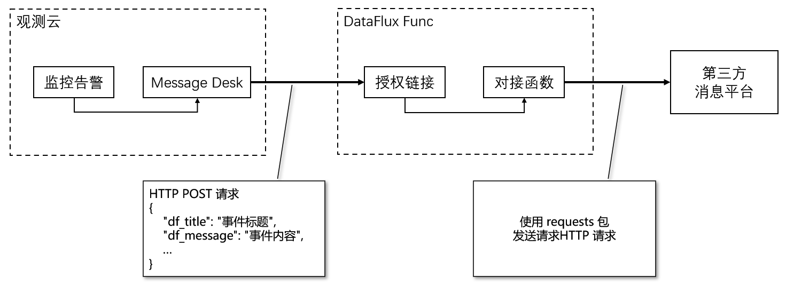
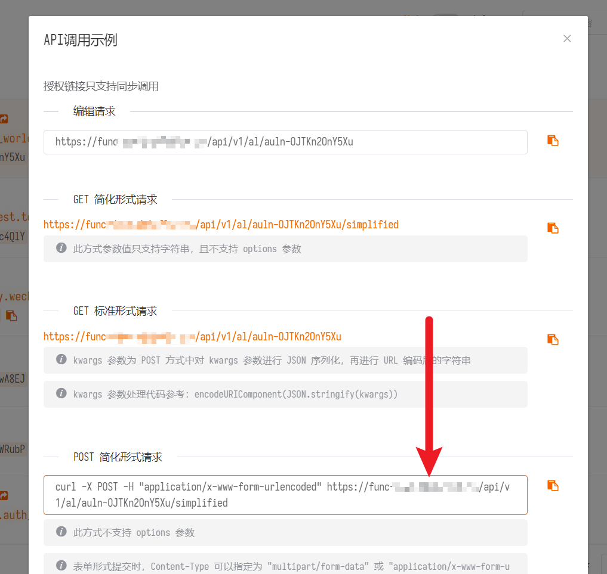
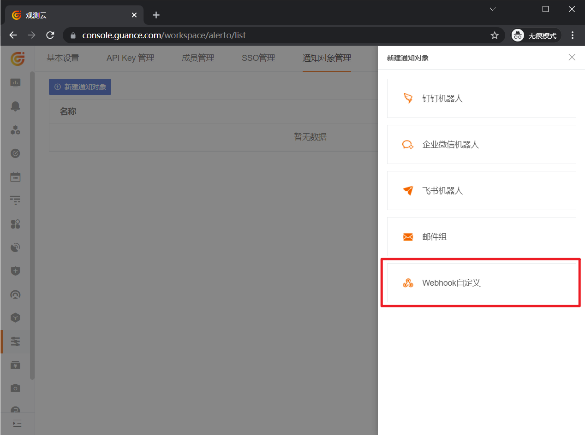
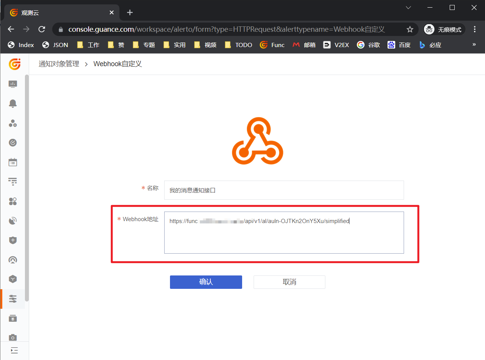

# 观测云Webhook自定义告警通知集成

本文档主要介绍如何集成观测云的Webhook自定义告警通知

## 1. 前言

SaaS版观测云中监控告警消息的邮件、短信通知，都直接使用驻云本公司所持有的平台账号进行发送。

但除了SaaS版外，观测云也支持私有化部署（即PaaS版）。私有化部署的观测云由于并不处于驻云账号下，因此无法发送邮件、短信消息，但可以通过「Webhook自定义」的方式进行对接。

此外，对于不满足于观测云所提供的已有通知方式（邮件、短信、钉钉、微信），自身有特殊消息通知渠道的，同样也可以通过「Webhook自定义」方式对接。

## 2. 观测云「Webhook自定义」告警通知细节

在观测云中的告警通知对象中选择「Webhook自定义」，即表示以HTTP请求方式发送通知。

观测云的HTTP告警通知为【固定格式的POST请求】，请求体格式为`application/json`，发送至所配置的地址。

一个典型的「Webhook自定义」告警通知【部分内容】如下：

```
POST http://some-domain/send-sms
Content-Type: application/json

{
    "timestamp"               : 1625638440,
    "df_status"               : "warning",
    "df_event_id"             : "event-xxxxxxxxxx",
    "df_title"                : "web001存在问题",
    "df_message"              : "web001存在问题\nCPU使用率大于90\n内存使用率大于90",
    "df_dimension_tags"       : "{\"host\":\"web001\"}",
    "df_monitor_id"           : "monitor_xxxxxxxxxx",
    "df_monitor_name"         : "异常检测名",
    "df_monitor_checker_id"   : "rul_xxxxxxxxxx",
    "df_monitor_checker_name" : "异常检测项目名",
    "df_monitor_checker_value": "99",
    "df_event_link"           : "https://console.guance.com/keyevents/monitorChart?xxxxxxxxxx"
    "df_workspace_uuid"       : "wksp_xxxxxxxxxx",
    "df_workspace_name"       : "我的工作空间",
    "Result"                  : 99,
    "...其他更多字段": "略",

    // 以下为旧版字段
    "date"          : 1625638440,
    "workspace_uuid": "wksp_xxxxxxxxxx",
    "workspace_name": "我的工作空间",
}
```

字段定义如下：

| 字段名                     | 类型                | 是否必须 | 说明                                                             |
| -------------------------- | ------------------- | -------- | ---------------------------------------------------------------- |
| `timestamp`                | Integer             | 必须     | 产生时间。Unix时间戳，单位秒                                     |
| `df_status`                | Enum                | 必须     | 状态。取值`ok`, `info`, `warning`, `error`, `critical`, `nodata` |
| `df_event_id`              | String              | 必须     | `event`ID。                                                      |
| `df_title`                 | String              | 必须     | 标题。                                                           |
| `df_message`               | String              |          | 详细描述。                                                       |
| `df_dimension_tags`        | String(JSON-format) | 必须     | 检测纬度标签，如`{"host":"web01"}`                               |
| `df_monitor_id`            | String              |          | 监控器分组ID                                                     |
| `df_monitor_name`          | String              |          | 监控器组名                                                       |
| `df_monitor_checker_id`    | String              |          | 监控器ID                                                         |
| `df_monitor_checker_name`  | String              |          | 监控器名                                                         |
| `df_monitor_checker_value` | String              |          | 检测触发事件时的值（大数据算法时为第一个异常值）                 |
| `df_event_link`            | String              |          | 事件跳转链接                                                     |
| `df_workspace_uuid`        | String              |          | 所属工作空间UUID                                                 |
| `df_workspace_name`        | String              |          | 所属工作空间名                                                   |
| `Result`                   | Float               |          | 检测值                                                           |
| `date`                     | Integer             |          | 【旧版】产生时间。Unix时间戳，单位秒                             |
| `workspace_uuid`           | String              |          | 【旧版】所属工作空间UUID                                         |
| `workspace_name`           | String              |          | 【旧版】所属工作空间名                                           |

> 一般来说，对接第三方消息平台时，只需要用到`df_title`和`df_message`两个字段即可。

## 3. 对接方式选择

按照客户实际情况，可以分为以下2种方式：

| 对接方式               | 简介                                                                                                                       |
| ---------------------- | -------------------------------------------------------------------------------------------------------------------------- |
| 直接对接               | 在「Webhook自定义」中直接填写客户系统/第三方系统URL                                                                        |
| DataFlux Func 中转对接 | 在「Webhook自定义」中填写DataFlux Func 的授权链接地址，<br>通过在DataFlux Func 中编写的函数再向客户系统/第三方系统发送请求 |

### 3.1 直接对接

即观测云产生事件时，直接向客户系统/第三方系统URL地址发送固定格式的HTTP 请求。

采用这种方式需要客户系统/第三方系统能够处理观测云发出的此类请求，具体请求格式参见上文的`观测云「Webhook自定义」告警通知细节`。

*如选择这种对接方式，那么实际上对接操作和DataFlux Func 并没有实质上的关系，本文档其余部分可以忽略*

### 3.2 DataFlux Func 中转对接

即观测云产生事件时，向DataFlux Func 的授权链接发送固定格式的HTTP 请求，再由DataFlux Func 中编写的脚本向客户系统/第三方系统发送请求。

由于绝大多数客户系统/第三方系统不太可能内置了对观测云「Webhook自定义」通知的对接处理接口，大部分情况是客户系统/第三方系统存在接收通知的接口，但与观测云的「Webhook自定义」方式发出的HTTP请求格式不同。因此，可以利用DataFlux Func 充当观测云和客户系统/第三方系统的转换器来使用。

如采用这种方式，需要读者已经了解或掌握以下内容：

- DataFlux Func 使用方法
- 基础Python开发知识

其次，对接也需要合适的网络环境：

- 观测云能够访问DataFlux Func
- DataFlux Func 能够访问到第三方的消息发送平台

> 提示：建议使用独立安装的DataFlux Func 实现此对接

*注意：如坚持使用观测云附带的DataFlux Func 实现此对接，请确保所有的操作修改不会影响观测云。如果您不清楚会不会影响观测云，请选择独立安装的DataFlux Func*

## 4. DataFlux Func 中转对接具体操作

此部分内容为使用DataFlux Func 中转对接的具体操作介绍

### 4.1 整体处理逻辑流程

告警通知的集成整体的处理逻辑流程非常简单，如下图：



### 4.2 典型操作步骤

【假设】当前有一个私有化部署的客户，需要私有化版的观测云也能发送短信。

并且，客户自身也保有发送短信接口，接口如下：

```
GET http://some-domain/send-sms?to=13000000000&msg=Hello
```
#### 编写用于对接第三消息平台的函数

在本例中，第三方消息平台通过标准HTTP GET 方式接入，参数如下：

| Query参数 | 是否必须 | 说明           |
| --------- | -------- | -------------- |
| to        | 是       | 接收短信的手机 |
| msg       | 是       | 短信内容       |

那么，结合上文有关「观测云告警通知细节」的内容，即可写出如下脚本：

~~~python
import requests

SMS_API = 'http://some-domain/send-sms'

@DFF.API('Webhook对接')
def webhook_accept(**event):
    print(f'事件数据：{event}')

    params = {
        'to' : '13000000000',
        'msg': event.get('df_title') or '您在观测云有新事件',
    }
    r = requests.get(SMS_API, params=params, timeout=3)
    print(f'接口返回：{r.status_code} {r.text}')

    return r.status_code, r.text

def test_webhook_accept():
    '''Webhook对接测试'''
    webhook_accept(df_title='测试Webhook对接')
~~~

本代码中使用了`requests`库作为发送HTTP 请求的客户端，您可以访问[requests官网文档](https://docs.python-requests.org/zh_CN/latest/)获得更详细的资料。

#### 创建授权链接

完成脚本并【发布】后，即可以在DataFlux Func的「管理 - 授权链接」中为函数添加授权链接。

创建授权链接后，在授权链接的「示例」中，复制「POST简化形式请求」中的地址（`/simplified`结尾）

*注意：不要忘记发布脚本。未发布的脚本只是草稿，并不会生效*



#### 添加告警通知

转到观测云，选择「管理 - 通知对象管理 - 新建通知对象 - Webhook自定义」，Webhook地址填写上一步中的「POST简化形式请求」中的地址即可。




## 5. 查看对接函数运行日志

由于以「授权链接」运行的函数并不会保存每次的任务记录。

如果对接函数复杂，且代码中包含很多`print(...)`的内容需要后续排查，可以用「批处理」来替代「授权链接」。

「批处理」可以简单理解为「授权链接」的异步版本，且不会返回函数的`return`内容。但是运行期间`print(...)`的内容会保留在任务记录中。

需要查看函数运行日志时，直接在每次的任务记录中查看即可。

## 6. 问题排查

如果在以上的配置都正确的情况下，收不到通知，那么可能存在以下几种可能，可以按顺序依次进行排查：

1. 观测云无法访问DataFlux Func
2. DataFlux Func 无法访问第三方的接口
3. 第三方接口本身问题等外部原因

*注意：进行问题排查时请仔细阅读接口返回信息，有返回并不代表正常*

### 6.1 观测云无法访问DataFlux Func

根据观测云和DataFlux Func 版本的不同组合，可以按照如下表格检查观测云到DataFlux Func 的连通性

| 观测云版本 | DataFlux Func 版本 | 排查方法                                                                                                                         |
| ---------- | ------------------ | -------------------------------------------------------------------------------------------------------------------------------- |
| SaaS版     | 独立部署版         | 直接使用浏览器通过公网访问DataFlux Func 域名                                                                                     |
| PaaS版     | 独立部署版         | 进入部署版观测云的`message-desk-worker`容器中<br>执行`curl {DataFlux Func 域名}`                                                 |
| PaaS版     | 自带DataFlux Func  | 进入部署版观测云的`message-desk-worker`容器中<br>执行`curl {DataFlux Func 域名}`<br>或`curl server-inner.func2:8088`（集群内网） |

*注意：在「PaaS版观测云 + 自带DataFlux Func」的方案下，通知对象的Webhook URL域名需要使用能够连通DataFlux Func 的域名*

### 6.2 DataFlux Func 无法访问第三方的接口

检查DataFlux Func 访问第三方接口，主要分为以下2个步骤，必须保证2个步骤等能正常运行才算能够连通：

1. 直接在DataFlux Func 中，直接运行上述例子中的`test_webhook_accept()`函数，检查是否正常运行

2. 执行以下Shell语句发起授权链接的调用：

```shell
curl -X POST -H "application/json" \
    http://{DataFlux Func 域名}/api/v1/al/auln-webhook/simplified \
    -d '{"df_title":"测试Webhook对接"}'
```

### 6.3 第三方接口本身问题等外部原因

此类问题种类多且繁杂，从单纯网络问题、IP白名单限制，到单纯的第三方接口Bug都有可能

建议最后进行此问题的排查，并将第三方接口的具体表现、返回信息汇报给第三方接口的提供商