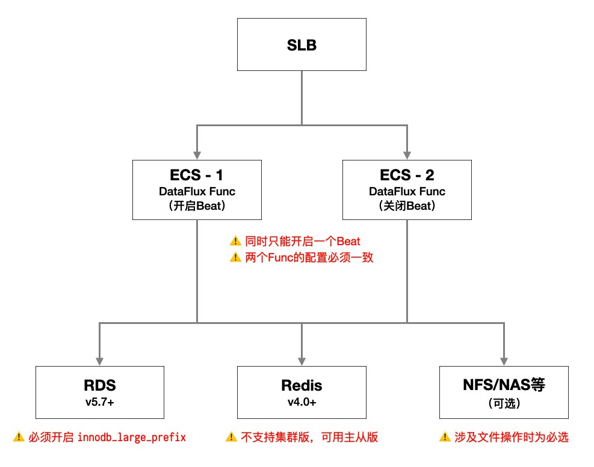

# 维护手册
---


本文档主要面向运维，提供有关DataFlux Func 安装部署、日常维护、故障排除等相关介绍

#### 携带版下载命令

```shell
/bin/bash -c "$(curl -fsSL t.guance.com/func-portable-download)"
```

## 1. 系统及环境要求

安装DataFlux Func 之前，请务必确认环境已经满足以下条件。

### 1.1 系统要求

运行DataFlux Func 的主机需要满足以下条件：

- CPU 核心数 >= 2
- 内存容量 >= 4GB
- 磁盘空间 >= 20GB
- 网络带宽 >= 10Mbps
- 操作系统为 Ubuntu 16.04 LTS/CentOS 7.2 以上
- 纯净系统（安装完操作系统后，除了配置网络外没有进行过其他操作）
- 开放`8088`端口（本系统默认使用`8088`端口，请确保防火墙、安全组等配置允许`8088`入方向访问）
- 使用外部MySQL 时，MySQL 版本必须为5.7以上
- 使用外部Redis 时，Redis 版本必须为4.0以上

*注意：DataFlux Func 不支持macOS、Windows，您可以选择在虚拟机、云主机中安装DataFlux Func*

*注意：DataFlux Func 不支持集群版Redis，有高可用需要请选择主从版*

*注意：如果在阿里云ECS上安装DataFlux Func，并且开启了阿里云盾插件。由于云盾本身占用资源较多，所以系统配置应适当提高*

> 详细操作系统兼容性实测结果，可参考「已实测操作系统兼容性」

如希望在树莓派上安装，请参考以下文章：

- [在树莓派上运行 - Ubuntu Server 64-bit](https://docs.guance.com/dataflux-func/run-on-raspberry-pi-ubuntu)
- [在树莓派上运行 - 官方Raspberry Pi OS](https://docs.guance.com/dataflux-func/run-on-raspberry-pi-os)

### 1.2 软件准备

本系统基于Docker Stack 运行，因此：

对于在线安装版，要求操作系统已经可以正常使用Docker 和Docker Stack。

对于携带版，安装脚本本身已经自带了Docker 的安装包并会在安装时自动安装。
用户也可以自行安装Docker 并初始化Docker Swarm，然后运行安装脚本，
安装脚本在发现Docker 已经安装后会自动跳过这部分处理。

- Docker Swarm 初始化命令为：`sudo docker swarm init`

如果本机存在多个网卡，需要在上述初始化命令中指定网卡

- 存在多网卡的建议用户自行安装Docker 并初始化Docker Swarm
- Docker Swarm 指定网卡的初始化命令为：`sudo docker swarm init --advertise-addr={网卡名} --default-addr-pool={默认地址池}`
- 本机网卡列表可以通过`ifconfig`或者`ip addr`查询
- 默认地址池注意不要与本地网络子网冲突

*注意：自动安装脚本在进行`docker swarm init`时，`--advertise-addr`参数会指定为`127.0.0.1`，`--default-addr-pool`参数会指定为`10.255.0.0/16`*

*注意：DataFlux Func 不支持在snap 版Docker 上运行*

### 1.3 已实测操作系统兼容性

本系统运行依赖Docker Swarm，部分比较旧的Linux发行版可能不支持新版Docker，导致无法安装本系统。

以下实测环境中：
- 虚拟机：均使用官方ISO镜像，安装后直接部署DataFlux Func
- 阿里云：均使用ECS自营镜像，ECS启动后直接部署DataFlux Func
- 树莓派：均为官方网站提供的ISO镜像（ARM 64位运行），启动后直接部署DataFlux Func

> 提示：以下列出的操作系统表示在云平台或虚拟机实际装机，并运行测试通过，未列出的不代表不兼容。

*注意：DataFlux Func 需要运行在64位系统中。官方Raspberry Pi OS 也需要开启ARM 64位模式运行。*

#### 1.3.1 Ubuntu 各版本实测

| 架构      | 操作系统                   | 实测环境       | 兼容性   | 备注                                                                                                              |
| --------- | -------------------------- | -------------- | -------- | ----------------------------------------------------------------------------------------------------------------- |
| `x86_64`  | Ubuntu Kylin 20.04 LTS Pro | 虚拟机         | 兼容     | 系统已自带Docker，<br>需要事先手工初始化Docker Swarm                                                              |
| `x86_64`  | Ubuntu 20.04 LTS           | 虚拟机         | 兼容     |                                                                                                                   |
| `x86_64`  | Ubuntu 18.04 LTS           | 虚拟机         | 兼容     |                                                                                                                   |
| `x86_64`  | Ubuntu 16.04 LTS           | 虚拟机         | 兼容     |                                                                                                                   |
| `x86_64`  | Ubuntu 14.04 LTS           | 虚拟机         | *不兼容* | 因Docker新特性要求，<br>无法使用新版Docker                                                                        |
| `aarch64` | Ubuntu 18.04 LTS           | 阿里云         | 兼容     |                                                                                                                   |
| `aarch64` | Ubuntu 20.04 LTS           | 树莓派4B 8GB版 | 兼容     | 详细请参考[在树莓派上运行 - Ubuntu Server 64-bit](https://docs.guance.com/dataflux-func/run-on-raspberry-pi-ubuntu) |

#### 1.3.2 Debian 各版本实测

| 架构      | 操作系统                             | 实测环境       | 兼容性 | 备注                                                                                                                                          |
| --------- | ------------------------------------ | -------------- | ------ | --------------------------------------------------------------------------------------------------------------------------------------------- |
| `x86_64`  | Debian 10.2 "buster"                 | 阿里云         | 兼容   |                                                                                                                                               |
| `x86_64`  | Debian 9.6 "stretch"                 | 阿里云         | 兼容   |                                                                                                                                               |
| `x86_64`  | Debian 8.11 "jessie"                 | 阿里云         | 兼容   |                                                                                                                                               |
| `aarch64` | Debian 10.9 "buster"                 | 阿里云         | 兼容   |                                                                                                                                               |
| `aarch64` | Raspberry Pi OS (Debain 10 "buster") | 树莓派4B 8GB版 | 兼容   | 需要树莓派开启`arm64_bit`模式<br>详细请参考[在树莓派上运行 - 官方Raspberry Pi OS](https://docs.guance.com/dataflux-func/run-on-raspberry-pi-os) |

#### 1.3.3 CentOS 各版本实测

| 架构      | 操作系统    | 实测环境 | 兼容性   | 备注                                                  |
| --------- | ----------- | -------- | -------- | ----------------------------------------------------- |
| `x86_64`  | CentOS 8.2  | 阿里云   | 兼容     |                                                       |
| `x86_64`  | CentOS 8.0  | 阿里云   | 兼容     |                                                       |
| `x86_64`  | CentOS 7.6  | 阿里云   | 兼容     |                                                       |
| `x86_64`  | CentOS 7.2  | 阿里云   | 兼容     |                                                       |
| `x86_64`  | CentOS 6.10 | 阿里云   | *不兼容* | 因Docker新特性要求，<br>无法使用新版Docker            |
| `aarch64` | CentOS 8.3  | 阿里云   | *不兼容* | 因官方Redis镜像无法启动而不兼容，<br>详见下方「提示」 |
| `aarch64` | CentOS 7.9  | 阿里云   | *不兼容* | 因官方Redis镜像无法启动而不兼容，<br>详见下方「提示」 |

官方Redis镜像在ARM版CentOS上启动时，会发生`<jemalloc>: Unsupported system page size`错误，参见：
- [CSDN：arm64下启动redis官方容器报错处理](https://blog.csdn.net/toyangdon/article/details/104941161)
- [Github issue: docker-library/redis/issues/208](https://github.com/docker-library/redis/issues/208)

#### 1.3.4 macOS、Windows

*暂不支持macOS、Windows，您可以选择在虚拟机、云主机中安装DataFlux Func*

### 1.4 已知浏览器兼容性

本系统为Web应用，部分浏览器可能存在兼容问题无法使用

| 浏览器                                  | 兼容性   |
| --------------------------------------- | -------- |
| Chrome                                  | 兼容     |
| Safari                                  | 兼容     |
| Firefox                                 | 兼容     |
| Microsoft Edge (webkit)                 | 兼容     |
| Opera                                   | 兼容     |
| 遨游浏览器                              | 兼容     |
| 搜狗浏览器                              | 兼容     |
| QQ 浏览器                               | 兼容     |
| 360极速浏览器（极速模式，即Chrome模式） | 兼容     |
| 360极速浏览器（兼容模式，即IE模式）     | *不兼容* |
| Internet Explorer                       | *不兼容* |


## 2. 快速安装

### 2.1. 使用「携带版」离线安装【推荐】

*本方式为推荐安装方式*

DataFlux Func 支持将所需安装文件下载后，通过U盘等移动设备带入无公网环境安装的「携带版」。

下载的「携带版」本身附带了自动安装脚本，执行即可进行安装（详情见下文）

#### 2.1.1 一键命令下载「携带版」安装文件

对于Linux、macOS 等系统，推荐使用官方提供的shell 命令下载「携带版」。

运行以下命令，即可自动下载DataFlux Func携带版的所需安装文件，下载脚本会自动根据当前环境选择下载`x86_64`或`aarch64`架构版本：

*注意：安装前请确认系统要求和服务器配置*

```shell
/bin/bash -c "$(curl -fsSL t.guance.com/func-portable-download)"
```

如需要下载指定架构的版本，可以使用以下命令下载：

- `Intel x86_64`处理器

```shell
/bin/bash -c "$(curl -fsSL t.guance.com/func-portable-download)" -- --arch x86_64
```

- `ARM aarch64`处理器（即ARM64v8，如：树莓派等）

```shell
/bin/bash -c "$(curl -fsSL t.guance.com/func-portable-download)" -- --arch aarch64
```

命令执行完成后，所有安装文件都保存在自动创建的`dataflux-func-portable-{架构}-{版本号}`目录下。

- 对于需要将DataFlux Func 安装到*无公网*的服务器时，可以先在本机下载，之后将整个目录通过U盘等移动存储设备，或`scp`工具等复制到目标机器中
- 对于需要将DataFlux Func 安装到可以访问公网的服务器，直接在服务器上下载即可

#### 2.1.2 手工下载「携带版」安装文件

对于不便使用shell 命令的系统，可手工下载所需安装文件。

如需要手工下载，以下是所有的文件列表：

| #   | 内容                      | 文件名                      | x86_64架构                                                                           | aarch64架构                                                                           |
| --- | ------------------------- | --------------------------- | ------------------------------------------------------------------------------------ | ------------------------------------------------------------------------------------- |
| 1   | Docker 二进制程序         | `docker-20.10.8.tgz`        | [下载](https://static.guance.com/dataflux-func/portable/x86_64/docker-20.10.8.tgz)   | [下载](https://static.guance.com/dataflux-func/portable/aarch64/docker-20.10.8.tgz)   |
| 2   | DataFlux Func 镜像        | `dataflux-func.tar.gz`      | [下载](https://static.guance.com/dataflux-func/portable/x86_64/dataflux-func.tar.gz) | [下载](https://static.guance.com/dataflux-func/portable/aarch64/dataflux-func.tar.gz) |
| 3   | MySQL/MariaDB 镜像        | `mysql.tar.gz`              | [下载](https://static.guance.com/dataflux-func/portable/x86_64/mysql.tar.gz)         | [下载](https://static.guance.com/dataflux-func/portable/aarch64/mysql.tar.gz)         |
| 4   | Redis 镜像                | `redis.tar.gz`              | [下载](https://static.guance.com/dataflux-func/portable/x86_64/redis.tar.gz)         | [下载](https://static.guance.com/dataflux-func/portable/aarch64/redis.tar.gz)         |
| 5   | Docker 服务配置文件       | `docker.service`            | [下载](https://static.guance.com/dataflux-func/portable/docker.service)              | [下载](https://static.guance.com/dataflux-func/portable/docker.service)               |
| 6   | DataFluxFunc 安装脚本     | `run-portable.sh`           | [下载](https://static.guance.com/dataflux-func/portable/run-portable.sh)             | [下载](https://static.guance.com/dataflux-func/portable/run-portable.sh)              |
| 7   | Docker Stack 配置文件模板 | `docker-stack.example.yaml` | [下载](https://static.guance.com/dataflux-func/portable/docker-stack.example.yaml)   | [下载](https://static.guance.com/dataflux-func/portable/docker-stack.example.yaml)    |
| 8   | 镜像列表                  | `image-list`                | [下载](https://static.guance.com/dataflux-func/portable/x86_64/image-list)           | [下载](https://static.guance.com/dataflux-func/portable/aarch64/image-list)           |
| 9   | 版本信息                  | `version`                   | [下载](https://static.guance.com/dataflux-func/portable/version)                     | [下载](https://static.guance.com/dataflux-func/portable/version)                      |

手工下载所有安装文件后，放入同一个目录下即可。

*注意：如有更新，【重新下载所有文件】。请勿自行猜测哪些文件有变动，哪些没有变动*

*注意：手工下载时，如使用浏览器等下载时，请注意不要下载到缓存的旧内容！！*

#### 2.1.3 使用「携带版」附带的脚本执行安装

运行安装文件所在目录下的`run-portable.sh`，即可自动配置并最终启动整个DataFlux Func：

*注意：安装前请确认系统要求和服务器配置*

*注意：DataFlux Func 不支持Mac，请拷贝到Linux 系统下再运行安装*

```shell
cd {安装文件所在目录}
sudo /bin/bash run-portable.sh

# 或者
sudo /bin/bash {安装文件所在目录}/run-portable.sh
```

使用自动安装脚本可以实现几分钟内快速安装运行，自动配置的内容如下：

- 运行MySQL、Redis、DataFlux Func（包含Server，Worker，Beat）
- 自动创建并将所有数据保存于`/usr/local/dataflux-func/`目录下（包括MySQL数据、Redis数据、DataFlux Func 配置、日志等文件）
- 随机生成MySQL `root`用户密码、系统Secret，并保存于DataFlux Func 配置文件中
- Redis不设密码
- MySQL、Redis 不提供外部访问

执行完成后，可以使用浏览器访问`http://{服务器IP地址/域名}:8088`进行初始化操作界面。

*注意：如果运行环境性能较差，应当使用`docker ps`命令确认所有组件成功启动后，方可访问（见以下列表）*

1. `dataflux-func_mysql`
2. `dataflux-func_redis`
3. `dataflux-func_server`
4. `dataflux-func_worker-0`
5. `dataflux-func_worker-1-6`
6. `dataflux-func_worker-7`
7. `dataflux-func_worker-8-9`
8. `dataflux-func_beat`

### 2.2. 使用一键安装命令在线安装【不推荐】

*注意：由于涉及驻云镜像库登录等事宜，本方式不做为首推方案*

*注意：需要事先已经安装好Docker 且配置好Docker Swarm，并已经登录驻云官方镜像库`pubrepo.jiagouyun.com`*

DataFlux Func 提供了一键在线安装脚本，可以在数分钟内完成安装并运行。

运行以下命令，即可自动下载配置脚本并最终启动整个DataFlux Func：

```shell
sudo /bin/bash -c "$(curl -fsSL t.guance.com/func-docker-stack-run)"
```

使用自动安装脚本可以实现几分钟内快速安装运行，自动配置的内容如下：

- 运行MySQL、Redis、DataFlux Func（包含Server，Worker，Beat）
- 自动创建并将所有数据保存于`/usr/local/dataflux-func/`目录下（包括MySQL数据、Redis数据、DataFlux Func 配置、日志等文件）
- 随机生成MySQL `root`用户密码、系统Secret，并保存于DataFlux Func 配置文件中
- Redis不设密码
- MySQL、Redis 不提供外部访问

执行完成后，可以使用浏览器访问`http://localhost:8088`进行初始化操作界面。

*注意：如果运行环境性能较差，应当使用`docker ps`命令确认所有组件成功启动后，方可访问（见以下列表）*

1. `dataflux-func_mysql`
2. `dataflux-func_redis`
3. `dataflux-func_server`
4. `dataflux-func_worker-0`
5. `dataflux-func_worker-1-6`
6. `dataflux-func_worker-7`
7. `dataflux-func_worker-8-9`
8. `dataflux-func_beat`


### 2.3. 验证安装

DataFlux Func 默认安装完成后，就已经附带了一些示例脚本。

依次执行以下操作，即可验证安装：

1. 点击顶部导航条的「脚本编辑器」，在左侧栏依次选择「脚本库」-「示例」-「基础演示」
2. 在右侧脚本编辑器顶部，点击「编辑」进入编辑模式，选择「hello_world」函数并点击「执行」按钮执行函数
3. 此时，如果在底部「脚本输出」中，能够正常看到函数的返回值

至此，验证安装完毕


#### 各服务说明

默认情况下，DataFlux Func 正常启动后，共有如下服务运行：

| 名称                       | 说明                                                                      |
| -------------------------- | ------------------------------------------------------------------------- |
| `dataflux-func_server`     | DataFlux Func 的前端服务。<br>主要用于提供 Web 界面、API接口等            |
| `dataflux-func_worker-0`   | 监听#0号队列的Python工作单元。<br>主要处理 DataFlux Func 的内部任务       |
| `dataflux-func_worker-1-6` | 监听#1~#6号队列的Python工作单元。<br>主要处理同步任务（授权链接）         |
| `dataflux-func_worker-7`   | 监听#7号队列的Python工作单元。<br>主要处理在 Web 界面中运行脚本的调试任务 |
| `dataflux-func_worker-8-9` | 监听#1~#6号队列的Python工作单元。<br>主要处理异步任务（自动触发、批处理） |
| `dataflux-func_beat`       | 自动触发任务的触发器，全局只能开启1个                                     |
| `dataflux-func_mysql`      | DataFlux Func 自带的内置MySQL                                             |
| `dataflux-func_redis`      | DataFlux Func 自带的内置Redis                                             |

#### 数据保存位置

DataFlux Func 运行需要存储各种不同的数据，大致内容及存储位置如下：

| 存储    | 存储内容                                                                                                                                                                          |
| ------- | --------------------------------------------------------------------------------------------------------------------------------------------------------------------------------- |
| `MySQL` | 绝大部分在UI操作中产生的数据，包括且不限于：<br>1. 脚本、数据源配置、环境变量<br>2. 用户信息、授权链接配置、自动触发配置、批处理配置<br>3. 操作记录、脚本运行记录、导入导出记录等 |
| `Redis` | 主要用于缓存和队列，包括且不限于：<br>1. 用户登录信息<br>2. 脚本运行时建立的各种缓存<br>3. 脚本执行任务队列<br>4. Func 自身监控数据等                                             |
| `磁盘`  | 主要用于必须以文件形式存在的数据，包括且不限于：<br>1. DataFlux Func 系统配置<br>2. PIP 工具安装的第三方包<br>3. 用户上传的文件<br>4. 数据库备份文件等                            |


### 2.4. 安装选项

自动安装脚本支持一些安装选项，用于适应不同的安装需求

#### 2.4.1 「携带版」指定安装选项

安装「携带版」时，只需要在自动安装命令后添加`--{参数}[ 参数配置（如有）]`，即可指定安装选项

如，指定端口号为9000：

```shell
sudo /bin/bash run-portable.sh --port 9000
```

<!--
#### 2.4.2 在线安装版指定安装选项

使用一键安装命令在线安装时，只需要在自动安装命令后添加`-- --{参数}[ 参数配置（如有）]`，即可指定安装选项

如，指定安装目录：

```shell
sudo /bin/bash -c "$(curl -fsSL t.guance.com/func-docker-stack-run)" -- --install-dir /home/dev/datafluxfunc
```

*注意：参数前确实有`--`，表示参数传递给需要执行的脚本，此处不是笔误*
-->

#### 2.4.2 可用安装选项

具体参数详情见下文

##### `--mini`：安装迷你版

针对低配置环境下，需要节约资源时的安装模式。

开启后：

- 仅启动单个Worker 监听所有队列
- 遇到重负载任务更容易导致队列阻塞和卡顿
- 系统任务和函数任务共享处理队列，相互会受到影响
- 系统要求降低为：
    - CPU 核心数 >= 1
    - 内存容量 >= 2GB
- 如不使用内置的MySQL、Redis，系统要求可以进一步降低

##### `--port {端口号}`：指定监听端口号

DataFlux Func 默认使用`8088`端口访问，如果此端口被其他程序占用，可以选择其他端口，如：`9000`。

##### `--install-dir {安装目录}`：指定安装目录

需要安装到与默认路径`/usr/local/dataflux-func`不同的路径下时，可指定此参数

##### `--no-mysql`：禁用内置MySQL

需要使用已有的MySQL数据库时，可指定此参数，禁止在本机启动MySQL。

*注意：启用此选项后，需要在安装完成后的配置页面指定正确的MySQL连接信息*

##### `--no-redis`：禁用内置Redis

需要使用已有的Redis数据库时，可指定此参数，禁止在本机启动Redis。

*注意：启用此选项后，需要在安装完成后的配置页面指定正确的Redis连接信息*


## 3. 日常维护

默认情况下，安装目录为`/usr/local/dataflux-func`

### 3.1 升级系统

*注意：如果最初安装时指定了不同安装目录，升级时也需要指定完全相同的目录才行*

*注意：千万不要随便删除以前的目录，有任何更改，请务必保存好之前的所有配置文件*

需要升级时，请按照以下步骤进行：

1. 使用`docker stack rm dataflux-func`命令，移除正在运行的服务（此步骤可能需要一定时间）
2. 使用`docker ps`确认所有容器都已经退出
3. 按照全新安装步骤，指定`--install-dir`参数安装到相同目录即可（脚本会自动继承以前的数据，不会删除原来的数据）

### 3.2 重启系统

需要重新启动时，请按照以下步骤进行：

1. 使用`docker stack rm dataflux-func`命令，移除正在运行的服务（此步骤可能需要一定时间）
2. 使用`docker ps`确认所有容器都已经退出
3. 使用`docker stack deploy dataflux-func -c {安装目录}/docker-stack.yaml --resolve-image never`重启所有服务

> 提示：由于「携带版」本身已经将镜像导入本地，加上`--resolve-image never`参数可以避免Docker 在启动容器时进行无意义的镜像检查

### 3.3 查看Docker Stack 配置

默认情况下，Docker Stack 配置文件保存位置如下：

| 环境     | 文件位置                       |
| -------- | ------------------------------ |
| 宿主机内 | `{安装目录}/docker-stack.yaml` |

### 3.4 查看DataFlux Func 配置

默认情况下，配置文件保存位置如下：

| 环境     | 文件位置                           |
| -------- | ---------------------------------- |
| 容器内   | `/data/user-config.yaml`           |
| 宿主机内 | `{安装目录}/data/user-config.yaml` |

### 3.5 查看资源文件目录

默认情况下，资源文件目录保存位置如下：

| 环境     | 目录位置                     |
| -------- | ---------------------------- |
| 容器内   | `/data/resources/`           |
| 宿主机内 | `{安装目录}/data/resources/` |

资源文件目录可能包含以下内容：

| 宿主机目录位置                                    | 说明                                             |
| ------------------------------------------------- | ------------------------------------------------ |
| `{安装目录}/data/resources/extra-python-packages` | 通过UI界面「PIP工具」安装的额外Python 包存放位置 |
| `{安装目录}/data/resources/uploads`               | 通过接口上传文件的临时存放目录（会自动回卷清理） |

开发者/用户也可以自行将所需的其他资源文件存放在`{安装目录}/data/resources`下，
以便在脚本中读取使用。

*以上目录程序会自动创建*

### 3.6 查看日志

默认情况下，日志文件保存位置如下：

| 环境     | 文件位置                                 |
| -------- | ---------------------------------------- |
| 容器内   | `/data/logs/dataflux-func.log`           |
| 宿主机内 | `{安装目录}/data/logs/dataflux-func.log` |

默认情况下，日志文件会根据logrotate配置自动回卷并压缩保存
（logrotate配置文件位置为`/etc/logrotate.d/dataflux-func`）

### 3.7 数据库自动备份

*注意：本功能通过`mysqldump`备份数据库，连接数据库的MySQL用户需要足够的权限才能正常备份（包括`SELECT`, `RELOAD`, `LOCK TABLES`, `REPLICATION CLIENT`, `SHOW VIEW`, `PROCESS`）*

DataFlux Func 会定期自动备份完整的数据库为sql文件

默认情况下，数据库备份文件保存位置如下：

| 环境     | 文件位置                                                            |
| -------- | ------------------------------------------------------------------- |
| 容器内   | `/data/sqldump/dataflux-func-sqldump-YYYYMMDD-hhmmss.sql`           |
| 宿主机内 | `{安装目录}/data/sqldump/dataflux-func-sqldump-YYYYMMDD-hhmmss.sql` |

> 提示：旧版本的备份文件命名可能为`dataflux-sqldump-YYYYMMDD-hhmmss.sql`

默认情况下，数据库备份文件每小时整点备份一次，最多保留7天（共168份）

### 3.8 卸载

*注意：卸载前，请使用脚本集导出功能导出相关数据*

需要卸载时，可以使用以下命令进行卸载：

```shell
# 移除正在运行的DataFlux Func
sudo docker stack rm dataflux-func

# 删除DataFlux Func 数据目录
sudo rm -rf {安装目录}
```

### 3.9 参数调整

默认的参数主要应对最常见的情况，一些比较特殊的场景可以调整部分参数来优化系统：

| 参数                          | 默认值    | 说明                                                                                                    |
| ----------------------------- | --------- | ------------------------------------------------------------------------------------------------------- |
| `LOG_LEVEL`                   | `WARNING` | 日志等级。<br>可以改为`ERROR`减少日志输出量。<br>或直接改为`NONE`禁用日志                               |
| `_WORKER_CONCURRENCY`         | `5`       | 工作单元进程数量。<br>如存在大量慢IO任务（耗时大于1秒），可改为`20`提高并发量，但不要过大，防止内存耗尽 |
| `_WORKER_PREFETCH_MULTIPLIER` | `10`      | 工作单元任务预获取数量。<br>如存在大量慢速任务（耗时大于1秒），建议改为`1`                              |

### 3.10 迁移数据库

如系统安装后通过了最初的单机验证阶段，
需要将数据库切换至外部数据库（如：阿里云RDS、Redis），
可根据以下步骤进行操作：

*注意：当使用外部数据库时，应确保MySQL版本为5.7，Redis版本为4.0以上*

*注意：DataFlux Func 不支持集群部署的Redis*

1. 在外部数据库实例中创建数据库，且确保如下配置项：
    - `innodb-large-prefix=on`
    - `character-set-server=utf8mb4`
    - `collation-server=utf8mb4_unicode_ci`
2. 根据上文「数据库自动备份」找到最近的MySQL数据库备份文件，将其导入外部数据库
3. 根据上文「查看DataFlux Func 配置」找到配置文件，并根据实际情况修改以下字段内容：
    - `MYSQL_HOST`
    - `MYSQL_PORT`
    - `MYSQL_USER`
    - `MYSQL_PASSWORD`
    - `MYSQL_DATABASE`
    - `REDIS_HOST`
    - `REDIS_PORT`
    - `REDIS_DATABASE`
    - `REDIS_PASSWORD`
4. 根据上文「查看Docker Stack 配置」找到Docker Stack 文件，删除其中的MySQL 和Redis 相关部分（注释掉即可）
5. 根据上文「重启系统」重启即可

### 3.11 高可用部署

DataFlux Func 支持多份部署以满足高可用要求。

以阿里云为例，可使用「SLB + ECS x 2 + RDS(MySQL) + RDS(Redis)」方式进行部署。

如果开发涉及到服务器端文件处理（如上传文件，文件服务等）、额外安装Python包，
则需要额外配置NFS/NAS 作为文件共享存储。
并将共享挂载到ECS 的`{安装目录}/data/resources`目录。



参考部署步骤：

1. 在ECS-1 正常安装DataFlux Func，并配置连接外部RDS 和Redis
2. 在ECS-2 正常安装DataFlux Func，复制ECS-1的配置文件并覆盖ECS-2的配置文件，并去除`beat`服务，重启ECS-2的服务

*注意：全局范围内`beat`服务有且只能存在1个，高可用部署时注意只能在某一台ECS上开启`beat`服务*

*注意：选择Redis的高可用方案时，请勿使用「集群版Redis」，可以使用「主从版Redis」*

*注意：如之前已经使用单机方式安装过DataFlux Func，在切换为高可用部署时，请参考上文「5.8 迁移数据库」进行迁移*

*注意：本方案为最简单的多份部署方案，由于ECS-1 与ECS-2 之间并不通讯，因此涉及到安装额外Python包、上传文件等处理时，需要使用共享文件存储*

### 3.12 导出/导入MySQL数据

除了DataFlux Func 自带的定期数据库备份，
也可以直接使用`mysqldump`导出和导入数据。

导出操作的具体命令如下：

```shell
sudo docker exec {MySQL容器ID} sh -c 'exec mysqldump --user=root --password="$MYSQL_ROOT_PASSWORD" --hex-blob --default-character-set=utf8mb4 --skip-extended-insert --databases dataflux_func' > {宿主机上的备份文件}
```

导入操作的具体命令如下：

```shell
sudo docker exec -i {MySQL容器ID} sh -c 'exec mysql -uroot -p"$MYSQL_ROOT_PASSWORD"' < {宿主机上的备份文件}
```

### 3.13 进入Redis终端

如需要直接操作Redis，可以直接进入Redis终端进行操作。

具体命令如下：

```shell
sudo docker exec -it {Redis容器ID} sh -c 'exec redis-cli -n 5'
```

> 提示：DataFlux Func 默认使用Redis 的5号数据库

#### 3.13.1 清理工作队列

DataFlux Func 中工作队列命名规则为`DataFluxFunc-worker#workerQueue@{0~9序号}`。

> 如：`DataFluxFunc-worker#workerQueue@1`

如需要直接清理工作队列，可以参考以下命令

- 如，查看1号队列的长度：

```shell
LLEN "DataFluxFunc-worker#workerQueue@1"
```

- 如，清空1号队列：

```shell
LTRIM "DataFluxFunc-worker#workerQueue@1" -1 0
```

### 3.14 管理员工具

DataFlux Func 也提供了管理员工具，方便进行一些应急维护工作。

管理员工具附带在容器中，需要使用Docker exec 方式运行：

```shell
sudo docker exec {任意DataFlux Func 容器ID} sh -c 'exec python admin-tool.py --help'
```

#### 3.14.1 重置管理员密码

普通用户的密码可以由系统管理员直接重新设置，
但系统管理员本身的密码如果忘记，需要使用DataFlux Func 附带的管理员工具进行重置。

具体命令如下：

- 容器外

```shell
sudo docker exec -it {任意DataFlux Func 容器ID} sh -c 'exec python admin-tool.py reset_admin'
```

- 容器内

```shell
cd /usr/src/app; python admin-tool.py reset_admin
```

修改示例：

```
Enter new Admin username: admin               # 指定管理员用户名（这里是admin）
New password:                                 # 指定管理员新密码
Confirm new password:                         # 重复管理员新密码
Are you sure you want to do this? (yes/no):   # 输入yes表示确认修改
```

#### 3.14.2 重置数据库更新序号

DataFlux Func 在安装/升级时，会自动更新数据库结构，并记录当前数据库结构版本序号。

在某些情况下，这个序号如果不正确，会导致系统无法正常启动，此时需要使用管理员工具修正。

具体命令如下：

- 容器外

```shell
sudo docker exec -it {任意DataFlux Func 容器ID} sh -c 'exec python admin-tool.py reset_db_upgrade_seq'
```

- 容器内

```shell
cd /usr/src/app; python admin-tool.py reset_db_upgrade_seq
```

*注意：如果您不知道这是什么，请咨询官方后再进行操作*

#### 3.14.3 清空Redis

在某些情况下（如：队列堵塞需要立即恢复，脚本不合理的逻辑导致缓存过大等），
可以使用以下命令，清空Redis数据库。

具体命令如下：

- 容器外

```shell
sudo docker exec -it {任意DataFlux Func 容器ID} sh -c 'exec python admin-tool.py clear_redis'
```

- 或容器内

```shell
cd /usr/src/app; python admin-tool.py clear_redis
```

*注意：清空Redis 不会对DataFlux Func 本身运行带来问题。但运行中的业务代码可能会依赖Redis 中的数据，请务必确认后进行操作*

### 3.15 在容器内绑定hosts

某些情况下，一些域名没有DNS解析，需要修改hosts后访问，
那么可以在`docker-stack.yaml`中，`worker-xxx`的服务添加`extra_hosts`内容实现，如：

```yaml
...
services:
  ...
  worker-1-6:
    ...
    extra_hosts:
      - "somehost:1.2.3.4"
      - "otherhost:5.6.7.8"
```

添加上述配置后那么，等同于在`/etc/hosts`中配置了如下内容：

```
somehost    1.2.3.4
otherhost   5.6.7.8
```

- [参考文档：Docker Compose 文件中的 extra_hosts 选项](https://docs.docker.com/compose/compose-file/compose-file-v3/#extra_hosts)
