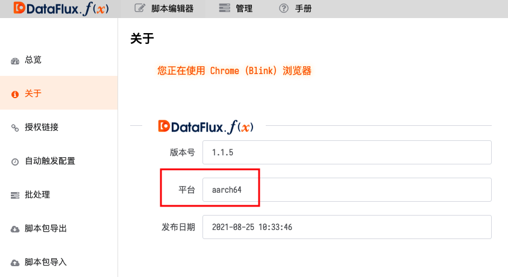
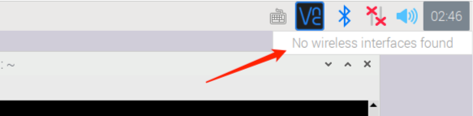

# 在树莓派上运行（官方系统）
---


本文档主要介绍如何在安装了官方 Raspberry Pi OS 系统的树莓派上运行本系统。

> 提示：请始终使用最新版 DataFlux Func 进行操作。

> 提示 2：本文基于树莓派 4B 8GB 版本进行操作。*树莓派 3B 太过赢弱，无法运行*。

> 提示 3：建议操作过程中使用有线网络连接树莓派

## 1. 准备工作

在树莓派上安装 DataFlux Func 前，需要一些准备工作。

### 1.1 烧录树莓派 SD 卡

建议使用纯净官方镜像来烧录 SD 卡后安装 DataFlux Func。

烧录 SD 卡时，可以选择：

1. 官方`Raspberry Pi Imager`工具进行烧录
    - [官方工具下载页面](https://www.raspberrypi.org/software/)
2. 直接下载官方`Raspberry Pi OS`镜像，使用第三方工具烧录
    - [官方镜像下载页面](https://www.raspberrypi.org/software/operating-systems/#raspberry-pi-os-32-bit)
    - [Etcher 烧录工具](https://www.balena.io/etcher/)

烧录完成后，即可将 SD 卡插入树莓派，通电启动。

### 1.2 开启 ARM 64 位模式

官方`Raspberry Pi OS`为了向下兼容性考量，没有开启 64 位模式。而对于树莓派 3B 以后的产品，都支持开启 64 位模式。

可以使用以下命令打开树莓派配置：

```shell
sudo vi /boot/config.txt
```

并加入以下内容，表示开启 ARM 64 位模式：

```
arm_64bit=1
```

保存并重新启动树莓派。

重启后，可以使用以下命令确认：

```shell
arch
```

输出如下：

```
aarch64
```

## 2. 安装 DataFlux Func

在树莓派上安装 DataFlux Func 的过程与在普通服务器上安装基本相同。

### 2.1 下载

下载操作与在其他平台上一样，使用以下命令即可，脚本会检测当前环境架构，并下载 ARM 版资源

```shell
/bin/bash -c "$(curl -fsSL t.guance.com/func-portable-download)"
```

*注意：如果需要在 PC 上下载适用于树莓派的 DataFlux Func 携带版，需要在下载命令中指定`--aarch64`，如：*

```shell
/bin/bash -c "$(curl -fsSL t.guance.com/func-portable-download)" -- --arch aarch64
```

### 2.2 安装

下载完成后，即可进入下载的目录，执行以下命令即行安装：

```shell
sudo /bin/bash run-portable.sh
```

### 2.3 初始化系统

安装完成后，接口使用浏览器打开 DataFlux Func 初始化页面进行操作。

- 在树莓派本机时，访问`http://127.0.0.1:8088`
- 从其他设备访问树莓派时，访问`http://{树莓派 IP}:8088`

### 2.4 确认安装

安装完成后，登录本系统，进入「管理 - 关于」，可以看到「架构」为`aarch64`：



此后的操作与在普通服务器上安装的 DataFlux Func 没有区别

## 3. 配置 WI-FI 连接

> 如果您希望安装好 DataFlux Func 后，让树莓派使用 WI-FI 方式接入网络，请阅读本章节。

安装 DataFlux Func 之后，树莓派任务栏的 WI-FI 控制面板可能会提示`No wireless interfaces found`，
且无法通过 UI 方式连接 WI-FI。与此同时，有线连接可以正常访问网络。



*注意：此问题在测试过程中已被发现，但原因尚不明确*

*注意：此问题并不影响有线连接*

### 3.1 修复树莓派 WI-FI 问题

为了修复此问题，可以打开网络配置：

```shell
sudo vi /etc/network/interfaces
```

添加如下配置：

```shell
auto wlan0
allow-hotplug wlan0
iface wlan0 inet dhcp
wpa-ssid {您的 WI-FI SSID}
wpa-psk  {您的 WI-FI 密码}
```

保存并重启树莓派。

### 3.2 确认问题修复

使用以下命令确认 WI-FI 模块：

```shell
iwconfig wlan0
```

输出内容为：

```
wlan0     IEEE 802.11  ESSID:"{您的 WI-FI SSID}"
          Mode:Managed  Frequency:2.472 GHz  Access Point: 08:36:C9:FC:3B:B0
          Bit Rate=72.2 Mb/s   Tx-Power=31 dBm
          Retry short limit:7   RTS thr:off   Fragment thr:off
          Power Management:on
          Link Quality=70/70  Signal level=-35 dBm
          Rx invalid nwid:0  Rx invalid crypt:0  Rx invalid frag:0
          Tx excessive retries:254  Invalid misc:0   Missed beacon:0
```

使用以下命令确认 WI-FI 网络连接

```shell
ifconfig wlan0
```

输出内容为：

```
wlan0: flags=4163<UP,BROADCAST,RUNNING,MULTICAST>  mtu 1500
        inet {树莓派分配到的 IP 地址}  netmask 255.255.255.0  broadcast 10.0.0.255
        inet6 fe80::e65f:1ff:fe30:c85d  prefixlen 64  scopeid 0x20<link>
        ether e4:5f:01:30:c8:5d  txqueuelen 1000  (Ethernet)
        RX packets 33397  bytes 5759317 (5.4 MiB)
        RX errors 0  dropped 0  overruns 0  frame 0
        TX packets 28599  bytes 22218944 (21.1 MiB)
        TX errors 0  dropped 0 overruns 0  carrier 0  collisions 0
```

最后打开浏览器，可以正常上网即表示 WI-FI 问题已经修复。

也可以直接使用 cURL 验证是否联网成功：

```shell
curl -L function.guance.com/h
```

*注意：即使 WI-FI 问题已经修复，任务栏中的 WI-FI 控制板可能依然显示`No wireless interfaces found`*

## X. 附录

此处记录一下与树莓派相关的内容供参考。

### X.1 最大化发挥树莓派性能

打开`/boot/config.txt`文件

```shell
sudo vim /boot/firmware/usercfg.txt
```

根据需要加入如下内容：

```
force_turbo=0  # 防止 CPU 以最大频率运行
arm_freq=2100  # CPU 超频至 2.1Ghz（默认为 1.5Ghz）
gpu_freq=750   # GPU 超频至 750Mhz
gpu_mem=512    # 显存改为 512MB
over_voltage=6 # 提高电压到 6 级
```

*注意：即使不进行上述设置也能正常使用，且单纯金属外壳即可实现被动散热*

*注意：本设置涉及超频，满负载运行时无法单纯依靠金属外壳进行被动散热，至少需要一个风扇*

*注意：更激进的配置可以进一步树莓派性能，但会导致保修失效*

*注意：如果因超频导致您的树莓派损坏，本文作者不负任何责任，请三思而后行*

### X.2 树莓派压力测试程序

可以使用树莓派压力测试工具测试树莓派运行稳定性（特别是在超频后）

拉取项目库

```shell
git clone https://gitee.com/sujivin/rpi-cpu-stress.git
```

> 原作者 Github 库地址为：[github.com/xukejing/rpi-cpu-stress](https://github.com/xukejing/rpi-cpu-stress)

添加可执行权限

```shell
cd rpi-cpu-stress
chmod +x stress.sh
```

启动压力测试

```
sudo ./stress.sh
```

那么，在终端可以看到如下输出：

```
a72 freq: 2100000
temp: 50634

a72 freq: 2100000
temp: 54530

a72 freq: 2100000
temp: 55991

a72 freq: 2100000
temp: 56478
```

- `a72 freq: 2100000`：表示当前 CPU 主频为 2.1Ghz
- `temp: 50634`：表示温度为 50.634 摄氏度

*注意：不要让树莓派长期处于高温（80 摄氏度以上）*

### X.3 在树莓派中安装中文输入法

在终端执行以下命令，安装「中州韻」输入法：

```shell
sudo apt-get install fcitx fcitx-rime
```

完成后，在「首选项 -> Fcitx 配置 -> 添加输入法」添加「中州韻」输入法

### X.4 在树莓派中安装中文字体

在终端执行以下命令，安装「文泉驿」字体：

```shell
sudo apt-get install ttf-wqy-zenhei
sudo fc-cache
```
