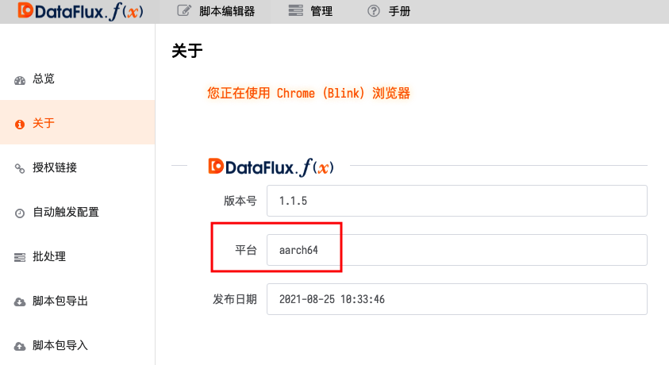

# 在树莓派上运行 - Ubuntu Server 64-bit
---


本文档主要介绍如何在树莓派上运行本系统。

> 提示：请始终使用最新版DataFlux Func 进行操作。

> 提示2：本文基于树莓派4B 8GB版本进行操作。*树莓派3B性能太过赢弱，无法运行*。

> 提示3：建议操作过程中使用有线网络连接树莓派

*注意：必须使用64位，用于树莓派的Ubuntu Server 镜像*

## 1. 准备工作

在树莓派上安装DataFlux Func 前，需要一些准备工作。

### 1.1 烧录树莓派SD卡并初始化系统

建议使用纯净官方镜像来烧录SD卡后安装DataFlux Func。

烧录SD卡时，可以选择：

1. 官方`Raspberry Pi Imager`工具进行烧录
    - [官方工具下载页面](https://www.raspberrypi.org/software/)
2. 直接下载官方`Ubuntu Server 64-bit`镜像，使用第三方工具烧录
    - [官方镜像下载页面](https://ubuntu.com/download/raspberry-pi)
    - [Etcher 烧录工具](https://www.balena.io/etcher/)

烧录完成后，即可将SD卡插入树莓派，通电启动。

### 1.2 初始化系统

首次启动用于树莓派的Ubuntu 后，需要使用默认用户名和密码登录：

| 用户名   | 密码     |
| -------- | -------- |
| `ubuntu` | `ubuntu` |

> 登录成功后会要求修改密码

### 1.3 配置Wi-Fi 连接（可选）

如果您希望通过Wi-Fi 连接网络，请按照如下步骤操作：

打开配置文件

```shell
sudo vim /etc/netplan/50-cloud-init.yaml
```

假设您的Wi-Fi SSID 为`my-wifi`，密码为`my-wifi-password`。那么，配置应修改为如下内容：

```yaml
network:
    ethernets:
        eth0:
            dhcp4: true
            optional: true
    # 在此添加 Wi-Fi 配置
    wifis:
        wlan0:
            dhcp4: true
            access-points:
                my-wifi:
                    password: my-wifi-password
    version: 2
```

应用新配置

```shell
sudo netplan apply
```

重启树莓派

```shell
sudo reboot
```

使用cURL 验证是否联网成功

```shell
curl -L function.guance.com/h
```

## 2. 安装DataFlux Func

在树莓派上安装DataFlux Func 的过程与在普通服务器上安装基本相同。

### 2.1 下载

下载操作与在其他平台上一样，使用以下命令即可，脚本会检测当前环境架构，并下载ARM版资源

```shell
/bin/bash -c "$(curl -fsSL t.guance.com/func-portable-download)"
```

*注意：如果需要在PC上下载适用于树莓派的DataFlux Func 携带版，需要在下载命令中指定`--aarch64`，如：*

```shell
/bin/bash -c "$(curl -fsSL t.guance.com/func-portable-download)" -- --arch aarch64
```

### 2.2 安装

下载完成后，即可进入下载的目录，执行以下命令即行安装：

```shell
sudo /bin/bash run-portable.sh
```

### 2.3 初始化系统

安装完成后，接口使用浏览器打开DataFlux Func 初始化页面进行操作。

- 访问`http://{树莓派IP}:8088`

### 2.4 确认安装

安装完成后，登录本系统，进入「管理 - 关于」，可以看到「架构」为`aarch64`：



此后的操作与在普通服务器上安装的DataFlux Func 没有区别

## X. 附录

此处记录一下与树莓派相关的内容供参考。

### X.1 最大化发挥树莓派性能

打开`/boot/firmware/usercfg.txt`文件

```shell
sudo vim /boot/firmware/usercfg.txt
```

根据需要加入如下内容：

```
force_turbo=0  # 防止CPU以最大频率运行
arm_freq=2100  # CPU超频至2.1Ghz（默认为1.5Ghz）
over_voltage=6 # 提高电压到6级
```

*注意：即使不进行上述设置也能正常使用，且单纯金属外壳即可实现被动散热*

*注意：本设置涉及超频，满负载运行时无法单纯依靠金属外壳进行被动散热，至少需要一个风扇*

*注意：更激进的配置可以进一步树莓派性能，但会导致保修失效*

*注意：如果因超频导致您的树莓派损坏，本文作者不负任何责任，请三思而后行*

### X.2 树莓派压力测试程序

可以使用树莓派压力测试工具测试树莓派运行稳定性（特别是在超频后）

拉取项目库

```shell
git clone https://gitee.com/sujivin/rpi-cpu-stress.git
```

> 原作者Github库地址为：[github.com/xukejing/rpi-cpu-stress](https://github.com/xukejing/rpi-cpu-stress)

添加可执行权限

```shell
cd rpi-cpu-stress
chmod +x stress.sh
```

启动压力测试

```
sudo ./stress.sh
```

那么，在终端可以看到如下输出：

```
a72 freq: 2100000
temp: 50634

a72 freq: 2100000
temp: 54530

a72 freq: 2100000
temp: 55991

a72 freq: 2100000
temp: 56478
```

- `a72 freq: 2100000`：表示当前CPU主频为2.1Ghz
- `temp: 50634`：表示温度为50.634摄氏度

*注意：不要让树莓派长期处于高温（80摄氏度以上）*
