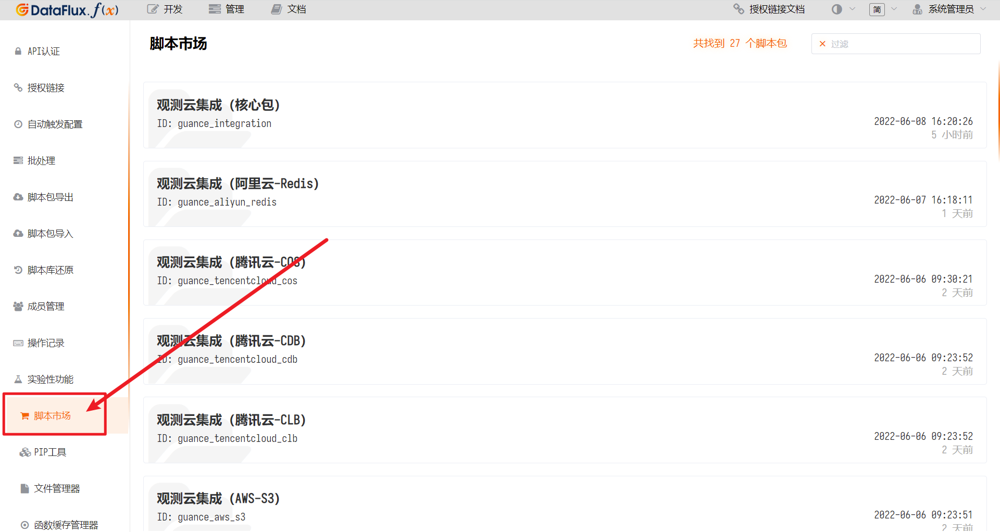
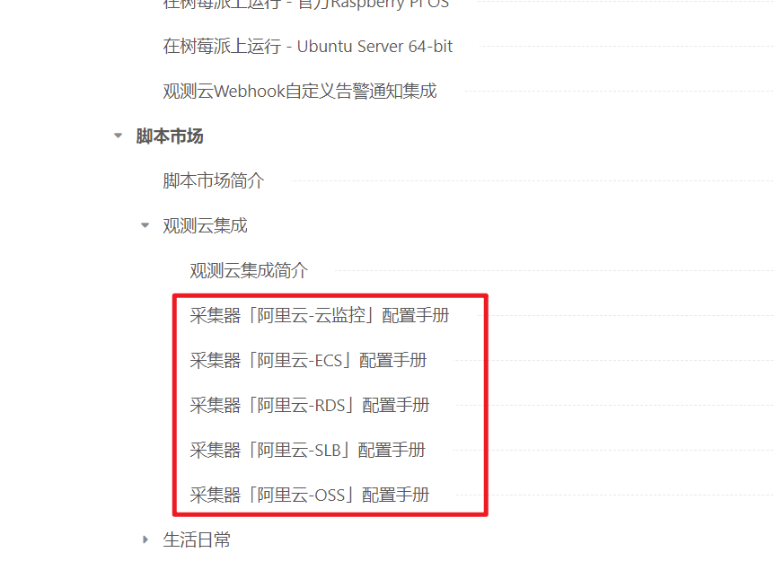

# 观测云集成
---

本文档主要介绍使用脚本市场中「观测云集成」系列脚本包同步阿里云、AWS平台相关数据的接入处理。

> 提示：请始终使用最新版DataFlux Func 进行操作。

> 提示2: 本脚本包会不断加入新功能，请随时关注本文档页。

## 1. 背景

在使用观测云的过程中，第三方云平台的一些数据可能无法通过DataKit 直接采集。

因此，DataFlux Func 提供了与各云平台对应的数据同步脚本包。用户可以从脚本市场安装相关的数据同步脚本包，进行简单的配置后，即可同步云平台的数据。

本文假设用户已经了解如何安装DataFlux Func 以及脚本包，以及如何在DataFlux Func 中正确连接DataKit。

| 相关文档                                       | 链接                                                                      |
| ---------------------------------------------- | ------------------------------------------------------------------------- |
| 有关如何安装DataFlux Func                      | [DataFlux Func 快速开始](/dataflux-func/quick-start)         |
| 有关如何在DataFlux Func 的脚本市场中安装脚本包 | [脚本市场基本操作](/dataflux-func/script-market-basic-usage) |
| 有关如何在DataFlux Func 中连接DataKit          | [连接并操作DataKit](/dataflux-func/connect-to-datakit)       |

## 2. 关于「阿里云集成」系列脚本包

本脚本包主要用于第三方云平台数据的获取并同步至观测云。

使用本脚本包，需要对应云平台中具有必要权限的AK。如对于阿里云，您可在阿里云「访问控制」中创建RAM 账号，并为RAM 账号创建AK 并授予所需权限。

*注意：为了您的账号安全，请使用只读权限的AK*

*注意2：部分第三方云平台由于其产品设计，可能需要全部只读权限的AK才能访问*

*注意3：最快捷的方法是使用具有全部云资源只读权限的AK（如阿里云的`ReadOnlyAccess`），如果部分信息的读取有顾虑，可以根据实际需要单独指定权限*

### 2.1 脚本包组成

本「观测云集成」系列脚本包采用了全新的设计，区分了「核心包」与特定采集器包。

其中，「核心包」为必选组件。使用本系列脚本包时，必须保证「核心包」已经安装。

具体组成如下：

| 名称                                                       | 说明                                                                             |
| ---------------------------------------------------------- | -------------------------------------------------------------------------------- |
| 观测云集成（核心包） ID: `guance_integration`           | 所有特定集成包的核心组件，必须安装                                               |
| 观测云集成（阿里云-云监控） ID: `guance_aliyun_monitor` | 采集阿里云云监控数据，并写入指标的组件 云监控数据包含所有阿里云产品的指标数据 |
| 观测云集成（阿里云-ECS） ID: `guance_aliyun_ecs`        | 采集阿里云ECS列表，并写入自定义对象的组件                                        |
| 其他更多...                                                |                                                                                  |

## 3. 快速开始

这里，我们假设需要对阿里云监控的数据进行采集并写入观测云，讲解整个集成过程。

> 提示：请提前准备好符合要求的阿里云AK（简单起见，可直接授予全局只读权限`ReadOnlyAccess`）

### 3.1 安装核心包和具体采集器

在「管理」-「脚本市场」中，依次点击并按照对应的脚本包卡片：

- 「观测云集成（核心包）」(ID：`guance_integration`)
- 「观测云集成（阿里云-云监控）」(ID：`guance_aliyun_monitor`)

*注意：在安装「核心包」后，系统会提示安装第三方依赖包，按照正常步骤安装即可*

### 3.2 编写代码

*注意：虽然安装后的脚本包可以修改，但请不要直接修改这些从脚本市场安装的脚本包*

在「开发」-「脚本库」中，添加自己的脚本集和脚本，如：

1. 创建ID为`my_aliyun`的脚本集
2. 在上述1. 中创建的脚本集中，创建ID为`main`的脚本

【假设】我们需要采集阿里云ECS的云监控，和CPU、内存相关的指标数据。

由于这类指标数据由阿里云监控提供，那么，需要编写的典型代码：

~~~python
from guance_integration__runner import Runner        # 引入启动器
import guance_aliyun_monitor__main as aliyun_monitor # 引入阿里云云监控采集器

# 账号配置
account = {
    'ak_id'     : '<具有合适权限的阿里云AK ID>',
    'ak_secret' : '<具有合适权限的阿里云AK Secret>',
    'extra_tags': {
        'account_name': '我的阿里云账号',
    }
}

@DFF.API('执行云资产同步')
def run():
    # 采集器配置
    collector_configs = {
        'targets': [
            {
                'namespace': 'acs_ecs_dashboard', # 云监控的namespace
                'metrics'  : ['*cpu*', '*mem*'],  # 云监控指标中包含cpu, mem的指标数据
            },
        ],
    }
    collectors = [
        aliyun_monitor.DataCollector(account, collector_configs),
    ]

    # 启动执行
    Runner(collectors).run()
~~~

### 3.3 创建自动触发配置

在完成上述代码编写后，点击「发布」脚本。

之后，在「管理」-「自动触发配置」中，为已编写的脚本创建自动触发配置即可。

*注意：过高的频率只会快速消耗AK调用API的额度，甚至会被云平台限流、封号，由此产生的问题DataFlux Func 并不能解决。*

### 3.4 采集多个产品

对于需要同时采集多个产品的情况，无需重复编写多个函数，只需要在`collectors`列表中添加更多采集器即可。

以采集「阿里云监控 + ECS + RDS + SLB + OSS」为例，参考代码如下：

~~~python
from guance_integration__runner import Runner        # 引入启动器
import guance_aliyun_ecs__main as aliyun_ecs         # 引入阿里云ECS采集器
import guance_aliyun_rds__main as aliyun_rds         # 引入阿里云RDS采集器
import guance_aliyun_slb__main as aliyun_slb         # 引入阿里云SLB采集器
import guance_aliyun_oss__main as aliyun_oss         # 引入阿里云OSS采集器
import guance_aliyun_monitor__main as aliyun_monitor # 引入阿里云云监控采集器

# 账号配置
account = {
    'ak_id'     : '<具有合适权限的阿里云AK ID>',
    'ak_secret' : '<具有合适权限的阿里云AK Secret>',
    'extra_tags': {
        'account_name': '我的阿里云账号',
    }
}

# 由于采集数据较多，此处需要为函数指定更大的超时时间（单位秒）
@DFF.API('执行云资产同步', timeout=300)
def run():
    # 采集器配置
    common_aliyun_configs = {
        'regions': [ 'cn-hangzhou' ], # ECS、RDS、SLB、OSS的配置相同
    }
    monitor_collector_configs = {
        'targets': [
            { 'namespace': 'acs_ecs_dashboard', 'metrics': ['*cpu*', '*mem*'] },
            { 'namespace': 'acs_rds_dashboard', 'metrics': ['*cpu*', '*iops*'] },
            { 'namespace': 'acs_slb_dashboard', 'metrics': ['*traffic*'] },
            { 'namespace': 'acs_oss_dashboard', 'metrics': ['*internet*'] },
        ],
    }

    # 创建采集器
    collectors = [
        aliyun_ecs.DataCollector(account, common_aliyun_configs),
        aliyun_rds.DataCollector(account, common_aliyun_configs),
        aliyun_slb.DataCollector(account, common_aliyun_configs),
        aliyun_oss.DataCollector(account, common_aliyun_configs),
        aliyun_monitor.DataCollector(account, monitor_collector_configs),
    ]

    # 启动执行
    Runner(collectors).run()
~~~

### 3.5 代码详解

以下为本例中代码的分步解释。

实际上，所有的「观测云集成」类脚本的使用都可以使用类似的方法实现。

##### `import`部分

为了正常使用脚本市场提供的脚本，在安装脚本包后，需要通过`import`方式来引入这些组件。

~~~python
from guance_integration__runner import Runner
import guance_aliyun_monitor__main as aliyun_monitor
~~~

`Runner`是所有采集器的实际启动器，任何情况下都需要引入`Runner`来完成对采集器的启动。
`aliyun_monitor`即为本示例中所需的「阿里云-云监控」采集器

##### 账号配置部分

为了能够正常调用云平台的API，用户也需要提供对应平台的AK供采集器使用。

~~~python
account = {
    'ak_id'     : '<具有合适权限的阿里云AK ID>',
    'ak_secret' : '<具有合适权限的阿里云AK Secret>',
    'extra_tags': {
        'account_name': '我的阿里云账号',
    }
}
~~~

除了最基本的`ak_id`、`ak_secret`外，部分云平台账号可能同时需要提供额外的内容，如AWS的`Region`等，具体可以参考具体采集器本身的文档。

最后，每个账号还允许添加一个`extra_tags`的字段，允许用户为采集的数据统一添加相同的标签，方便在观测云中辨认不同的数据所属的账号。

`extra_tags`的Key、Value 都为字符串，内容不限，且支持多个Key、Value。

在本例中，我们通过为`extra_tags`配置`{ 'account_name': '我的阿里云账号' }`，将所有本账号的数据都加上了`account_name=我的阿里云账号`标签

##### 函数定义部分

在DataFlux Func 中，所有代码都必须包含在某个被`@DFF.API(...)`装饰的函数中。

~~~python
@DFF.API('执行云资产同步')
def run():
    # 具体代码略...
~~~

`@DFF.API(...)`装饰器第一个参数为标题，内容随意。

对于观测云集成的脚本来说，最终都是通过「自动触发配置」方式运行脚本，只有添加了`@DFF.API(...)`装饰器的函数才能够被创建为「自动触发配置」。

##### 采集器配置部分

除了配置对应云平台的账号，还需要对采集器进行配置。

*采集器的配置可以在具体采集器的文档中找到，本文此处仅作使用提示*

~~~python
collector_configs = {
    'targets': [
        {
            'namespace': 'acs_ecs_dashboard', # 云监控的namespace
            'metrics'  : ['*cpu*', '*mem*'],  # 云监控指标中包含cpu, mem的指标数据
        },
    ],
}
collectors = [
    aliyun_monitor.DataCollector(account, collector_configs),
]
~~~

阿里云监控需要配置采集的目标。在本例中，我们指定了只采集有关ECS中，和CPU、内存有关的指标。

最后，需要使用上文中的账号配置以及这里的采集器配置，生成具体的「采集器实例」。

##### 启动运行部分

采集器的运行需要统一的`Runner`启动器来运行。

启动器需要使用在上文中生成的具体「采集器实例」初始化，并调用`run()`函数启动运行。

启动器会遍历所有传入的采集器并依次将采集后的数据上报至DataKit（默认DataKit的数据源ID为`datakit`）。

~~~python
Runner(collectors).run()
~~~

在代码编写完成后，如果不确定配置是否正确，可以为启动器添加`debug=True`参数使其在调试模式下运行。

在调试模式下运行的启动器，会正常进行数据采集操作，但最终不会写入DataKit，如下：

~~~python
Runner(collectors, debug=True).run()
~~~

如果需要写入的DataKit的数据源ID不为默认的`datakit`，那么，可以为启动器添加`datakit_id="<DataKit ID>"`来指定DataKit的数据源ID，如下：

~~~python
Runner(collectors, datakit_id='<DataKit ID>').run()
~~~

## 4. 其他云厂商代码参考

其他云厂商的配置方式与阿里云类似

### 亚马逊（AWS）

以采集「EC2实例对象」及「EC2相关的监控指标」为例：

~~~python
from guance_integration__runner import Runner
import guance_aws_ec2__main as aws_ec2
import guance_aws_cloudwatch__main as aws_cloudwatch

# 账号配置
account = {
    'ak_id'     : '<具有合适权限的AWS AK ID>',
    'ak_secret' : '<具有合适权限的AWS AK Secret>',
    'extra_tags': {
        'account_name': '我的AWS账号',
    }
}

@DFF.API('执行云资产同步')
def run():
    regions = ['cn-northwest-1']

    # 采集器配置
    ec2_configs = {
        'regions': regions,
    }
    cloudwatch_configs = {
        'regions': regions,
        'targets': [
            {
                'namespace': 'AWS/EC2',
                'metrics'  : ['*cpu*'],
            },
        ],
    }
    collectors = [
        aws_ec2.DataCollector(account, ec2_configs),
        aws_cloudwatch.DataCollector(account, cloudwatch_configs),
    ]

    # 启动执行
    Runner(collectors).run()
~~~

### 腾讯云

以采集「CVM实例对象」及「CVM相关的监控指标」为例：

~~~python
from guance_integration__runner import Runner
import guance_tencentcloud_cvm__main as tencentcloud_cvm
import guance_tencentcloud_monitor__main as tencentcloud_monitor

# 账号配置
account = {
    'ak_id'     : '<具有合适权限的腾讯云 Secret ID>',
    'ak_secret' : '<具有合适权限的腾讯云 Secret Key>',
    'extra_tags': {
        'account_name': '我的腾讯云账号',
    }
}

@DFF.API('执行云资产同步')
def run():
    regions = ['ap-shanghai']

    # 采集器配置
    cvm_configs = {
        'regions': regions,
    }
    monitor_configs = {
        'regions': regions,
        'targets': [
            {
                'namespace': 'QCE/CVM',
                'metrics'  : ['*cpu*'],
            },
        ],
    }
    collectors = [
        tencentcloud_cvm.DataCollector(account, cvm_configs),
        tencentcloud_monitor.DataCollector(account, monitor_configs),
    ]

    # 启动执行
    Runner(collectors).run()
~~~

## 5. 注意事项及说明

有关本系列脚本包，请在使用前阅读以下注意事项及说明

### 5.1 固定的云厂商标签

使用本系列脚本包向观测云上报的数据，默认会根据所对应的云厂商添加`cloud_provider`标签，用于区分云厂商。

因此，在账号配置的`extra_tags`中，请勿再添加Key 为`cloud_provider`的标签。

具体的云平台及对应的固定标签如下：

| 所属云平台 | 标签值     |
| ---------- | ---------- |
| 阿里云     | `'aliyun'` |
| AWS        | `'AWS'`    |

### 5.2 可能产生的巨量API调用及数据

某些采集器如果配置为获取全量数据，会产生巨量的API查询，极易触发云平台限流，甚至AK被封。

因此，在编写采集器配置时，应当在了解具体产品API调用规则，以及在观测云产生数据量的基础上进行充分的考量。

*如果由此产生任何经济损失，本脚本作者及相关方概不负责*

### 5.3 云监控数据的联动补充

一般来说，各云厂商的云监控产品只会提供监控对象的ID及其监控指标信息，如：ECS的实例ID和CPU使用率。而不会同时返回如实例名称等其他信息。

所以，当仅开启云监控类采集器时，虽然可以达到监控数据的查看、告警等目的，但仅依靠ID区分不同对象会很不直观。

因此，云监控类采集器会与对应自定义对象类采集器同时开启时，系统会自动根据ID等数据进行联动，为云监控类数据附带更多有关实例的信息。

由于需要先获知自定义对象信息才能在云监控类采集器中进行联动，因此一般建议将云监控的采集器放置在列表末尾，如：

~~~python
# 创建采集器
collectors = [
    aliyun_ecs.DataCollector(account, common_aliyun_configs),
    aliyun_rds.DataCollector(account, common_aliyun_configs),
    aliyun_slb.DataCollector(account, common_aliyun_configs),
    aliyun_oss.DataCollector(account, common_aliyun_configs),

    # 云监控类采集器一般放在最末尾
    aliyun_monitor.DataCollector(account, monitor_collector_configs),
]
~~~

> 具体的联动效果，请参考具体的采集器文档

### 5.4 不同采集器的采集频率限制

即使在「自动出发配置」中配置了较短的执行间隔（如1分钟），各个采集器内部都根据自身业务特性设置了最小启动间隔。

对于大部分上报自定义对象的采集器来说，内部最小启动间隔为15分钟。如果在15分钟内连续启动，程序会自动跳过，不会进行实际的采集处理。

对于云监控类的采集器来说，内部最小启动间隔为1分钟，但也请根据实际需要设置合理的执行间隔，避免大量API调用。

### 5.5 同时采集多个产品时的耗时

在单个函数中配置多个采集器时，由于需要大量请求云厂商的API，每次执行的耗时可能较长。

以阿里云为例，如下的采集方案：

| 采集器             | 配置                        |
| ------------------ | --------------------------- |
| 云监控             | ECS、RDS、SLB、OSS 所有指标 |
| ECS、RDS、SLB、OSS | 仅限杭州地域                |

单次运行耗时约为1到2分钟。

因此，一般来说，单个函数中同时采集多个产品的，都需要额外为函数指定更长的超时时间`timeout`（单位秒）如：

~~~python
# 由于采集数据较多，此处需要为函数指定更大的超时时间（单位秒）
@DFF.API('执行云资产同步', timeout=300)
def run():
    # 具体代码略
~~~

> 参数`timeout`最长可指定为`3600`秒（即1小时），一般建议设置为所需耗时的1.5倍左右。过长的`timeout`可能会导致执行队列无意义的拥堵

## 6. 采集器配置索引

由于不同采集器具有不同的配置、采集内容。具体采集器的配置等详情见相关文档

