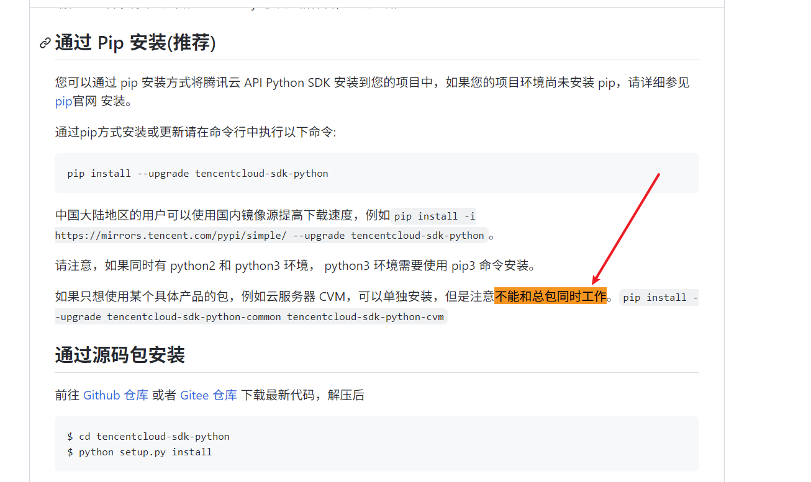
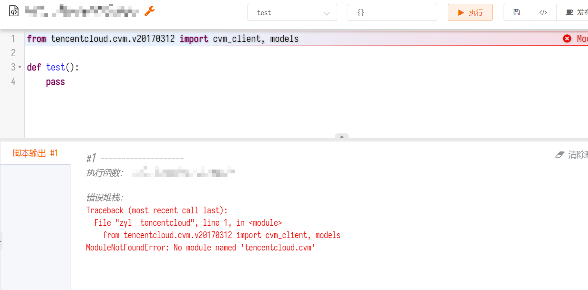
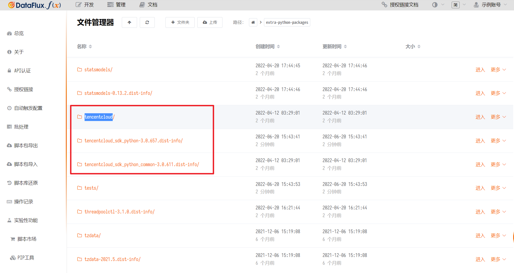
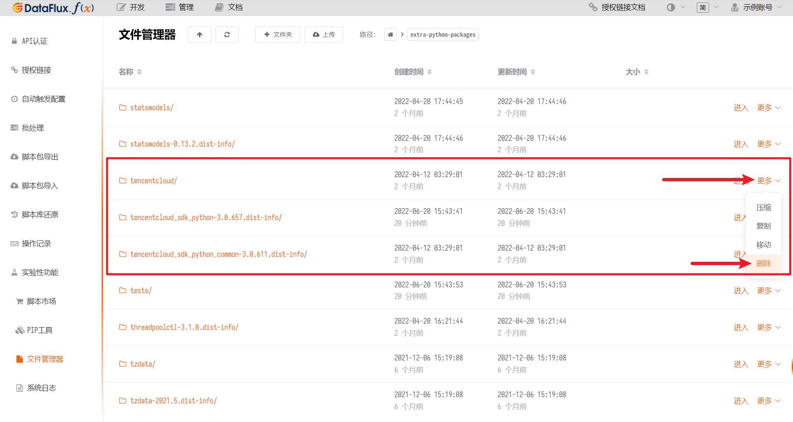

# 腾讯云 SDK 模块问题
---

某些情况下，运行腾讯云的相关采集器可能会报`No module named 'tencentcloud.xxx'`错误。

本文主要介绍此问题的原因与解决方案

## 1. 背景

脚本市场中腾讯云采集器底层使用了腾讯云的官方 SDK`tencentcloud-sdk-python`。

腾讯云官方 SDK 区分「总包」和「散包」，总包为包含所有产品的 SDK、散包为每个产品单独的 SDK，且两者*不能*同时使用。

腾讯云 SDK 的 [官方文档](https://github.com/TencentCloud/tencentcloud-sdk-python#%E9%80%9A%E8%BF%87-pip-%E5%AE%89%E8%A3%85%E6%8E%A8%E8%8D%90) 也证实了这一点：

## 2. 现状

由于「观测云集成 Core 核心包」仅需要使用`tencentcloud-sdk-python-common`，因此在 2022-06-20 之前版本的核心包依赖的是「散包」，如用户额外安装了「总包」，会导致腾讯云的采集器无法运行。

为了保持最大兼容性，在 2022-06-20 之后的核心包已改为依赖「总包」，需要针对腾讯云 SDK 进行额外开发的可以不必再额外安装 SDK。

如同时安装了总包和散包，那么运行如下脚本会产生无法导入的问题：

> 此处假设同时安装了`tencentcloud-sdk-python`和`tencentcloud-sdk-python-cvm`

~~~python
from tencentcloud.cvm.v20170312 import cvm_client, models

def test():
    pass
~~~

## 3. 确认问题

可以通过以下方法检查是否同时安装了腾讯云 SDK 的总包和散包：

### 第 1 步：进入第三方包安装目录

打开 DataFlux Func 的「管理 - 实验性功能 - 文件管理器」，进入`extra-python-packages/`目录：

### 第 2 步：检查腾讯云 SDK 包

查找`tencentcloud`开头的目录，如果同时存在`tencentcloud_sdk_python-{版本号}.dist-info`和`tencentcloud_sdk_python_{common 或具体产品名}-{版本号}.dist-info`等目录，则说明同时安装了总包和散包：

## 4. 解决方法

如果已经产生了上述问题，那么，可以通过删除已经安装的包文件来修复此问题。

### 第 1 步：进入第三方包安装目录

在 DataFlux Func 的「管理 - 实验性功能 - 文件管理器」，进入`extra-python-packages/`目录，删除所有`tencentcloud`开头的文件夹：

### 第 2 步：重启 DataFlux Func

重启整个 DataFlux Func。

### 第 3 步：重新安装腾讯云 SDK

重新使用「PIP 工具」安装总包`tencentcloud-sdk-python`，并且*以后也不要再安装任何散包*。

## 5. 备注

无论是安装以前版本的「观测云集成 Core 核心包」时自动提示安装腾讯云的包，还是自行在「PIP 工具」中安装腾讯云的包，只要系统内同时安装了「总包」和「散包」都有可能产生上述问题。

此问题本质是腾讯云的包相互之间不兼容导致，和 DataFlux Func、Python 脚本本身都没有直接关系。

请通过上文「确认问题」步骤判断是否存在问题，并按照「解决方法」步骤来解决问题。