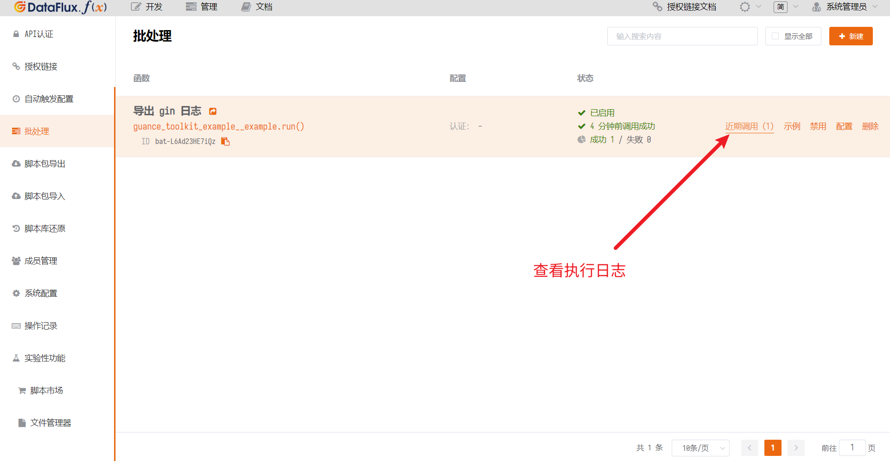
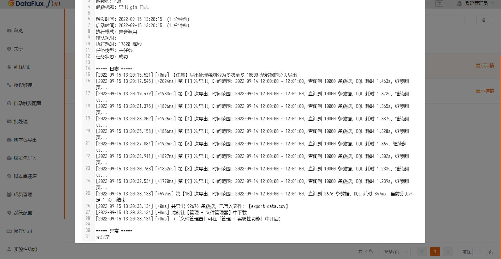
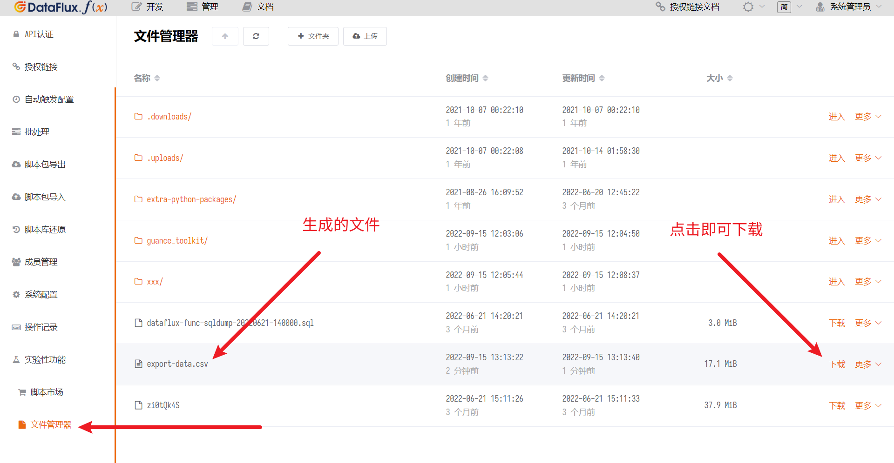

# 观测云工具包
---


本文档主要介绍如何使用脚本市场中的「观测云工具包」脚本包进行一些无法直接在观测云平台中操作的工作。

> 提示：请始终使用最新版 DataFlux Func 进行操作。

> 提示 2: 本脚本包会不断加入新功能，请随时关注本文档页。

## 1. 背景

在用户使用观测云平台的过程中，存在一些工作无法直接在观测云平台中操作。用户可以从脚本市场安装本脚本包，进行简单的配置后，即可完成相应的工作。

本文假设用户已经了解并安装了相关脚本包。
有关如何在 DataFlux Func 的脚本市场中安装脚本版，请参考：

- [脚本市场基本操作](/dataflux-func/script-market-basic-usage)

本文假设用户已经了解如何使用 DQL。
有关如何编写 DQL 语句，请参考：

- [观测云文档 / DQL](/dql/)

## 2. 导出日志为 CSV 文件

可以从观测云将大量日志导出，并保存在 DataFlux Func 的资源目录下。
导出成功后，用户可以前往 DataFlux Func「管理 - 文件管理器」下载 CSV 文件。

> 如果找不到「文件管理器」，可以在「管理 - 实验性功能」中开启。

典型使用代码如下：

```python
import guance_toolkit__api as guance_toolkit

@DFF.API('导出 gin 日志')
def run():
    # DQL 语句（注意不要指定时间范围）
    dql = '''L::re(`.*`):(log_time,message,message_length){ `source` IN ['gin'] }'''

    # 时间范围
    start_time = '2022-09-14T12:00:00+08:00'
    end_time   = '2022-09-14T12:01:00+08:00'

    # 工作空间 Token
    workspace_token = 'tkn_e84a8369b65044be9cd7fb8a5e680f65'

    # 输出地址（资源目录下相对地址，不要以/开头）
    # 默认输出地址为：
    #   guance_toolkit/gaunce-export-data-<执行时间>.csv
    file_path = 'export-data.csv'

    # 启动执行
    guance_toolkit.export_logging(dql=dql,
                                  start_time=start_time,
                                  end_time=end_time,
                                  workspace_token=workspace_token,
                                  file_path=file_path)
```

> 提示：您在实现自己的代码时，可以根据需要将部分导出参数作为函数的输入参数，实现更通用的导出函数或接口

完成代码后，在「管理 - 批处理」中为此函数创建一个「批处理」，并根据示例调用即可。

创建批处理并调用：


查看批处理执行日志：




获取批处理执行生成的文件：

