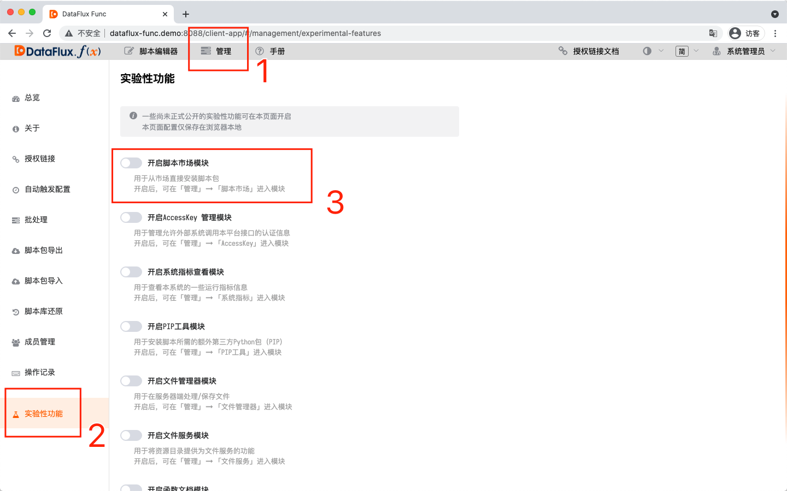
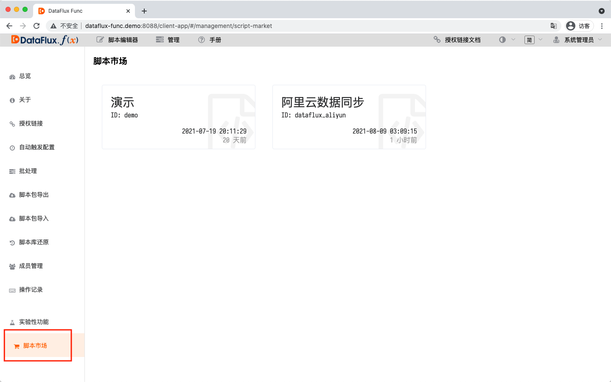
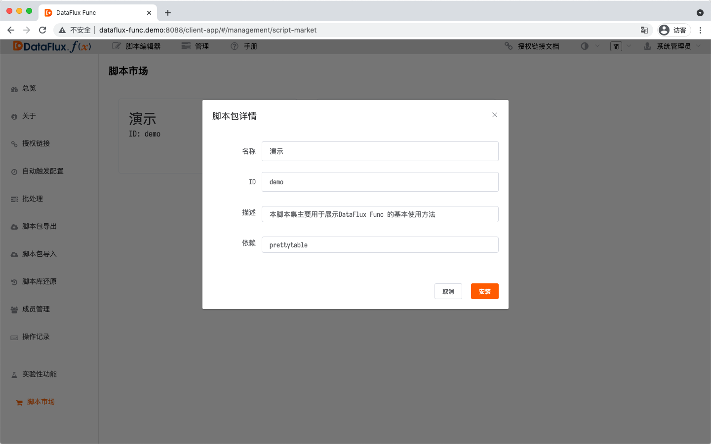
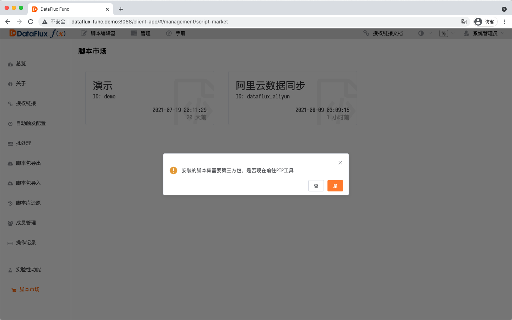
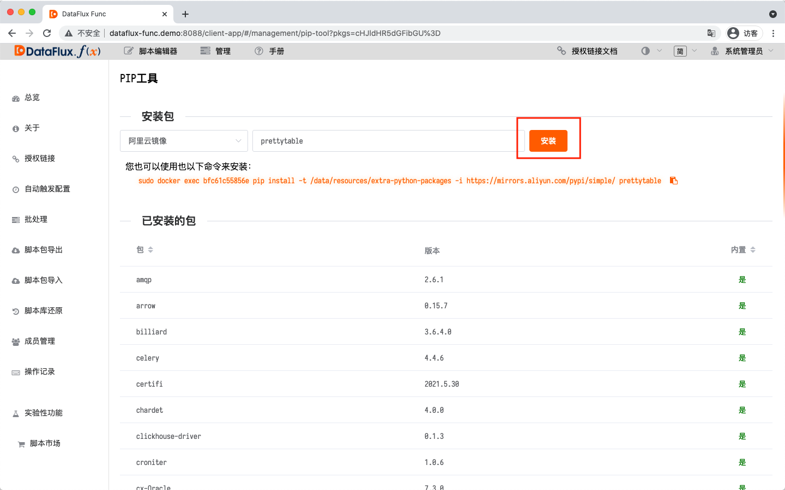
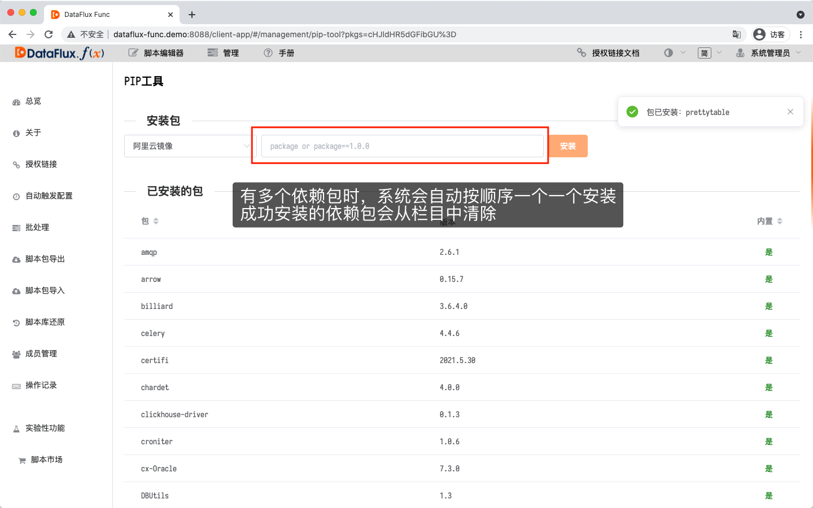
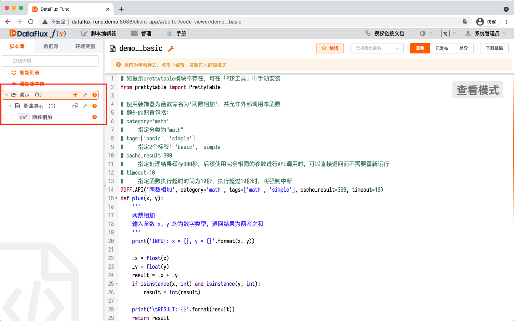

# 脚本市场简介
---

本文档主要介绍「脚本市场」的基本操作。

> 提示：请始终使用最新版DataFlux Func 进行操作。

## 1. 背景

DataFlux Func 由于其可编程特性，用户可以通过自行编写脚本实现各式各样的功能需求。

而对于一些具有较强通用性的程序解决方案，DataFlux Func 官方会在「脚本市场」提供脚本包供用户安装，免去用户每次从零开始编写脚本的困扰。

## 2. 安装脚本包

使用「脚本市场」并安装脚本，请参考以下方式进行：

#### 开启脚本市场模块

在「管理」-「实验性功能」中，打开「开启脚本市场模块」

#### 安装脚本

在「管理」-「脚本市场」中选择所需要安装的脚本

确认无误后，点击「安装」

#### 安装Python依赖

如所安装的脚本存在额外的Python依赖包，系统会提示跳转至「PIP工具」

点击「安装」，安装Python依赖包

#### 安装完成

安装完毕，可在脚本库中查看所安装的脚本

## 3. 注意点

在安装、使用「脚本市场」的脚本包时，请注意以下几点：

#### 安装的脚本可以修改

安装后的脚本与用户自行编写的脚本并无区别。

用户在「脚本市场」所安装的脚本，并不是固定不可变的脚本。

在安装脚本后，用户可以进一步根据自己需要进行修改，系统对此并没有任何限制。

#### ...但不建议修改安装的脚本

由于「脚本市场」所提供的脚本包会不断更新，用户在更新脚本时，即覆盖安装脚本即可。

如果直接在原脚本中进行修改，所做的改动会在更新脚本时丢失。

如果确实需要对「脚本市场」中的脚本进行调整，可在安装脚本包后，使用脚本集的克隆功能克隆一份专门用于修改。

#### 注意同ID覆盖

安装脚本包之后，脚本包会以脚本集的形式出现在脚本库中。

如果脚本库中存在相同ID的脚本集，则会被替换为所安装的脚本。

如果遇到同名情况，可使用脚本集的「克隆」功能，将ID重复的脚本集克隆为不同的ID。
