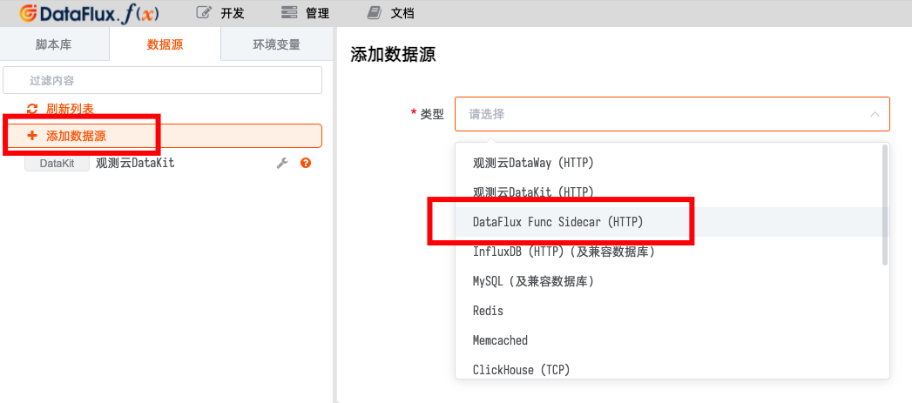
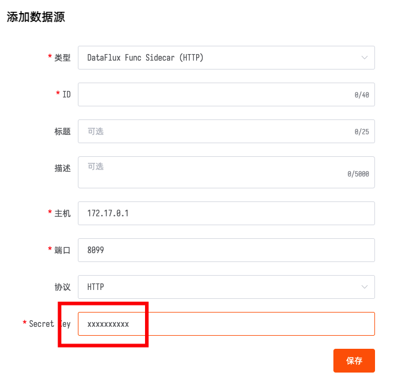

# Sidecar 手册
---


Sidecar 是 DataFlux Func 的一个附带组件。

由于通常 DataFlux Func 运行在容器内，无法直接在宿主机上执行 Shell 命令。而 Sidecar 的是一个运行于宿主机上的程序，作为 DataFlux Func 的代理直接在宿主机上执行 Shell 命令。

#### 下载命令

```shell
/bin/bash -c "$(curl -fsSL t.guance.com/func-sidecar-download)"
```

## 0. 阅读前提示

*注意：本文所有涉及到的 shell 命令，在 root 用户下可直接运行，非 root 用户下需要添加 sudo 运行*

## 1. 系统及环境要求

可以运行 DataFlux Func 的主机正常都能运行 Sidecar。

### 1.1 DataFlux Func 版本要求

*Sidecar 必须与 DataFlux Func `1.3.5`及更高版本配合才能使用*

## 2. 快速安装

正常情况下，Sidecar 会和 DataFlux Func 安装在同一台主机上。以下操作假设在已经安装好 DataFlux Func 的主机上进行。

*注意：如果 Sidecar 和 DataFlux Func 运行在不同主机上，需要修改相应配置。*

### 2.1 离线安装

安装 Sidecar 之前，需要下载所需资源。

对于无公网环境的主机，可以通过 U 盘等移动设备拷贝至主机上。

下载的资源文件附带了自动安装脚本，执行即可进行安装（详情见下文）

#### 2.1.1 一键命令下载资源文件

对于 Linux、macOS 等系统，推荐使用官方提供的 shell 命令下载「携带版」。

运行以下命令，即可自动下载 Sidecar 的所需文件，下载脚本会自动根据当前环境选择下载`x86_64`或`aarch64`架构版本：

```shell
/bin/bash -c "$(curl -fsSL t.guance.com/func-sidecar-download)"
```

如需要下载指定架构的版本，可以使用以下命令下载：

- `Intel x86_64`处理器

```shell
/bin/bash -c "$(curl -fsSL t.guance.com/func-sidecar-download)" -- --arch x86_64
```

- `ARM aarch64`处理器（即 ARM64v8，如：树莓派等）

```shell
/bin/bash -c "$(curl -fsSL t.guance.com/func-sidecar-download)" -- --arch aarch64
```

命令执行完成后，所有所需文件都保存在当前目录下新创建的`dataflux-func-sidecar`目录下。

- 对于需要将 Sidecar 安装到*无公网*的服务器时，可以先在本机下载，之后将整个目录通过 U 盘等移动存储设备，或`scp`工具等复制到目标机器中
- 对于需要将 Sidecar 安装到可以访问公网的服务器，直接在服务器上下载即可

#### 2.1.2 手工下载资源文件

对于不便使用 shell 命令的系统，可手工下载所需资源文件。

如需要手工下载，以下是所有的文件列表：

| #   | 内容                 | 文件名                          | x86_64 架构                                                                                      | aarch64 架构                                                                                   |
| --- | -------------------- | ------------------------------- | ------------------------------------------------------------------------------------------------ | ---------------------------------------------------------------------------------------------- |
| 1   | Sidecar 二进制程序   | `dataflux-func-sidecar.tar.gz`  | [下载](https://static.guance.com/dataflux-func/sidecar/linux-amd64/dataflux-func-sidecar.tar.gz) | [下载](https://static.guance.com/dataflux-func/sidecar/linux-arm/dataflux-func-sidecar.tar.gz) |
| 2   | Sidecar 服务配置文件 | `dataflux-func-sidecar.service` | [下载](https://static.guance.com/dataflux-func/sidecar/dataflux-func-sidecar.service)            | [下载](https://static.guance.com/dataflux-func/sidecar/dataflux-func-sidecar.service)          |
| 3   | Sidecar 安装脚本     | `run-sidecar.sh`                | [下载](https://static.guance.com/dataflux-func/sidecar/run-sidecar.sh)                           | [下载](https://static.guance.com/dataflux-func/sidecar/run-sidecar.sh)                         |
| 4   | 版本信息             | `version`                       | [下载](https://static.guance.com/dataflux-func/sidecar/version)                                  | [下载](https://static.guance.com/dataflux-func/sidecar/version)                                |

手工下载所有文件后，放入新建的`dataflux-func-sidecar`目录下即可。

*注意：如有更新，【重新下载所有文件】。请勿自行猜测哪些文件有变动，哪些没有变动*

*注意：手工下载时，如使用浏览器等下载时，请注意不要下载到缓存的旧内容！！*

#### 2.1.3 使用附带的脚本执行安装

在已经下载的`dataflux-func-sidecar`目录下，
运行以下命令，即可自动配置并最终启动整个 Sidecar：

*注意：Sidecar 不支持 Mac，请拷贝到 Linux 系统下再运行安装*

```shell
sudo /bin/bash run-sidecar.sh
```

使用自动安装脚本可以实现几秒内快速安装运行，自动配置的内容如下：

- 创建`/usr/local/bin/dataflux-func-sidecar`可执行文件
- 创建`/etc/dataflux-func-sidecar`配置文件
- 创建`dffs`用户用于运行 Sidecar 程序
- 创建`/etc/systemd/system/dataflux-func-sidecar`Systemd 配置文件，并设置为开机启动

安装完毕后，会展示如下安装信息：

```
Bind:
    127.0.0.1:8099,172.17.0.1:8099
Secret Key:
    xxxxxxxxxxxxxxxx
To shutdown:
    sudo systemctl start dataflux-func-sidecar
To start:
    sudo systemctl stop dataflux-func-sidecar

Now open 127.0.0.1:8099,172.17.0.1:8099 and have fun!
```

输出内容意义如下：

| 项目       | 说明                             | 对应配置文件项目 |
| ---------- | -------------------------------- | ---------------- |
| Bind       | 监听地址。支持多个，英文逗号分割 | `BIND`           |
| Secret Key | 密钥。用于验证请求               | `SECRET_KEY`     |

其中，默认安装情况下，Bind 会有 2 个地址：

- `127.0.0.1:8099`：本地网络
- `172.17.0.1:8099`：`docker0`，用于和 DataFlux Func 通讯

### 2.2. 验证安装

Sidecar 默认安装完成后，可以使用以下命令验证安装：

```shell
curl http://127.0.0.1:8099
```

如返回如下信息，则表示 Sidecar 正常运行：

```
Welcome to DataFlux Func Sidecar
* Version: 0.0.1
* Release Date: 2021-10-17 00:00:00
```

### 2.3. 安装选项

自动安装脚本支持一些安装选项，用于适应不同的安装需求

安装时，只需要在自动安装命令后添加`--{参数}[ 参数配置（如有）]`，即可指定安装选项

如，指定监听地址：

```shell
sudo /bin/bash run-sidecar.sh --bind 0.0.0.0.8099
```

#### 2.3.1 可用安装选项

具体参数详情见下文

##### `--bind`：指定监听地址

Sidecar 默认监听`127.0.0.1:8099,172.17.0.1:8099`。如端口被占用，可以选择其他监听地址。

##### `--secret-key`：指定密钥

DataFlux Func Sidecar 默认安装时会自动生成随机密钥，可使用本参数手工指定密钥。

## 3. 在 DataFlux Func 中调用 Sidecar

### 3.1. 创建 Sidecar 数据源

前往「数据源 - 添加数据源 - DataFlux Func Sidecar（HTTP）」，正确填写`Secret Key`创建即可。

如果安装 Sidecar 时指定了不同的监听地址（修改了 Bind 参数），那么创建数据源时也需要做相应的修改。





### 3.2. 编写代码

以下为示例代码：

```python
import json

@DFF.API('Test Sidecar')
def test_sidecar():
    sidecar = DFF.SRC('sidecar')
    res = sidecar.shell('hostname', wait=True, callback_url='http://172.17.0.1:8088/api/v1/al/auln-sidecar-callback')
    # res 内容为：
    # (200, {'data': {'stderr': '', 'stdout': 'my_host\n'}, 'message': '', 'ok': True})
    return res

@DFF.API('Test Sidecar callback')
def test_sidecar_callback(**kwargs):
    # kwargs 内容为：
    # {'stderr': '', 'stdout': 'my_host\n'}
```

### 3.3. 配置函数

上述代码示例中：

「Test Sidecar」为主要执行函数，可以配置为「授权链接」或者「自动触发配置」执行。

「Test Sidecar callback」为接收执行后回调的函数，需要配置为「授权链接」

> 示例代码中，`callback_url`参数中的授权链接地址 ID 部分为`"auln-sidecar-callback"`，那么为回调函数配置「授权链接」时也要指定相同的 ID，保证 URL 地址一致。

> 对于 Sidecar 和 DataFlux Func 安装在同一台主机的情况，双方可以通过`docker0`相互访问，即 IP 地址为`172.17.0.1`。

有关「Sidecar 数据源操作对象」详情见下文

## 4. Sidecar 数据源操作对象 API

使用 Sidecar 数据源操作对象允许用户调用 Sidecar 执行 Shell 命令。

`DFF.SRC(...)`参数如下：

| 参数             | 类型 | 必须/默认值 | 说明      |
| ---------------- | ---- | ----------- | --------- |
| `data_source_id` | str  | 必须        | 数据源 ID |

### SidecarHelper.shell(...)

`shell(...)`方法用于执行调用 Sidecar 执行 Shell 命令，参数如下：

| 参数           | 类型 | 必须/默认值 | 说明                                                                                                                                                                 |
| -------------- | ---- | ----------- | -------------------------------------------------------------------------------------------------------------------------------------------------------------------- |
| `cmd`          | str  | 必须        | 需要执行的 Shell 命令<br>如：`"ls -l"`                                                                                                                               |
| `wait`         | bool | `True`      | 是否等待执行完成<br>设置为`False`时，本函数会立刻返回，并且不会返回终端输出                                                                                          |
| `workdir`      | str  | `None`      | Shell 命令执行的工作目录<br>如：`"/home/dev"`                                                                                                                        |
| `envs`         | dict | `None`      | 环境变量，键和值都为字符串<br>如：`{"MY_NAME": "Tom"}`                                                                                                               |
| `callback_url` | str  | `None`      | 回调地址，命令执行后，将`stdout`和`stderr`使用 POST 方式发送至指定 URL<br>一般和`wait=False`参数一起使用，实现异步回调                                               |
| `timeout`      | int  | `3`         | 请求超时时间<br>*注意：本参数并不是 Shell 命令的超时时间，而是 Func 请求 Sidecar 的超时时间*<br>即 Func 请求 Sidecar 可能会超时，但所执行的 Shell 命令并不会因此停止 |

### 执行后回调

调用`SidecarHelper.shell(...)`并指定`callback_url`参数后，Sidecar 会在执行完 Shell 命令后将标准输出`stdout`和标准错误`stderr`以 POST 方式发送至此地址。

具体结构如下：

```
POST {callback_url}
Content-Type: application/json

{
    "kwargs": {
        "stdout": "<标准输出文本>",
        "stderr": "<标准错误文本>"
    }
}
```

> 此结构与 DataFlux Func 的「授权链接*标准 POST 方式*」匹配，可直接使用「授权链接」接收执行后的回调。

## 5. 日常维护

默认情况下，可执行程序安装位置为`/usr/local/bin/dataflux-func-sidecar`

### 5.1 升级系统

重复执行安装过程即可，自动安装脚本会自动替换可执行程序并重启服务。

同时，以前的配置文件内容会保留。

### 5.2 启动/关闭/重启服务

Sidecar 服务使用 systemd 管理，直接使用`systemctl`操作即可：

```shell
sudo systemctl start dataflux-func-sidecar    # 启动
sudo systemctl stop dataflux-func-sidecar     # 停止
sudo systemctl restart dataflux-func-sidecar  # 重启
```

### 5.3 查看配置

配置文件位于`/etc/dataflux-func-sidecar`。

## 6. 安全性保障

由于 Sidecar 的使用模式本质上就是向所在主机发送任意可执行代码，具有危险性。

因此 Sidecar 在实现和部署上具有以下限制条件：

1. Sidecar 服务`dffs`用户运行（即 DataFlux Func Sidecar 首字母缩写）
2. Sidecar 必须配置了 SecretKey 才能正常调用执行 Shell 命令
3. `SidecarHelper.shell(...)`内部实现了 HmacSha1 签名，以防止篡改、重放攻击

由于 Sidecar 服务以`dffs`用于运行，无法执行需要 root 权限的命令或操作其他用户的文件。如有需要，可以将`dffs`用户加入用户组、或修改文件相关权限。
