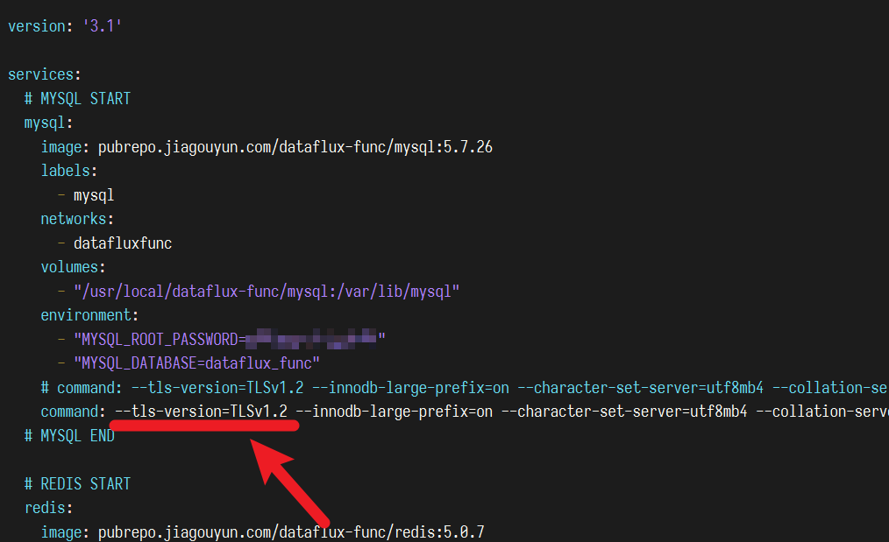

# 故障排查
---


本文档主要用于记录已知故障的解决办法。

由于系统本身具有一定复杂性，当遇到问题时，可以根据下文进行初步判断大概可能存在的问题点。

*注意：DataFlux Func 不支持集群部署的 Redis，如集群部署的 Redis 可能发生各种奇怪的问题*

*注意：DataFlux Func 不支持在 snap 版 Docker 上运行*

## 1. 忘记安装目录

DataFlux Func 默认的安装路径为`/usr/local/dataflux-func`。

此外，在 DataFlux Func `1.1.5`版本后，安装/升级成功后，会将安装目录写入固定位置文件`/etc/dataflux-func`。

可以通过以下命令确认安装目录：

```shell
cat /etc/dataflux-func
```

返回示例如下：

```shell
INSTALLED_DIR=/usr/local/dataflux-func
```

*注意：`1.1.5`版本后升级不必提供`--install-dir`参数，脚本会自动根据`/etc/dataflux-func`中的内容找到安装目录*

*注意：`1.1.5`版本后，已经安装过 DataFlux Func 的主机【原则上】不再允许二次安装到不同目录*

*注意：正在运行旧版本的 DataFlux Func 不会有上述自动处理，当次升级仍然需要手工指定上一次安装目录*

> 注意：当你看到本内容时，你只能下载到`1.1.5`版本之后的 DataFlux Func 了

## 2. 安装部署时脚本中断

安装部署时，很多情况都有可能导致脚本中断，但一般都是由于不满足系统要求导致。

可能原因及解决方案：

| 原因                                           | 解决方案                                                                |
| ---------------------------------------------- | ----------------------------------------------------------------------- |
| 所用操作系统不支持 Docker 及相关组件的安装运行 | 更换操作系统                                                            |
| 主机具有多个网卡                               | 参考上文「软件准备」中有关 Docker Swarm 初始化的描述                    |
| 系统中安装的是 snap 版 Docker                  | 卸载 snap 版 Docker，重新安装官方途径的 Docker，或使用脚本自带的 Docker |

在排除问题后，重新运行脚本即可

### 2.1 有关 snap 版 Docker 的特别说明

由于 snap 的权限策略及限制等，DataFlux Func 不支持 snap 版的 Docker。

如果已经安装了 snap 版的 Docker，直接运行安装脚本，则可能在在执行到`Deploying: dataflux-func`阶段，发生以下错误：

```
open docker-stack.yaml: no such file or directory
```

*建议卸载 snap 版 Docker，重新安装官方途径的 Docker，或使用脚本自带的 Docker。*

## 3. 安装部署完成后容器无法正常运行

### 3.1 容器反复重启

此问题一般是由于配置、防火墙、各种白名单配置不正确引起。

具体表现为：

1. 使用浏览器无法打开页面
2. 使用`sudo docker ps -a`命令查看容器列表时，发现重启在不断重启
3. 在部署服务器本机使用`curl http://localhost:8088`返回`curl: (7) Failed to connect to localhost port 8088: Connection refused`错误
3. 日志文件中不断输出错误堆栈信息

可能原因及解决方案：

| 原因                                     | 解决方案                                                       |
| ---------------------------------------- | -------------------------------------------------------------- |
| 当前版本的系统确实存在 BUG               | 更换其他版本，并联系驻云官方                                   |
| 手工修改过配置但配置存在错误             | 检查修改过的配置文件，检查如 YAML 语法、数据库链接信息是否正确 |
| 修改配置指定了外部服务器，但实际网络不通 | 检查防火墙、阿里云安全组配置、数据库链接白名单等配置           |

### 3.2 容器不存在

此问题一般是因为运行环境不正确引起。

具体表现为：

1. 执行`sudo docker stack ls`可以看到`dataflux-func`
2. 执行`sudo docker ps -a`看不到对应容器
3. 执行`sudo docker stack ps dataflux-func --no-trunc`，发现容器状态不正常

可能原因及解决方案：

| 原因                          | 解决方案                                                                |
| ----------------------------- | ----------------------------------------------------------------------- |
| 系统中安装的是 snap 版 Docker | 卸载 snap 版 Docker，重新安装官方途径的 Docker，或使用脚本自带的 Docker |
| 其他                          | 可根据`sudo docker stack ps dataflux-func --no-trunc`中`ERROR`栏目排查  |

## 4. 函数执行返回超时

函数执行超时可能有多种可能，需要根据不同情况进行辨别

### 4.1 函数执行耗时过长导致工作进程被 Kill

为了保护系统，DataFlux Func 对函数执行的最长时间有限制，不允许无限制运行下去。
在超过一定时间后，会直接 Kill 掉执行进程。

具体表现为：

1. 浏览器访问`/api/v1/al/auln-xxxxx`接口时，长时间卡在加载中状态
2. curl 方式调用`GET|POST /api/v1/al/auln-xxxxx`接口返回状态码`599`，返回数据类似如下：

```json
{
    "detail": {
        "einfoTEXT": "raise SoftTimeLimitExceeded()\nbilliard.exceptions.SoftTimeLimitExceeded: SoftTimeLimitExceeded()",
        "id": "task-xxxxx"
    },
    "error": 599.31,
    "message": "Calling Function timeout.",
    "ok": false,
    "reason": "EFuncTimeout",
    "reqCost": 5020,
    "reqDump": {
        "method": "GET",
        "url": "/api/v1/al/auln-xxxxx"
    },
    "traceId": "TRACE-xxxxx"
}
```

其中，`reqCost`字段为此函数从开始执行到被 Kill 经过的时间（毫秒）

可能原因及解决方案：

| 原因                                                            | 解决方案                                                                                 |
| --------------------------------------------------------------- | ---------------------------------------------------------------------------------------- |
| 所执行的函数指定了`timeout`超时参数（秒），且函数运行超时       | 联系函数开发者排查错误，包括且不限于：<br>超时参数设置过短<br>函数内调用外部系统响应过慢 |
| 所执行的函数未指定`timeout`超时参数，但函数运行超过默认超时限制 | 同上                                                                                     |
| 使用浏览器访问时，耗时过长，浏览器主动断开连接                  | 联系函数开发者排查错误，无法提高响应时考虑其他异步方案                                   |

> 函数超时默认为`30 秒`，最大设置为`3600 秒`

### 4.2 函数执行耗时过长导致 API 接口提前返回

为了保护系统，DataFlux Func 对使用 HTTP 接口【同步】调用函数的最长响应时间有限制，不允许服务器无限制保持 HTTP 连接。
在超过一定时间后，API 层面会放弃等待函数返回，直接响应 HTTP 请求。

具体表现为：

1. 调用`GET|POST /api/v1/al/auln-xxxxx`接口返回状态码`599`，返回数据类似如下：

```json
{
    "detail": {
        "id": "task-xxxxx"
    },
    "error": 599.1,
    "message": "Waiting function result timeout, but task is still running. Use task ID to fetch result later.",
    "ok": false,
    "reason": "EAPITimeout",
    "reqCost": 3011,
    "reqDump": {
        "method": "GET",
        "url": "/api/v1/al/auln-xxxxx"
    },
    "traceId": "TRACE-xxxxx"
}
```

*注意：API 接口超时仅表示 HTTP 响应时间超时，此时函数可能依然在后台运行，并遵循函数超时处理逻辑*

可能原因及解决方案：

| 原因                                                                    | 解决方案                                                                                     |
| ----------------------------------------------------------------------- | -------------------------------------------------------------------------------------------- |
| 所执行的函数指定了`api_timeout`API 超时参数（秒），且函数运行超时       | 联系函数开发者排查错误，包括且不限于：<br>API 超时参数设置过短<br>函数内调用外部系统响应过慢 |
| 所执行的函数未指定`api_timeout`API 超时参数，但函数运行超过默认超时限制 | 同上                                                                                         |

> API 超时默认为`10 秒`，最大设置为`180 秒`。同时，API 超时不会长于函数超时

## 5. 函数执行无响应

函数执行无响应可能有多种可能，需要根据不同情况进行辨别

具体表现为：

1. 浏览器访问接口时，长时间处于加载中状态
2. curl 方式调用接口时，长时间没有任何响应

此时，需要在 DataFlux Func 中写一个测试函数，并将其配置为「授权链接」，来帮助判断原因。

测试函数如下：

```python
@DFF.API('Test Func')
def test_func():
    return 'ok'
```

### 5.1 测试函数有响应

可能原因及解决方案：

| 原因                           | 解决方案               |
| ------------------------------ | ---------------------- |
| 所调用函数确实需要运行很长时间 | 联系函数开发者排查问题 |

### 5.2 测试函数无响应

可能原因及解决方案：

| 原因               | 解决方案                                   |
| ------------------ | ------------------------------------------ |
| 存在队列阻塞       | 前往「关于 - 获取系统报告 - 清空工作队列」 |
| Redis 连接存在问题 | 重启系统，排查 Redis 连接配置是否正确      |

## 6. 系统内脚本内无法访问外网

脚本内无法访问外网，大多是因为 DNS、防火墙的原因。

具体表现为，脚本执行类似`requests.get('http://www.baidu.com')`的代码时，发生以下错误：

1. `Temporary failure in name resolution`
2. `Connection refused`
3. `Connection to www.baidu.com timed out`
4. 其他网络错误

可以依次执行以下操作排查问题：

1. 在宿主机执行`ping 114.114.114.114`，检查宿主机是否能够访问公网
2. 在宿主机执行`curl http://www.baidu.com`，检查宿主机 DNS 是否正常
3. 执行`sudo docker exec -it {任意 DataFlux Func 容器 ID} sh -c 'exec ping 114.114.114.114'`，检查从容器内是否可以访问公网
4. 执行`sudo docker exec -it {任意 DataFlux Func 容器 ID} sh -c 'exec curl http://www.baidu.com -i'`，检查容器内 DNS 是否正常

> 提示：`114.114.114.114`是一个常用公共 DNS 服务器的地址

> 提示：如果所安装的 DataFlux Func 镜像内没有`ping`命令，也可以改用`curl http://{百度 IP 地址}`命令替代

可能原因及解决方案：

| 原因                           | 解决方案                                               |
| ------------------------------ | ------------------------------------------------------ |
| 宿主机无法访问公网、DNS 不正常 | 检查并调整操作系统网络配置                             |
| 容器内无法访问公网、DNS 不正常 | 检查并调整 Docker 相关配置，必要时检查操作系统网络配置 |

### 6.1 Docker DNS 配置参考

编辑`/etc/docker/daemon.json`文件，加入如下内容后，保存并重启 Docker 服务：

~~~json
{
    "dns" : [
        "114.114.114.114",
        "8.8.8.8"
    ]
}
~~~

## 7. 外网无法访问系统

系统本身已经正常运行，但外部无法访问时，大多是网络原因。

具体表现为：

1. 在部署服务器本机使用`curl -i http://127.0.0.1:8088`返回`302`跳转信息：

```
HTTP/1.1 302 Found
Location: /client-app
Vary: Accept
Content-Type: text/plain; charset=utf-8
Content-Length: 33
Date: Wed, 25 Aug 2021 14:23:02 GMT
Connection: keep-alive

Found. Redirecting to /client-app
```

2. 在部署服务器本机使用`curl http://127.0.0.1:8088/api/v1/do/ping`返回`200`正常数据：

```
HTTP/1.1 200 OK
Vary: Origin, Accept-Encoding
Access-Control-Allow-Credentials: true
X-Trace-Id: TRACE-D2B2A855-3C28-4566-8EC5-5A2EDD85856C
X-Request-Time: 2021-08-25T14:24:00.239Z
X-Response-Time: 2021-08-25T14:24:00.241Z
X-Request-Cost: 2
Content-Type: application/json; charset=utf-8
Content-Length: 192
ETag: W/"c0-Wb2YFtp16lA4mB7Xh7SpYumGNog"
Date: Wed, 25 Aug 2021 14:24:00 GMT
Connection: keep-alive

{"ok":true,"error":200,"message":"","data":"pong","traceId":"TRACE-D2B2A855-3C28-4566-8EC5-5A2EDD85856C","reqTime":"2021-08-25T14:24:00.239Z","respTime":"2021-08-25T14:24:00.241Z","reqCost":2}
```

3. 在其他设备上使用`curl -i http://{服务器地址}:8088`无响应，或直接返回拒绝连接

发生此类问题，大多数是网络问题，与 DataFlux Func 本身无关。

以下内容仅为部分可能的解决方案的记录。

### 7.1 IP/域名解析等不正确

尝试在其他设备上`ping` DataFlux Func 所在的服务器，确认 IP、域名是否正确。

可以通过修改 DNS、修改`/etc/hosts`配置方式解决，具体以实际网络情况为准。

### 7.2 各类防火墙、安全配置不正确

包括且不限于：

1. 防火墙配置不正确
2. 阿里云 ECS 安全组配置不正确
3. 反向代理服务器、阿里云 SLB 配置不正确

首先，先检查当前部署开放的端口：

```shell
grep '8088' {安装目录}/docker-stack.yaml
```

返回内容为：

```
- "{开放端口}:8088"
```

> 提示：{开放端口}默认为`8088`，即上述命令返回`- "8088:8088"`

检查并修改网络环境，允许外部访问服务器的端口

### 7.3 本地网络与自动创建的 ingress 子网冲突

可以使用以下命令检查：

```shell
sudo docker network inspect ingress
```

查看`IPAM` - `Config` - `Subnet`值是否与本地网络相同：

```js
[
    {
        "Name": "ingress",
        "Id": "adinmn5ww9q3vqo0wbse2jn1s",
        "Created": "2021-08-21T07:46:47.534343555Z",
        "Scope": "swarm",
        "Driver": "overlay",
        "EnableIPv6": false,
        "IPAM": {
            "Driver": "default",
            "Options": null,
            "Config": [
                {
                    "Subnet": "10.0.0.0/16", // 【此处】
                    "Gateway": "10.0.0.1"
                }
            ]
        },
    },
    ...
```

如果重复，可以通过以下方式修改：

1. 停止 DataFlux Func
2. 删除先有网络：`sudo docker network rm ingress`
3. 重建网络：`docker network create --driver overlay --ingress --subnet 10.255.0.0/16 --gateway 10.255.0.1 ingress`
4. 启动 DataFlux Func

- [参考文档：Docker Swarm 默认地址池](https://docs.docker.com/engine/reference/commandline/swarm_init/#--default-addr-pool)
- [参考文档：Docker ingress 网络自定义配置](https://docs.docker.com/network/overlay/#customize-the-default-ingress-network)

### 7.4 缺少内核转发配置

此问题在 CentOS 系统中发现过，但大多数情况下没有遇到过。

可以通过以下方式确认转发配置

```shell
cat /proc/sys/net/ipv4/ip_forward
```

1. 上述命令返回`1`表示已经打开转发
2. 否则，可以使用如下方式打开转发配置

```shell
echo 1 > /proc/sys/net/ipv4/ip_forward
```

## 8. 无外网环境、网速慢等环境下，系统启动缓慢

由于 DataFlux Func 所用的镜像均包含`pubrepo.jiagouyun.com`前缀。

因此，在直接使用`docker stack deploy`命令启动系统时，Docker 会自动向`pubrepo.jiagouyun.com`发送请求检查镜像。

但由于实际网络并不能连通，因此在启动每一个服务前，都会 Docker 都会等待，直到检查镜像失败为止。

鉴于上述原因，在使用`docker stack deploy`命令启动系统时，需要额外指定`--resolve-image never`参数，禁止 Docker 检查镜像即可。

命令如下：

```shell
sudo docker stack deploy dataflux-func -c {安装目录}/docker-stack.yaml --resolve-image never
```

### 8.1 如何复现系统启动缓慢的问题？

我们可以在正常环境中人为制造出系统启动缓慢的问题，并进行对比：

1. 在`/etc/hosts`中，添加一条*错误*的记录：`255.255.255.1 pubrepo.jiagouyun.com`
2. 使用`ping pubrepo.jiagouyun.com`命令确认域名*无法访问*
3. 分别使用以下命令对比启动速度：
    - `sudo docker stack deploy dataflux-func -c {安装目录}/docker-stack.yaml`
    - `sudo docker stack deploy dataflux-func -c {安装目录}/docker-stack.yaml --resolve-image never`

## 9. 发布脚本/执行函数时 MySQL 发生「ERROR 2026 (HY000)」错误

由于 Ubuntu 20.04 对 SSL 版本最低要求为 v1.2，旧版本 DataFlux Func 升级到 1.5.5 版本后，在发布/运行脚本时，可能会出现如下异常：

```
ERROR 2026 (HY000): SSL connection error: error:1425F102:SSL routines:ssl_choose_client_version:unsupported protocol
```

DataFlux Func 1.5.5 及以后版本已经内置了自动修改配置的处理，正常升级即可。

如果问题依然存在，可以尝试以下手动方式修复：

1. 打开`<安装目录>/docker-stack.yaml`文件（默认位置为`/usr/local/dataflux-func/docker-stack.yaml`）
2. 在 yaml 文件中找到`service` - `mysql` - `command`配置，添加`--tls-version=TLSv1.2`参数

参考修改方式如下：

```
# 将
command: --innodb-large-prefix=on （... 后略）

# 修改为
command: --tls-version=TLSv1.2 --innodb-large-prefix=on （... 后略）
```



## 10. 授权链接、批处理只能通过 GET 调用，POST 调用时会失败

一般有如下可能：

### 10.1 混淆了「简化形式」和「标准形式」

检查请求的 URL 地址和请求体是否正确，避免「简化形式」和「标准形式」混用。

具体请参考 [手册 / 开发手册 / 基础 / 调用函数](/doc/development-guide-basic/#4)

### 10.2 HTTP 请求被 301 等跳转为 HTTPS 请求

确认 DataFlux Func 是否在类似 Nginx 等反向代理服务器后方，且反向代理服务器将你的 HTTP 请求跳转到了 HTTPS 请求。

如果是，那么，你发送的`POST http://xxxxx`会被跳转为`GET https://xxxxx`请求，原本请求体中的内容也会丢失。

将请求改为直接发送`POST https://xxxxx`即可解决问题。
