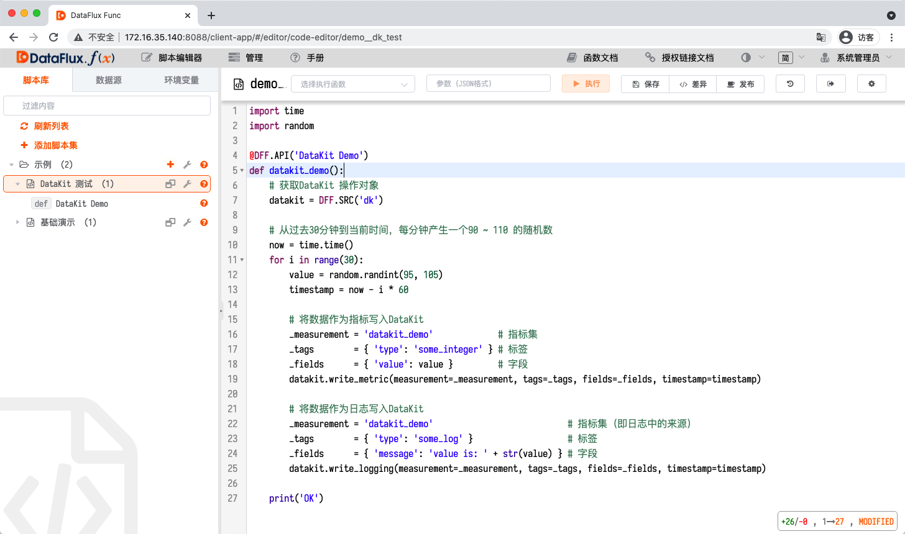
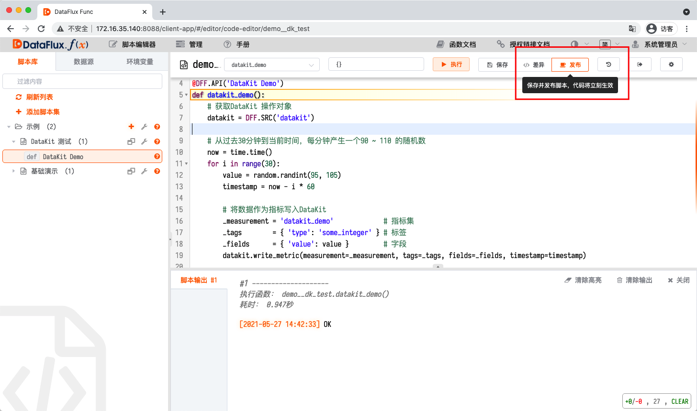
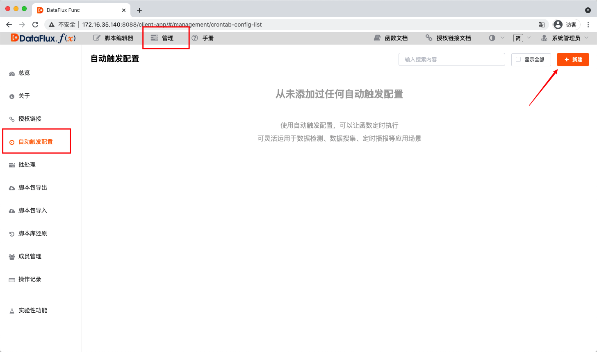
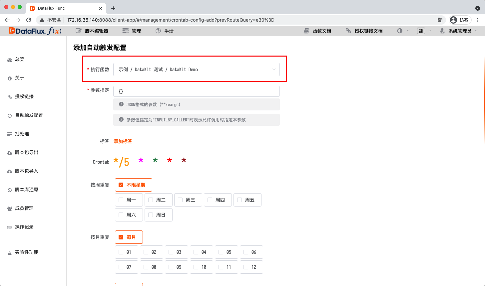
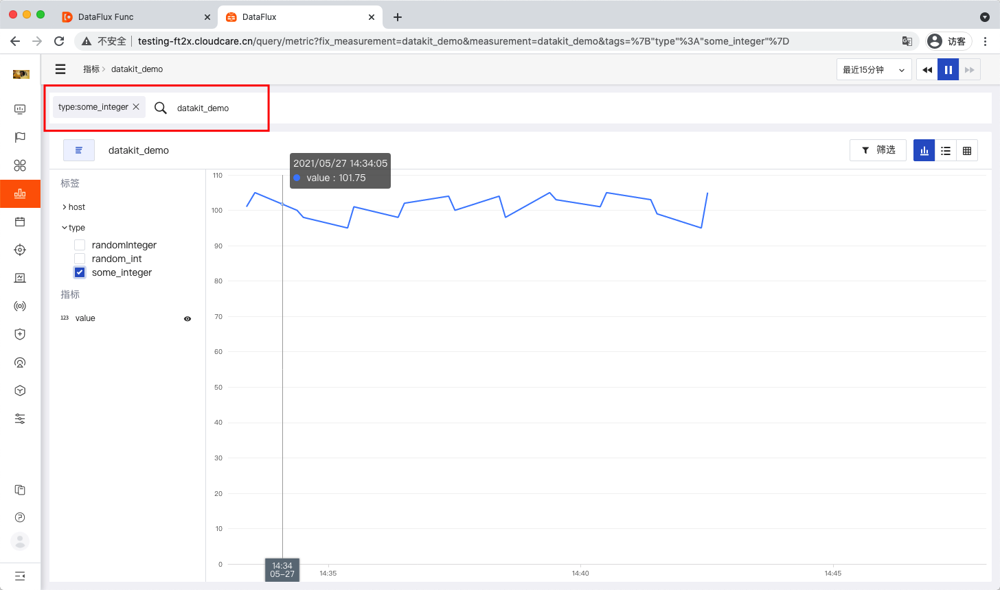
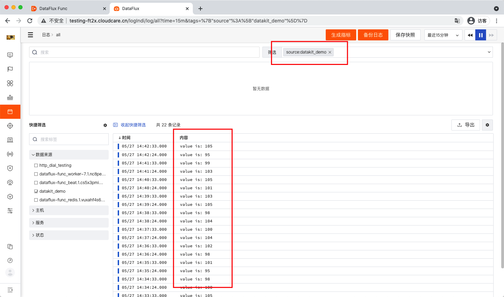

# 通过DataKit 写入数据
---

本文档主要介绍如何使用本系统向DataKit 写入数据。
（即：将DataFlux Func 作为采集器对接DataKit）

> 提示：本文中采用的示例数据为随机数，因此为了文档整体观感，部分截图存在一定演义成分，不保证每次操作都能取得完全相同的结果。

> 提示2：本文示例只有在DataKit, DataWay 等观测云各组件正确配置/运行，网络正常的情况下才能获得预期效果。

> 提示3：请始终使用最新版DataFlux Func 进行操作。

## 1. 背景

某些情况下，观测云提供的采集器无法满足数据上报的需求。
此时，可以使用DataFlux Func 作为DataKit 的采集器进行数据上报。

本文假设用户已经在DataFlux Func 中正确连接了DataKit。
有关如何在DataFlux Func 中连接DataKit，请参考：

- [连接并操作DataKit](https://docs.guance.com/dataflux-func/connect-to-datakit)

## 2. 编写数据写入函数

进入编辑器，创建脚本并输入以下示例脚本：

~~~python
import time
import random

@DFF.API('DataKit Demo')
def datakit_demo():
    # 获取DataKit 操作对象
    datakit = DFF.SRC('datakit')

    # 从过去30分钟到当前时间，每分钟产生一个90 ~ 110 的随机数
    now = time.time()
    for i in range(30):
        value     = random.randint(95, 105)
        timestamp = now - i * 60

        # 将数据作为指标写入DataKit
        _measurement = 'datakit_demo'             # 指标集
        _tags        = { 'type': 'some_integer' } # 标签
        _fields      = { 'value': value }         # 字段
        datakit.write_metric(measurement=_measurement, tags=_tags, fields=_fields, timestamp=timestamp)

        # 将数据作为日志写入DataKit
        _measurement = 'datakit_demo'                           # 指标集（即日志中的来源）
        _tags        = { 'type': 'some_log' }                   # 标签
        _fields      = { 'message': 'value is: ' + str(value) } # 字段
        datakit.write_logging(measurement=_measurement, tags=_tags, fields=_fields, timestamp=timestamp)

    print('OK')
~~~

### 3.1. 调试函数

点击「执行」按钮，正确执行即表示正常。

## 4. 发布脚本

脚本修改后会保存为草稿，需要发布后，才算是正式上线。

## 5. 配置函数自动运行

被`@DFF.API(...)`修饰的函数，可以在「管理」-「自动触发配置」中配置自动执行。

## 6. 在观测云中查看数据

在函数正常运行后，稍作等待……

转到观测云「指标」。

选择刚才写入的指标集和标签，即可查看产生的数据。

转到观测云「日志」。

选择刚才写入的指标集和标签，即可查看产生的数据。

