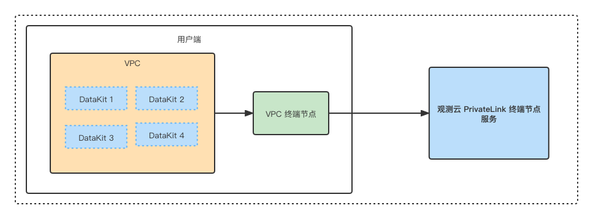
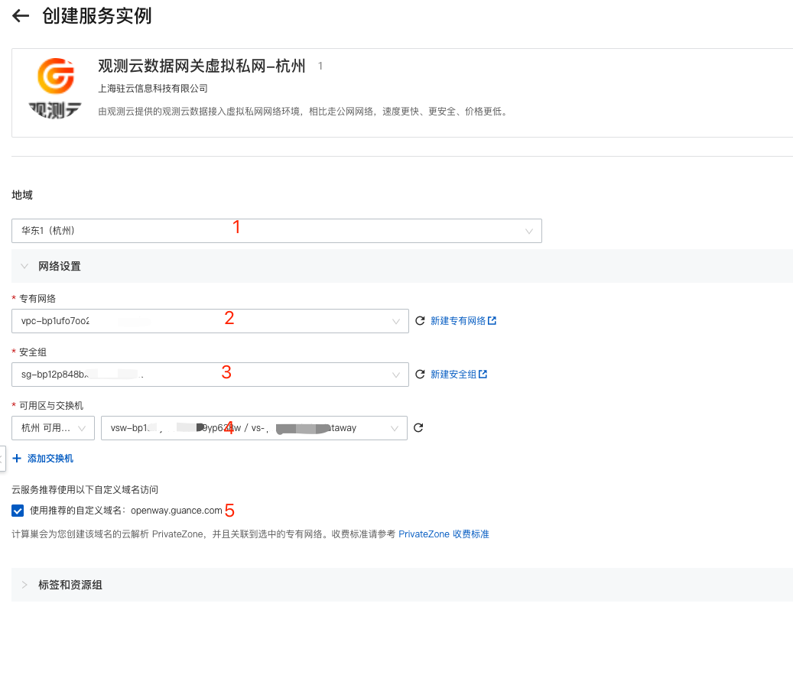

# 虚拟互联网接入
---

## 概述

如果您接入观测云的系统是部署在阿里云上的，本指南将指导您如何通过订阅计算巢“**观测云数据网关虚拟互联网**”服务来打通从您的主机 DataKit 到观测云平台的数据网关私网网络。

> 目前只支持阿里云用户接入。

建立私网连接优点：

- **更高带宽**：不占用业务系统的公网带宽，通过虚拟互联网实现更高带宽
- **更安全**：数据不经过公网，完全在阿里云私网内流转，数据更安全
- **更低资费**：相比公网带宽的高费用，虚拟互联网的资费成本更低

目前已上架的服务为 **cn-hangzhou、cn-beijing **两个地域，其他地域的也即将上架，架构如下：

## 订阅服务

### 服务部署链接

1. **cn-hangzhou** 地域部署链接：[观测云数据网关虚拟私网-杭州](https://computenest.console.aliyun.com/user/cn-hangzhou/serviceInstanceCreate?ServiceId=service-68c8fee7f0554d6b9baa&ServiceVersion=1)
2. **cn-beijing **地域部署链接：[观测云数据网关虚拟私网-北京](https://computenest.console.aliyun.com/user/cn-hangzhou/serviceInstanceCreate?ServiceId=service-af3b4511d9214c9ebaba&ServiceVersion=1)
2. 其他地域的虚拟互联网服务即将上线。

**注：cn-hangzhou 之外 Region 需要接入私网的用户，可以联系我们开通白名单。**

### 不同 Region 的私网数据网关默认 Endpoint

| **地域** | **Endpoint** |
| --- | --- |
| cn-hangzhou | https://openway.guance.com |
| cn-beijing | https://beijing-openway.guance.com |

### 配置服务订阅
使用您的阿里云账号登录，打开以上的 **服务部署链接，**来订阅我们的虚拟互联网服务，以 cn-hangzhou 为例：

1. 首先选择订阅地域，必须与您待接入观测云的系统所部署云资源的同一地域。
1. 选择待接入系统所部署云资源的同一个 VPC 网络，**如果涉及到多个 VPC 需要接入虚拟互联网，可多次订阅，每个 VPC 订阅一次。**
1. 选择安装组。
1. 可用区与交换机，如果涉及多个可用区与交换机，可以添加多个。
1. 选中“使用推荐的自定义域名”，使用默认的推荐域名，如 cn-hanghou 为 openway.guance.com 域名。

使用默认的 openway.guance.com 域名，好处是如果在同 VPC 内已经部署实施了 DataKit，可以无缝将数据网络网络切换为虚拟内网。

### 订阅完成

订阅完成后，计算巢服务会自动在您的云账号下，帮您创建并配置好：
1、一个私网连接终端节点；
2、一个解析到默认地域的 Endpoint 域名的云解析 Private Zone。

### 资费情况

资费情况主要看阿里云的私网连接 PrivateLink，以及云解析 PrivateZone 两个服务的费用，参考阿里云官网的 [私网连接 PrivateLink 计费说明](https://help.aliyun.com/document_detail/198081.html)，以及 [云解析 PrivateZone 计费说明](https://help.aliyun.com/document_detail/71338.html)。
另外 **杭州 **之外的接入用户，还会收取一定的跨区网络流量费，相比公网流量会有不少的成本优势。

## 如何使用

订阅完成后，对您的 DataKit 接入观测云完全透明，无须修改 DataKit 配置，已自动建立私网连接。可以登录云主机执行以下 ping openway.guance.com 命令，查看 ping 出来的 IP，如果是内网 IP 地址，说明已经成功与观测云数据网关建立了私网连接：

