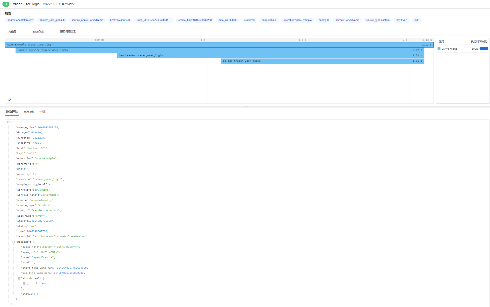

# Java 示例
---

在使用 OTEL 发送 Trace 到 Datakit 之前，请先确定您已经配置好了采集器。
配置：[Datakit 配置 OTEL](https://www.yuque.com/dataflux/datakit/opentelemetry){:target="_blank"}

## 添加依赖

在 pom.xml 中添加依赖

``` xml
    <!-- 加入opentelemetry  -->
    <dependency>
        <groupId>io.opentelemetry</groupId>
        <artifactId>opentelemetry-sdk</artifactId>
        <version>1.9.0</version>
    </dependency>
    <dependency>
        <groupId>io.opentelemetry</groupId>
        <artifactId>opentelemetry-exporter-otlp</artifactId>
        <version>1.9.0</version>
    </dependency>
    <dependency>
        <groupId>io.grpc</groupId>
        <artifactId>grpc-netty-shaded</artifactId>
        <version>1.41.0</version>
    </dependency>
    <dependency>
        <groupId>io.opentelemetry</groupId>
        <artifactId>opentelemetry-semconv</artifactId>
        <version>1.9.0-alpha</version>
    </dependency>
    <!-- 使用 grpc 协议 -->
    <dependency>
        <groupId>io.grpc</groupId>
        <artifactId>grpc-protobuf</artifactId>
        <version>1.36.1</version>
    </dependency>

```

Java 代码示例

``` java
package com.example;

import io.opentelemetry.api.OpenTelemetry;
import io.opentelemetry.api.common.Attributes;
import io.opentelemetry.api.trace.Span;
import io.opentelemetry.api.trace.Tracer;
import io.opentelemetry.api.trace.propagation.W3CTraceContextPropagator;
import io.opentelemetry.context.Context;
import io.opentelemetry.context.propagation.ContextPropagators;
import io.opentelemetry.exporter.otlp.trace.OtlpGrpcSpanExporter;
import io.opentelemetry.sdk.OpenTelemetrySdk;
import io.opentelemetry.sdk.resources.Resource;
import io.opentelemetry.semconv.resource.attributes.ResourceAttributes;
import io.opentelemetry.sdk.trace.SdkTracerProvider;
import io.opentelemetry.sdk.trace.export.BatchSpanProcessor;
import java.util.concurrent.TimeUnit;
import static java.lang.Thread.sleep;


public class otlpdemo {
    public static void main(String[] args) {
        try {
            OtlpGrpcSpanExporter grpcSpanExporter = OtlpGrpcSpanExporter.builder()
                    .setEndpoint("http://127.0.0.1:4317")   //配置.setEndpoint参数时，必须添加https或者http
                    .setTimeout(2, TimeUnit.SECONDS)
                    //.addHeader("header1", "1") // 添加header
                    .build();

            String s = grpcSpanExporter.toString();
            System.out.println(s);
            SdkTracerProvider tracerProvider = SdkTracerProvider.builder()
                    .addSpanProcessor(BatchSpanProcessor.builder(grpcSpanExporter).build())
                    .setResource(Resource.create(Attributes.builder()
                            .put(ResourceAttributes.SERVICE_NAME, "serviceForJAVA")
                            .put(ResourceAttributes.SERVICE_VERSION, "1.0.0")
                            .put(ResourceAttributes.HOST_NAME, "host")
                            .build()))
                    .build();

            OpenTelemetry openTelemetry = OpenTelemetrySdk.builder()
                    .setTracerProvider(tracerProvider)
                    .setPropagators(ContextPropagators.create(W3CTraceContextPropagator.getInstance()))
                    .buildAndRegisterGlobal();
            // .build();

            Tracer tracer = openTelemetry.getTracer("instrumentation-library-name", "1.0.0");
            Span parentSpan = tracer.spanBuilder("parent").startSpan();


            Span childSpan = tracer.spanBuilder("child")
                    .setParent(Context.current().with(parentSpan))
                    .startSpan();
            childSpan.setAttribute("tagsA", "vllelel");
            // do stuff
            sleep(500);    //延时1秒
            for (int i = 0; i < 10; i++) {
                Span childSpan1 = tracer.spanBuilder("child")
                        .setParent(Context.current().with(parentSpan))
                        .startSpan();
                sleep(1000);    //延时1秒
                System.out.println(i);
                childSpan1.end();
            }
            childSpan.end();
            childSpan.end(0, TimeUnit.NANOSECONDS);
            System.out.println("span end");
            sleep(1000);    //延时1秒
            parentSpan.end();
            tracerProvider.shutdown();

        } catch (InterruptedException e) {
            e.printStackTrace();
        } finally {
            System.out.println("finally end");
        }
    }
}
```

## 观测

登录 [观测云](https://console.guance.com/tracing/service/table?time=15m){:target="_blank"} 后查看 `应用性能监测` -> `链路` -> 点击单条 `链路`



在火焰图中可看到每一个模块中执行的时间、调用流程等。

--- 

参考

- 源码示例 [github-opentelemetry-java](https://github.com/open-telemetry/opentelemetry-java){:target="_blank"}
- 文档 [官方文档](https://opentelemetry.io/docs/instrumentation/go/getting-started/){:target="_blank"}
