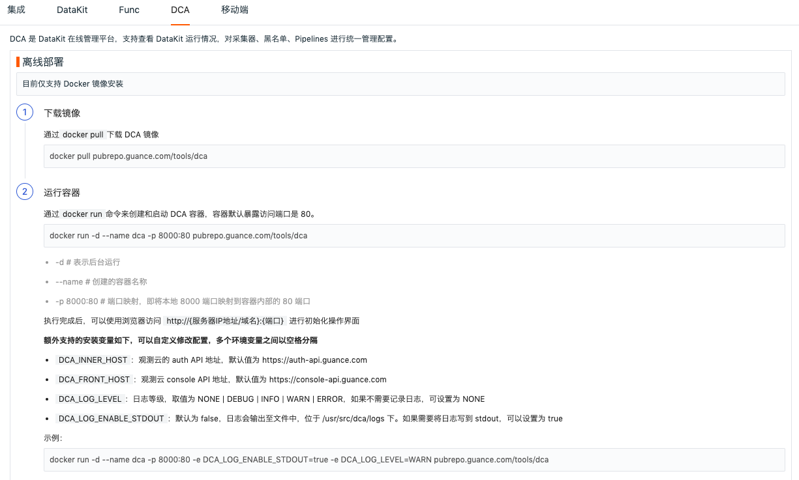
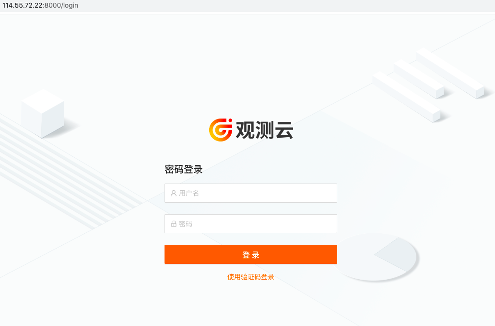
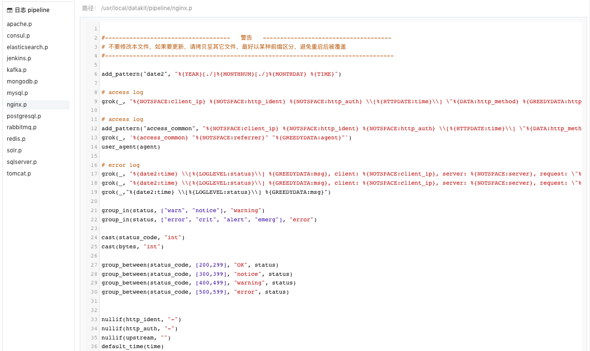
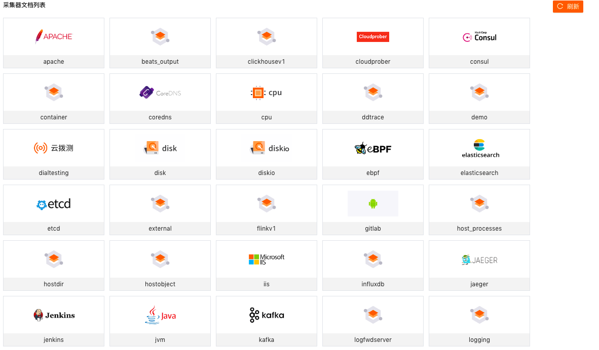

# DCA

---

DCA 是 DataKit 的 Web 端管理工具，旨在方便管理已经安装和配置的采集器，支持查看采集器运行情况、采集器配置管理、Pipeline管理、黑名单管理以及采集器文档帮助等功能。

注意：DCA 目前仅支持在同一个局域网内的 DataKit 远程管理。

## 前提条件

### 安装 DataKit

需要远程管理的主机已安装 DataKit ，且版本在 `1.4.8`以上，版本可以通过 `datakit --version` 进行查看。关于安装 DataKit ，可参考文档 [DataKit 安装文档](../datakit/datakit-install.md) 。

### 开启 DCA

DataKit 安装完成后，在 Datakit 安装目录 `/usr/local/datakit/conf.d` ，打开配置文件 `datakit.conf` ，开启 dca 即 `enable = true`  ，监听端口默认开启即 `listen = "0.0.0.0:9531"` ，使用命令 `datakit --restart` 重启，即可完成配置。

```
[dca]
# 开启
enable = true
# 监听地址和端口
listen = "0.0.0.0:9531"
# 白名单，支持指定IP地址或者CIDR格式网络地址
white_list = ["0.0.0.0/0", "192.168.1.0/24"]

```

关于更多开启 DCA 的说明，可参考文档 [DCA 客户端](../datakit/dca.md) 。

## 安装 DCA

通过 DCA Web 端远程管理 DataKit ，只需任意选择一台主机安装 DCA ，下载 DCA 镜像后运行即可使用。在观测云「集成」-「DCA」可查看 DCA 的部署步骤。

注意：目前 DCA Web 端支持 Docker 镜像安装，可参考文档 [安装 Docker](https://docs.docker.com/engine/install/) 。

1.下载 DCA 镜像

```
docker pull pubrepo.guance.com/tools/dca
```

2.创建和启动 DCA 容器，容器默认暴露访问端口是 80

```
docker run -d --name dca -p 8000:80 pubrepo.guance.com/tools/dca
```




## 登录 DCA

DCA 开启和安装以后，即可在浏览器输入地址 `localhost:8000` 打开 DCA  Web 端，登录账号，即可开始使用。若无账号，可先注册 [观测云账号](https://auth.guance.com/register?channel=帮助文档)。




登录到 DCA 后，可在左上角选择工作空间管理其对应 DataKit 及采集器，支持通过搜索关键字快速筛选需要查看和管理的主机名称。

通过 DCA 远程管理的主机分成三种状态：

- online：说明数据上报正常，可通过 DCA 查看 DataKit 的运行情况和配置采集器；
- unknown：说明远程管理配置未开启，或者不在一个局域网内；
- offline：说明主机已经超过 10 分钟未上报数据，或者主机名称被修改后，原主机名称会显示成 offline 的状态。未正常上报数据的主机，若超过 24 小时仍未有数据上报，该主机记录将会从列表中移除。


### 查看 DataKit 运行情况

登录到 DCA 后，选择工作空间，即可查看该工作空间下所有已经安装 DataKit 的主机名和 IP 信息。点击 DataKit 主机，即可远程连接到 DataKit ，查看该主机上 DataKit 的运行情况，包括版本、运行时间、发布日期、采集器运行情况等。


### 查看采集器配置

远程连接到 DataKit 以后，点击「采集器配置」，即可查看已经配置的采集器列表和 Sample 列表（当前 DataKit 支持配置的所有 Sample 文件）。

- 已配置列表：可查看其下所有的 conf 文件。
- Sample 列表：可查看其下所有的 sample 文件。
- 帮助：可查看对应的采集器帮助文档

注意：DCA 目前不支持配置采集器，需远程登陆到主机进行配置操作。


### 查看日志 Pipeline

远程连接到 DataKit 以后，点击「Pipelines」，即可查看 DataKit 默认自带的 pipeline 文件。关于 pipeline 可参考文档 [文本数据处理](../datakit/pipeline.md) 。




### 查看黑名单

远程连接到 DataKit 以后，点击「黑名单」，即可查看在观测云工作配置的黑名单，如下图所示 `source = default and (status in [unknown])` 即为配置的黑名单条件。

注意：通过观测云创建的黑名单文件统一保存在路径：`/usr/local/datakit/data/.pull` 。


### 查看采集器帮助

远程连接到 DataKit 以后，点击「帮助」，即可查看采集器文档列表。点击需要查看的采集器名称，直接跳转显示该采集器的帮助文档。 

关于如何查看更多采集器的帮助文档，可参考文档 [采集器](../integrations/hostobject.md) 。




