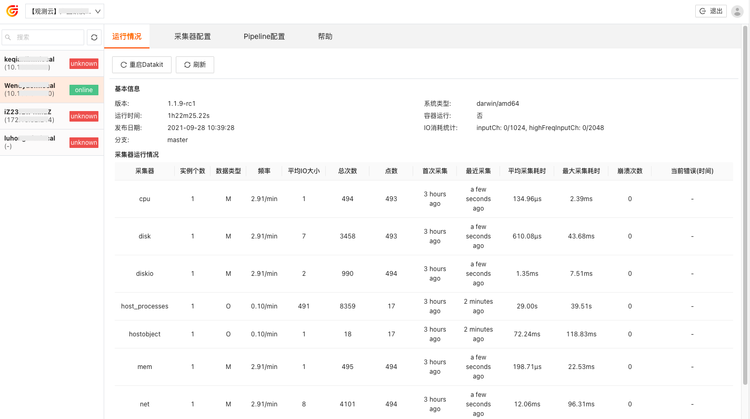

# DCA

---

DCA，DataKit Control APP，是一款桌面客户端应用，旨在方便管理已经安装和配置的采集器，支持查看集成列表、配置文件管理、Pipeline管理、集成配置文档在线查看等功能。您可以通过 DCA 远程连接 DataKit ，在线变更采集器，变更完成后保存更新即可生效。

在观测云工作空间，依次点击「集成」-「DCA」，即可下载安装包。下载完成后，可安装在您的电脑远程管理 DataKit 。

注意：DCA 目前仅支持在同一个局域网内的 DataKit 远程管理。

## 前提条件

需要远程管理的主机已安装 DataKit ，且版本在 `1.1.8-rc2`以上。关于安装 DataKit ，可参考文档 [DataKit 安装文档](../datakit/datakit-install.md) 。

## 开启 DCA

**方法一：修改配置文件 datakit.conf**

在 Datakit 安装目录 `/usr/local/datakit/conf.d` ，打开配置文件 datakit.conf ，开启 dca 即 `enable = true`  ，监听端口默认开启即 `listen = "0.0.0.0:9531"`。

**方法二：在安装命令前添加环境变量**

- `DK_DCA_ENABLE`: 是否开启，开启设置为1
- `DK_DCA_WHITE_LIST`: 访问服务白名单，支持IP地址或CIDR格式地址，多个地址请以逗号分割；若需要允许所有地址访问，可设置 `DK_DCA_WHITE_LIST=0.0.0.0/0` 。

关于更多开启 DCA 的说明，可参考文档 [DCA 客户端](../datakit/dca.md) 。

## 登录 DCA

DataKit 安装并配置完成后，打开 DCA 客户端，登录账号，即可开始使用。若无账号，可先注册 [观测云账号](https://auth.guance.com/register?channel=帮助文档)。登录到 DCA 后，可在左上角选择工作空间管理其对应 DataKit 及采集器，支持通过搜索关键字快速筛选需要查看和管理的主机名称。

通过 DCA 远程管理的主机分成三种状态：

- online：说明数据上报正常，可通过 DCA 查看 DataKit 的运行情况和配置采集器；
- unknown：说明远程管理配置未开启，或者不在一个局域网内；
- offline：说明主机已经超过 10 分钟未上报数据，或者主机名称被修改后，原主机名称会显示成 offline 的状态。未正常上报数据的主机，若超过 24 小时仍未有数据上报，该主机记录将会从列表中移除。

### 查看 DataKit 运行情况

登录到 DCA 后，选择工作空间，即可查看该工作空间下所有已经安装 DataKit 的主机名和 IP 信息。点击 DataKit 主机，即可远程连接到 DataKit ，查看该主机上 DataKit 的运行情况，包括版本、运行时间、发布日期、采集器运行情况等。

### 配置采集器

远程连接到 DataKit 以后，点击「采集器配置」，即可查看已经配置的采集器列表和 Sample 列表（当前 DataKit 支持配置的所有 Sample 文件）。

- 已配置列表：可查看其下所有的 conf 文件。点击编辑，可对采集器配置进行更新，点击保存，更新即可生效。
- Sample 列表：可查看其下所有的 sample 文件。点击编辑，可修改采集器配置，点击保存，修改的配置即可生效。
- sample 配置：即采集器的最初配置示例，若需要改回原示例或部分原示例，可打开 sample 配置进行对比修改。

注意：

- DCA 目前不支持删除已经配置的采集器，需登陆到主机进行删除。
- 观测云账号包括：只读、标准、管理员和拥有者。只读账号仅支持查看，标准、管理员和拥有者账号可编辑和重启 DataKit ，更多账号权限说明可参考文档 [权限管理](../management/access-management.md) 。

### 配置Pipeline

远程连接到 DataKit 以后，点击「Pipeline配置」，即可查看 DataKit 默认自带的 pipeline 文件和自定义手动添加 pipeline 文件，支持通过“克隆”的方式添加自定义 pipeline 文件。

注意：

- 手动添加的自定义 pipeline 文件名需要加上 `custom_` 为前缀才会被分类保存到“自定义”目录下，如无 `custom_` 前缀，则分类保存到“默认”目录下。
- 通过“克隆”添加的 pipeline 文件名称前自动添加 `custom_` 前缀，统一保存在“自定义”目录下。标准、管理员和拥有者账号可克隆默认 pipeline 到自定义 pipeline，只读账号仅支持查看，更多账号权限说明可参考文档 [权限管理](../management/access-management.md) 。

关于 pipeline 自定义，可参考文档 [文本数据处理](../datakit/pipeline.md) 。

### 查看采集器帮助

远程连接到 DataKit 以后，点击「帮助」，即可查看采集器文档列表。点击需要查看的采集器名称，直接跳转显示该采集器的帮助文档。 

关于如何查看更多采集器的帮助文档，可参考文档 [采集器](../integrations/hostobject.md) 。

