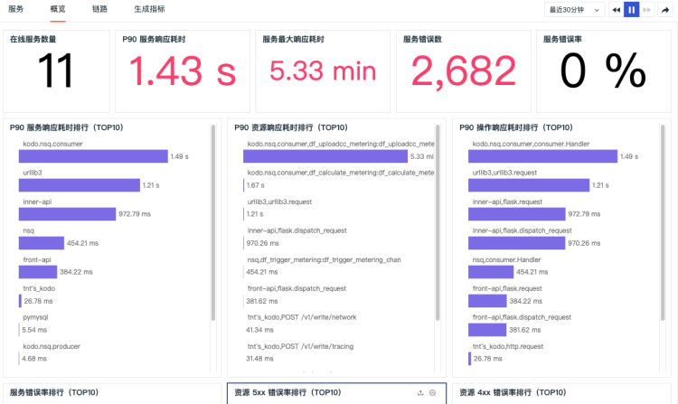

# 概览
---

在「应用性能」-「概览」中，“观测云” 默认为您提供了应用性能概览视图，您可以在概览页面查看在线服务数量、P90 服务响应耗时、服务最大影响耗时、服务错误数、服务错误率统计，同时还可以查看 P90 服务、资源、操作的响应耗时 Top10 排行，以及服务错误率、资源 5xx 错误率、资源 4xx 错误率 Top10 排行。

---

观测云是一款面向开发、运维、测试及业务团队的实时数据监测平台，能够统一满足云、云原生、应用及业务上的监测需求，快速实现系统可观测。**立即前往观测云，开启一站式可观测之旅：**[www.guance.com](https://www.guance.com)

