# 升级商业版
---

## 注册商业版
您可以在 [观测云官网](https://www.guance.com/) ，「[立即注册](https://auth.guance.com/register)」为观测云用户，观测云注册时，提供体验版和商业版注册选项。 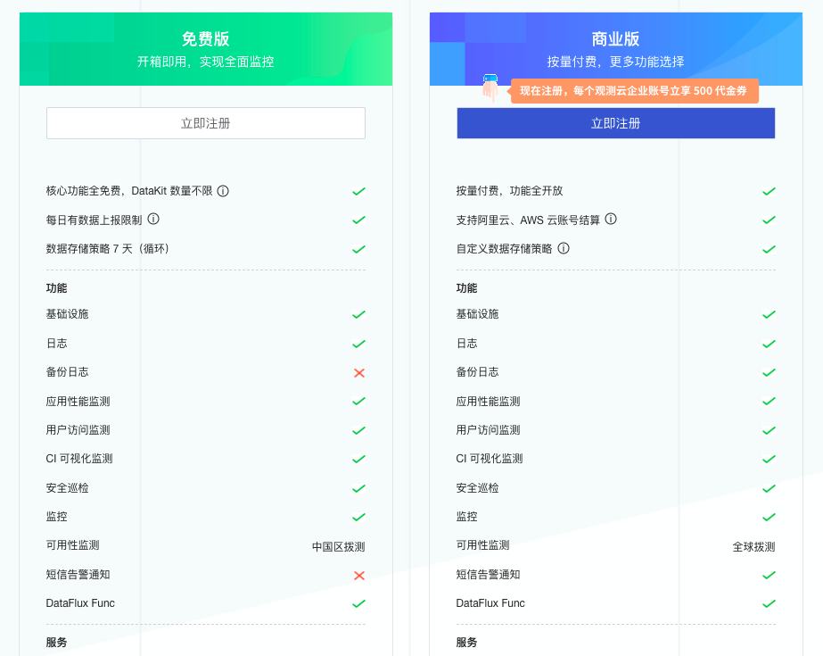 选择商业版，点击“立即注册”。在基本信息页面，选择站点、输入注册信息，点击“下一步”。 注意：

- 观测云提供多个注册登录站点，您可以根据使用资源的情况选择合适的站点进行注册登录。
- 若在注册商业版时，输入的“用户名”同时用来注册观测云费用中心的账号，费用中心的用户名账号会检查唯一性，一旦注册不能修改。

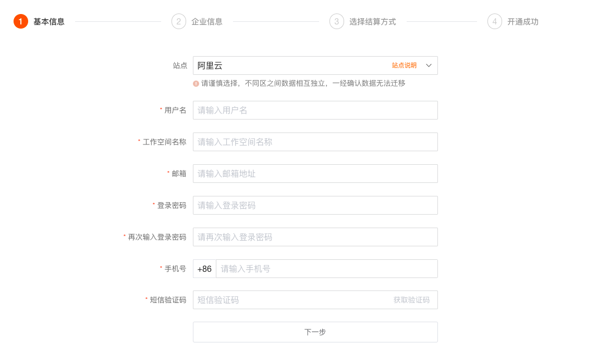 在企业信息页面，输入企业信息，点击“注册”。 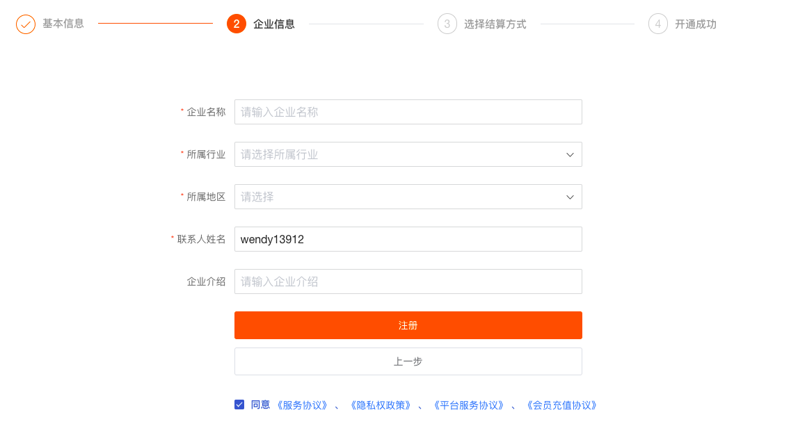 在选择结算方式页面，根据站点的选择会两种结算方式组合：[阿里云账号结算](https://www.yuque.com/dataflux/doc/vgdy2u)和[观测云企业账号结算](https://www.yuque.com/dataflux/doc/xcifgo)、[AWS账号结算](https://www.yuque.com/dataflux/doc/zszq8p)和观测云企业账号结算。您可以根据你的实际需求选择相应的结算方式，默认为观测云企业账号结算。 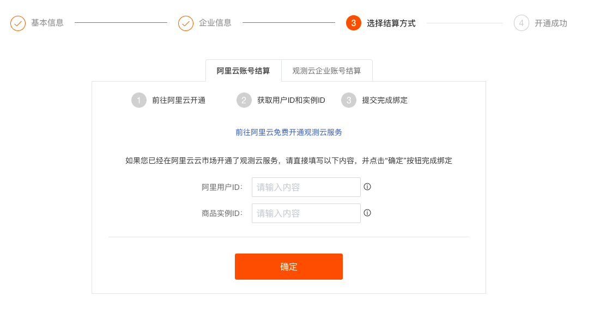 选择完结算方式以后，点击“确定”，即可成功开通观测云商业版。 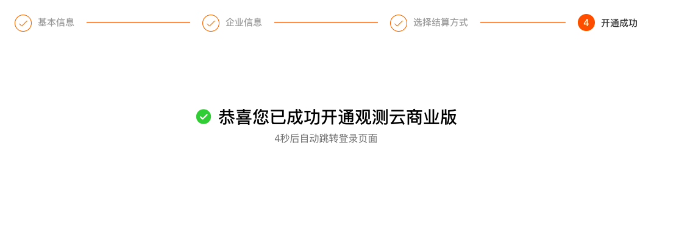 注册完成后，可观看观测云介绍小视频并加入到观测云社区。  看完观测云介绍以后，点击“立即开始”即可进入新手引导页面，可以根据新手引导安装配置第一个 DataKit 。  在观测云付费计划与账单，可以看到当前工作空间为“商业版”。  在观测云付费计划与账单，点击右上角的“进入费用中心”，即可自动跳转到观测云费用中心。 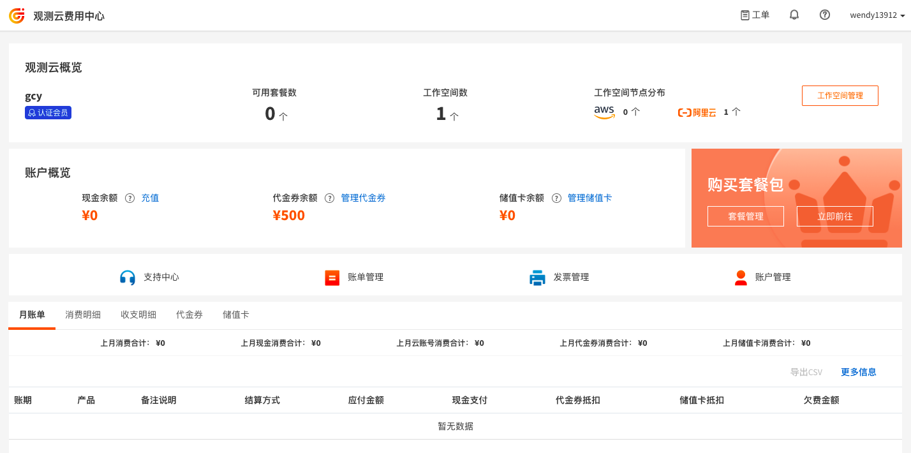

## 升级商业版
若您是[体验版](https://www.yuque.com/dataflux/doc/sw61zm)用户，您可以在观测云工作空间「付费计划与账单」，点击「升级」，升级观测云为商业版。 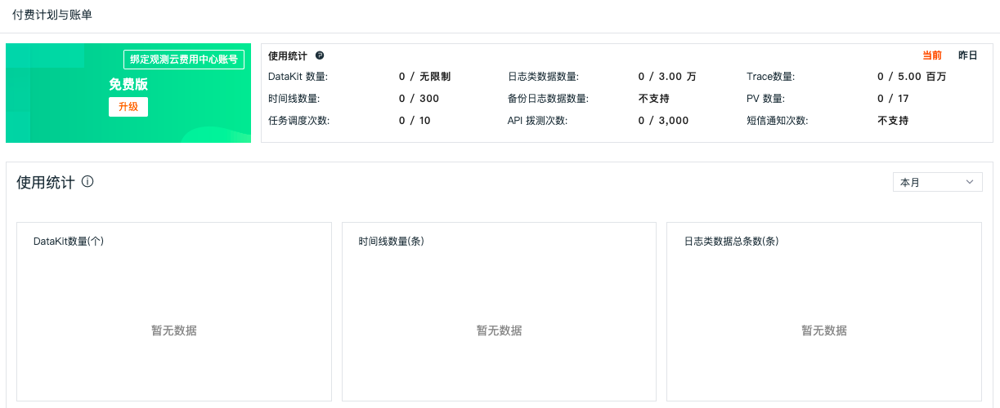 在套餐升级页面，点击「升级」。观测云支持按需购买，按量付费。更多版本计费逻辑可参考文档 [计费方式](https://www.yuque.com/dataflux/doc/ateans) 。 注意：若在免费注册观测云时选择开启“同步开通观测云企业账号”，点击“升级”即弹出“服务协议”对话框，同意后即开通成功。 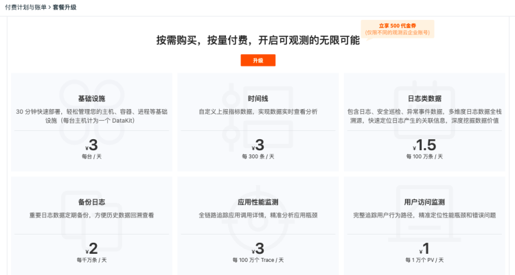 输入已经在观测云费用中心注册账号进行绑定，此处会对“用户名”进行校验，请输入已开通观测云费用中心账号的“用户名”。 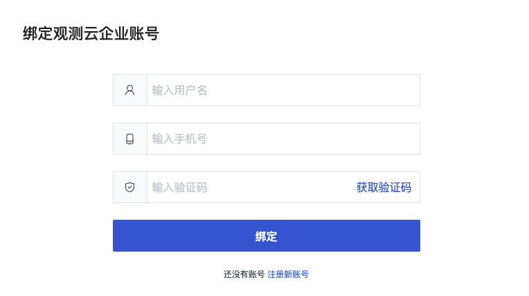

或点击“注册新账号”进行注册新的观测云费用中心账户后再绑定，此处会对“用户名”进行校验，请输入注册观测云账号时的“用户名”。 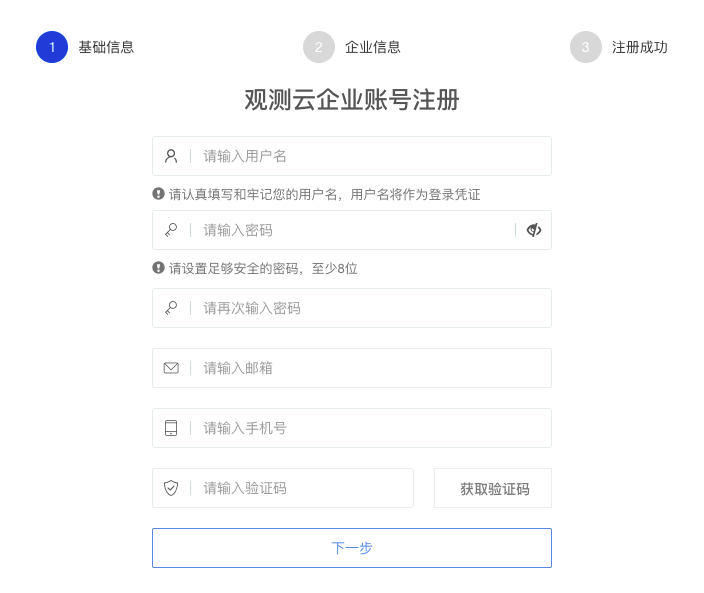 查看开通协议并同意，协议同意后即可收到开通提醒邮件，该工作空间升级到商业版。 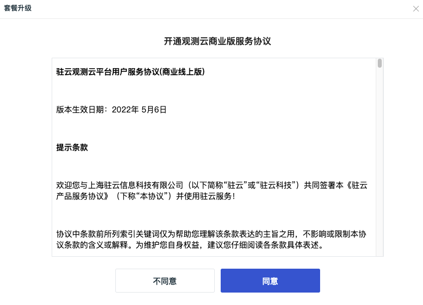 商业版升级成功，默认使用观测云费用中心账号结算，若需要更改其他结算方式，可以点击“绑定结算云账号”按钮。目前观测云支持三种结算方式：

- 观测云企业账号：直接在观测云费用中心进行充值结算；
- 阿里云账号：直接通过阿里云账号进行充值结算；
- 亚马逊云账号：直接通过AWS账号进行充值结算。

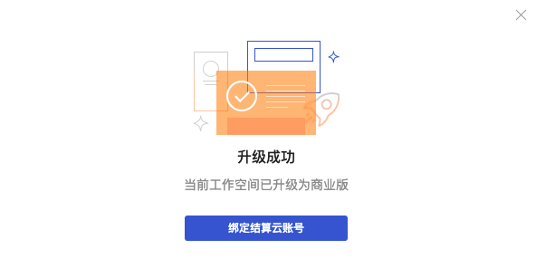 点击“绑定结算云账号”，选择结算云账号。这里支持四种场景：

- 已登记云账号结算，未开通“结算方式任意选择”：推荐使用“已登记云账号”，另外可选择当前站点所属的云平台账号，如“阿里云账号”；
- 已登记云账号结算，且开通“结算方式任意选择”：推荐使用“已登记云账号”，另外可选择所有站点所属的云平台账号，如“阿里云账号”或“AWS云账号”；
- 无登记云账号结算，开通“结算方式任意选择”：可选择所有站点所属的云平台账号，如“阿里云账号”或“AWS云账号”（见下图示例）；
- 无登记云账号结算，未开通“结算方式任意选择”：可选择当前站点所属的云平台账号，如“阿里云账号”。

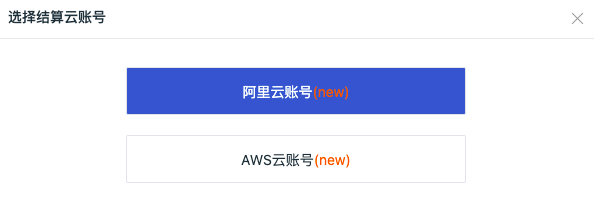 选择“阿里云账号”，在弹出的对话框中选择结算方式，具体步骤可参考 [开通阿里云账号结算方式](https://www.yuque.com/dataflux/doc/vgdy2u#oL2g8) 或 [在 AWS 订阅观测云](https://www.yuque.com/dataflux/doc/zszq8p#VL6Qh) 。 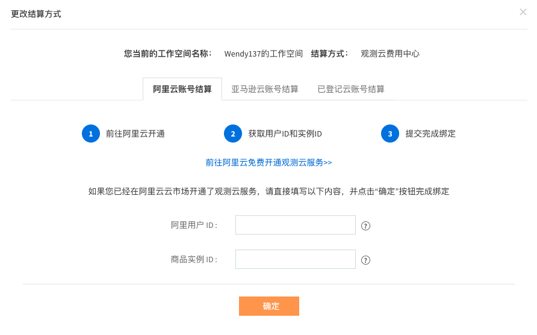 若选择使用费用中心账号结算，可直接关闭“更改结算方式”对话框。支持在观测云费用中心“工作空间管理”更改结算方式。 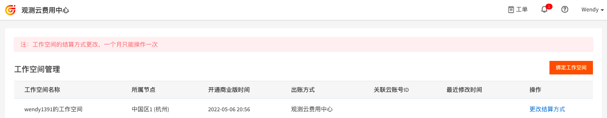 返回观测云付费计划与账单，可以看到当前工作空间已经升级到“商业版”。 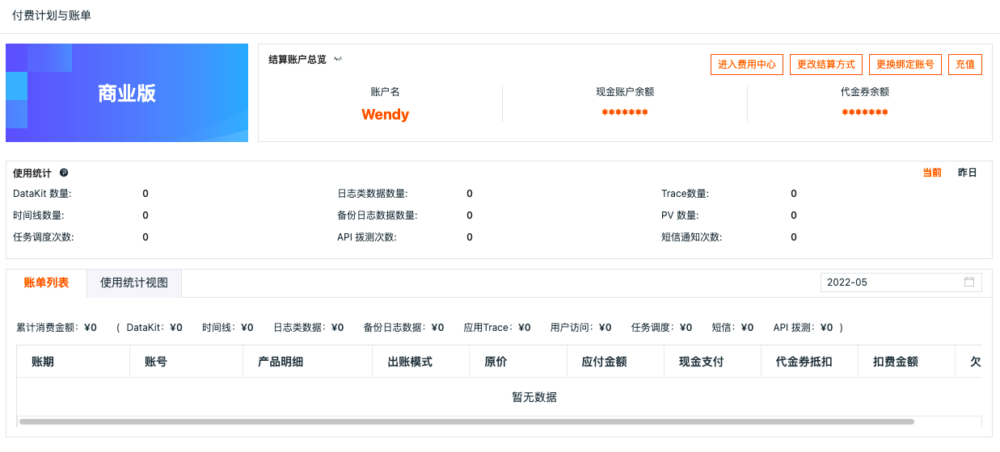 在观测云付费计划与账单，点击右上角的“进入费用中心”，即可自动跳转到观测云费用中心。 

---

观测云是一款面向开发、运维、测试及业务团队的实时数据监测平台，能够统一满足云、云原生、应用及业务上的监测需求，快速实现系统可观测。**立即前往观测云，开启一站式可观测之旅：**[www.guance.com](https://www.guance.com) 
