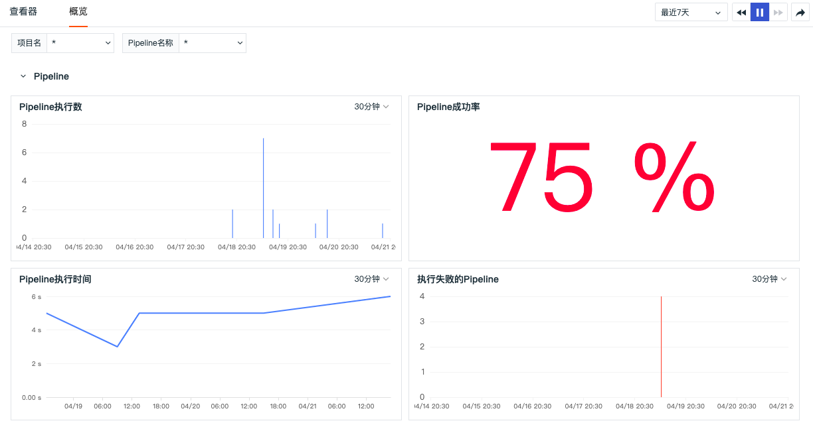
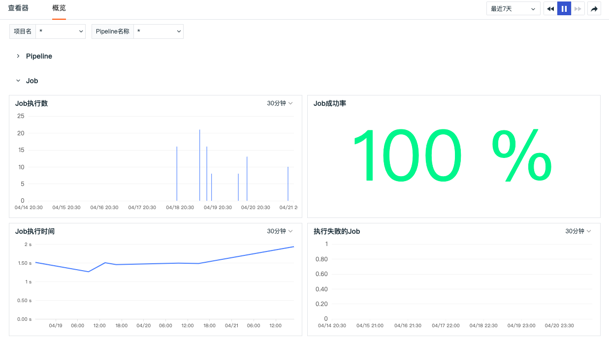

# 概览
---

在「CI 可视化」-「概览」中，您可以分别查看 Pipeline 和 Job 的概览视图，包括执行数、成功率、执行时间以及执行失败的数量。

- Pipeline

- Job

---

观测云是一款面向开发、运维、测试及业务团队的实时数据监测平台，能够统一满足云、云原生、应用及业务上的监测需求，快速实现系统可观测。**立即前往观测云，开启一站式可观测之旅：**[www.guance.com](https://www.guance.com)

