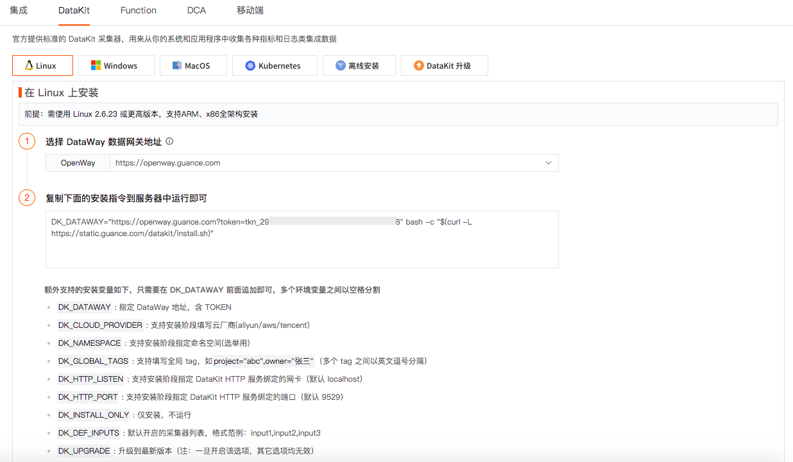
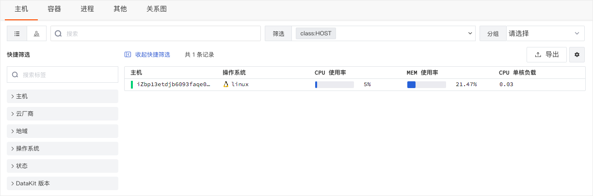

# 部署第一个DataKit
---

## 场景描述

你前段时间买了一台 Linux 主机，在上面基于Nginx部署了一个门户网站，最近发现网站打开很慢，有的时候甚至会发生打不开的情况，比如打开某个页面发生404的错误等。为了解决这个问题，你决定把这台云主机通过观测云监控起来，分析哪里出现了问题。

## 前提条件

在开始使用观测云监控云主机之前，你需要先注册一个 [观测云账号](https://auth.guance.com/register?channel=语雀) ，注册完成后登录到观测云工作空间，即可获取DataKit 安装指令，部署你的第一个 DataKit。

DataKit 是观测云官方发布的数据采集应用，支持上百种数据的采集，可实时采集如主机、进程、容器、日志、应用性能、用户访问等多种数据。

## 方法/步骤

### Step1：获取安装指令

你可以登录到观测云工作空间，依次点击「集成」-「DataKit」，复制 DataKit 安装指令。

### Step2：在主机上执行安装指令

打开命令行终端工具，登录到你的主机，执行复制的「安装指令」，安装完成后会提示`Install Success`，你可以通过 DataKit 安装结果提供的链接查看 DataKit 的安装状态、手册和更新记录。

### Step3：开始使用观测云

DataKit 成功安装完成后，主机对象采集器`hostobject`已经默认开启，你就可以直接在观测云工作空间的「基础设施」-「主机」下查看刚才安装 DataKit 的主机，包括主机状态、主机名、操作系统、CPU使用率、MEM使用率、CPU单核负载等，你也可以点击主机查看主机的更多详情。

安装完 DataKit，我们就可以开始 [配置采集器](https://www.yuque.com/dataflux/doc/tyqgkt)，来采集更多不同的数据。

---

观测云是一款面向开发、运维、测试及业务团队的实时数据监测平台，能够统一满足云、云原生、应用及业务上的监测需求，快速实现系统可观测。**立即前往观测云，开启一站式可观测之旅：**[www.guance.com](https://www.guance.com)
