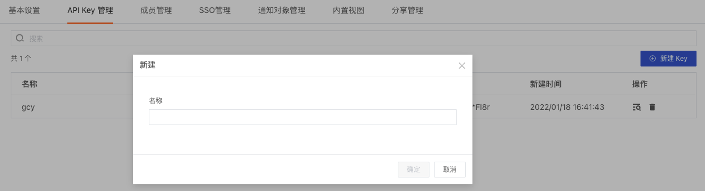
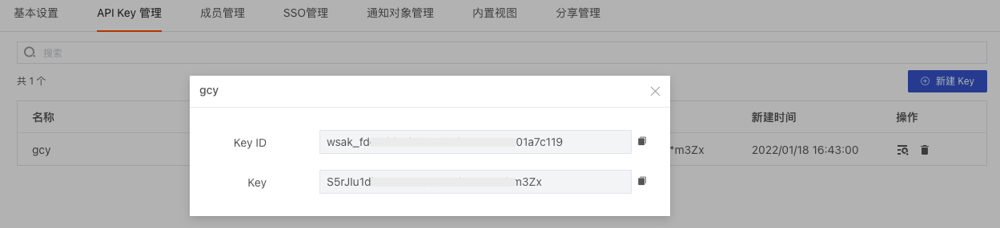
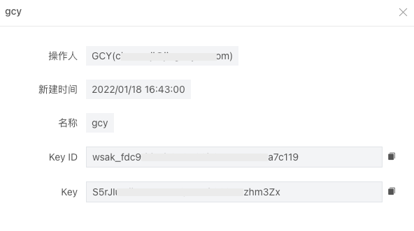
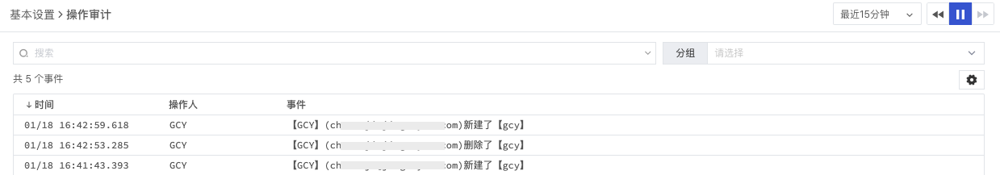

# API Key 管理
---

“观测云” 支持通过调用 Open API 接口的方式来获取和更新观测云工作空间的数据，在调用 API 接口前，需要先创建 API Key 作为认证方式。关于 API 介绍，可参考文档 [OpenAPI](../17-工作空间管理/03-API-Key管理/01-OpenAPI.md) 。

## 新建 API Key

在观测云工作空间「管理」-「API Key 管理」，点击右上角 「新建 Key」，输入 Key 名称，点击确定。 注意：API Key 管理支持管理员及以上可编辑。  点击确定后，即可获取用于调用的 API Key ID和密钥。  或通过在 API Key 管理列表右侧点击获取 API Key ID和密钥，若不再需要或有泄露风险，可删除重新再创建。  新建/删除 API Key 都会产生操作审计事件，可在观测云工作空间「管理」-「基本设置」下的操作审计进行查看。 

---

观测云是一款面向开发、运维、测试及业务团队的实时数据监测平台，能够统一满足云、云原生、应用及业务上的监测需求，快速实现系统可观测。**立即前往观测云，开启一站式可观测之旅：**[www.guance.com](https://www.guance.com) 

