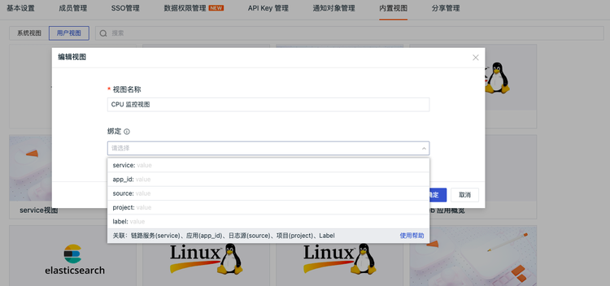
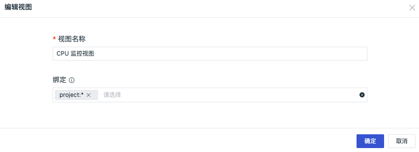
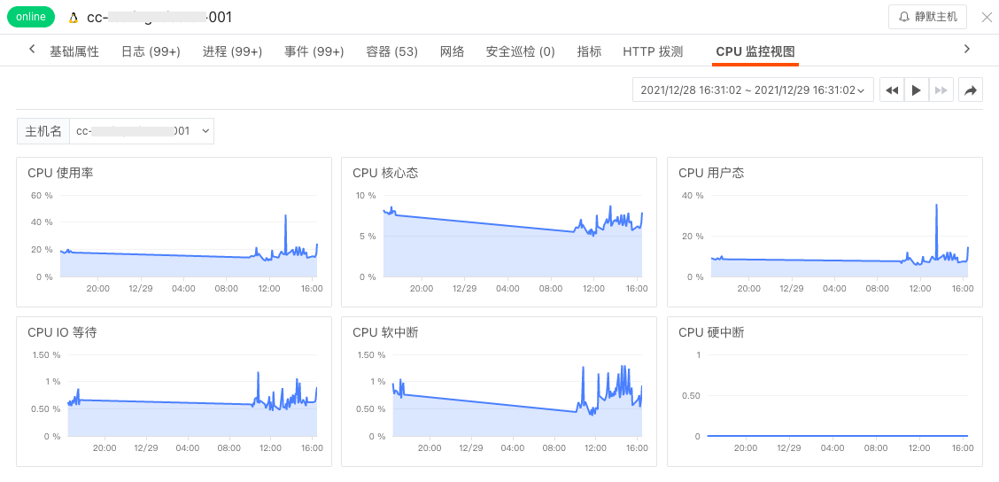
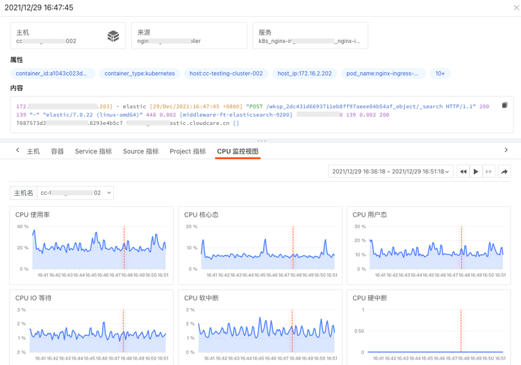
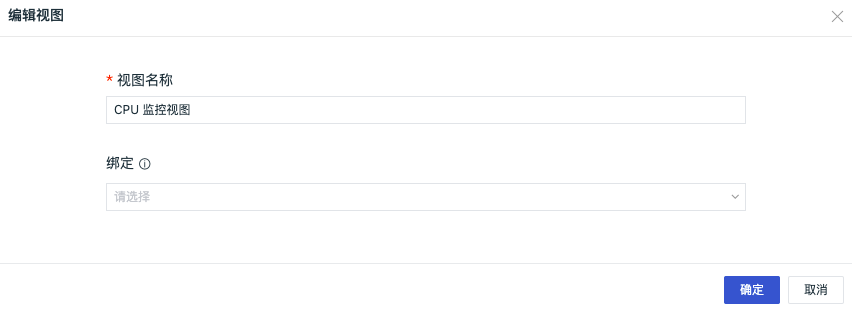

# 绑定内置视图
---

## 简介

“观测云” 支持通过将内置视图与不同的链路服务、应用、日志源、项目等字段进行关联绑定，根据绑定字段可在对应的查看器详情页查看绑定的内置视图（用户视图），支持的查看器包括场景自定义查看器、基础设施、日志、链路、用户访问、安全巡检、可用性等查看器。

## 字段说明

**注意：在内置视图绑定字段时，除下面字段数据范围内的值可以选择以外，支持用户输入自定义字段值，但不支持自定义字段。**

| **字段名** | **数据范围** | **适配范围** | **数值范围** |
| --- | --- | --- | --- |
| `service` (链路服务) | 当前工作空间 Tracing （用户性能监测）数据中的 service 值 | 场景-自定义查看器 基础设施-所有查看器 日志查看器 链路查看器 用户访问-session、view查看器 安全巡检查看器 可用性查看器 | ``*``：表示匹配全部服务 ``value``：表示仅匹配对应的服务，支持多值 |
| `app_id` (应用) | 当前工作空间 Rum-View （用户访问监测）数据中的 app_id 值 | 场景-自定义查看器 基础设施-所有查看器 日志查看器 链路查看器 用户访问-session、view查看器 安全巡检查看器 可用性查看器 | ``*``：表示匹配全部应用 ``value``：表示仅匹配对应的应用，支持多值 |
| `source` (日志源) | 当前工作空间 Logging （日志）数据中的 source 值 | 场景-自定义查看器 基础设施-所有查看器 日志查看器 链路查看器 安全巡检查看器 可用性查看器 | ``*``：表示匹配全部日志源 ``value``：表示仅匹配对应的日志源，支持多值 |
| `project` (项目) | 当前工作空间的 Object（基础设施） 数据中的 project 值 | 场景-自定义查看器 基础设施-所有查看器 日志查看器 链路查看器 用户访问-session、view查看器 安全巡检查看器 可用性查看器 | ``*``：表示匹配全部项目 ``value``：表示仅匹配对应的项目，支持多值 |
| `label` | 当前工作空间的 Object（基础设施） 数据中的 label 值 | 基础设施-所有查看器 | ``*``：表示匹配全部项目 ``value``：表示仅匹配对应的 label，支持多值 |

**绑定字段后在查看器详情页的显示逻辑说明：** 1）绑定字段的value值支持 `*` ，单值，多值 3种模式。

- 若value值选择`*`，如配置`Service:*`：所有列表里面存在Service字段的查看器详情页绑定该内置视图
- 若value值选择“单值”，如配置`Service:value1`，所有列表里面存在service=value1的查看器详情页绑定该内置视图
- 若value值选择“多值”，如配置`Service:value1,value2`，所有列表数据中存在service=value1或者service=value2的查看器详情页绑定该内置视图

2）绑定字段显示顺序：service>app_id>source>project>label，相同字段的顺序不做特殊处理。

- 若 service = ${value}、source = ${value}、 project = ${value} 匹配到同一个内置视图，则在查看器详情页只显示这个内置视图
- 若 service = ${value}、source = ${value}、 project = ${value} 匹配到不同的内置视图，则在查看器详情页按照Service>Source>Project 顺序显示对应的内置视图

3）在查看器详情页绑定的内置视图，默认显示的时间范围是“最近15分钟”，且会获取当前数据记录的时间在图中标注显示。

## 示例说明

系统视图可以通过“编辑”来创建绑定关系，用户视图可以通过“新建/编辑”来创建绑定关系。下面以系统视图为例。

### 1.创建绑定关系

在观测云工作空间「管理」-「内置视图」-「用户视图」，在设置下选择“编辑”，在弹出的对话框的“绑定”中，可以看到上面表格中列出的几个字段名，具体介绍可参考上面的表格。  在“绑定”中选择`project:*`，点击“确定”。  注意：若创建用户视图绑定关系，为保证数据的一致性，绑定内置视图前，需**至少添加指定对象分类下的一个字段作为该内置视图的视图变量**，系统会依据这个视图变量自动同步内置视图。

### 2.在查看器详情查看绑定的内置视图
1）在基础设施主机详情页查看绑定的内置视图，前提条件该主机具有“project（项目）”的标签。  2）在日志查看器详情页查看绑定的内置视图，前提条件该主机具有“project（项目）”的标签。 

### 3.删除查看器详情已绑定的内置视图
在观测云工作空间「管理」-「内置视图」-「用户视图」，在设置下选择“编辑”，清除“绑定”中的字段内容，点击“确定”即可删除查看器详情已绑定的内置视图。 

---

观测云是一款面向开发、运维、测试及业务团队的实时数据监测平台，能够统一满足云、云原生、应用及业务上的监测需求，快速实现系统可观测。**立即前往观测云，开启一站式可观测之旅：**[www.guance.com](https://www.guance.com) 

