# Keycloak单点登录示例
---


## 操作场景

Keycloak 是 RedHat 推出的基于云的标识和访问管理服务，可帮助企业管理内外部资源。观测云支持基于 SAML 2.0（安全断言标记语言 2.0）的联合身份验证，SAML 2.0 是许多身份验证提供商（Identity Provider， IdP）使用的一种开放标准。您可以通过基于 SAML 2.0 联合身份验证将 Keycloak 与观测云进行集成，从而实现 Keycloak 帐户自动登录（单一登录）观测云平台访问对应工作空间资源，不必为企业/团队单独创建观测云账号。

本文使用搭建的Keycloak服务器，演示如何实现 Keycloak 用户 SSO 登录到观测云管理控制台。


## 前置条件

已搭建 Keycloak 服务器，并能登录到 Keycloak 服务器进行配置。若无 Keycloak 环境，可参考以下步骤搭建。

```
sudo yum update         #更新

sudo yum install -y java-1.8.0-openjdk java-1.8.0-openjdk-devel      #安装JDK

wget https://downloads.jboss.org/keycloak/11.0.2/keycloak-11.0.2.zip   #下载Keycloak

yum install unzip       #安装解压缩包

unzip keycloak-11.0.2.zip       #解压下载的Keycloak

cd keycloak-11.0.2/bin         #进入 bin 目录

./add-user-keycloak.sh -r master -u admin -p admin     #创建服务器管理员登录账号和密码

nohup bin/standalone.sh -b 0.0.0.0 &     #返回 bin 目录，并在后台挂在 Keycloak 启动服务
```

Keycloak环境搭建完成后，在浏览器输入`https://IP地址:8443/auth`，点击“Administration Console”，打开 Keycloak 管理控制台。<br />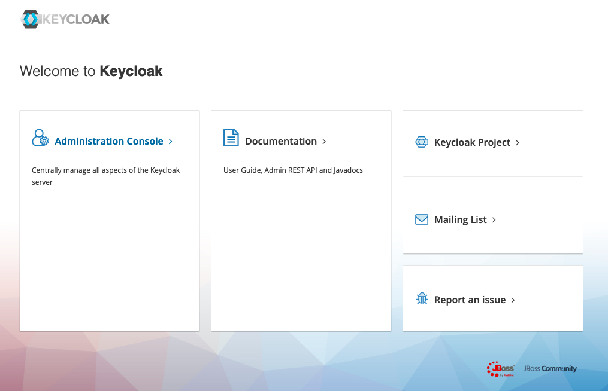

## 操作步骤

### 1.创建 Keycloak realm

注意：Keycloak 本身有一个主域（Master），我们需要创建一个新的域（类似工作空间）。<br />1）在 Keycloak 管理控制台，点击“Master”-“Add realm”。<br />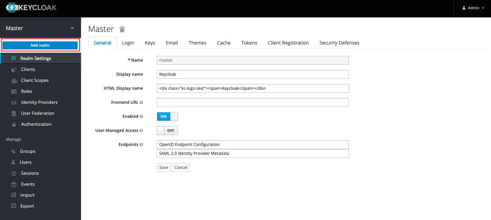<br />2）在“Add realm”页面，在“Name”处输入域名称，如“gcy”，点击“Create”，即可创建一个新的域。<br />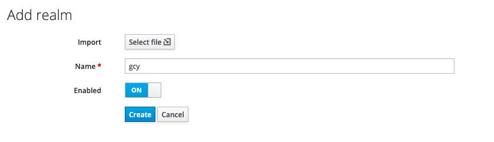


### 2.创建 Client 并配置 SAML

注意：本步骤将创建 Keycloak 客户端并配置 SAML ，建立 Keycloak 和观测云之间的信任关系使之相互信任。<br />1）在新创建的“gcy”域下，点击“Client”，在右侧点击“Create”。<br />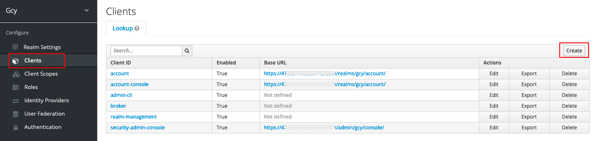<br />2）在“Add Client”按照以下内容填写完成后，点击“Save”。

- Client ID（实体 ID）：[https://auth.guance.com/saml/metadata.xml](https://auth.guance.com/saml/metadata.xml)
- Client Protocol：选择“saml”
- Client SAML Endpoint（断言地址），临时使用：[https://auth.guance.com/saml/assertion](https://auth.guance.com/saml/assertion/)

**注意：此次配置仅为获取下一步的元数据文档使用，需要在观测云中启用SSO单点登录后，获取到正确的“实体ID”和“断言地址”后重新替换。关于如何获取观测云的断言地址和实体 ID，可参考文档 **[**新建SSO**](./17-工作空间管理/06-SSO管理.md)** 。**<br />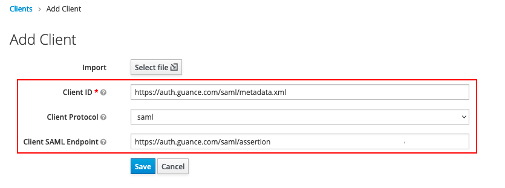<br />Client 创建后，在“Settings”可以看到上一步填写的实体ID、协议和断言地址。设置如下参数后保存。

- Sign Assertions：ON（用于防止IdP传输的数据被篡改，保证从IdP传输到SP的数据安全。）

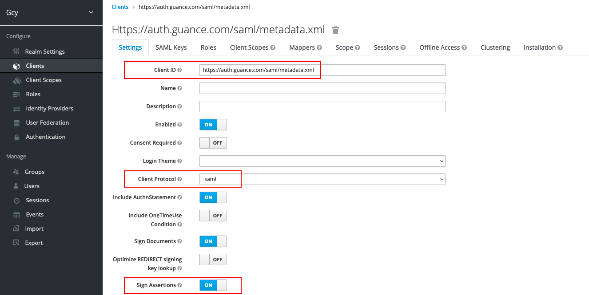

- IDP Initiated SSO URL Name：可任填，如“gcy”，填完以后会生成 SSO 单点登录地址，见下图
- Base URL：填入上一个参数生成的 SSO 单点登录地址，如`/auth/realms/gcy/protocol/saml/clients/gcy`，这个主要用于在 Keycloak Clients 生成访问链接直接单点登录到观测云。

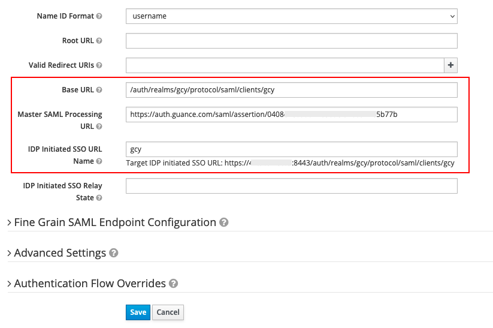

3）在“Clients”的“Mappers”，点击“Create”，创建邮箱映射，此部分内容为必填项，如果不填，无法实现SSO单点登录。<br />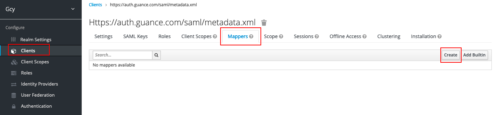<br />在“Create Protocol Mapper”页面，输入以下内容后，并保存。

- Name：可任填，如“mail mapper”
- Mapper Type：选择“User Property”
- Property：按照身份提供商的支持的规则填入“email”
- SAML Attribute Name：必需填入“Email”

注意：观测云定义了一个映射字段，必须填入“Email”用于关联身份提供商的用户邮箱（即身份提供商将登录用户的邮箱映射到Email）。<br />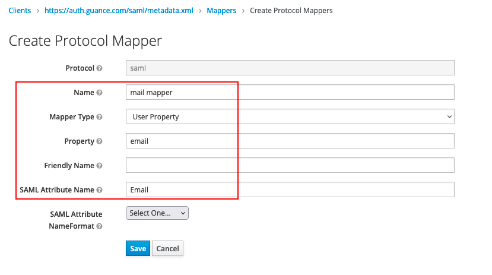

### 3.获取 KeyCloak 元数据文档

注意：本步骤可获取在观测云创建身份提供商的元数据文档。<br />1）在“Clients”的“Installation”，选择“Mod Auth Mellon files”，点击“Download”下载元数据文档。<br />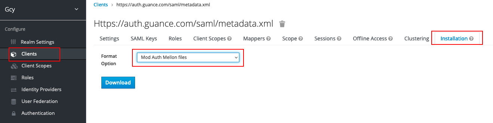<br />2） 在下载的文件夹中，选择“ipd-metadata.xml”。<br />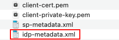<br />3）由于 Keycloak 的云数据文档是“域”级别的，需要在元数据文档“idp-metadata.xml”中的访问地址增加客户端的参数`/clients/<IDP Initiated SSO URL Name>`，此文档中由于设置了`IDP Initiated SSO URL Name：gcy`，故在xml文件中填入`/clients/gcy`，见下图。添加完成后保存xml文件。<br />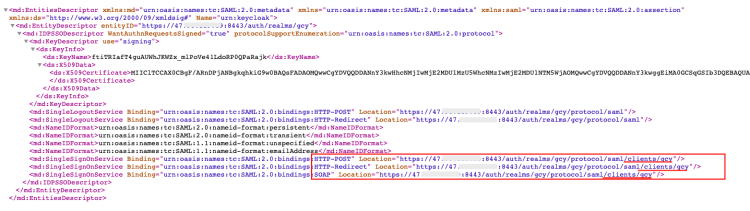


### 4.配置 Keycloak 用户

注意：本步骤配置在观测云创建身份提供商的授权用户邮箱账号，通过配置的 Keycloak 用户邮箱账号可单点登录到观测云平台。<br />1）在创建的gcy域，点击“User”，点击“Add user”。<br />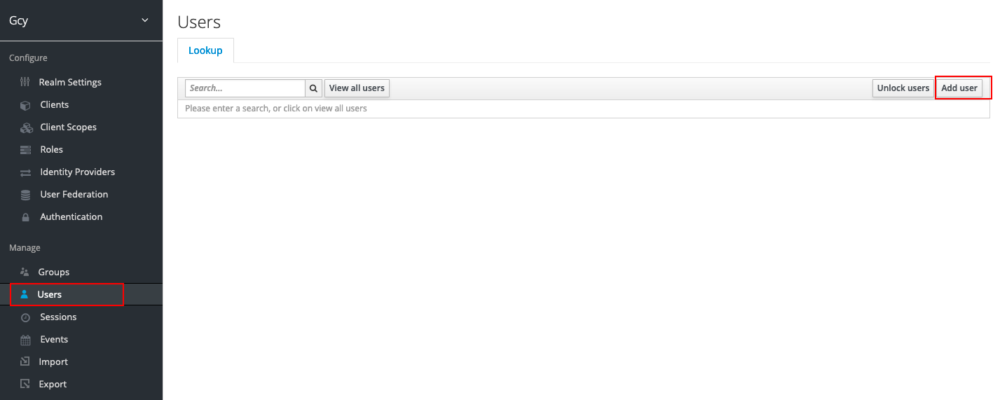<br />2）输入“Username”和“Email”，Email为必填项，且需要和观测云身份提供商配置的用户百名单邮箱保持一致，用于匹配邮箱映射登录到观测云。<br />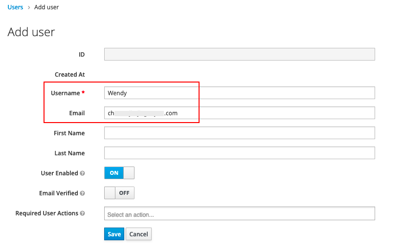<br />3）创建用户后，在“Credentials”中为用户设置密码。<br />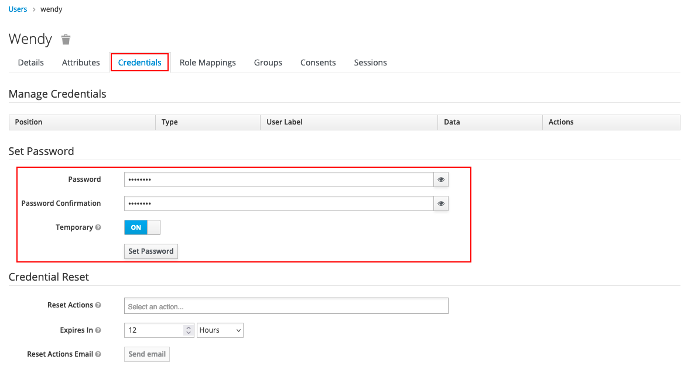


### 5.在观测云启用SSO单点登录并在 KeyCloak 替换 SAML 断言地址

1）启用 SSO 单点登录，在观测云工作空间“管理”-“SSO管理”，点击“启用”即可。可参考文档 [新建SSO](./17-工作空间管理/06-SSO管理.md) 。<br />**注意：基于账号安全考虑，观测云支持工作空间仅配置一个 SSO，若您之前已经配置过 SAML 2.0，我们默认会将您最后一次更新的 SAML2.0 配置视为最终单点登录验证入口。**<br />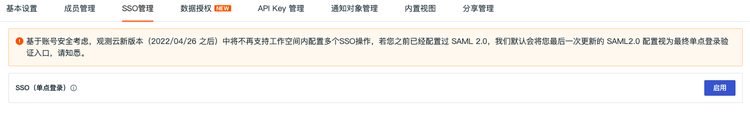<br />2）上传身份提供商的“元数据文档”，配置“邮箱域名”，选择“访问角色”，即可获取该身份提供商的“实体ID”和“断言地址”，支持直接复制“登录地址”进行登录。<br />**注意：启用 SSO 登录时，需要添加“邮箱域名”，用于观测云和身份提供商进行邮箱域名映射（用户邮箱域名需和观测云中添加的邮箱域名保持一致），实现单点登录。**<br />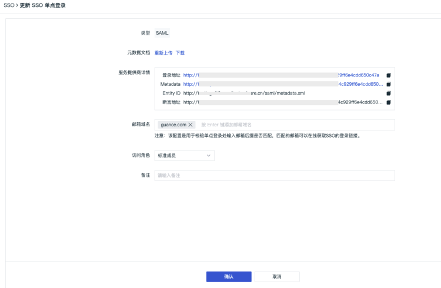<br />3）返回 Keycloak，更新 SAML 的“断言地址”，见[步骤2.2)](#j217u)。<br />**注意：在观测云配置单点登录时，身份提供商SAML中配置的断言地址必须和观测云中的保持一致，才能实现单点登录。**<br />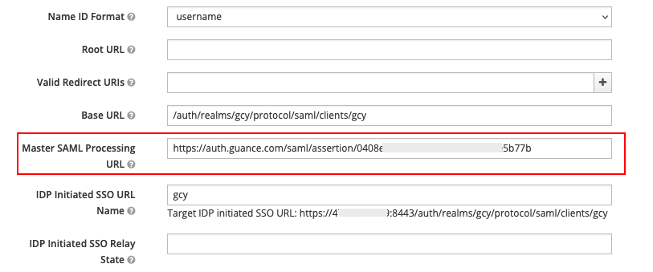

### 6.使用 Keycloak 账号单点登录观测云

所有配置完成后，可以有两种方式单点登录到观测云。

#### 方法一：在 Keycloak 登录到观测云

1）在 Keycloak 的 Clients，点击右侧的“Base URL”。<br />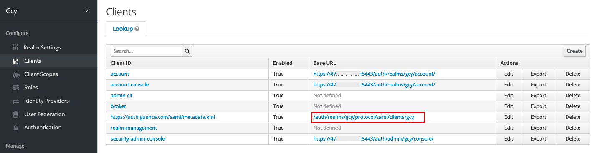<br />2）输入配置的用户邮箱和密码。<br />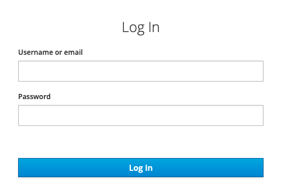<br />3）登录到观测云对应的工作空间。<br />注意：若多个工作空间同时配置了相同的身份提供商 SSO 点单登录，用户通过 SSO 单点登录到工作空间后，可以点击观测云左上角的工作空间选项，切换不同的工作空间查看数据。<br />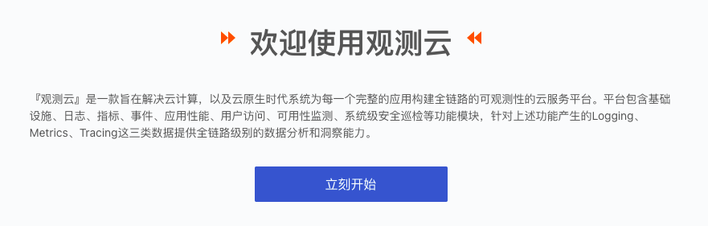

#### 方法二：在观测云用 Keycloak 账号单点登录

1）SSO配置完成后，通过 [观测云官网](https://www.dataflux.cn/) 或者 [观测云控制台](https://auth.dataflux.cn/loginpsw) 登录，在登录页面选择「单点登录」。<br />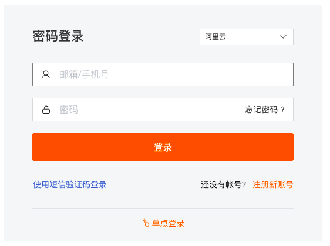<br />2）输入在创建SSO的邮箱地址，点击「获取登录地址」。<br /><br />3）点击「链接」打开企业账号登录页面。<br />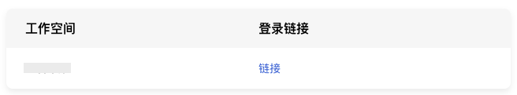<br />4）输入企业通用邮箱（在 Keycloak 和观测云SSO管理中配置的企业邮箱地址）和密码。<br /><br />5）登录到观测云对应的工作空间。<br />注意：若多个工作空间同时配置了相同的身份提供商 SSO 点单登录，用户通过 SSO 单点登录到工作空间后，可以点击观测云左上角的工作空间选项，切换不同的工作空间查看数据。<br />

---

观测云是一款面向开发、运维、测试及业务团队的实时数据监测平台，能够统一满足云、云原生、应用及业务上的监测需求，快速实现系统可观测。**立即前往观测云，开启一站式可观测之旅：**[www.guance.com](https://www.guance.com)<br />
