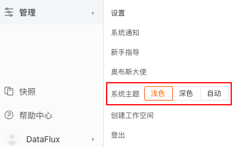
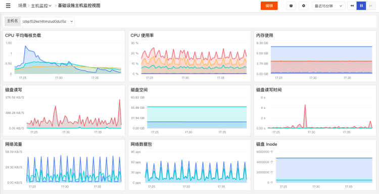
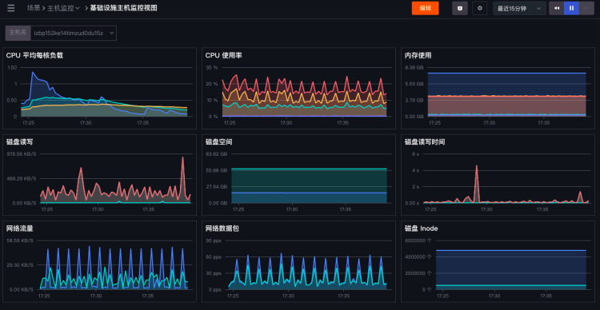

# 系统主题
---

## 主题设置

“观测云” 支持切换主题颜色，有浅色和深色两种，点击左下角账号，在「系统主题」选择使用。

注意：系统主题选择“自动”，可根据电脑外观设置自动切换主题颜色。 

- 浅色效果

- 深色效果

---

观测云是一款面向开发、运维、测试及业务团队的实时数据监测平台，能够统一满足云、云原生、应用及业务上的监测需求，快速实现系统可观测。**立即前往观测云，开启一站式可观测之旅：**[www.guance.com](https://www.guance.com) 
