# DQL查询
---

## 简介

DQL 是专为 “观测云” 开发的语言，语法简单，方便使用，可在 “观测云” 或者终端设备通过 DQL 语言进行数据查询。

## DQL 查询

在观测云工作空间，点击菜单栏的「快捷入口」-「DQL 查询」即可打开 DQL 查询查看器，或者您可以通过快捷键`Alt+Q`直接打开 DQL 查询。<br />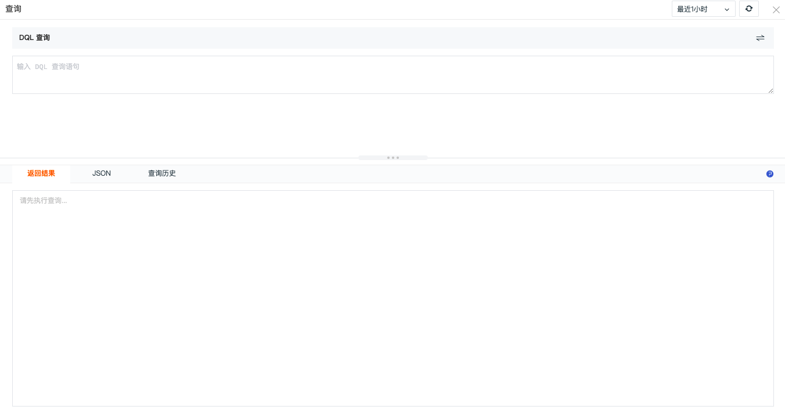

### 简单查询
点击“DQL 查询”右侧的切换按钮，可切换 DQL 查询为简单查询。<br />注意：「DQL查询」切换成「简单查询」时，若无法解析或者解析不完整：

- 在「简单查询」下未操作，直接切换回「DQL查询」则显示之前的 DQL 查询语句；
- 在「简单查询」下调整了查询语句，再次切换回「DQL查询」将按照最新的「简单查询」进行解析。

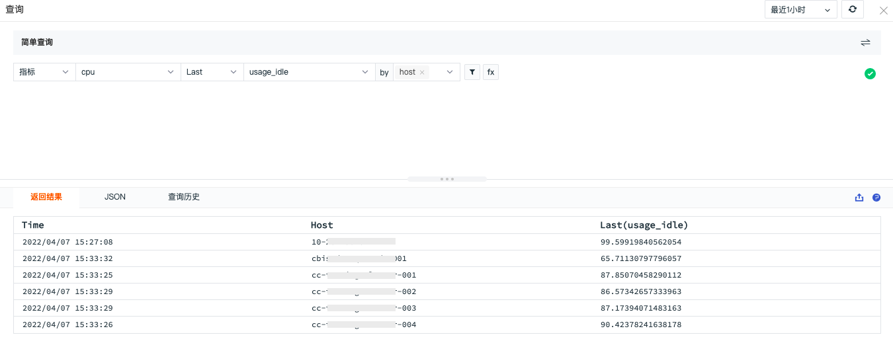

### 返回结果

在 DQL 查询窗口输入 DQL 查询语句，点击其他任意地方，即可在“返回结果”查看查询结果。 “返回结果”以表格形式返回查询结果，最多返回1000条数据，支持导出CSV文件，支持点击查看帮助文档。<br />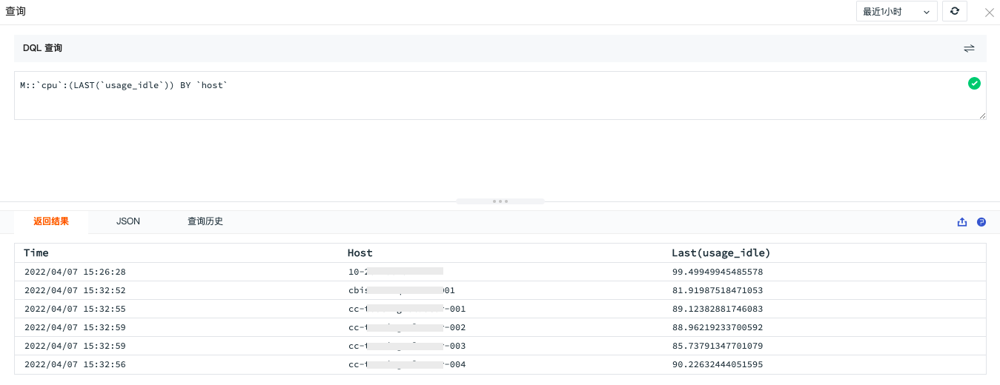<br />若 DQL 查询语句有误，也可在“返回结果”查看错误提示。<br />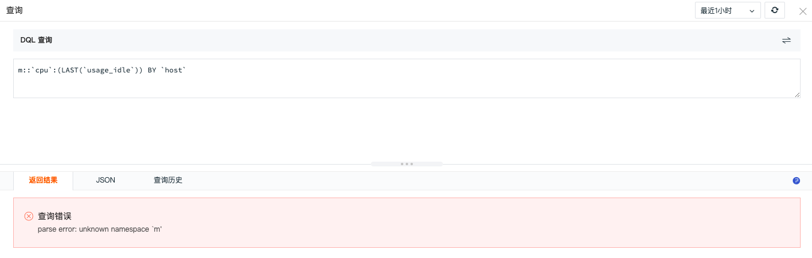

### JSON

若 DQL 查询语句正确，返回查询结果后，可在“JSON”查看 Json 结构的查询结果，支持复制 Json ，支持点击查看帮助文档。若 DQL 查询返回错误结果，则在“JSON”同时提示错误信息。<br />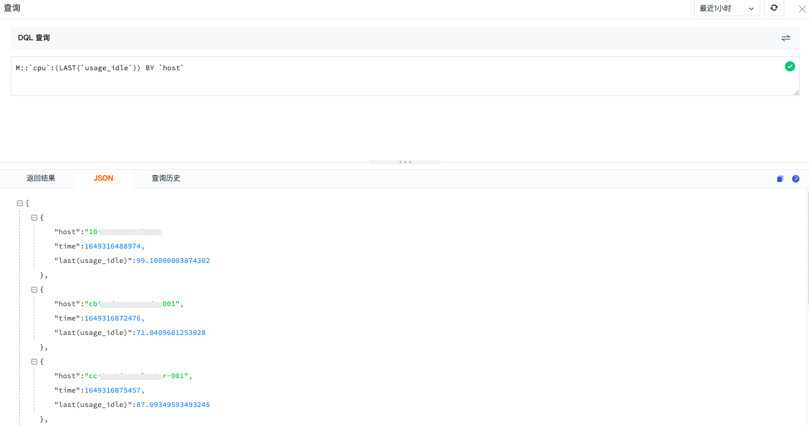

### 查询历史

查询历史支持按日查看7天内的100条查询历史数据，支持对查询语句进行模糊搜索。<br />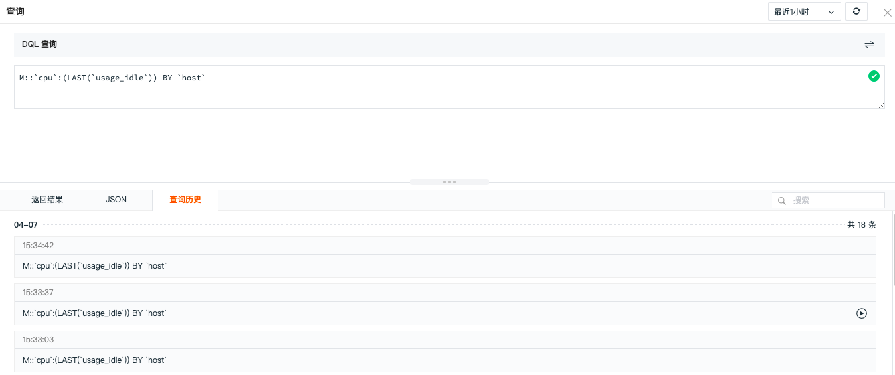<br />点击查询历史数据右侧的执行按钮，直接展示对应的查询语句及查询结果。<br />

## DQL 语法

DQL 查询遵循如下的语法范式，各个部分之间的相对顺序不能调换，从语法角度而言，`data-source` 是必须的（类似于 SQL 中的 `FROM` 子句），其它部分都是可选的。更多 DQL 语法介绍可参考文档 [DQL 定义](../dql/define.md) 。
```
namespace::
	data-source
	target-clause
	filter-clause
	time-expr
	by-clause
	limit-clause
	offset-clause
	slimit-clause
	soffset-clause
```

### 示例说明

下面是一个简单的示例，通过 DQL 查询时序指标集 cpu 的字段 usage_idle (CPU空闲率)，以 host 来过滤筛选，同时以 host 来分组显示结果。其中 #{host} 是在观测云仪表板设置的视图变量，用于过滤筛选。<br />

把上面的语句应用到观测云场景仪表版的图表查询中，下图结合表达式查询和 DQL 查询，展示最近 15 分钟 CPU 使用率。<br />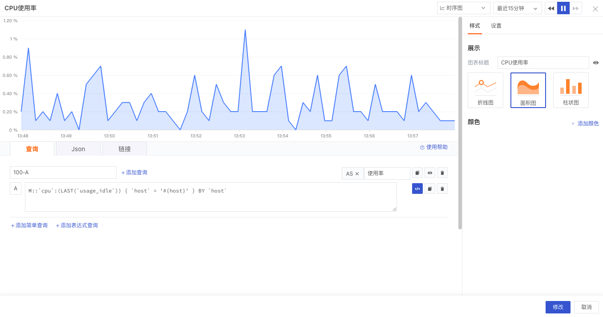

## DQL 函数

DQL 查询除了可以在场景仪表板中使用以外，我们还可以通过 DQL 函数来查询 DataKit 采集的各种数据，如数据来源、字段、标签等。

### SHOW 函数

SHOW 函数用于展示各类数据。若对通过 DataKit 采集的数据来源、字段、标签等没有清晰的了解，可以在 DQL 查询查看器通过 SHOW 函数来查询。

下面通过 SHOW 函数查询“对象”和“日志”的来源、字段等数据。更多函数介绍可参考文档 [DQL 函数](../dql/funcs.md) 以及 [DQL 外层函数](../dql/out-funcs.md) 。

#### show_object_source()

展示 `object` 数据的指标集合。<br />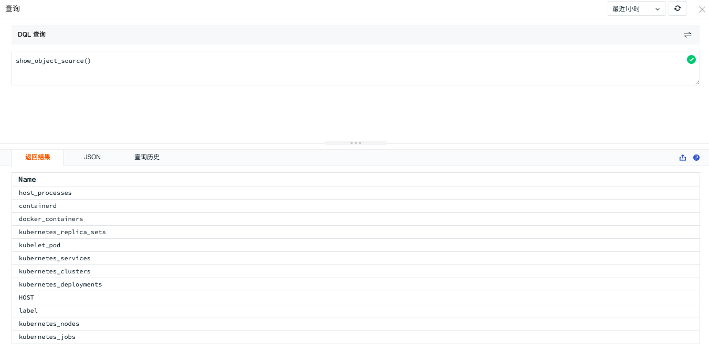

#### show_object_field()

展示对象的 `fileds` 列表。<br />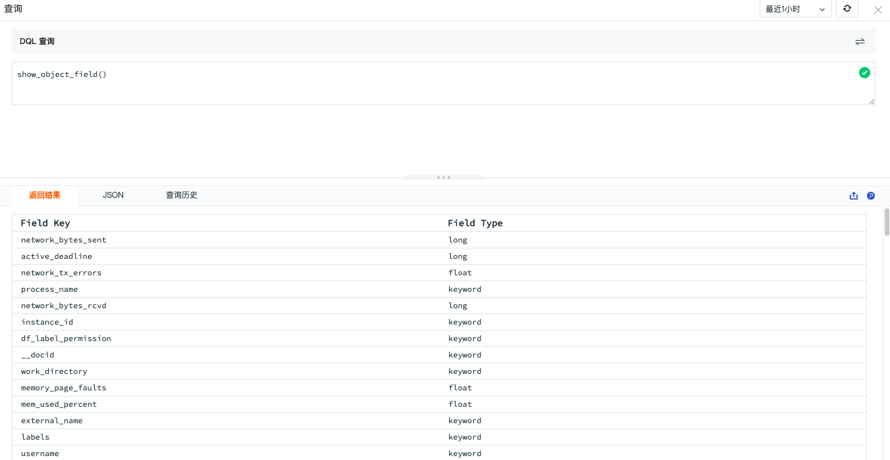

#### show_object_label()

展示对象包含的标签信息。<br />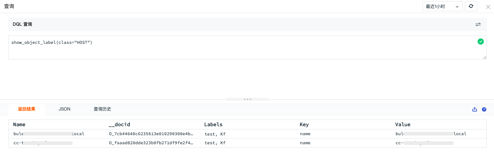

#### show_logging_source()

展示日志数据的指标集合。<br />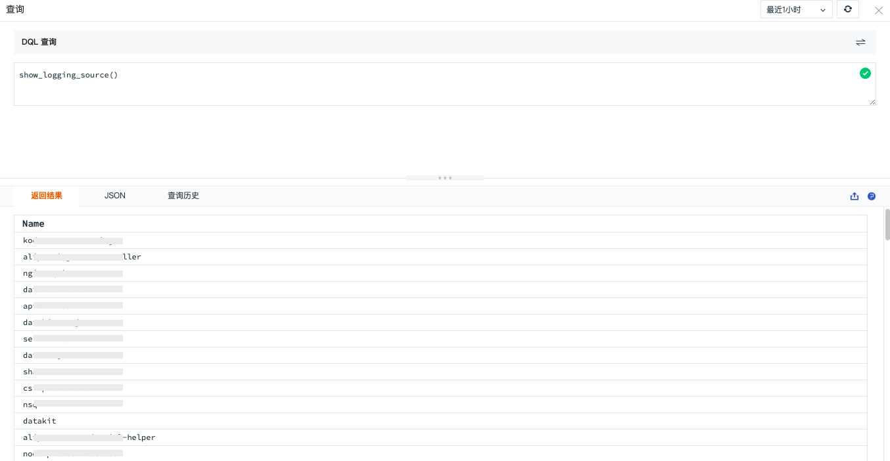

#### show_logging_field()

展示指定 `source` 下的所有 fileds 列表。<br />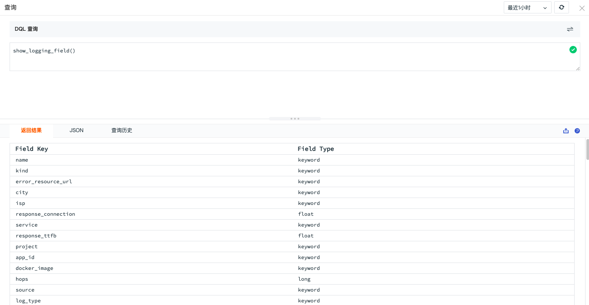


---


