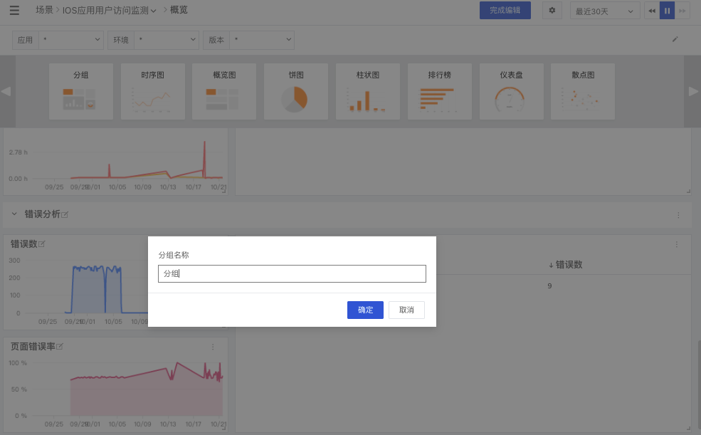
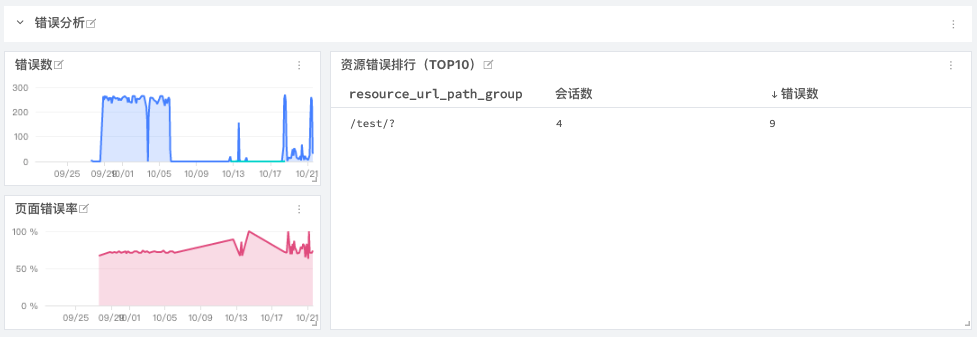

# 图表分组
---

## 简介

“观测云” 支持将场景视图的图表划分为不同的组别，帮助用户分类管理可视化图表，快速对比监测结果。

## 创建组合

开启图表「编辑模式」，在图表中选择「分组」，即可在节点视图中创建一个新的分组。

## 删除组合

在编辑模式下，在分组中选择「按钮」即可删除组合。支持仅删除分组，并保留原有图表进入默认分组下。

## 示例图

---

观测云是一款面向开发、运维、测试及业务团队的实时数据监测平台，能够统一满足云、云原生、应用及业务上的监测需求，快速实现系统可观测。**立即前往观测云，开启一站式可观测之旅：**[www.guance.com](https://www.guance.com)
