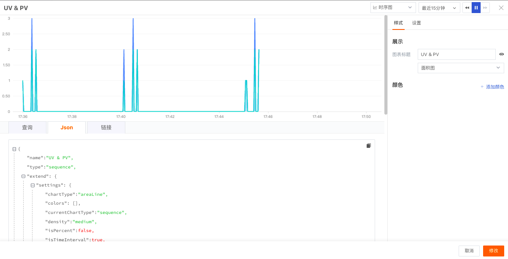

# 图表Json
---

通过场景仪表版「编辑」-「Json」可快速帮您洞察图表绘制详情。在编辑图表时，每一个正确的查询都对应一个json文本，支持复制粘贴，支持编辑Json并和查询/设置联动，支持对输入的Json进行校验，若有错误则显示错误提示。

---

观测云是一款面向开发、运维、测试及业务团队的实时数据监测平台，能够统一满足云、云原生、应用及业务上的监测需求，快速实现系统可观测。**立即前往观测云，开启一站式可观测之旅：**[www.guance.com](https://www.guance.com)

