# 图表查询
---

## 简介

在编辑图表时，您可以依据选择的图表类型，进行图表查询以及其他图表设置。图表查询是指依据用户自定义的数据查询以可视化布局显示数值数据并揭露重要数据关系的图形。每一个正确的查询都对应一个json文本，支持工作台内的 json文本和图表查询可互相解析，帮助您洞察图表绘制详情。

## 数据查询

单个图表同时支持展示多条查询，包括「简单查询」、「表达式查询」、「DQL查询」。点击「添加简单查询」、「添加表达式查询」即可添加一个新的查询。「简单查询」和「DQL查询」可通过按钮相互切换。对于单查询图表如概览图、仪表盘、排行榜，「简单查询」可直接转换为「表达式查询」。 注意：「DQL查询」切换成「简单查询」时，若无法解析或者解析不完整：

- 在「简单查询」下未操作，直接切换回「DQL查询」则显示之前的 DQL 查询语句；
- 在「简单查询」下调整了查询语句，再次切换回「DQL查询」将按照最新的「简单查询」进行解析。

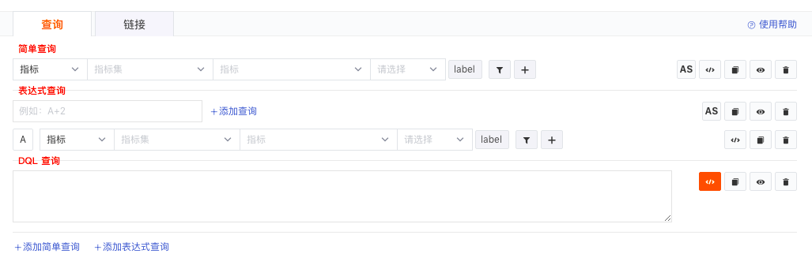

### 简单查询

简单查询支持对不同数据源的数据进行查询，并通过选择聚合函数、分组标签、label 、筛选条件等进行图表展示。

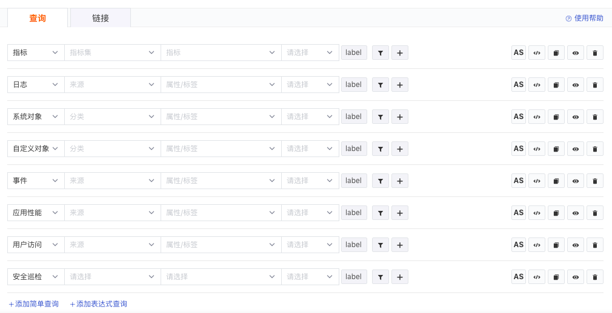

#### 数据源

数据源包括来自指标、日志、系统对象、自定义对象、事件、应用性能、用户访问和安全巡检的一系列数据组合。

| 选项 | 说明 |
| --- | --- |
| 指标 | 需要选择「指标集」和「指标」，一个指标集可包含多个指标，基础函数默认选中「Last by」。结合图表类型，选择想要展示的指标进行查询。 |
| 日志/系统对象/自定义对象/事件/应用性能/用户访问/安全巡检 | 系统对象、自定义对象和安全巡检需要选择「分类」和「属性/标签」，日志/事件/应用性能/用户访问需要选择「来源」和「属性/标签」，基础函数默认选中「Count by」。 |

#### 分组

分组查询支持选择不同的 “标签” 进行分组查询，数据按所选的标签项进行分组展示，支持选择多个标签（不超过三个）进行查询。

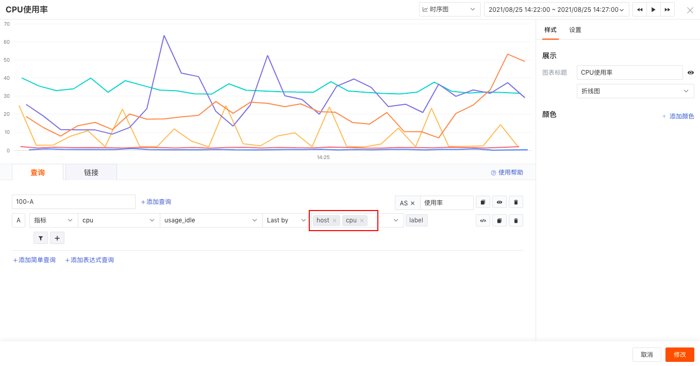

#### label

支持选择主机 label 属性进行筛选显示，在图表查询中选择 label 之前，需在「基础设施」-「主机」中为主机设置 label 属性。如下图，点击“+”，输入label 属性“production” ，可发现有两台主机的数据。有关主机 label 设置可参考文档 [主机](https://www.yuque.com/dataflux/doc/mwqbgr#MP3rm) 。

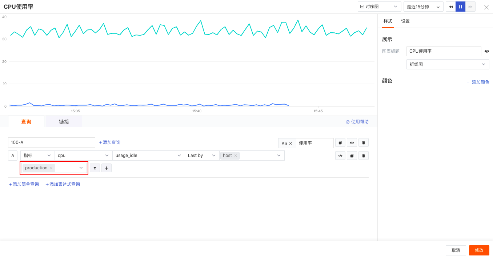

#### 筛选

支持通过标签进行筛选。点击「漏斗」图标，即可为该查询添加筛选条件，支持添加多个筛选条件，每个筛选条件之间可以有「并且」和「或」两种取值方式。

**注意：筛选条件内容中的「#{host}」为视图变量，详情参考文档 **[**视图变量**](https://www.yuque.com/dataflux/doc/mgpxkf)** 。**

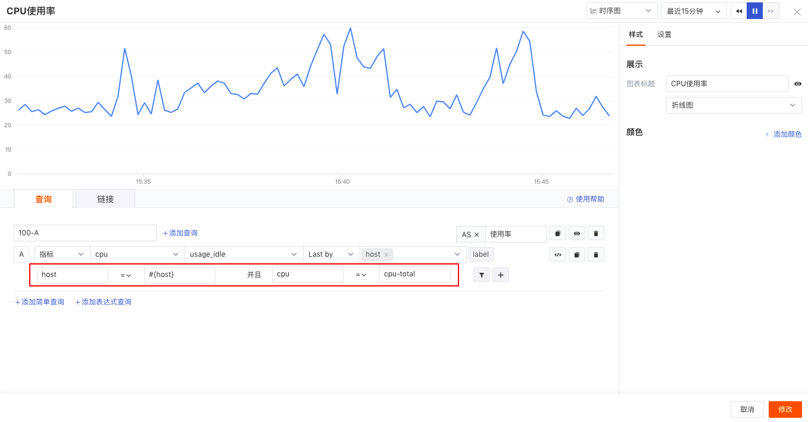

#### 函数

支持通过函数计算指标等数据源。点击「+」图标，即可为该查询添加函数，支持添加多个函数。

##### 聚合函数

UI 模式下支持选择如下聚合方式返回结果值，在DQL模式下支持更多的聚合函数，可参考 [DQL聚合函数](https://www.yuque.com/dataflux/doc/ziezwr#f0c291d2)。

| 聚合函数 | 说明 |
| --- | --- |
| last | 返回最新时间戳的值 |
| first | 返回最早时间戳的值 |
| avg | 返回字段的平均值。参数有且只有一个，参数类型是字段名 |
| min | 返回最小值 |
| max | 返回最大值 |
| sum | 返回字段值的和 |
| P50 | 返回第百分之 50 的字段值 |
| P75 | 返回第百分之 75 的字段值 |
| P90 | 返回第百分之 90 的字段值 |
| P99 | 返回第百分之 99 的字段值 |
| count | 返回非空字段值的汇总值 |
| count_distinct | 统计字段不同值的数量 |
| difference | 返回一个字段中连续的时间值之间的差异 |
| derivative | 返回一个字段在一个series中的变化率 |
| non_negative_derivative | 返回在一个series中的一个字段中值的变化的非负速率 |

##### 转换函数

这里的转换函数又称为外层函数，UI 模式下支持选择的函数如下所示，在DQL模式中支持更多的外部函数，可参考 [DQL外层函数](https://www.yuque.com/dataflux/doc/wgrf10#288ae864)。

| 转换函数（外层函数） | 说明 |
| --- | --- |
| cumsum | 对处理集累计求和 |
| abs |  计算处理集每个元素的绝对值 |
| log2 | 计算处理集每个元素以 2 为底数的对数，处理集至少大于一行，否则返回空值 |
| log10 | 计算处理集每个元素以 10 为底数的对数，处理集至少大于一行，否则返回空值 |
| moving_average  | 计算处理集的移动平均值，窗口的大小需要不小于处理集的行数，否则返回空值 |
| difference | 计算处理集相邻元素的差值，处理集至少大于一行，否则返回空值 |
| derivative | 计算处理集相邻元素的导数，求导的时间单位为秒（s） |
| non_negative_derivative | 计算处理集相邻元素的非负导数，求导的时间单位为秒（s） |
| non_negative_difference | 计算处理集相邻元素的非负差值，处理集至少大于一行，否则返回空值 |
| series_sum | 当分组产生多个 series, 根据时间点，合并为1个series。其中，相同时间点的多个 series 求和，处理集至少大于一行，否则返回空值 |
| rate |  计算某个指标一定时间范围内的变化率，适合缓慢变化的计数器。时间单位为秒（s） |
| irate | 计算某个指标一定时间范围内的变化率，适合快速变化的计数器，时间单位为秒（s） |

##### 窗口函数

支持以选定的时间间隔为窗口（记录集合），结合聚合函数对每条记录都执行统计计算，支持选择1分钟、5分钟、15分钟、30分钟、1小时、3小时等。 注意：窗口函数查询结果并不会改变记录条数，当前存在的记录数量在执行完函数结果后，仍保持之前的记录数量。

##### 无数据填充

支持设定空值数据的填充方式，设定后在查询中显示为「fill」，包括三种类型：

| 函数 | 说明 |
| --- | --- |
| 前值填充（previous） | 前值填充是将空值数据转为上一个数值举例：  |
| 线性填充（linear） | 线性填充是将空值数据进行线性函数计算后填充 |
| 数值填充 | 数值填充是可自定义填充数值 |

#### 别名

支持添加自定义名称，点击「AS」，即可添加别名。

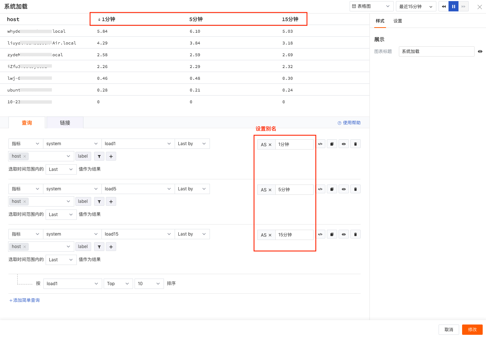

#### 隐藏查询

点击「隐藏」图标，即可隐藏图表上的该条查询结果。从下图可以看出，系统加载数据只显示1分钟和15分钟的查询结果，5分钟的系统加载查询结果已经被隐藏，无法在图表上查看。

#### 复制查询

点击“复制”图标，即可复制该条查询。

#### 删除查询

点击“删除”图标，即可删除该条查询。

### DQL查询

在图表查询过程中，当简单查询已无法满足您的需求时，你可以切换到 DQL模式。点击「</>」，手动输入 DQL语句进行图表查询，任意点击屏幕即可执行查询语句并刷新图表，系统将提示错误的DQL查询语句。

DQL 是专为观测云开发的语言，一个图表同时支持多条 DQL查询。详情参见 [DQL查询](https://www.yuque.com/dataflux/doc/fsnd2r) 。

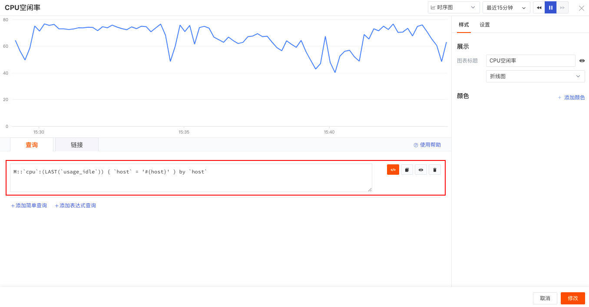

### 表达式查询

表达式查询通过添加表达式进行计算。若表达式查询中包含多个查询语句，分组标签需保持一致。在表达式计算中，若查询 A 带单位，查询 A 与数字的运算结果同样带单位。例如：A 的单位是 KB，那么A+100的单位也是 KB。

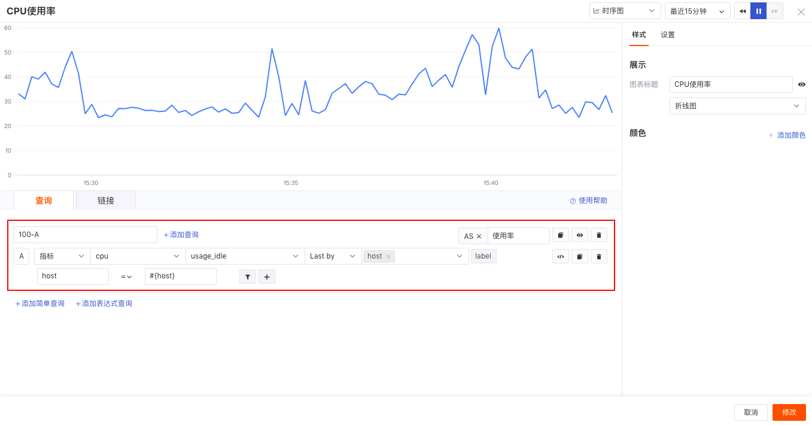

## 图表千分位

观测云仪表板图表查询结果支持自动加上数据千分位格式显示。

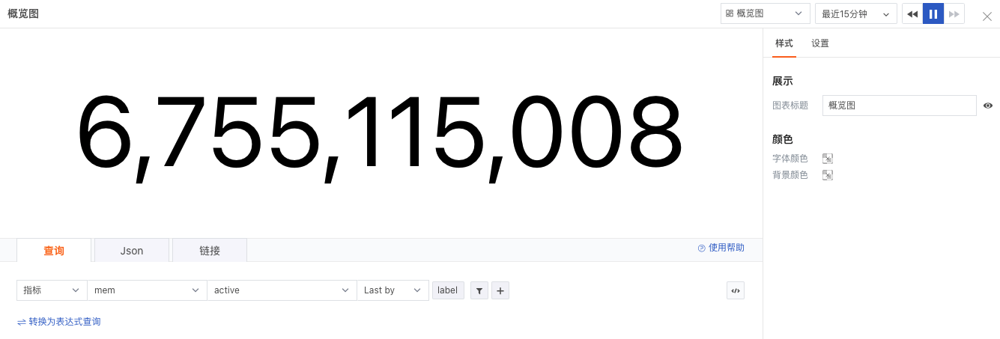

若设置了单位，则按照设置的单位显示数据格式。

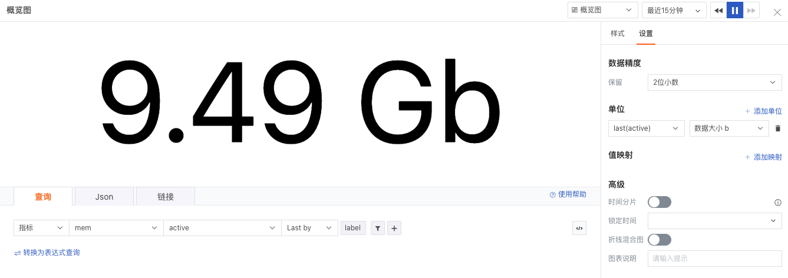

设置完成后可以在预览的情况下按照千分位数据格式显示，若设置单位则按照单位设置格式显示。

- 千分位数据格式显示

- 设置的数据格式显示

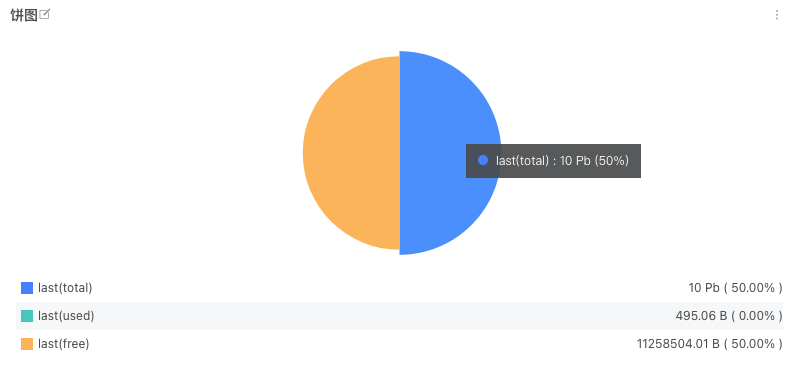

---

观测云是一款面向开发、运维、测试及业务团队的实时数据监测平台，能够统一满足云、云原生、应用及业务上的监测需求，快速实现系统可观测。**立即前往观测云，开启一站式可观测之旅：**[www.guance.com](https://www.guance.com)
