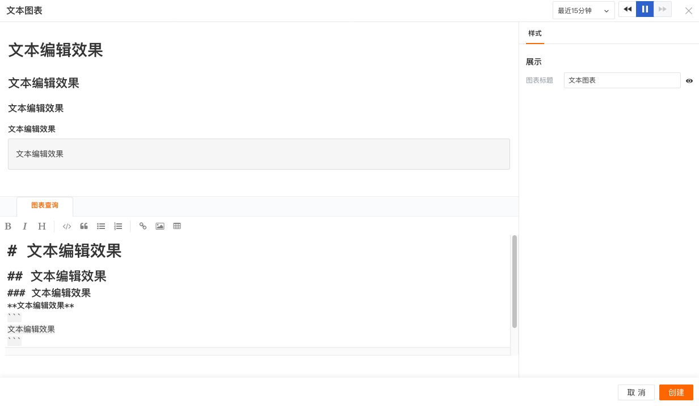

# 文本
---

## 简介

文本一般用于提示、说明，您可以文本中添加文字、图像、超链接等。

**注意：文档为 markdown 格式**

## 图表样式
| 选项 | 说明 |
| --- | --- |
| 图表标题 | 为图表设置标题名称，设置完成后，在图表的左上方显示，支持隐藏 |

## 示例图

---

观测云是一款面向开发、运维、测试及业务团队的实时数据监测平台，能够统一满足云、云原生、应用及业务上的监测需求，快速实现系统可观测。**立即前往观测云，开启一站式可观测之旅：**[www.guance.com](https://www.guance.com)
