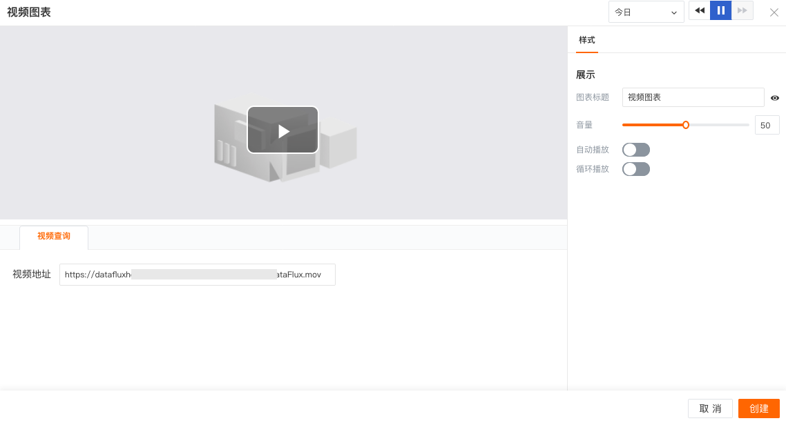

# 视频
---

## 简介

“观测云” 支持添加视频至视图中，可用于教程、说明等等。填入视频地址即可，上方可实时预览视频详情。

## 图表样式
| 选项 | 说明 |
| --- | --- |
| 图表标题 | 为图表设置标题名称，设置完成后，在图表的左上方显示，支持隐藏 |
| 音量 | 设置视频音量大小 |
| 自动播放 | 设置视频是否自动播放 |
| 循环播放 | 设置视频是否循环播放 |

## 示例图

---

观测云是一款面向开发、运维、测试及业务团队的实时数据监测平台，能够统一满足云、云原生、应用及业务上的监测需求，快速实现系统可观测。**立即前往观测云，开启一站式可观测之旅：**[www.guance.com](https://www.guance.com)
