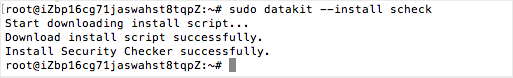
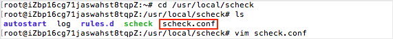
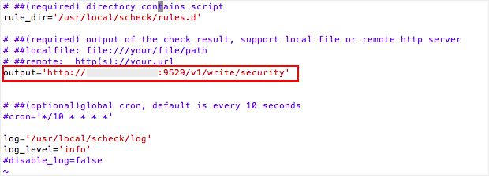
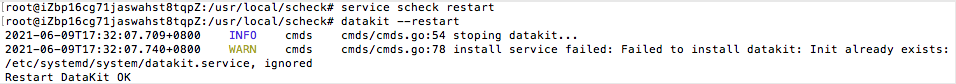
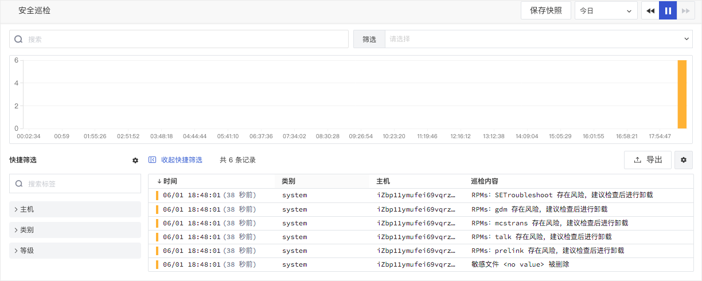

# 数据采集
---


## 简介

“观测云” 支持采集主机、系统、容器、网络等存在的漏洞和异常，并上报到工作空间。

## 前置条件

- 安装 DataKit（[DataKit 安装文档](https://www.yuque.com/dataflux/datakit/datakit-install)）

## 数据采集

Datakit 可以直接接入 Security Checker 的数据。复制 Security Checker 的安装指令到服务器中执行安装，安装完成后，可进入默认安装目录，打开配置文件进行配置，配置完成后，重启 DataKit 即可生效。更多详情可参考文档 [Security Checker接入](https://www.yuque.com/dataflux/datakit/sec-checker)。

## 字段说明
| 字段名 | 说明 |
| --- | --- |
| date | 时间单位：微秒 |
| rule | 规则 |
| host | 主机名称 |
| category | 事件分类，包括：`network`，`storage`，`database`，`system`，`webserver`，`Kubernetes` |
| level | 巡检事件等级，支持：`info`，`warn`，`critical` |
| title | 巡检事件的标题 |
| message | 巡检事件内容 |
| suggestion | 建议内容，包括说明、风险、影响、审计、补救措施等 |


## 示例说明
### 1. 安装 DataKit
在“观测云”工作空间「集成」-「DataKit」，选择DataKit安装方式，获取「安装指令」在主机执行。


### 2. 安装安全巡检采集器
在主机上执行如下命令安装安全巡检采集器。

```shell
$ sudo datakit --install scheck
```



### 3. 配置安全巡检采集器
配置巡检结果输出到 DataKit，在`/usr/local/scheck`目录下，编辑配置文件`scheck.conf`。



确认 output 配置是否默认将数据发送给DataKit接口。



### 4. 重启安全巡检采集器
重启安全巡检和DataKit，分别执行命令 `service scheck restart` 和 `datakit --restart` 。



更多安全巡检安装和配置可参考文档 [Security Checker  安装和配置](https://www.yuque.com/dataflux/datakit/sec-checker)。

### 5. 在“观测云”工作空间查看安全巡检数据
安装、配置、重启完安全巡检采集器后，即可在“观测云”工作空间的「安全巡检」，查看到主机根据安全脚本触发的巡检事件。




---

观测云是一款面向开发、运维、测试及业务团队的实时数据监测平台，能够统一满足云、云原生、应用及业务上的监测需求，快速实现系统可观测。**立即前往观测云，开启一站式可观测之旅：**[www.guance.com](https://www.guance.com)

