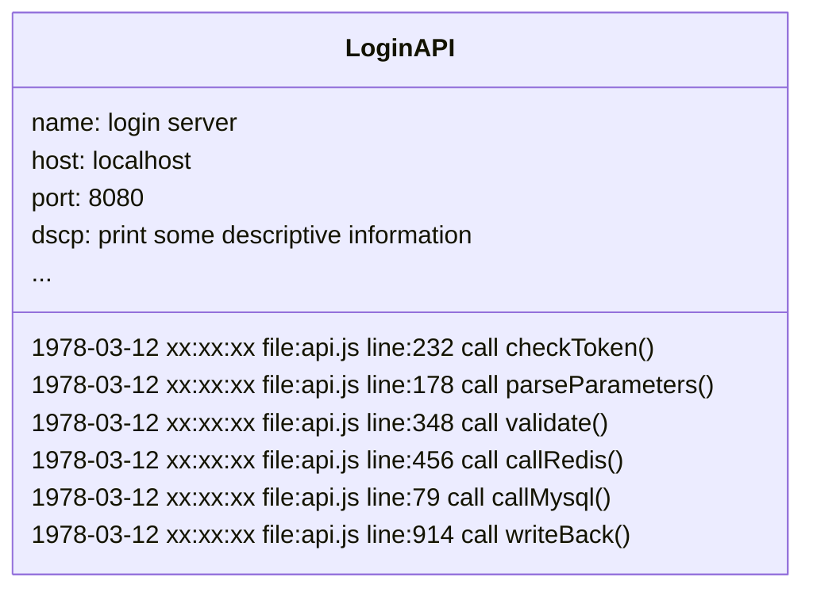
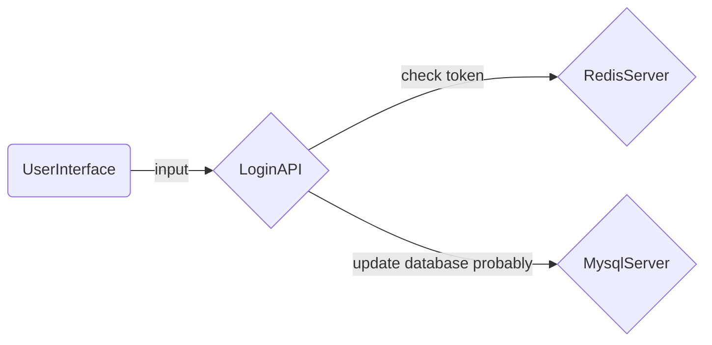

Program logs are the breadcrumbs of code execution, and following these breadcrumbs not only helps find hidden bugs in the code :fontawesome-solid-bug: but more importantly, continuous program logs provide a way to observe the execution process of a program.

## Starting with Logs {#log}

> Logs Only

Before tracing systems emerged, our only way to obtain system operation status was through local logs. In fact, before tracing systems, log services had undergone several generations of different product iterations.

By directing standard output and standard error output to a local file and leveraging the power of the operating system, ideally, we could get an endless stream of program execution logs. As long as the system doesn’t crash, there are no single points of failure, and no processes interrupt your file write stream, you can always obtain an execution process file for the process and search for events of interest in a large file.

## Before Tracing Systems {#befor}

> Log Servers

The importance of program logs led to the emergence of dedicated log servers. Yes, no need to worry about SPoF anymore; log servers continuously record program logs sent by processes on fixed ports.

In the early stages of log servers, their working methods were more like file servers, except that the interface changed from a terminal to a browser, and searchable logs expanded from a single program to multiple programs. However, the recorded logs were still just stacks of process execution order records, as shown in the simulated login server logs below.

From log texts, you can only see isolated program events, making it difficult to understand the program's operational state from a single execution document. In the later stages of file servers, specialized UIs for log viewing and a series of program runtime environment status parameters appeared. During this phase, log services resembled database services built on log files, allowing smoother searches for events of interest.

## Tracing Systems {#tracing}

> The Rise of Observability

A tracing system is not a higher-level log service and does not belong to the logging domain, but it is the true breadcrumb. Tracing systems generate execution state data structures (Spans) during process execution. As the processing flow progresses, numerous Spans connect in the order of execution to form the current process’s trace (Tracing). Multiple processes connected in their invocation order form the observable execution state of the current system.

Still using a fictional login service as an example:

The diagram above only shows the trace graph generated by a tracing system across multiple processes. In reality, within a tracing system, you can also see the state of each execution process similar to logs. If you want, you can customize the fields in the reported state data structure (Span) and give them meaning. Tracing systems are not for debugging (although bugs cannot hide in a tracing system); they provide detailed depictions of system operational states to identify system issues and offer positive feedback mechanisms to improve system versions iteratively.

Tracing systems primarily address two levels of problems:

- How to collect state data

Based on the technology stack of the monitored system, common [tracing system solutions](datakit-tracing-introduction.md#sln) in the market provide both automated and manual data collection methods. By monitoring the runtime of programs, such as NodeJS, JAVA, C#, etc., all implementations based on these technology stacks can be automatically traced. Additionally, tracing systems provide Tracing Libraries for all technology stacks, enabling full manual tracing by introducing dependencies into projects and making simple code edits.

- How to organize state data

The natural caller-callee relationships in program execution lead all tracing systems to define state data structures in parent-child relationships. Using ParentID and ID, the Span generated by the caller and callee is associated. Within the same process, different invocation processes (including threads in concurrent environments) are linked by passing contexts containing the caller ID. Between different processes, callers send contexts containing their own IDs between processes (via network or inter-process communication channels) to associate parent and child processes.

## Tracing System Solutions {#sln}

Application Performance Monitoring (APM) markets require tracing capabilities. Here are brief introductions to some common solutions:

[DataDog](https://docs.datadoghq.com/tracing/){:target="_blank"}

: Currently the most comprehensive APM solution provider, offering monitoring and deep visualization capabilities for production environments. It provides out-of-the-box performance monitoring dashboards for web services, message queues, databases, and more to monitor all program events. Tracing data can seamlessly correlate across services, containers, sessions, logs, system profiles, comprehensive detection, networks, processes, and system base Metrics. In DataDog, you can directly locate problematic code when investigating slow traces caused by system bottlenecks.

[Jaeger](https://www.jaegertracing.io/docs/){:target="_blank"}

: Jaeger is an open-source distributed tracing system inspired by Dapper and OpenZipkin, released by Uber Technologies, especially suitable for monitoring microservices-based systems, providing the following capabilities:
: - Distributed context propagation
: - Distributed transaction monitoring
: - Root cause analysis
: - Service dependency analysis
: - Performance optimization
: If interested in Jaeger, refer to the Uber tech team's [internal practices](https://www.uber.com/blog/distributed-tracing/){:target="_blank"}.

[OpenTelemetry](https://opentelemetry.io/docs/){:target="_blank"}

: OpenTelemetry (OTEL) is an open-source observability framework developed based on third-party tracing protocols, providing telemetry, generation, collection, and export of monitoring data such as tracing, Metrics, and logs. As an industry standard, it is natively supported by many service providers.

[SkyWalking](https://skywalking.apache.org/docs/){:target="_blank"}

: SkyWalking is an open-source APM system that provides monitoring, tracing, diagnostics, and other capabilities for distributed cloud-native systems. Core features include:
: - Server-side Metrics analysis
: - Root cause analysis
: - Service Map analysis
: - Service dependency analysis
: - Slow service discovery
: - Performance optimization
: - Cache monitoring, read/write performance, and slow access discovery
: - Database monitoring, slow query discovery
: - Message queue performance monitoring
: - Browser performance monitoring, root tracing capability
: - Infrastructure monitoring support for mainstream cloud providers
: - System alerting

[Zipkin](https://zipkin.io/pages/quickstart.html){:target="_blank"}

: Zipkin is a distributed tracing system used to collect time-series data to achieve system monitoring and discover service-level system issues. Zipkin provides integrated solutions for data collection and querying. You can jump directly from logs to traces in the Zipkin UI based on a TraceID and offers diverse data retrieval capabilities.

[Datakit](https://docs.guance.com/datakit/datakit-tracing/){:target="_blank"}

: Unlike the aforementioned tracing systems, Datakit itself does not generate any program execution state data (Spans) nor alter the data organization. Datakit listens on network ports to receive trace data from major mainstream tracing systems. Datakit's tracing module not only offers out-of-the-box capabilities but is almost zero-config. Users can seamlessly transition from any other tracing system to Datakit.

: As a trace data processing and analysis network service, Datakit has the following characteristics:

: - Datakit can handle high-load traffic data, maintaining low CPU usage even under heavy loads due to its multi-path local caching technology.
: - Datakit can operate efficiently in high-concurrency network request environments, using access policies and thread pools to handle high concurrency while keeping CPU usage low.
: - Datakit can seamlessly integrate with various mainstream tracing systems currently available and is expanding its compatibility.

: As an analytical tool, Datakit has the following features:

: - Highly configurable flexibility; you can use Datakit's tracing capabilities without configuration or enable various tracing computing capabilities provided by Datakit, including sampling, rare trace picking, resource shutdown, etc., with simple configurations.
: - Efficient and distributed consistent sampling algorithms.
: - Various front-end data processing Filters to meet daily data processing needs.
: - Back-end Pipeline support allows you to customize data processing using [Guance's powerful Pipeline scripts](https://docs.guance.com/logs/pipelines/text-processing/){:target="_blank"} before sending data to the center.

## Conclusion {#conclude}

Tracing systems provide multi-dimensional, in-depth visualization of system execution states. They have changed system maintenance and development models, significantly reducing development and operations costs while providing various analytical tools to identify system bottlenecks and valuable clues for subsequent system version iterations.