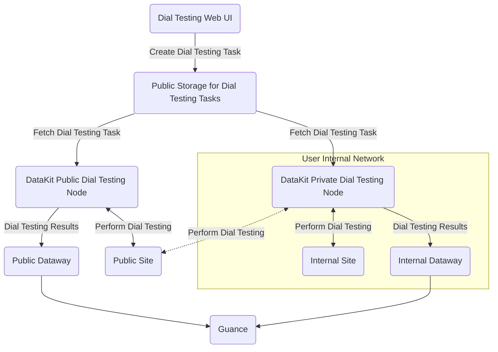

:fontawesome-brands-linux: :fontawesome-brands-apple: :material-kubernetes: :material-docker:

---

This collector gathers data from network dial testing results. All data generated by dial testing is reported to Guance.

## Configuration {#config}

<!-- markdownlint-disable MD046 -->
=== "Host Installation"

    For private dial testing node deployment, you need to [create a private dial testing node on the Guance page](../usability-monitoring/self-node.md). After creation, fill in the relevant information from the page into `conf.d/network/dialtesting.conf`:

    Enter the `conf.d/network` directory under the DataKit installation directory, copy `dialtesting.conf.sample`, and rename it to `dialtesting.conf`. Example configuration as follows:
    
    ```toml
        
    [[inputs.dialtesting]]
      # We can also configure a JSON path like "file:///your/dir/json-file-name"
      server = "https://dflux-dial.guance.com"
    
      # [require] node ID
      region_id = "default"
    
      # If the server is dflux-dial.guance.com, ak/sk are required
      ak = ""
      sk = ""
    
      # The interval to pull the tasks.
      pull_interval = "1m"
    
      # The timeout for the HTTP request.
      time_out = "30s"
    
      # The number of workers.
      workers = 6
    
      # Collect related metrics when job execution time error interval is larger than task_exec_time_interval
      task_exec_time_interval = "5s"
     
      # Stop the task when the task fails to send data to DataWay over max_send_fail_count.
      max_send_fail_count = 16
    
      # The maximum sleep time when sending data to DataWay fails.
      max_send_fail_sleep_time = "30m"
    
      # The maximum number of jobs sending data to DataWay in parallel. Default 10.
      max_job_number = 10
    
      # The maximum number of job channels. Default 1000.
      max_job_chan_number = 1000
    
      # Disable internal network tasks.
      disable_internal_network_task = true
    
      # Disable internal network CIDR list.
      disabled_internal_network_cidr_list = []
    
      # Custom tags.
      [inputs.dialtesting.tags]
      # some_tag = "some_value"
      # more_tag = "some_other_value"
      # ...
    ```

    After configuration, [restart DataKit](../datakit/datakit-service-how-to.md#manage-service).

=== "Kubernetes"

    You can inject the collector configuration via [ConfigMap](../datakit/datakit-daemonset-deploy.md#configmap-setting) or enable the collector by [configuring ENV_DATAKIT_INPUTS](../datakit/datakit-daemonset-deploy.md#env-setting).

    Environment variables can also be used to modify configuration parameters (requires adding to ENV_DEFAULT_ENABLED_INPUTS as default collectors):

    - **ENV_INPUT_DIALTESTING_ENV_INPUT_DIALTESTING_DISABLE_INTERNAL_NETWORK_TASK**
    
        Whether to allow internal network addresses/services to be tested. Default is not allowed.
    
        **Field Type**: Boolean
    
        **Collector Configuration Field**: `disable_internal_network_task`
    
        **Example**: `true`
    
        **Default Value**: `false`
    
    - **ENV_INPUT_DIALTESTING_ENV_INPUT_DIALTESTING_DISABLED_INTERNAL_NETWORK_CIDR_LIST**
    
        List of CIDR addresses that are prohibited from being tested.
    
        **Field Type**: List
    
        **Collector Configuration Field**: `disabled_internal_network_cidr_list`
    
        **Example**: `["192.168.0.0/16"]`
    
        **Default Value**: `-`
    
    - **ENV_INPUT_DIALTESTING_ENV_INPUT_DIALTESTING_ENABLE_DEBUG_API**
    
        Prohibit dial testing debug API (default prohibited)
    
        **Field Type**: Boolean
    
        **Collector Configuration Field**: `env_input_dialtesting_enable_debug_api`
    
        **Example**: `false`
    
        **Default Value**: `false`

---

???+ attention

    Currently, only Linux dial testing nodes support "route tracing", and the trace data will be saved in the [`traceroute`](dialtesting.md#fields) field of the related metrics.
<!-- markdownlint-enable -->

### Dial Testing Node Deployment {#arch}

The following diagram shows the network topology for deploying dial testing nodes. There are two ways to deploy dial testing nodes:

- Public Network Dial Testing Nodes: Directly use the globally deployed dial testing nodes provided by Guance to monitor services on the public internet.
- Private Network Dial Testing Nodes: If you need to test services within your **internal network**, you must deploy **private** dial testing nodes yourself. Of course, if the network allows, these private dial testing nodes can also test services on the public internet.

Regardless of whether they are public or private dial testing nodes, they can all create dial testing tasks through the web interface.



## Logging {#logging}

### `http_dial_testing`

- Tags


| Tag | Description |
| ---- | --------|
|`city`|Name of the city|
|`country`|Name of the country|
|`datakit_version`|DataKit version|
|`dest_ip`|IP address of the destination|
|`df_label`|Label of the task|
|`internal`|Boolean value, true for domestic and false for overseas|
|`isp`|ISP, such as `chinamobile`, `chinaunicom`, `chinatelecom`|
|`method`|HTTP method, such as `GET`|
|`name`|Name of the task|
|`node_name`|Name of the node|
|`owner`|Owner name|
|`proto`|Protocol of the HTTP, such as 'HTTP/1.1'|
|`province`|Name of the province|
|`status`|Status of the task, either 'OK' or 'FAIL'|
|`status_code_class`|Class of the status code, such as '2xx'|
|`status_code_string`|Status string, such as '200 OK'|
|`url`|URL of the endpoint to be monitored|

- Metrics List


| Metric | Description | Type | Unit |
| ---- |---- | :---:    | :----: |
|`config_vars`|Configuration variables of the task|string|-|
|`fail_reason`|Reason leading to the failure of the task|string|-|
|`message`|Message string which includes the header and body of the request or response|string|-|
|`response_body_size`|Length of the response body|int|B|
|`response_connection`|HTTP connection time|float|μs|
|`response_dns`|HTTP DNS parsing time|float|μs|
|`response_download`|HTTP downloading time|float|μs|
|`response_ssl`|HTTP SSL handshake time|float|μs|
|`response_time`|Response time|int|μs|
|`response_ttfb`|HTTP response `ttfb`|float|μs|
|`seq_number`|Sequence number of the test|int|count|
|`status_code`|Response code|int|-|
|`success`|Number specifying success, 1 for success, -1 for failure|int|-|
|`task`|Raw task string|string|-|


### `tcp_dial_testing`

- Tags


| Tag | Description |
| ---- | --------|
|`city`|Name of the city|
|`country`|Name of the country|
|`datakit_version`|DataKit version|
|`dest_host`|Name of the host to be monitored|
|`dest_ip`|IP address|
|`dest_port`|Port of the TCP connection|
|`df_label`|Label of the task|
|`internal`|Boolean value, true for domestic and false for overseas|
|`isp`|ISP, such as `chinamobile`, `chinaunicom`, `chinatelecom`|
|`name`|Name of the task|
|`node_name`|Name of the node|
|`owner`|Owner name|
|`proto`|Protocol of the task|
|`province`|Name of the province|
|`status`|Status of the task, either 'OK' or 'FAIL'|

- Metrics List


| Metric | Description | Type | Unit |
| ---- |---- | :---:    | :----: |
|`config_vars`|Configuration variables of the task|string|-|
|`fail_reason`|Reason leading to the failure of the task|string|-|
|`message`|Message string including response time or fail reason|string|-|
|`response_time`|Response time|int|μs|
|`response_time_with_dns`|Response time including DNS time|int|μs|
|`seq_number`|Sequence number of the test|int|count|
|`success`|Number specifying success, 1 for success, -1 for failure|int|-|
|`task`|Raw task string|string|-|
|`traceroute`|JSON string of the `traceroute` result|string|-|


### `icmp_dial_testing`

- Tags


| Tag | Description |
| ---- | --------|
|`city`|Name of the city|
|`country`|Name of the country|
|`datakit_version`|DataKit version|
|`dest_host`|Name of the host to be monitored|
|`df_label`|Label of the task|
|`internal`|Boolean value, true for domestic and false for overseas|
|`isp`|ISP, such as `chinamobile`, `chinaunicom`, `chinatelecom`|
|`name`|Name of the task|
|`node_name`|Name of the node|
|`owner`|Owner name|
|`proto`|Protocol of the task|
|`province`|Name of the province|
|`status`|Status of the task, either 'OK' or 'FAIL'|

- Metrics List


| Metric | Description | Type | Unit |
| ---- |---- | :---:    | :----: |
|`average_round_trip_time`|Average round trip time(RTT)|float|μs|
|`average_round_trip_time_in_millis`|Average round trip time(RTT), deprecated|float|ms|
|`config_vars`|Configuration variables of the task|string|-|
|`fail_reason`|Reason leading to the failure of the task|string|-|
|`max_round_trip_time`|Maximum round trip time(RTT)|float|μs|
|`max_round_trip_time_in_millis`|Maximum round trip time(RTT), deprecated|float|ms|
|`message`|Message string including average round trip time or failure reason|string|-|
|`min_round_trip_time`|Minimum round trip time(RTT)|float|μs|
|`min_round_trip_time_in_millis`|Minimum round trip time(RTT), deprecated|float|ms|
|`packet_loss_percent`|Packet loss percentage|float|-|
|`packets_received`|Number of packets received|int|count|
|`packets_sent`|Number of packets sent|int|count|
|`seq_number`|Sequence number of the test|int|count|
|`std_round_trip_time`|Standard deviation of the round trip|float|μs|
|`std_round_trip_time_in_millis`|Standard deviation of the round trip, deprecated|float|ms|
|`success`|Number specifying success, 1 for success, -1 for failure|int|-|
|`task`|Raw task string|string|-|
|`traceroute`|JSON string of the `traceroute` result|string|-|


### `websocket_dial_testing`

- Tags


| Tag | Description |
| ---- | --------|
|`city`|Name of the city|
|`country`|Name of the country|
|`datakit_version`|DataKit version|
|`df_label`|Label of the task|
|`internal`|Boolean value, true for domestic and false for overseas|
|`isp`|ISP, such as `chinamobile`, `chinaunicom`, `chinatelecom`|
|`name`|Name of the task|
|`node_name`|Name of the node|
|`owner`|Owner name|
|`proto`|Protocol of the task|
|`province`|Name of the province|
|`status`|Status of the task, either 'OK' or 'FAIL'|
|`url`|URL string, such as `ws://www.abc.com`|

- Metrics List


| Metric | Description | Type | Unit |
| ---- |---- | :---:    | :----: |
|`config_vars`|Configuration variables of the task|string|-|
|`fail_reason`|Reason leading to the failure of the task|string|-|
|`message`|Message string including response time or failure reason|string|-|
|`response_message`|Response message|string|-|
|`response_time`|Response time|int|μs|
|`response_time_with_dns`|Response time including DNS|int|μs|
|`sent_message`|Sent message|string|-|
|`seq_number`|Sequence number of the test|int|count|
|`success`|Number specifying success, 1 for success, -1 for failure|int|-|
|`task`|Raw task string|string|-|


### `multi_dial_testing`

- Tags


| Tag | Description |
| ---- | --------|
|`city`|Name of the city|
|`country`|Name of the country|
|`datakit_version`|DataKit version|
|`df_label`|Label of the task|
|`internal`|Boolean value, true for domestic and false for overseas|
|`isp`|ISP, such as `chinamobile`, `chinaunicom`, `chinatelecom`|
|`name`|Name of the task|
|`node_name`|Name of the node|
|`owner`|Owner name|
|`province`|Name of the province|
|`status`|Status of the task, either 'OK' or 'FAIL'|

- Metrics List


| Metric | Description | Type | Unit |
| ---- |---- | :---:    | :----: |
|`config_vars`|Configuration variables of the task|string|-|
|`fail_reason`|Reason leading to the failure of the task|string|-|
|`last_step`|Last step number executed|int|-|
|`message`|Message string which includes the header and body of the request or response|string|-|
|`response_time`|Response time|int|μs|
|`seq_number`|Sequence number of the test|int|count|
|`steps`|Result of each step|string|-|
|`success`|Number specifying success, 1 for success, -1 for failure|int|-|
|`task`|Raw task string|string|-|


### `traceroute` {#traceroute}

`traceroute` is the JSON text of "route tracing" data. The entire data is an array object, where each element records the relevant details of one route probe. Example as follows:

```json
[
    {
        "total": 2,
        "failed": 0,
        "loss": 0,
        "avg_cost": 12700395,
        "min_cost": 11902041,
        "max_cost": 13498750,
        "std_cost": 1129043,
        "items": [
            {
                "ip": "10.8.9.1",
                "response_time": 13498750
            },
            {
                "ip": "10.8.9.1",
                "response_time": 11902041
            }
        ]
    },
    {
        "total": 2,
        "failed": 0,
        "loss": 0,
        "avg_cost": 13775021,
        "min_cost": 13740084,
        "max_cost": 13809959,
        "std_cost": 49409,
        "items": [
            {
                "ip": "10.12.168.218",
                "response_time": 13740084
            },
            {
                "ip": "10.12.168.218",
                "response_time": 13809959
            }
        ]
    }
]
```

**Field Descriptions:**

| Field       | Type          | Description                        |
| :---       | ---           | ---                         |
| `total`    | number        | Total number of probes                  |
| `failed`   | number        | Number of failures                    |
| `loss`     | number        | Failure percentage                  |
| `avg_cost` | number        | Average latency (μs)                |
| `min_cost` | number        | Minimum latency (μs)                |
| `max_cost` | number        | Maximum latency (μs)                |
| `std_cost` | number        | Standard deviation of latency (μs)              |
| `items`    | Array of Items | Details of each probe (see below `items` field description) |

**`items` Field Description**

| Field            | Type   | Description                        |
| :---            | ---    | ---                         |
| `ip`            | string | IP address, `*` if failed |
| `response_time` | number | Response time (μs)                |

## Self-Monitoring Metrics Collection for Dial Testing Collector {#metric}

The dial testing collector exposes [Prometheus metrics](../datakit/datakit-metrics.md). If you need to report these metrics to Guance, you can collect them using the [DataKit collector](dk.md). Refer to the following configuration example:

```toml
[[inputs.dk]]
  ......

  metric_name_filter = [
  
  ### others...
  
  ### dialtesting
  "datakit_dialtesting_.*",

  ]

  ......
```