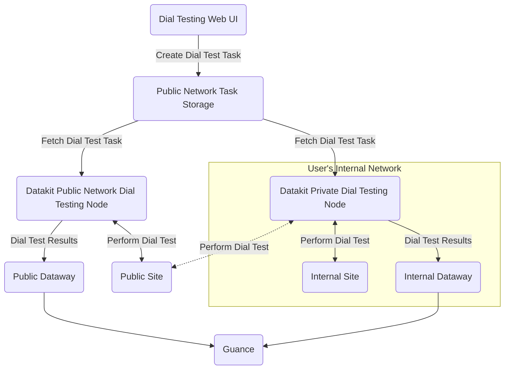

:fontawesome-brands-linux: :fontawesome-brands-apple: :material-kubernetes: :material-docker:

---

This collector gathers network dial testing results, and all generated data is reported to Guance.

## Configuration {#config}

<!-- markdownlint-disable MD046 -->
=== "Host Installation"

    For private dial testing node deployment, you need to create a private dial testing node on the [Guance page](../usability-monitoring/self-node.md). After creation, fill in the relevant information from the page into `conf.d/network/dialtesting.conf`:

    Navigate to the `conf.d/network` directory under the DataKit installation directory, copy `dialtesting.conf.sample` and rename it to `dialtesting.conf`. Example configuration is as follows:
    
    ```toml
    [[inputs.dialtesting]]
      # We can also configure a JSON path like "file:///your/dir/json-file-name"
      server = "https://dflux-dial.guance.com"
    
      # [require] node ID
      region_id = "default"
    
      # if server are dflux-dial.guance.com, ak/sk required
      ak = ""
      sk = ""
    
      # The interval to pull the tasks.
      pull_interval = "1m"
    
      # The timeout for the HTTP request.
      time_out = "30s"
    
      # The number of the workers.
      workers = 6
    
      # Collect related metric when job execution time error interval is larger than task_exec_time_interval
      task_exec_time_interval = "5s"
     
      # Stop the task when the task failed to send data to dataway over max_send_fail_count.
      max_send_fail_count = 16
    
      # The max sleep time when send data to dataway failed.
      max_send_fail_sleep_time = "30m"
    
      # The max number of jobs sending data to dataway in parallel. Default 10.
      max_job_number = 10
    
      # The max number of job chan. Default 1000.
      max_job_chan_number = 1000
    
      # Disable internal network task.
      disable_internal_network_task = true
    
      # Disable internal network cidr list.
      disabled_internal_network_cidr_list = []
    
      # Custom tags.
      [inputs.dialtesting.tags]
      # some_tag = "some_value"
      # more_tag = "some_other_value"
      # ...
    ```

    After configuration, [restart DataKit](../datakit/datakit-service-how-to.md#manage-service).

=== "Kubernetes"

    You can inject the collector configuration via [ConfigMap](../datakit/datakit-daemonset-deploy.md#configmap-setting) or [configure ENV_DATAKIT_INPUTS](../datakit/datakit-daemonset-deploy.md#env-setting) to enable the collector.

    Environment variables can also be used to modify configuration parameters (they need to be added as default collectors in ENV_DEFAULT_ENABLED_INPUTS):

    - **ENV_INPUT_DIALTESTING_ENV_INPUT_DIALTESTING_DISABLE_INTERNAL_NETWORK_TASK**
    
        Whether to allow dial testing of internal addresses/services. Default is not allowed
    
        **Field Type**: Boolean
    
        **Collector Configuration Field**: `disable_internal_network_task`
    
        **Example**: `true`
    
        **Default Value**: `false`
    
    - **ENV_INPUT_DIALTESTING_ENV_INPUT_DIALTESTING_DISABLED_INTERNAL_NETWORK_CIDR_LIST**
    
        List of CIDR addresses that are prohibited from dial testing
    
        **Field Type**: List
    
        **Collector Configuration Field**: `disabled_internal_network_cidr_list`
    
        **Example**: `["192.168.0.0/16"]`
    
        **Default Value**: `-`
    
    - **ENV_INPUT_DIALTESTING_ENV_INPUT_DIALTESTING_ENABLE_DEBUG_API**
    
        Prohibits the dial testing debug interface (default is prohibited)
    
        **Field Type**: Boolean
    
        **Collector Configuration Field**: `env_input_dialtesting_enable_debug_api`
    
        **Example**: `false`
    
        **Default Value**: `false`

---

???+ attention

    Currently, only Linux dial testing nodes support "route tracking," with tracking data saved in the [`traceroute`](dialtesting.md#fields) field of related metrics.
<!-- markdownlint-enable -->

### Dial Testing Node Deployment {#arch}

Below is the network deployment topology for dial testing nodes. There are two types of dial testing node deployments:

- Public Network Dial Testing Nodes: Use the public dial testing nodes deployed globally by Guance to monitor services on the **public network**.
- Private Network Dial Testing Nodes: If you need to test services within your **internal network**, you will need to deploy **private** dial testing nodes yourself. Of course, if the network allows, these private dial testing nodes can also be used to test services on the public network.

Regardless of whether they are public or private dial testing nodes, both can create dial testing tasks via the web interface.



## Logs {#logging}

### `http_dial_testing`

- Tags


| Tag | Description |
| ---- | --------|
|`city`|The name of the city|
|`country`|The name of the country|
|`datakit_version`|The DataKit version|
|`dest_ip`|The IP address of the destination|
|`df_label`|The label of the task|
|`internal`|The boolean value, true for domestic and false for overseas|
|`isp`|ISP, such as `chinamobile`, `chinaunicom`, `chinatelecom`|
|`method`|HTTP method, such as `GET`|
|`name`|The name of the task|
|`node_name`|The name of the node|
|`owner`|The owner name|
|`proto`|The protocol of the HTTP, such as 'HTTP/1.1'|
|`province`|The name of the province|
|`status`|The status of the task, either 'OK' or 'FAIL'|
|`status_code_class`|The class of the status code, such as '2xx'|
|`status_code_string`|The status string, such as '200 OK'|
|`url`|The URL of the endpoint to be monitored|

- Metrics List


| Metric | Description | Type | Unit |
| ---- |---- | :---:    | :----: |
|`fail_reason`|The reason leading to the failure of the task|string|-|
|`message`|The message string including the header and body of the request/response|string|-|
|`response_body_size`|The length of the response body|int|B|
|`response_connection`|HTTP connection time|float|μs|
|`response_dns`|HTTP DNS parsing time|float|μs|
|`response_download`|HTTP downloading time|float|μs|
|`response_ssl`|HTTP SSL handshake time|float|μs|
|`response_time`|Response time|int|μs|
|`response_ttfb`|HTTP response `ttfb`|float|μs|
|`seq_number`|Test sequence number|int|count|
|`status_code`|Response code|int|-|
|`success`|Indicator of success, 1 for success, -1 for failure|int|-|


### `tcp_dial_testing`

- Tags


| Tag | Description |
| ---- | --------|
|`city`|The name of the city|
|`country`|The name of the country|
|`datakit_version`|The DataKit version|
|`dest_host`|The name of the host to be monitored|
|`dest_ip`|The IP address|
|`dest_port`|The port of the TCP connection|
|`df_label`|The label of the task|
|`internal`|The boolean value, true for domestic and false for overseas|
|`isp`|ISP, such as `chinamobile`, `chinaunicom`, `chinatelecom`|
|`name`|The name of the task|
|`node_name`|The name of the node|
|`owner`|The owner name|
|`proto`|The protocol of the task|
|`province`|The name of the province|
|`status`|The status of the task, either 'OK' or 'FAIL'|

- Metrics List


| Metric | Description | Type | Unit |
| ---- |---- | :---:    | :----: |
|`fail_reason`|The reason leading to the failure of the task|string|-|
|`message`|The message string includes the response time or fail reason|string|-|
|`response_time`|Response time|int|μs|
|`response_time_with_dns`|Response time including DNS time|int|μs|
|`seq_number`|Test sequence number|int|count|
|`success`|Indicator of success, 1 for success, -1 for failure|int|-|
|`traceroute`|JSON string of the `traceroute` result|string|-|


### `icmp_dial_testing`

- Tags


| Tag | Description |
| ---- | --------|
|`city`|The name of the city|
|`country`|The name of the country|
|`datakit_version`|The DataKit version|
|`dest_host`|The name of the host to be monitored|
|`df_label`|The label of the task|
|`internal`|The boolean value, true for domestic and false for overseas|
|`isp`|ISP, such as `chinamobile`, `chinaunicom`, `chinatelecom`|
|`name`|The name of the task|
|`node_name`|The name of the node|
|`owner`|The owner name|
|`proto`|The protocol of the task|
|`province`|The name of the province|
|`status`|The status of the task, either 'OK' or 'FAIL'|

- Metrics List


| Metric | Description | Type | Unit |
| ---- |---- | :---:    | :----: |
|`average_round_trip_time`|Average round-trip time (RTT)|float|μs|
|`average_round_trip_time_in_millis`|Deprecated average round-trip time (RTT)|float|ms|
|`fail_reason`|Reason for task failure|string|-|
|`max_round_trip_time`|Maximum round-trip time (RTT)|float|μs|
|`max_round_trip_time_in_millis`|Deprecated maximum round-trip time (RTT)|float|ms|
|`message`|Message string including average round-trip time or failure reason|string|-|
|`min_round_trip_time`|Minimum round-trip time (RTT)|float|μs|
|`min_round_trip_time_in_millis`|Deprecated minimum round-trip time (RTT)|float|ms|
|`packet_loss_percent`|Packet loss percentage|float|-|
|`packets_received`|Number of packets received|int|count|
|`packets_sent`|Number of packets sent|int|count|
|`seq_number`|Test sequence number|int|count|
|`std_round_trip_time`|Standard deviation of round-trip time|float|μs|
|`std_round_trip_time_in_millis`|Deprecated standard deviation of round-trip time|float|ms|
|`success`|Indicator of success, 1 for success, -1 for failure|int|-|
|`traceroute`|JSON string of the `traceroute` result|string|-|


### `websocket_dial_testing`

- Tags


| Tag | Description |
| ---- | --------|
|`city`|The name of the city|
|`country`|The name of the country|
|`datakit_version`|The DataKit version|
|`df_label`|The label of the task|
|`internal`|The boolean value, true for domestic and false for overseas|
|`isp`|ISP, such as `chinamobile`, `chinaunicom`, `chinatelecom`|
|`name`|The name of the task|
|`node_name`|The name of the node|
|`owner`|The owner name|
|`proto`|The protocol of the task|
|`province`|The name of the province|
|`status`|The status of the task, either 'OK' or 'FAIL'|
|`url`|URL string, such as `ws://www.abc.com`|

- Metrics List


| Metric | Description | Type | Unit |
| ---- |---- | :---:    | :----: |
|`fail_reason`|Reason for task failure|string|-|
|`message`|Message string including response time or failure reason|string|-|
|`response_message`|Response message|string|-|
|`response_time`|Response time|int|μs|
|`response_time_with_dns`|Response time including DNS|int|μs|
|`sent_message`|Sent message|string|-|
|`seq_number`|Test sequence number|int|count|
|`success`|Indicator of success, 1 for success, -1 for failure|int|-|


### `traceroute` {#traceroute}

`traceroute` is the JSON text of "route tracking" data. Each element in the array records details of one route probe. Example:

```json
[
    {
        "total": 2,
        "failed": 0,
        "loss": 0,
        "avg_cost": 12700395,
        "min_cost": 11902041,
        "max_cost": 13498750,
        "std_cost": 1129043,
        "items": [
            {
                "ip": "10.8.9.1",
                "response_time": 13498750
            },
            {
                "ip": "10.8.9.1",
                "response_time": 11902041
            }
        ]
    },
    {
        "total": 2,
        "failed": 0,
        "loss": 0,
        "avg_cost": 13775021,
        "min_cost": 13740084,
        "max_cost": 13809959,
        "std_cost": 49409,
        "items": [
            {
                "ip": "10.12.168.218",
                "response_time": 13740084
            },
            {
                "ip": "10.12.168.218",
                "response_time": 13809959
            }
        ]
    }
]
```

**Field Descriptions:**

| Field       | Type          | Description                        |
| :---       | ---           | ---                         |
| `total`    | number        | Total probes                  |
| `failed`   | number        | Failed probes                    |
| `loss`     | number        | Loss percentage                  |
| `avg_cost` | number        | Average latency (μs)                |
| `min_cost` | number        | Minimum latency (μs)                |
| `max_cost` | number        | Maximum latency (μs)                |
| `std_cost` | number        | Latency standard deviation (μs)              |
| `items`    | Array of Item | Details of each probe (see below `items` field description) |

**`items` Field Description**

| Field            | Type   | Description                        |
| :---            | ---    | ---                         |
| `ip`            | string | IP address, if failed, value is `*` |
| `response_time` | number | Response time (μs)                |

## Collector Self-Monitoring Metrics Collection {#metric}

The dial testing collector exposes [Prometheus metrics](../datakit/datakit-metrics.md). To report these metrics to Guance, you can use the [DataKit collector](dk.md) for collection. Relevant configurations are as follows:

```toml
[[inputs.dk]]
  ......

  metric_name_filter = [
  
  ### others...
  
  ### dialtesting
  "datakit_dialtesting_.*",

  ]

  ......
```