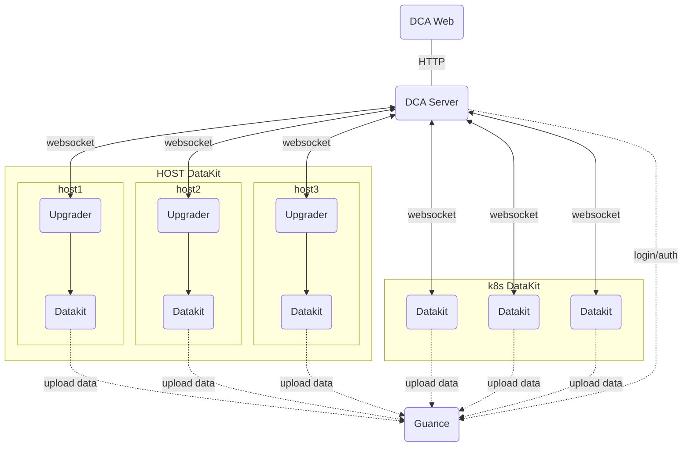

# DCA Client

[:octicons-beaker-24: Experimental](index.md#experimental)

---

:fontawesome-brands-linux: :fontawesome-brands-apple: :material-kubernetes: :material-docker:

---

DCA (Datakit Control App) is primarily used to manage Datakit, such as viewing Datakit lists, managing configuration files, managing Pipelines, and viewing help documentation.

The basic network topology of DCA is as follows:



## Enable DCA Service {#config}

<!-- markdownlint-disable MD046 -->
=== "Enable DCA Function During Host Installation"

    Add the following environment variables before the installation command:
    
    - `DK_DCA_ENABLE`: Whether to enable, set to `on` to enable.
    - `DK_DCA_WEBSOCKET_SERVER`: Configure the websocket service address for DCA ([:octicons-tag-24: Version-1.64.0](changelog.md#cl-1.64.0))
    
    Example:
    
    ```shell
    DK_DCA_ENABLE=on DK_DCA_WEBSOCKET_SERVER="ws://127.0.0.1:9000/ws" DK_DATAWAY=https://openway.guance.com?token=<TOKEN> bash -c "$(curl -L https://static.guance.com/datakit/install.sh)"
    ```

    After a successful installation, DataKit will automatically connect to the DCA service.

=== "Kubernetes"

    You can enable the DCA function by [setting related DCA environment variables](../datakit/datakit-daemonset-deploy.md#env-dca).

=== "*datakit.conf*"

    Modify the *datakit.conf* configuration file:
    
    ```toml
    [dca]
        # Enable
        enable = true

        # DCA service address
        websocket_server = "ws://127.0.0.1:8000/ws"

    ```

    After configuring, [restart DataKit](datakit-service-how-to.md#manage-service).

<!-- markdownlint-enable -->

---

## DCA Web Service {#dca-web}

<!-- markdownlint-disable MD046 -->
???+ Attention

    Interfaces of different versions of DataKit may vary. To better use DCA, it is recommended to upgrade DataKit to the latest version.

<!-- markdownlint-enable -->

DCA web is the web version of the DCA client. It provides API proxy for DataKit through a backend service deployment and offers a frontend web page for accessing DataKit.

<!-- markdownlint-disable MD046 -->
=== "Docker"

    For Docker installation, refer to the [documentation](https://docs.docker.com/desktop/install/linux-install/){:target="_blank"}.

    - Download Image

    Before running the container, download the DCA image using `docker pull`.

    ```shell
    docker pull pubrepo.guance.com/tools/dca:latest
    ```

    - Run Container

    Use the `docker run` command to create and start the DCA container. The default exposed port is 80.

    ```shell
    docker run -d --name dca -p 8000:80 pubrepo.guance.com/tools/dca
    ```

    - Test

    After the container runs successfully, you can access it via a browser: `http://localhost:8000`

=== "k8s"

    Download [*dca.yaml*](https://static.guance.com/datakit/dca/dca.yaml){:target="_blank"}, modify the relevant configurations in the file, and apply the `dca.yaml` file to the Kubernetes cluster.

    ```shell
    kubectl apply -f dca.yaml
    kubectl get pod -n datakit
    ```
<!-- markdownlint-enable -->

### Environment Variable Configuration {#envs}

By default, DCA uses system default settings. If custom configurations are needed, they can be modified by injecting environment variables. Currently supported environment variables are:

| Environment Variable Name       | Type   | Default Value                           | Description                                                                                            |
| ------------------------------- | ------ | --------------------------------------- | ------------------------------------------------------------------------------------------------------ |
| `DCA_CONSOLE_API_URL`           | string | `https://console-api.guance.com`        | Guance console API address, refer to [node addresses](dca.md#node-address)                             |
| `DCA_CONSOLE_WEB_URL`           | string | `https://console.guance.com`            | Guance platform address, refer to [node addresses](dca.md#node-address)                                |
| `DCA_STATIC_BASE_URL`           | string | `https://static.guance.com`             | Static file server address                                                                            |
| `DCA_CONSOLE_PROXY`             | string | None                                    | Guance API proxy, does not proxy DataKit interfaces                                                   |
| `DCA_LOG_LEVEL`                 | string | INFO                                    | Log level, values can be debug/info/warn/error                                                        |
| `DCA_LOG_PATH`                  | string | INFO                                    | Log path, set to `stdout` if output to stdout is required                                             |
| `DCA_TLS_ENABLE`                | string |                                         | Enable TLS, set this value to enable                                                                  |
| `DCA_TLS_CERT_FILE`             | string |                                         | Certificate file path, e.g., `/etc/ssl/certs/server.crt`                                              |
| `DCA_TLS_KEY_FILE`              | string |                                         | Private key file path, e.g., `/etc/ssl/certs/server.key`                                              |

Example:

```shell
docker run -d --name dca -p 8000:80 -e DCA_LOG_PATH=stdout -e DCA_LOG_LEVEL=WARN pubrepo.guance.com/tools/dca
```

### Node Addresses {#node-address}

| Deployment Type | Node Name      | `DCA_CONSOLE_API_URL`                     | `DCA_CONSOLE_WEB_URL`                      |
|-----------------|----------------|--------------------------------------------|--------------------------------------------|
| SaaS Deployment | China Region 1 (Hangzhou) | `https://console-api.guance.com`           | `https://console.guance.com`               |
| SaaS Deployment | China Region 2 (Ningxia)  | `https://aws-console-api.guance.com`       | `https://aws-console.guance.com`           |
| SaaS Deployment | China Region 4 (Guangzhou)| `https://cn4-console-api.guance.com`       | `https://cn4-console.guance.com`           |
| SaaS Deployment | China Region 6 (Hong Kong)| `https://cn6-console-api.guance.com`       | `https://cn6-console.guance.com`           |
| SaaS Deployment | Overseas Region 1 (Oregon)| `https://us1-console-api.guance.com`       | `https://us1-console.guance.com`           |
| SaaS Deployment | Europe Region 1 (Frankfurt)| `https://eu1-console-api.guance.com`       | `https://eu1-console.guance.com`           |
| SaaS Deployment | Asia-Pacific Region 1 (Singapore)| `https://ap1-console-api.guance.com`     | `https://ap1-console.guance.com`           |
| Private Deployment Edition | Private Deployment Edition | Actual deployment address | Actual deployment address |

### Login to DCA {#login}

After enabling and installing DCA, you can access it by entering the URL `localhost:8000` in your browser. On first access, the page will redirect to a login transition page. Click the "Proceed Now" button at the bottom of the page to be directed to the Guance platform. Follow the instructions on the page to configure the DCA address. Once configured, you can directly access the DCA platform without logging in through the Guance platform.

<figure markdown>
  { width="800" }
</figure>

### View DataKit List {#datakit-list}

After logging into DCA, you can select the workspace in the top-left corner to manage the corresponding DataKit and collectors. You can quickly filter hosts by searching for keywords.

Hosts managed remotely through DCA are divided into three states:

- Running: Indicates that data reporting is normal, allowing you to view the DataKit's runtime status and configure collectors via DCA.
- Offline: Indicates that DataKit is offline.
- Stopped: DataKit is in a stopped state.
- Upgrading: DataKit is in an upgrading state.
- Restarting: DataKit is in a restarting state.

By default, only information about DataKit in the current workspace can be viewed. To manage DataKit, such as upgrading DataKit, creating, deleting, or modifying collectors and Pipelines, the current account must have **DCA Configuration Management** permissions. Refer to [Role Management](../management/role-management.md) for specific settings.

<figure markdown>
  { width="800" }
</figure>

### View DataKit Runtime Status {#view-runtime}

After logging into DCA, select the workspace to view all installed DataKit hostnames and IP information. Click on a DataKit host to remotely connect to DataKit and view its runtime status, including version, uptime, release date, collector runtime status, etc., and perform a reload operation on DataKit.

<figure markdown>
  { width="800" }
</figure>

### Manage Collector Configurations {#view-inputs-conf}

After remotely connecting to DataKit, click on "Collector Configuration" to view the list of configured collectors and Sample lists (all Sample files supported by the current DataKit).

- Configured List: View, edit, and delete all conf files.
- Sample List: View and edit all sample files.
- Help: View the corresponding collector help documentation.

<figure markdown>
  { width="800" }
</figure>

### Manage Pipelines {#view-pipeline}

After remotely connecting to DataKit, click on "Pipelines" to view, edit, and test the default Pipeline files provided by DataKit. Refer to the [Text Data Processing](../pipeline/use-pipeline/index.md) documentation for more details on Pipelines.

<figure markdown>
  { width="800" }
</figure>

### View Blacklist {#view-filters}

After remotely connecting to DataKit, click on "Blacklist" to view the blacklist configured in the Guance workspace, as shown below `source = default and (status in [unknown])` is the configured blacklist condition.

Note: Blacklist files created through Guance are uniformly saved in the path: `/usr/local/datakit/data/.pull`.

<figure markdown>
  { width="800" }
</figure>

### View Logs {#view-log}

After remotely connecting to DataKit, click on "Logs" to view DataKit logs in real-time and export them to your local machine.

<figure markdown>
  { width="800" }
</figure>

## Changelog {#change-log}

### 0.1.0 (2024/11/27) {#cl-0.1.0}

- Refactored the underlying framework of DCA, using WebSocket protocol for communication to facilitate managing DataKit in different network environments.
- Added functionality to manage the main configuration of DataKit.
- Added support for TLS configuration.
- Changed the "Reload" feature of DataKit to "Restart".
