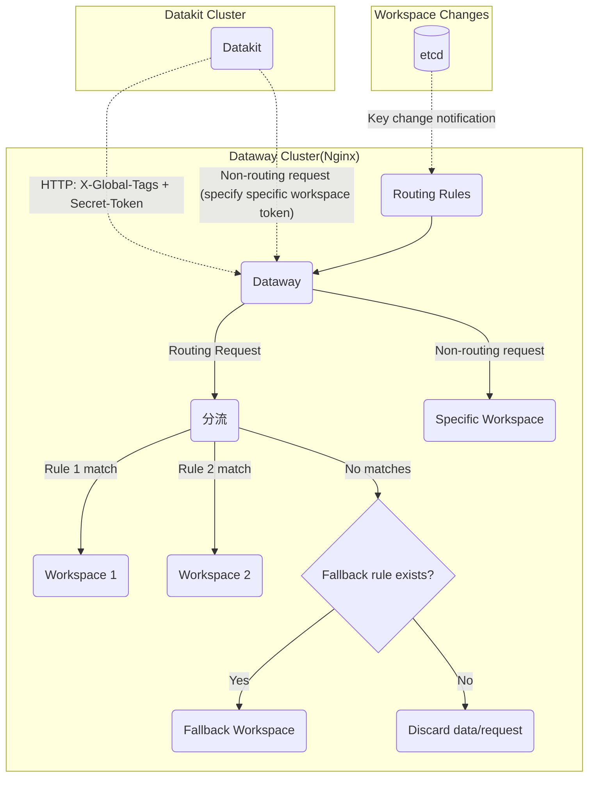
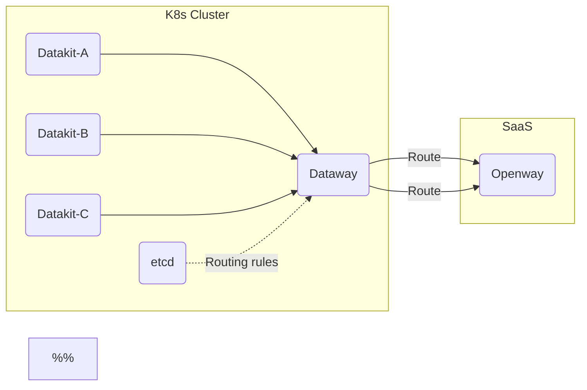

# Dataway Sink
---

[:octicons-tag-24: Version-1.14.0](../datakit/changelog.md#cl-1.14.0) version of Datakit is required to use the Sinker feature described here.

---

## Introduction to Dataway Sinker Functionality {#sink-intro}

During routine data collection, due to the existence of multiple different workspaces, we may need to send different data to different workspaces. For example, in a shared Kubernetes cluster, the collected data may involve different teams or business departments. At this point, we can route data with specific attributes to various workspaces respectively, achieving fine-grained collection under a shared infrastructure scenario.

The basic network topology is as follows:



> [Dataway 1.8.0](dataway-changelog.md#cl-1.8.0) supports receiving both Sinker and non-Sinker requests, so only one Dataway deployment is needed.

### Cascading Mode of Dataway {#cascaded}

For SaaS users, you can deploy a Dataway locally (in k8s Cluster) dedicated for routing, then forward the data to Openway:

<!-- markdownlint-disable MD046 -->
???+ warning

    In cascading mode, the Dataway within the cluster must enable the cascaded option. See the [environment variable explanation](dataway.md#dw-envs) in the installation documentation.
<!-- markdownlint-enable -->



Impact of cascading:

- Some API behaviors will differ. Due to historical reasons, there are differences between the URLs of requests sent by Datakit and those on Kodo. Dataway plays an API translation role here. In cascading scenarios, the API translation function is disabled.
- The cascading Dataway does not send heartbeat requests to the center. Because the next-level Dataway does not process this request (so it results in a 404)
- Requests received by the cascading Dataway do not sign the API when forwarding to the next Dataway.

## Dataway Installation {#dw-install}

Refer to [here](dataway.md#install)

## Dataway Configuration {#dw-config}

In addition to regular Dataway settings, a few additional configurations need to be set (located at */usr/local/cloudcare/dataflux/dataway/dataway.yaml*):

```yaml
# Set the address for Dataway to upload to, usually Kodo, but can also be another Dataway
remote_host: https://kodo.guance.com

# If the upload address is Dataway, this should be set to true, indicating Dataway cascading
cascaded: false

# This token is a randomly set token on Dataway; it needs to be filled into the
# Datakit's datakit.conf configuration. It should maintain a certain length and format.
secret_token: tkn_xxxxxxxxxxxxxxxxxxxxxxxxxxxxxxxx

# Sinker rules setting
sinker:
  etcd: # Supports etcd
    urls:
    - http://localhost:2379
    dial_timeout: 30s
    key_space: /dw_sinker
    username: "dataway"
    password: "<PASSWORD>"

  #file: # Also supports local file method, commonly used for debugging
  #  path: /path/to/sinker.json
```

<!-- markdownlint-disable MD046 -->
???+ warning

    If `secret_token` is not set, any request from Datakit can pass through, which does not cause data issues. However, if Dataway is deployed publicly, it is recommended to set `secret_token`.
<!-- markdownlint-enable -->

### Setting Sinker Rules {#setup-sinker-rules}

Dataway Sinker rules are a set of JSON-formatted configurations. The matching rule syntax is consistent with blacklist writing, refer to [here](../datakit/datakit-filter.md).


Currently, two sources of configuration are supported:

- Specify a local JSON file, mainly used for debugging Sinker rules. In this case, after updating the Sinker rules in the JSON file, **Dataway needs to be restarted for changes to take effect**
- etcd: Store the debugged rule file in etcd. When fine-tuning rules later, directly update etcd, **no need to restart Dataway**

Actually, the JSON stored in etcd is the same as the JSON in the local file. Below, we only introduce the etcd托管方式。

#### etcd Settings {#etcd-settings}

> All commands below are operated on Linux.

As an etcd client, Dataway can set up the following usernames and roles in etcd (etcd 3.5+), refer to [here](https://etcd.io/docs/v3.5/op-guide/authentication/rbac/#using-etcdctl-to-authenticate){:target="_blank"}

Create a `dataway` account and corresponding role:

```shell
# Add username, will prompt for password input
$ etcdctl user add dataway

# Add the sinker role
$ etcdctl role add sinker

# Add dataway to the role
$ etcdctl user grant-role dataway sinker

# Restrict role key permissions (the two keys /dw_sinker and /ping are default)
$ etcdctl role grant-permission sinker readwrite /dw_sinker
$ etcdctl role grant-permission sinker readwrite /ping       # Used for connectivity checks
```

<!-- markdownlint-disable MD046 -->
???+ info "Why create roles?"

    Roles control the permissions of corresponding users on certain keys. Here we might be using an existing etcd service of the user, so it is necessary to restrict the data permissions of the Dataway user.

???+ warning

    If etcd has enabled [authentication mode](https://etcd.io/docs/v3.5/op-guide/authentication/rbac/#enabling-authentication){:target="_blank"}, the `etcdctl` command needs to include the corresponding username and password:

    ```shell
    $ etcdctl --user name:password ...
    ```
<!-- markdownlint-enable -->

#### Writing Sinker Rules {#prepare-sink-rules}

> New versions (1.3.6) of Dataway support manipulating etcd-based Sinker rules via the `dataway` command.

Assuming *sinker.json* rule definition is as follows:

```json
{
    "strict":true,
    "rules": [
        {
            "rules": [
                "{ host = 'my-host'}"
            ],
            "url": "https://kodo.guance.com?token=tkn_xxxxxxxxxxxxxxxxxxxxxxxxxxxxxxxx"
        },
        {
            "rules": [
                "{ host = 'my-host' OR cluster = 'cluster-A' }"
            ],
            "url": "https://kodo.guance.com?token=tkn_yyyyyyyyyyyyyyyyyyyyyyyyyyyyyyyy"
        }
     ]
}
```

Using the following command, you can write Sinker rule configurations:

```shell
$ etcdctl --user dataway:PASSWORD put /dw_sinker "$(<sinker.json)"
OK
```

<!-- markdownlint-disable MD046 -->
???+ tip "Marking Workspace Information"

    Since *sinker.json* does not support comments, we can add an `info` field in JSON as a note to achieve the effect of comments:

    ``` json hl_lines="5"
    {
        "rules": [
            "{ host = 'my-host' OR cluster = 'cluster-A' }"
        ],
        "info": "This is the yyy workspace",
        "url": "https://kodo.guance.com?token=tkn_yyyyyyyyyyyyyyyyyyyyyyyyyyyyyyyy"
    }
    ```
<!-- markdownlint-enable -->

#### Default Rule {#default-rule}

[:octicons-tag-24: Version-1.6.0](dataway-changelog.md#cl-1.6.0)

Adding the `as_default` flag in a specific rule entry sets that rule as the default fallback rule. A fallback rule can omit any matching conditions (do not configure the `rules` field); it should not participate in normal rule matching. A suggested fallback rule is as follows:

``` json hl_lines="2"
{
    "as_default": true,
    "info": "This is the default fallback workspace",
    "url": "https://kodo.guance.com?token=tkn_xxxxxxxxxxxxxxxxxxxxxxxxxxxxxxxx"
}
```

> Note: Only one fallback rule should be set. If there are multiple fallback rules in the Sinker configuration, the last one takes precedence.

### Token Rules {#spec-on-secret-token}

Since Datakit checks tokens on Dataway, the `token` (including `secret_token`) configured here must meet the following conditions:

> Starts with `token_` or `tkn_`, followed by 32 characters.

For tokens that do not meet this condition, Datakit installation will fail.

## Datakit End Configuration {#config-dk}

In Datakit, we need to make several settings to tag collected data for grouping.

- Configure Global Custom Key List

Datakit will search for fields with these keys in its collected data (only string-type fields), extract them, and use them as the basis for grouped sending.

<!-- markdownlint-disable MD046 -->
=== "Host Installation"

    Refer to [here](../datakit/datakit-install.md#env-sink)

=== "Kubernetes"

    Refer to [here](../datakit/datakit-daemonset-deploy.md#env-sinker)
<!-- markdownlint-enable -->

- Configure "Global Host Tag" and "Global Election Tag"

All Datakit uploaded data will carry these global tags (including tag key and tag value) as the basis for grouped sending.

<!-- markdownlint-disable MD046 -->
=== "Host Installation"

    Refer to [here](../datakit/datakit-install.md#common-envs)

=== "Kubernetes"

    Refer to [here](../datakit/datakit-daemonset-deploy.md#env-common)
<!-- markdownlint-enable -->

### Datakit End Customer Key Configuration {#dk-customer-key}

To ensure that data collected by a specific Datakit meets routing requirements, ensure the following points:

- Datakit has enabled the Sinker function
- Datakit has configured valid Global Customer Keys

These configurations are as follows:

```toml
# /usr/local/datakit/conf.d/datakit.conf
[dataway]

  # Specify a set of customer keys
  global_customer_keys = [
    # Example: Add category and class two keys
    # It is not advisable to configure too many keys here, generally 2 ~ 3 keys are sufficient
    "category",
    "class",
  ]

  # Enable sinker function
  enable_sinker = true
```

Besides synthetic testing data and [regular data categories](../datakit/apis.md#category), it also supports [Session Replay](../integrations/rum.md#rum-session-replay) and [Profiling](../integrations/profile.md) binary file data. Therefore, all field names can be chosen here, with the caveat that **non-string type fields should not be configured**. Normal keys generally come from Tags (all Tag values are string types). Datakit will not use non-string type fields as routing criteria.

#### Impact of Global Tags {#dk-global-tags-on-sink}

In addition to `global_customer_keys` affecting routing tags, the [global Tags](../datakit/datakit-conf.md#set-global-tag) configured on Datakit (including global election Tags and global host Tags) also influence routing tags. That is, if the data point contains fields that appear in the global Tags (these field values must be string types), they will also be counted towards routing. Assuming the global election Tag is as follows:

```toml
# datakit.conf
[election.tags]
    cluster = "my-cluster"
```

For the following data point:

```not-set
pi,cluster=cluster_A,app=math,other_tag=other_value value=3.14 1712796013000000000
```

Because the global election Tag includes `cluster` (regardless of the value configured for this Tag), and this point itself has a `cluster` Tag, the final `X-Global-Tags` will append the key-value pair `cluster=cluster_A`:

```not-set
X-Global-Tags: cluster=cluster_A
```

If `global_customer_keys` also configures the `app` key, the final routing Header would be (the order of key-value pairs is not important):

```not-set
X-Global-Tags: cluster=cluster_A,app=math
```

<!-- markdownlint-disable MD046 -->
???+ note

    In this example, the value of `cluster` in *datakit.conf* is deliberately set differently from the `cluster` field value in the data point, mainly emphasizing the impact of the Tag Key. It can be understood that once a data point contains a qualified global Tag Key, **its effect is equivalent to adding this global Tag Key to `global_customer_keys`**.
<!-- markdownlint-enable -->

## Dataway Sink Commands {#dw-sink-command}

Starting from version [:octicons-tag-24: Version-1.3.6](dataway-changelog.md#cl-1.3.6), Dataway supports managing `sinker` configurations via command line, specific usage is as follows:

```shell
$ ./dataway sink --help

Usage of sink:
  -add string
        single rule json file
  -cfg-file string
        configure file (default "/usr/local/cloudcare/dataflux/dataway/dataway.yaml")
  -file string
        file path of the rule json, only used for command put and get
  -get
        get the rule json
  -list
        list rules
  -log string
        log file path (default "/dev/null")
  -put
        save the rule json
  -token string
        rules filtered by token, eg: xx,yy
```

**Specifying Configuration File**

By default, the command loads the configuration file `/usr/local/cloudcare/dataflux/dataway/dataway.yaml`. To load other configurations, specify using `--cfg-file`.

```shell
$ ./dataway sink --cfg-file dataway.yaml [--list...]
```

**Command Log Settings**

By default, command output logs are disabled. To view them, set the `--log` parameter.

```shell
# Output log to stdout
$ ./dataway sink --list --log stdout

# Output log to file
$ ./dataway sink --list --log /tmp/log
```

**Viewing Rule List**

```shell

# List all rules
$ ./dataway sink --list

# List all rules filtered by token
$ ./dataway sink --list --token=token1,token2

CreateRevision: 2
ModRevision: 41
Version: 40
Rules:
[
    {
        "rules": [
            "{ workspace = 'zhengb-test'}"
        ],
        "url": "https://openway.guance.com?token=token1"
    }
]
```

**Adding Rules**

Create a rule file `rule.json`, content reference as follows:

```json
[
  {
    "rules": [
      "{ host = 'HOST1'}"
    ],
    "url": "https://openway.guance.com?token=tkn_xxxxxxxxxxxxx"
  },
  {
    "rules": [
      "{ host = 'HOST2'}"
    ],
    "url": "https://openway.guance.com?token=tkn_yyyyyyyyyyyyy"
  }
]

```

Add new rules

```shell
$ ./dataway sink --add rule.json

add 2 rules ok!

```

**Export Configuration**

Export configuration can export `sinker` configurations to a local file.

```shell
$ ./dataway sink --get --file sink-get.json

rules json was saved to sink-get.json!

```

**Write Configuration**

Writing rules synchronizes local rule files to `sinker`.

Create a rule file `sink-put.json`, content reference as follows:

```json
{
    "rules": [
        {
            "rules": [
                "{ workspace = 'test'}"
            ],
            "url": "https://openway.guance.com?token=tkn_xxxxxxxxxxxxxx"
        }
    ],
    "strict": true
}

```

Write configuration

```shell
$ ./dataway sink --put --file sink-put.json
```

## Configuration Examples {#config-examples}

<!-- markdownlint-disable MD046 -->
??? info "Example of dataway.yaml in Kubernetes (expand to view)"

    Directly specify sinker JSON in yaml:


    ```yaml
    ---
    apiVersion: apps/v1
    kind: Deployment
    metadata:
      labels:
        app: deployment-utils-dataway
      name: dataway
      namespace: utils
    spec:
      replicas: 1
      selector:
        matchLabels:
          app: deployment-utils-dataway
      template:
        metadata:
          labels:
            app: deployment-utils-dataway
          annotations:
            datakit/logs: |
              [{"disable": true}]
            datakit/prom.instances: |
              [[inputs.prom]]
                url = "http://$IP:9090/metrics" # Depending on the situation, this port (default 9090) may vary
                source = "dataway"
                measurement_name = "dw" # Fixed as this Metrics set
                interval = "10s"

                [inputs.prom.tags]
                  namespace = "$NAMESPACE"
                  pod_name = "$PODNAME"
                  node_name = "$NODENAME"
        spec:
          affinity:
            podAffinity: {}
            podAntiAffinity:
              requiredDuringSchedulingIgnoredDuringExecution:
                - labelSelector:
                    matchExpressions:
                      - key: app
                        operator: In
                        values:
                          - deployment-utils-dataway
                  topologyKey: kubernetes.io/hostname

          containers:
          - image: registry.jiagouyun.com/dataway/dataway:1.3.6 # Choose an appropriate version number here
            #imagePullPolicy: IfNotPresent
            imagePullPolicy: Always
            name: dataway
            env:
            - name: DW_REMOTE_HOST
              value: "http://kodo.forethought-kodo:9527" # Fill in the real Kodo address or the next Dataway address here
            - name: DW_BIND
              value: "0.0.0.0:9528"
            - name: DW_UUID
              value: "agnt_xxxxx" # Fill in the real Dataway UUID here
            - name: DW_TOKEN
              value: "tkn_oooooooooooooooooooooooooooooooo" # Fill in the real Dataway token here, generally the system workspace token
            - name: DW_PROM_LISTEN
              value: "0.0.0.0:9090"
            - name: DW_SECRET_TOKEN
              value: "tkn_zzzzzzzzzzzzzzzzzzzzzzzzzzzzzzzz"
            - name: DW_SINKER_FILE_PATH
              value: "/usr/local/cloudcare/dataflux/dataway/sinker.json"
            ports:
            - containerPort: 9528
              name: 9528tcp01
              protocol: TCP
            volumeMounts:
              - mountPath: /usr/local/cloudcare/dataflux/dataway/cache
                name: dataway-cache
              - mountPath: /usr/local/cloudcare/dataflux/dataway/sinker.json
                name: sinker
                subPath: sinker.json
            resources:
              limits:
                cpu: '4'
                memory: 4Gi
              requests:
                cpu: 100m
                memory: 512Mi
          # nodeSelector:
          #   key: string
          imagePullSecrets:
          - name: registry-key
          restartPolicy: Always
          volumes:
          - hostPath:
              path: /root/dataway_cache
            name: dataway-cache
          - configMap:
              name: sinker
            name: sinker
    ---

    apiVersion: v1
    kind: Service
    metadata:
      name: dataway
      namespace: utils
    spec:
      ports:
      - name: 9528tcp02
        port: 9528
        protocol: TCP
        targetPort: 9528
        nodePort: 30928
      selector:
        app: deployment-utils-dataway
      type: NodePort

    ---
    apiVersion: v1
    kind: ConfigMap
    metadata:
      name: sinker
      namespace: utils
    data:
      sinker.json: |
        {
            "strict":true,
            "rules": [
                {
                    "rules": [
                        "{ project = 'xxxxx'}"
                    ],
                    "url": "http://kodo.forethought-kodo:9527?token=tkn_xxxxxxxxxxxxxxxxxxxxxxxxxxxxxxxx"
                },
                {
                    "rules": [
                        "{ project = 'xxxxx'}"
                    ],
                    "url": "http://kodo.forethought-kodo:9527?token=tkn_yyyyyyyyyyyyyyyyyyyyyyyyyyyyyyyy"
                }
             ]
        }
    ```

<!-- markdownlint-enable -->

<!-- markdownlint-disable MD046 -->
??? info "Ingress Configuration Example (expand to view)"

    ```yaml
    apiVersion: networking.k8s.io/v1
    kind: Ingress
    metadata:
      name: dataway-sinker
      namespace: utils
    spec:
      ingressClassName: nginx
      rules:
      - host: datawaysinker-xxxx.com
        http:
          paths:
          - backend:
              service:
                name: dataway
                port:
                  number: 9528
            path: /
            pathType: ImplementationSpecific
    ```

<!-- markdownlint-enable -->

## FAQ {#faq}

### Viewing Details of Dropped Requests {#dropped-request}

[:octicons-tag-24: Version-1.3.7](dataway-changelog.md#cl-1.3.7)

When a request does not match the Sinker rules, Dataway discards the request and increments a discard count in metrics. During debugging, we need to know the specifics of a discarded request, especially the `X-Global-Tags` information carried in the request header.

We can search Dataway logs using the following command:

``` bash
$ cat <path/to/dataway/log> | grep dropped
```

In the output results, we can see outputs similar to the following:

``` not-set
for API /v1/write/logging with X-Global-Tags <some-X-Global-Tags...> dropped
```

### Troubleshooting Discarded Datakit Requests {#dk-http-406}

[:octicons-tag-24: Version-1.3.9](dataway-changelog.md#cl-1.3.9)

When a Datakit request is discarded by Dataway, Dataway returns a corresponding HTTP error. In the Datakit logs, you might see errors like the following:

```not-set
post 3641 to http://dataway-ip:9528/v1/write/metric failed(HTTP: 406 Not Acceptable):
{"error_code":"dataway.sinkRulesNotMatched","message":"X-Global-Tags: `host=my-host',
URL: `/v1/write/metric'"}, data dropped
```

This error indicates that the request `/v1/write/metric` was discarded because its X-Global-Tags did not satisfy any of the rules on Dataway.

Additionally, in the Datakit monitor (`datakit monitor -V`), in the bottom-right `DataWay APIs` panel, the column `Status` will display `Not Acceptable`, indicating that the corresponding Dataway API request was discarded.

Checking Datakit's own metrics also reveals the corresponding metrics:

```shell
$ curl -s http://localhost:9529/metrics | grep datakit_io_dataway_api_latency_seconds_count

datakit_io_dataway_api_latency_seconds_count{api="/v1/datakit/pull",status="Not Acceptable"} 50
datakit_io_dataway_api_latency_seconds_count{api="/v1/write/metric",status="Not Acceptable"} 301
```

### Datakit Error 403 {#dk-403}

If the Dataway sinker configuration is incorrect, leading all Datakit requests to use `secret_token`, and this token is not recognized by the center (Kodo), it reports a 403 error `kodo.tokenNotFound`.

This issue could be caused by incorrect etcd username/password, preventing Dataway from obtaining the Sinker configuration, thus Dataway considers the current sinker invalid and forwards all data directly to the center.

### etcd Permission Issues {#etcd-permission}

If the Dataway logs show the following error, it suggests permission settings may be problematic:

```not-set
sinker ping: etcdserver: permission denied, retrying(97th)
```

If the permission configuration is improper, you can delete all existing Dataway-based permissions and reconfigure them. Refer to [here](https://etcd.io/docs/v3.5/op-guide/authentication/rbac/#using-etcdctl-to-authenticate){:target="_blank"}

### Key Overriding Relationship on Datakit End {#key-priority}

When configuring the "Global Custom Key List," if the "Global Host Tag" and "Global Election Tag" also contain keys with the same name, the corresponding Key-Value pair in the collected data is used.

For example, if the "Global Custom Key List" contains `key1,key2,key3`, and the "Global Host Tag" or "Global Election Tag" also configures these keys with specified values, such as `key1=value-1`, and in some data collection, there is a field `key1=value-from-data`, then the final grouping basis uses the data's `key1=value-from-data`, ignoring the Value of the corresponding Key in the "Global Host Tag" and "Global Election Tag".

If the "Global Host Tag" and "Global Election Tag" have keys with the same name, the "Global Election Tag" key takes precedence. In summary, the priority of Key value sources (in descending order) is as follows:

- Collected data
- Global Election Tag
- Global Host Tag

### Built-in "Global Custom Keys" {#reserved-customer-keys}

Datakit has built-in several custom keys that generally do not appear in collected data, but Datakit can use these keys to group data. If there is a need to split data based on these dimensions, they can be added to the "Global Custom Key" list (by default, these keys are not configured). We can use the following built-in custom keys to implement data splitting.

<!-- markdownlint-disable MD046 -->
???+ warning

    Adding "Global Custom Keys" can cause data to be sent in separate batches. If the granularity is too fine, it can drastically reduce Datakit's upload efficiency. Generally, the number of "Global Custom Keys" should not exceed 3.
<!-- markdownlint-enable -->

- `class` targets object data. When enabled, it splits data based on object classification. For example, if the object classification for Pod is `kubelet_pod`, rules can be created specifically for Pods:

``` json
{
    "strict": true,
    "rules": [
        {
            "rules": [
                "{ class = 'kubelet_pod' AND other_conditon = 'some-value' }",
            ],
            "url": "https://kodo.guance.com?token=<YOUR-TOKEN>"
        },
        {
            ... # other rules
        }
    ]
}
```

- `measurement` targets metric data. Specific Metrics sets can be routed to specific workspaces. For instance, if the Metrics set name for disk is `disk`, the rule can be written as follows:

```json
{
    "strict": true,
    "rules": [
        {
           "rules": [
               "{ measurement = 'disk' AND other_conditon = 'some-value' }",
           ],
           "url": "https://kodo.guance.com?token=<YOUR-TOKEN>"
        },
        {
            ... # other rules
        }
    ]
}
```

- `source` targets logs (L), eBPF network metrics (N), events (E), and RUM data
- `service` targets Tracing, Synthetic Tests, and Profiling
- `category` targets all [standard data classifications](../datakit/apis.md#category), whose values are the "name" column of the corresponding data classification (such as `metric` for Time Series, `object` for objects, etc.). Taking logs as an example, we can create a rule specifically for logs as follows:

``` json
{
    "strict": true,
    "rules": [
        {
            "rules": [
                "{ category = 'logging' AND other_conditon = 'some-value' }",
            ],
            "url": "https://kodo.guance.com?token=<YOUR-TOKEN>"
        },
        {
            ... # other rules
        }
    ]
}
```

### Special Routing Behavior {#special-sink-rule}

Some requests initiated by Datakit aim to pull resources from the center or perform self-identification. These actions are already atomic and indivisible and cannot be distributed to multiple workspaces (because Datakit needs to handle the return of these API requests and decide its subsequent behavior). Therefore, these APIs can only be routed to one workspace.

If multiple conditions are met in the routing rules, these APIs will **only be routed to the first workspace specified by the matching rule**.

Below is an example of such routing rules:

> We recommend adding the following rule to all Sinker rules to ensure that Datakit's existing API requests are directed to a specific workspace.

``` json
{
    "strict": true,
    "info": "Special workspace (used only for data retrieval APIs)",
    "rules": [
        {
            "rules": [
                "{ __dataway_api in ['/v1/datakit/pull', '/v1/election', '/v1/election/heartbeat', '/v1/query/raw', '/v1/workspace', '/v1/object/labels', '/v1/check/token'] }",
            ],
            "url": "https://kodo.guance.com?token=<SOME-SPECIAL-WORKSPACE-TOKEN>"
        }
    ]
}
```

<!-- markdownlint-disable MD046 -->
???+ info

    Explanation of these API URLs:
        
    - `/v1/election`: Election request
    - `/v1/election/heartbeat`: Election heartbeat request
    - `/v1/datakit/pull`: Pull Pipeline and blacklist configurations from the center
    - `/v1/query/raw`: DQL query
    - `/v1/workspace`: Get workspace information
    - `/v1/object/labels`: Update/delete object data
    - `/v1/check/token`: Check workspace Token information
<!-- markdownlint-enable -->

Here, the key `__dataway_api` does not need to be configured in the `global_customer_keys` in *datakit.conf*. Dataway defaults to using this as a routing key, with the current request's API route as its value. That is, for a certain API:

```text
POST /v1/some/api
X-Global-Tags: cluster=cluster_A,app=math
```

Its ultimate effect on routing is the same as:

```text
POST /v1/some/api
X-Global-Tags: cluster=cluster_A,app=math,__dataway_api=/v1/write/metrics
```

So, we can directly use the `__dataway_api` key-value pair in the Sink rule for matching. This also reminds us not to include other important data upload APIs in this special rule, such as `/v1/write/...` interfaces, otherwise, where the data ultimately lands is undefined.