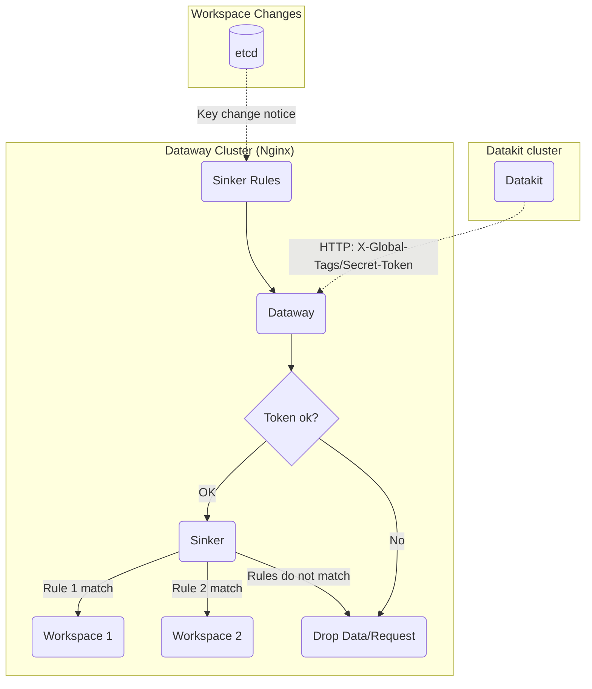
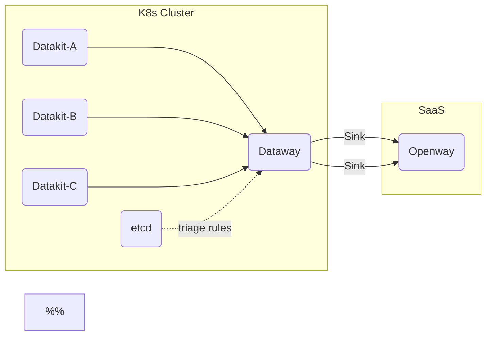

# Dataway Sink
---

[:octicons-tag-24: Version-1.14.0](../datakit/changelog.md#cl-1.14.0) to use the sinker functionality here.

---

## Dataway Sinker Introduction {#sink-intro}

In the daily data collection process, we may need to upload different data into different workspaces due to the existence of multiple different workspaces. For example, in a common Kubernetes cluster, the data collected may involve different teams or business departments, and we can tap the data with specific attributes to different workspaces to achieve fine-grained collection in common infrastructure scenarios.

The basic network topology is as follows:



### Dataway Serial Mode {#cascaded}

For SaaS users, you can deploy a Dataway on your own premises (k8s cluster) dedicated to offloading, and then forward the data to Openway:

<!-- markdownlint-disable MD046 -->
???+ attention

    In cascaded mode, the Dataway in the cluster needs to enable the `cascaded` option. See [Environment Variable Description](dataway.md#dw-envs) in the installation documentation. 
<!-- markdownlint-enable -->



## Dataway installation {#dw-install}

See [here](dataway.md#install)

## Dataway Settings {#dw-config}

In addition to the general Dataway settings, several additional configurations need to be set up (located in the */usr/local/cloudcare/dataflux/dataway/* directory):

```yaml
# Set the address to be uploaded by Dataway here, usually Kodo, but it can also be another Dataway
remote_host: https://kodo.guance.com

# If the upload address is Dataway, set to true here to indicate that Dataway cascade
cascaded: false

# This token is a random token set on the dataway, we need to fill it in
# Datakit's datakit.conf configuration. A certain length and format need to be maintained here.
secret_token: tkn_xxxxxxxxxxxxxxxxxxxxxxxxxxxxxxxx

# sinker rule settings
sinker:
  etcd: # supports etcd
    urls:
    - http://localhost:2379
    dial_timeout: 30s
    key_space: /dw_sinker
    username: "dataway"
    password: "<PASSWORD>"

  #file: # also supports local file mode, which is often used for debugging
  #  path: /path/to/sinker.json
```

<!-- markdownlint-disable MD046 -->
???+ attention

    If you do not set `secret_token`, any request sent by Datakit will go through without causing data problems. However, if Dataway is deployed on the public network, it is recommended to set `secret_token`.

    If etcd does not set a username/password, then set both `username` and `password` to `""` here.
<!-- markdownlint-enable -->

### Config sinker rules {#setup-sinker-rules}

Dataway Sinker rules are JSON string, there are 2 JSON source:

- Specify a local disk file(like */path/to/sinker.json*), every time we update the JSON file, we **must** restart dataway to reload the JSON.
- We can push the JSON file to etcd. While sinker JSON host on etcd, we don't have to restart Dataway if the JSON file refreshed, Dataway will be notified if sinker rules updated.

Actually, the JSON from local file or etcd are the same string, we only cover how to manage sinker rules hosted on etcd in the following sections.

## etcd settings {#etcd-settings}

> All command following are under Linux.

<!-- markdownlint-disable MD046 -->
=== "etcd settings already exist"

    Dataway, as an etcd client, can set the following username and role in etcd (etcd 3.5+), see [here](https://etcd.io/docs/v3.5/op-guide/authentication/rbac/#using-etcdctl-to-authenticate){:target="_blank"}

    Create a 'dataway' account and corresponding role:

    ```shell
    # Add a username, where you will be prompted for a password
    $ etcdctl user add dataway

    # Add the role of sinker
    $ etcdctl role add sinker

    # Add Dataway to the role
    $ etcdctl user grant-role dataway sinker

    # Restrict the key permissions of the role (where /dw_sinker and /ping are the two keys used by default)
    $ etcdctl role grant-permission sinker readwrite /dw_sinker
    $ etcdctl role grant-permission sinker readwrite /ping # is used to detect connectivity
    ```

=== "Kubernetes self-built etcd node"

    See [here](https://github.com/etcd-io/etcd/tree/main/hack/kubernetes-deploy){:target="_blank"}.

???+ info "Why create a role?"

    Roles are used to control the permissions of the corresponding user on certain keys, here we may use the user's existing etcd service, it is necessary to restrict the data permissions of Dataway this user.

???+ attention

    If etcd has [authentication mode](https://etcd.io/docs/v3.5/op-guide/authentication/rbac/#enabling-authentication){:target="_blank"} enabled, execute the `etcdctl` command, and bring the corresponding username and password:

    ```shell
    $ etcdctl --user name:password ...
    ```
<!-- markdownlint-enable -->

### Write sinker rules {#prepare-sink-rules}

> For Dataway version 1.3.6, there are convenient commands to manage sinker rules hosted on etcd.

Suppose the *sinker.json* rule is defined as follows:

```json
{
    "strict":true,
    "rules": [
        {
            "rules": [
                "{ host = 'my-host'}"
            ],
            "url": "https://kodo.guance.com?token=tkn_xxxxxxxxxxxxxxxxxxxxxxxxxxxxxxxx"
        },
        {
            "rules": [
                "{ host = 'my-host' OR cluster = 'cluster-A' }"
            ],
            "url": "https://kodo.guance.com?token=tkn_yyyyyyyyyyyyyyyyyyyyyyyyyyyyyyyy"
        }
     ]
}
```

You can write the sinker rule configuration with the following command:

```shell
$ etcdctl --user dataway:PASSWORD put /dw_sinker "$(<sinker.json)"
OK
```

<!-- markdownlint-disable MD046 -->
???+ tip "Comment URL Token Info"

    Because we can't add comments on JSON file *sinker.json*, we can add extra field for commenting:

    ``` json
    {
        "rules": [
            "{ host = 'my-host' OR cluster = 'cluster-A' }"
        ],
        "info": "This is yyy workspace",
        "url": "https://kodo.guance.com?token=tkn_yyyyyyyyyyyyyyyyyyyyyyyyyyyyyyyy"
    }
    ```
<!-- markdownlint-enable -->

### Token Specs {#spec-on-secret-token}

Since Datakit will detect tokens on Dataway, the `token` (including `secret_token`) set here must meet the following conditions:

> starts with `token_` or `tkn_` and follows a character length of 32.

For tokens that do not meet this condition, Datakit fails to install.

## Datakit settings {#config-dk}

For Datakit, we must setup some configures to enable sinker:

- Config *customer global keys*: Datakit will search among all uploading data for these keys(only string-type fields), and group the upload payload by same `key:value` pair

<!-- markdownlint-disable MD046 -->
=== "Host Installation"

    See [here](../datakit/datakit-install.md#env-sink)

=== "Kubernetes"

    See [here](../datakit/datakit-daemonset-deploy.md#env-sinker)
<!-- markdownlint-enable -->

- Configure Global Host Tag and Global Election Tag

In all Datakit uploaded data, these configured global tags (including tag key and tag value) will be brought as the basis for group sending.

<!-- markdownlint-disable MD046 -->
=== "Host Installation"

    See [here](../datakit/datakit-install.md#common-envs)

=== "Kubernetes"

    See [here](../datakit/datakit-daemonset-deploy.md#env-common)
<!-- markdownlint-enable -->

### Setup global custom keys {#dk-customer-key}

To enable sinker for Datakit, setup these in *datakit.conf*: 

```toml
[dataway]
  global_customer_keys = [
    # Do not add too may keys here, 2 ~ 3 keys are valid.
    # Here we add category and class.
    "category",
    "class",
  ]

  # enable Sinker feature
  enable_sinker = true
```

In addition to dial tests, [General Data Classification](../datakit/apis.md#category), [Session Replay](../integrations/rum.md#rum-session-replay) and [Profiling](../integrations/profile.md) and other binary file data. **Do not configure non-string-type keys for `global_customer_keys`**, we just ignore them.

#### Impact of Global Tags on Sink {#dk-global-tags-on-sink}

In addition to `global_customer_keys` affecting the sinking markers, the [Global Tags](../datakit/datakit-conf.md#set-global-tag) configured in Datakit (including global election tags and global host tags) also influence the sinking markers. This means that if the data points contain fields that appear in the global tags (and the value types of these fields must be string), they will be taken into account for sinking. Assume the global election tag is configured as follows:

```toml
# datakit.conf
[election.tags]
    cluster = "my-cluster"
```

For the following data point:

```not-set
pi,cluster=cluster_A,app=math,other_tag=other_value value=3.14 1712796013000000000
```

Since the global election tag includes `cluster` (regardless of the value configured for this tag), and the data point itself also has a `cluster` tag, the final `X-Global-Tags` will include the key-value pair `cluster=cluster_A`:

```not-set
X-Global-Tags: cluster=cluster_A
```

If `global_customer_keys` also configures the `app` key, then the final sharding Header will be (the order of the key-value pairs is not important):

```not-set
X-Global-Tags: cluster=cluster_A,app=math
```

<!-- markdownlint-disable MD046 -->
???+ note

    The example here intentionally sets the value of `cluster` in the *datakit.conf* different from the value of the `cluster` field in the data point, mainly to emphasize the impact of the tag key here. It can be understood that once a data point contains a global tag key that meets the condition, **its effect is equivalent to this global tag key being added to `global_customer_keys`**.
<!-- markdownlint-enable -->

## Dataway sink command {#dw-sink-command}

Dataway supports managing the configuration of `sinker` through the command line since version [:octicons-tag-24: Version-1.3.6](dataway-changelog.md#cl-1.3.6). The specific usage is as follows:

```shell
$ ./dataway sink --help

Usage of sink:
  -add string
        single rule json file
  -cfg-file string
        configure file (default "/usr/local/cloudcare/dataflux/dataway/dataway.yaml")
  -file string
        file path of the rule json, only used for command put and get
  -get
        get the rule json
  -list
        list rules
  -log string
        log file path (default "/dev/null")
  -put
        save the rule json
  -token string
        rules filtered by token, eg: xx,yy
```

**Specify configuration file**

When the command is executed, the default configuration file loaded is `/usr/local/cloudcare/dataflux/dataway/dataway`.yaml, and if additional configurations need to be loaded, they can be specified using the `--cfg-file` option.

```shell
$ ./dataway sink --cfg-file dataway.yaml [--list...]
```

**Command log setting**

The command log was disabled by default. If you need to view it, you can set the `--log` parameter.

```shell
# output log to stdout
$ ./dataway sink --list --log stdout

# output log to file
$ ./dataway sink --list --log /tmp/log
```

**View sinker rules**

```shell

# list all rules 
$ ./dataway sink --list

# list all rules filtered by token 
$ ./dataway sink --list --token=token1,token2

CreateRevision: 2
ModRevision: 41
Version: 40
Rules: 
[
    {
        "rules": [
            "{ workspace = 'zhengb-test'}"
        ],
        "url": "https://openway.guance.com?token=token1"
    }
]
```

**Add sinker rules**

Create file `rule.json` and add the following content:

```json
[
  {
    "rules": [
      "{ host = 'HOST1'}"
    ],
    "url": "https://openway.guance.com?token=tkn_xxxxxxxxxxxxx"
  },
  {
    "rules": [
      "{ host = 'HOST2'}"
    ],
    "url": "https://openway.guance.com?token=tkn_yyyyyyyyyyyyy"
  }
]

```

Add the rules.

```shell
$ ./dataway sink --add rule.json

add 2 rules ok!

```

**Export sinker configuration**

Export the `sinker` configuration content to local file.

```shell
$ ./dataway sink --get --file sink-get.json

rules json was saved to sink-get.json!

```

**Import sinker configuration**

Import `sinker` configuration from local file.

Create file `sink-put.json` and add following content:

```json
{
    "rules": [
        {
            "rules": [
                "{ workspace = 'test'}"
            ],
            "url": "https://openway.guance.com?token=tkn_xxxxxxxxxxxxxx"
        }
    ],
    "strict": true
}

```

Import the file.

```shell
$ dataway sink --put --file sink-put.json
```

## Config examples {#config-examples}

<!-- markdownlint-disable MD046 -->
??? info "dataway.yaml in Kubernetes(expand me)"

    We can setup a configmap in Dataway Pod yaml:


    ```yaml
    ---
    apiVersion: apps/v1
    kind: Deployment
    metadata:
      labels:
        app: deployment-utils-dataway
      name: dataway
      namespace: utils
    spec:
      replicas: 1
      selector:
        matchLabels:
          app: deployment-utils-dataway
      template:
        metadata:
          labels:
            app: deployment-utils-dataway
          annotations:
            datakit/logs: |
              [{"disable": true}]
            datakit/prom.instances: |
              [[inputs.prom]]
                url = "http://$IP:9090/metrics"
                source = "dataway"
                measurement_name = "dw"
                interval = "10s"

                [inputs.prom.tags]
                  namespace = "$NAMESPACE"
                  pod_name = "$PODNAME"
                  node_name = "$NODENAME"
        spec:
          affinity:
            podAffinity: {}
            podAntiAffinity:
              requiredDuringSchedulingIgnoredDuringExecution:
                - labelSelector:
                    matchExpressions:
                      - key: app
                        operator: In
                        values:
                          - deployment-utils-dataway
                  topologyKey: kubernetes.io/hostname

          containers:
          - image: registry.jiagouyun.com/dataway/dataway:1.3.6 # select version here 
            #imagePullPolicy: IfNotPresent
            imagePullPolicy: Always
            name: dataway
            env:
            - name: DW_REMOTE_HOST
              value: "http://kodo.forethought-kodo:9527" # setup kodo server or next cascaded Dataway
            - name: DW_BIND
              value: "0.0.0.0:9528"
            - name: DW_UUID
              value: "agnt_xxxxx" # setup Dataway UUID
            - name: DW_TOKEN
              value: "tkn_oooooooooooooooooooooooooooooooo" # setup system workspace Dataway token
            - name: DW_PROM_LISTEN
              value: "0.0.0.0:9090"
            - name: DW_SECRET_TOKEN
              value: "tkn_zzzzzzzzzzzzzzzzzzzzzzzzzzzzzzzz"
            - name: DW_SINKER_FILE_PATH
              value: "/usr/local/cloudcare/dataflux/dataway/sinker.json"
            ports:
            - containerPort: 9528
              name: 9528tcp01
              protocol: TCP
            volumeMounts:
              - mountPath: /usr/local/cloudcare/dataflux/dataway/cache
                name: dataway-cache
              - mountPath: /usr/local/cloudcare/dataflux/dataway/sinker.json
                name: sinker
                subPath: sinker.json
            resources:
              limits:
                cpu: '4'
                memory: 4Gi
              requests:
                cpu: 100m
                memory: 512Mi
          # nodeSelector:
          #   key: string
          imagePullSecrets:
          - name: registry-key
          restartPolicy: Always
          volumes:
          - hostPath:
              path: /root/dataway_cache
            name: dataway-cache
          - configMap:
              name: sinker
            name: sinker
    ---

    apiVersion: v1
    kind: Service
    metadata:
      name: dataway
      namespace: utils
    spec:
      ports:
      - name: 9528tcp02
        port: 9528
        protocol: TCP
        targetPort: 9528
        nodePort: 30928
      selector:
        app: deployment-utils-dataway
      type: NodePort

    ---
    apiVersion: v1
    kind: ConfigMap
    metadata:
      name: sinker
      namespace: utils
    data:
      sinker.json: |
        {
            "strict":true,
            "rules": [
                {
                    "rules": [
                        "{ project = 'xxxxx'}"
                    ],
                    "url": "http://kodo.forethought-kodo:9527?token=tkn_xxxxxxxxxxxxxxxxxxxxxxxxxxxxxxxx"
                },
                {
                    "rules": [
                        "{ project = 'xxxxx'}"
                    ],
                    "url": "http://kodo.forethought-kodo:9527?token=tkn_yyyyyyyyyyyyyyyyyyyyyyyyyyyyyyyy"
                }
             ]
        }
    ```

<!-- markdownlint-enable -->

<!-- markdownlint-disable MD046 -->
??? info "Ingress for Dataway(expand me)"

    ```yaml
    apiVersion: networking.k8s.io/v1
    kind: Ingress
    metadata:
      name: dataway-sinker
      namespace: utils
    spec:
      ingressClassName: nginx
      rules:
      - host: datawaysinker-xxxx.com
        http:
          paths:
          - backend:
              service:
                name: dataway
                port:
                  number: 9528
            path: /
            pathType: ImplementationSpecific
    ```

<!-- markdownlint-enable -->

## FAQ {#faq}

### Datakit Error 403 {#dk-403}

If the sinker on the Dataway is misconfigured, causing all Datakit requests to use `secret_token`, and the token hub (Kodo) is not recognized, a 403 error `kodo.tokenNotFound` is reported.

The cause of this problem may be that the etcd username and password are wrong, causing Dataway to fail to obtain the sinker configuration, and Dataway believes that the current sinker is invalid, and all data is directly transmitted to the center.

### etcd permission configuration issues {#etcd-permission}

If the following error is reported in the Dataway log, there may be a problem with the permission setting:

```not-set
sinker ping: etcdserver: permission denied, retrying(97th)
```

If the permissions are not configured properly, you can delete all existing Dataway-based permissions and reconfigure them, see [here](https://etcd.io/docs/v3.5/op-guide/authentication/rbac/#using-etcdctl-to-authenticate){:target="_blank"}

### Datakit Key Priority {#key-priority}

When configuring the Global Custom Key List, if both the Global Host Tag and the Global Election Tag also have a Key with the same name, the corresponding Key-Value pair in the collected data is used.

For example, if there is `key1,key2,key3` in the configured "global custom key list", and these keys are also configured in the "global host tag" or "global election tag" and the corresponding values are specified, such as: `key1=value-1`, in a data collection, there is also a field `key1=value-from-data`, then the final grouping by uses `key1=in the data` value-from-data', ignoring the value of the corresponding key configured in the Global Host Tag and Global Election Tag.

If there is a key with the same name between the Global Host Tag and the Global Election Tag, the key in the Global Election Tag takes precedence. In summary, the value source priority of the key is as follows (decreasing):

- Data collected
- Global election tag
- Global host TAg

### Built-in "global custom key" {#reserved-customer-keys}

Datakit has several built-in custom keys that are not typically present in the collected data, but Datakit can use these keys to group data. If there is a need to split the dimensions of these keys, you can add them to the "Global Custom Key" list (none of these keys are configured by default). We can use some built-in custom keys as follows to achieve data offloading.

<!-- markdownlint-disable MD046 -->
???+ attention

    The addition of a "global custom key" will cause data to be subpackaged when it is sent, and if the granularity is too fine, the Datakit upload efficiency will be rapidly reduced. In general, it is not recommended to have more than 3 global custom keys.
<!-- markdownlint-enable -->

- `class` is for object data, and when enabled, it will be divided according to the classification of objects. For example, if the object of a pod is classified as `kubelet_pod`, then you can formulate a triage rule for the pod:

``` json
{
    "strict": true,
    "rules": [
        {
            "rules": [
                "{ class = 'kubelet_pod' AND other_conditon = 'some-value' }",
            ],
            "url": "https://openway.guance.com?token=<YOUR-TOKEN>",
        },
        {
            ... # other rules
        }
    ]
}
```

- `measurement` For indicator data, we can hit a specific indicator set to a specific workspace, for example, the name of the indicator set on disk is `disk`, we can write the rule like this:

```json
{
    "strict": true,
    "rules": [
        {
           "rules": [
               "{ measurement = 'disk' AND other_conditon = 'some-value' }",
           ],
           "url": "https://openway.guance.com?token=<YOUR-TOKEN>",
        },
        {
            ... # other rules
        }
    ]
}
```

- `source` for logs (L), eBPF network metrics (N), events (E), and RUM data
- `service` for Tracing, Scheck, and Profiling
- `category` for all [general data classification](apis.md#category), its value is the "name" column of the corresponding data classification (e.g. time series is `metric`, object is `object`, etc.). Taking logs as an example, we can do a separate triage rule for logs as follows:

``` json
{
    "strict": true,
    "rules": [
        {
            "rules": [
                "{ category = 'logging' AND other_conditon = 'some-value' }",
            ],
            "url": "https://openway.guance.com?token=<YOUR-TOKEN>",
        },
        {
            ... # other rules
        }
    ]
}
```

- `__dataway_api` can be routed for a specific API, and the specified rule can be applied to that request. For example, a synchronous request and an election request for Pipeline (the election function involves two API calls):

``` json
{
    "strict": true,
    "rules": [
        {
            "rules": [
                "{ __dataway_api in ['/v1/datakit/pull', '/v1/election', '/v1/election/heartbeat'] }",
            ],
            "url": "https://openway.guance.com?token=<YOUR-TOKEN>",
        }
    ]
}
```

<!-- markdownlint-disable MD046 -->
???+ attention

    Even if a URL (`__dataway_api`) matches multiple sinking rules, some API requests will **only be routed once**. The following API URLs are subject to this behavior:

    - `/v1/election`: Election request
    - `/v1/election/heartbeat`: Election heartbeat request
    - `/v1/datakit/pull`: Pulling central configuration for Pipelines and blacklists
    - `/v1/query/raw`: DQL query
    - `/v1/workspace`: Retrieve workspace information
    - `/v1/object/labels`: Update/delete object data
    - `/v1/check/token`: Check workspace Token information
<!-- markdownlint-enable -->
