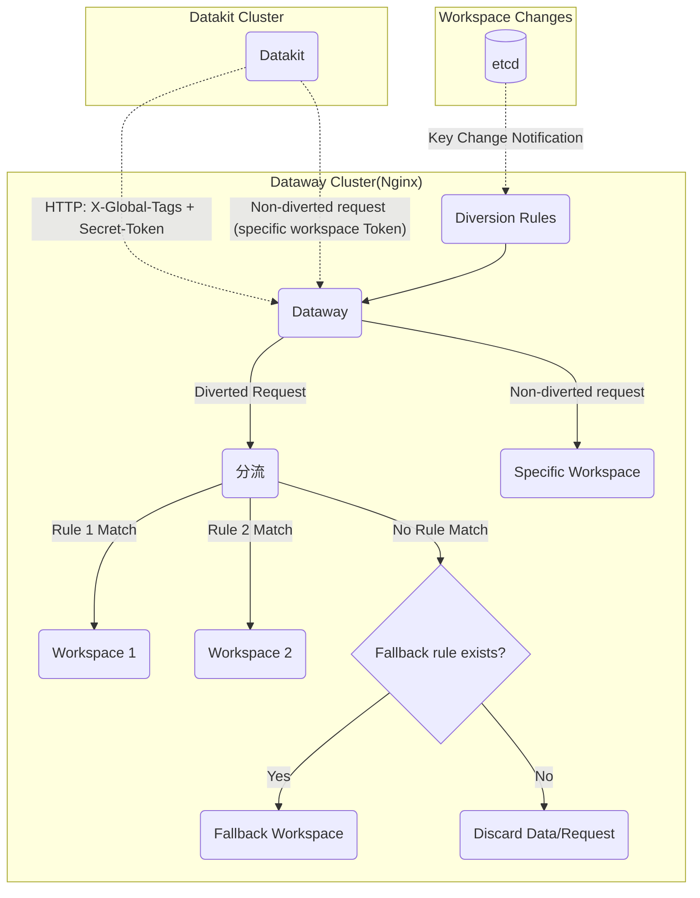
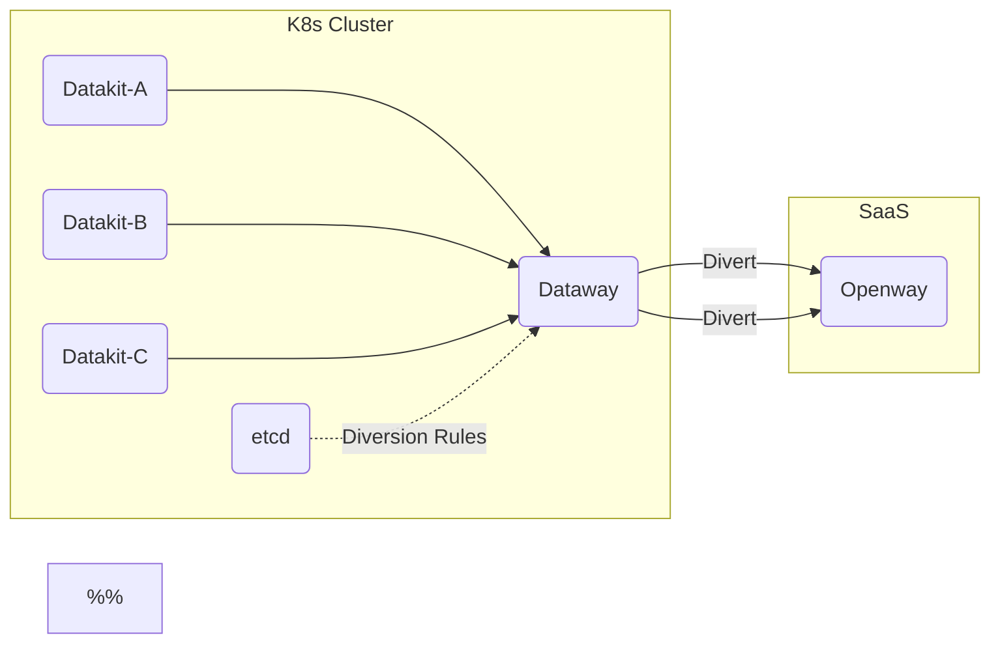

<!-- Do not modify this file directly in the dataflux-doc repository, as it is automatically exported by the Dataway project -->

# Dataway Sink
---

[:octicons-tag-24: Version-1.14.0](../datakit/changelog.md#cl-1.14.0) This version of Datakit enables the use of the Sinker feature described here.

---

## Introduction to Dataway Sinker Functionality {#sink-intro}

During routine data collection processes, due to the existence of multiple different workspaces, we may need to direct different data to different workspaces. For example, in a shared Kubernetes cluster, the collected data might involve different teams or business departments. In such cases, we can route data with specific attributes to various distinct workspaces to achieve fine-grained collection under a shared infrastructure scenario.

The basic network topology is as follows:



> [Dataway 1.8.0](dataway-changelog.md#cl-1.8.0) supports receiving both Sinker and non-Sinker types of requests, so deploying only one Dataway instance is sufficient.

### Cascaded Mode for Dataway {#cascaded}

For SaaS users, a Dataway can be deployed locally (on k8s Cluster) specifically for diversion, and then forward the data to Openway:

<!-- markdownlint-disable MD046 -->
???+ warning

    In cascaded mode, the Dataway within the cluster needs to enable the cascaded option. Refer to the [environment variable description](dataway.md#dw-envs) in the installation documentation.
<!-- markdownlint-enable -->



Impact of cascading:

- Some API behaviors will differ. Due to historical reasons, there are differences between the request URLs from Datakit and those on Kodo, and Dataway plays a role in API translation. In cascaded situations, the API translation function is disabled.
- The cascaded Dataway will not send heartbeat requests to the center. Because the next-level Dataway does not process this request (so it results in a 404).
- For requests received by the cascaded Dataway, when they are forwarded to the next Dataway, no API signature will be applied.

## Dataway Installation {#dw-install}

Refer to [here](dataway.md#install)

## Dataway Configuration {#dw-config}

In addition to regular Dataway settings, several additional configurations need to set (located at */usr/local/cloudcare/dataflux/dataway/dataway.yaml*):

```yaml
# Set the address where Dataway uploads data; usually Kodo, but it could also be another Dataway
remote_host: https://kodo.<<< custom_key.brand_main_domain >>>

# If the upload address is Dataway, this should be set to true, indicating Dataway cascading
cascaded: false

# This token is an arbitrary segment set on Dataway; it needs to be filled into the 
# Datakit's datakit.conf configuration. It should maintain a certain length and format.
secret_token: tkn_xxxxxxxxxxxxxxxxxxxxxxxxxxxxxxxx

# Sinker rules setting
sinker:
  etcd: # Supports etcd
    urls:
    - http://localhost:2379
    dial_timeout: 30s
    key_space: /dw_sinker
    username: "dataway"
    password: "<PASSWORD>"

  #file: # Also supports local file method, commonly used for debugging
  #  path: /path/to/sinker.json
```

<!-- markdownlint-disable MD046 -->
???+ warning

    If `secret_token` is not set, any request sent by Datakit will pass, which will not cause data issues. However, if Dataway is deployed on the public internet, it is still recommended to set the `secret_token`.
<!-- markdownlint-enable -->

### Sinker Rules Configuration {#setup-sinker-rules}

Dataway Sinker rules are a set of JSON-formatted configurations, where the matching rule syntax is consistent with the blacklist writing style. Refer to [here](../datakit/datakit-filter.md).


Currently, two sources of configuration are supported:

- Specify a local JSON file, mainly used for debugging Sinker rules. In this case, after updating the Sinker rules in the JSON file, **Dataway needs to be restarted for the changes to take effect**.
- etcd: Store debugged rules in etcd, and update them directly in etcd when making minor adjustments, **without needing to restart Dataway**.

Actually, the JSON content stored in etcd is the same as the local file's JSON content. Below, only the etcd management method is introduced.

#### etcd Configuration {#etcd-settings}

> All commands below are executed on Linux.

As an etcd client, Dataway can configure the following username and roles in etcd (etcd 3.5+), refer to [here](https://etcd.io/docs/v3.5/op-guide/authentication/rbac/#using-etcdctl-to-authenticate){:target="_blank"}

Create the `dataway` account and corresponding role:

```shell
# Add username, it will prompt for password input
$ etcdctl user add dataway

# Add the sinker role
$ etcdctl role add sinker

# Add dataway to the role
$ etcdctl user grant-role dataway sinker

# Restrict role's key permissions (the keys /dw_sinker and /ping are used by default)
$ etcdctl role grant-permission sinker readwrite /dw_sinker
$ etcdctl role grant-permission sinker readwrite /ping       # Used for connectivity checks
```

<!-- markdownlint-disable MD046 -->
???+ info "Why create roles?"

    Roles control permissions for specific users on certain keys. Here, we may be using an existing etcd service, so it is necessary to restrict the data permissions for the Dataway user.

???+ warning

    If etcd has enabled [authentication mode](https://etcd.io/docs/v3.5/op-guide/authentication/rbac/#enabling-authentication){:target="_blank"}, when executing `etcdctl` commands, the corresponding username and password must be provided:

    ```shell
    $ etcdctl --user name:password ...
    ```
<!-- markdownlint-enable -->

#### Writing Sinker Rules {#prepare-sink-rules}

> New versions (1.3.6) of Dataway support managing etcd Sinker rules via the `dataway` command.

Assume that the *sinker.json* rule definition is as follows:

```json
{
    "strict":true,
    "rules": [
        {
            "rules": [
                "{ host = 'my-host'}"
            ],
            "url": "https://kodo.<<< custom_key.brand_main_domain >>>?token=tkn_xxxxxxxxxxxxxxxxxxxxxxxxxxxxxxxx"
        },
        {
            "rules": [
                "{ host = 'my-host' OR cluster = 'cluster-A' }"
            ],
            "url": "https://kodo.<<< custom_key.brand_main_domain >>>?token=tkn_yyyyyyyyyyyyyyyyyyyyyyyyyyyyyyyy"
        }
     ]
}
```

The following command writes the Sinker rule configuration:

```shell
$ etcdctl --user dataway:PASSWORD put /dw_sinker "$(<sinker.json)"
OK
```

<!-- markdownlint-disable MD046 -->
???+ tip "Identifying Workspace Information"

    Since *sinker.json* does not support comments, we can add an `info` field in the JSON to serve as a memo, achieving the effect of commenting:

    ``` json hl_lines="5"
    {
        "rules": [
            "{ host = 'my-host' OR cluster = 'cluster-A' }"
        ],
        "info": "This is the yyy workspace",
        "url": "https://kodo.<<< custom_key.brand_main_domain >>>?token=tkn_yyyyyyyyyyyyyyyyyyyyyyyyyyyyyyyy"
    }
    ```
<!-- markdownlint-enable -->

#### Default Rule {#default-rule}

[:octicons-tag-24: Version-1.6.0](dataway-changelog.md#cl-1.6.0)

By adding the `as_default` identifier in a specific rule entry, you can set that rule as the default fallback rule. A fallback rule does not require any match conditions (no `rules` field configured); simultaneously, it should not participate in regular rule matching. A recommended fallback rule is as follows:

``` json hl_lines="2"
{
    "as_default": true,
    "info": "This is the default fallback workspace",
    "url": "https://kodo.<<< custom_key.brand_main_domain >>>?token=tkn_xxxxxxxxxxxxxxxxxxxxxxxxxxxxxxxx"
}
```

> Note: Only one fallback rule should be set. If multiple fallback rules exist in the Sinker configuration, the last one takes precedence.

### Token Rules {#spec-on-secret-token}

Since Datakit will check the tokens on Dataway, the `token` (including `secret_token`) set here must meet the following conditions:

> Start with `token_` or `tkn_`, followed by 32 characters.

For tokens that do not meet these conditions, Datakit installation will fail.

## Datakit End Configuration {#config-dk}

In Datakit, we need to make a few settings so that it can tag the collected data with specific labels for grouping.

- Configure the Global Custom Key List

Datakit will search for fields with these Keys in its collected data (only string type fields are searched) and extract them as the basis for grouped sending.

<!-- markdownlint-disable MD046 -->
=== "Host Installation"

    Refer to [here](../datakit/datakit-install.md#env-sink)

=== "Kubernetes"

    Refer to [here](../datakit/datakit-daemonset-deploy.md#env-sinker)
<!-- markdownlint-enable -->

- Configure "Global Host Tag" and "Global Election Tag"

All Datakit uploaded data will carry the configured global tags (including tag key and tag value) as the basis for grouped sending.

<!-- markdownlint-disable MD046 -->
=== "Host Installation"

    Refer to [here](../datakit/datakit-install.md#common-envs)

=== "Kubernetes"

    Refer to [here](../datakit/datakit-daemonset-deploy.md#env-common)
<!-- markdownlint-enable -->

### Datakit End Customer Key Configuration {#dk-customer-key}

If you want the data collected by a specific Datakit to meet the requirements for diversion, ensure the following points:

- Datakit has enabled the Sinker feature
- Datakit has configured an effective Global Customer Key

These configurations are as follows:

```toml
# /usr/local/datakit/conf.d/datakit.conf
[dataway]

  # Specify a group of customer keys
  global_customer_keys = [
    # Example: Add category and class two keys
    # Not too many keys should be configured here, generally 2 ~ 3 keys are sufficient
    "category",
    "class",
  ]

  # Enable sinker functionality
  enable_sinker = true
```

Besides testing data and [regular data classifications](../datakit/apis.md#category), it also supports [Session Replay](../integrations/rum.md#rum-session-replay) and [Profiling](../integrations/profile.md) binary file data. Therefore, all field names can be selected here, but note that **non-string type fields should not be configured**, normal Keys generally come from Tags (all Tag values are string types). Datakit will not use non-string type fields as diversion criteria.

#### Influence of Global Tags {#dk-global-tags-on-sink}

Besides `global_customer_keys`, the [global Tags](../datakit/datakit-conf.md#set-global-tag) configured on Datakit (including global election Tags and global host Tags) also affect the diversion marking. That is, if the data point contains fields that appear in the global Tags (these field values must be string types), they will also be included in the diversion. Assume the global election Tags are as follows:

```toml
# datakit.conf
[election.tags]
    cluster = "my-cluster"
```

For the following data point:

```not-set
pi,cluster=cluster_A,app=math,other_tag=other_value value=3.14 1712796013000000000
```

Since the global election Tags contain `cluster` (regardless of the value configured for the Tag), the point itself also has the `cluster` Tag. In the final `X-Global-Tags`, `cluster=cluster_A` will be appended:

```not-set
X-Global-Tags: cluster=cluster_A
```

If `global_customer_keys` also configures `app` as a key, the final diversion Header will be (the order of the key-value pairs is not important):

```not-set
X-Global-Tags: cluster=cluster_A,app=math
```

<!-- markdownlint-disable MD046 -->
???+ note

    In this example, the value of `cluster` configured in *datakit.conf* is intentionally set differently from the `cluster` field value in the data point, mainly to emphasize the influence of the Tag Key. You can understand that once a qualified global Tag Key appears in the data point, **its effect is equivalent to adding this global Tag Key to `global_customer_keys`**.
<!-- markdownlint-enable -->

## Dataway Sink Command {#dw-sink-command}

Starting from version [:octicons-tag-24: Version-1.3.6](dataway-changelog.md#cl-1.3.6), Dataway supports managing `sinker` configurations via the command line. Specific usage is as follows:

```shell
$ ./dataway sink --help

Usage of sink:
  -add string
        single rule json file
  -cfg-file string
        configure file (default "/usr/local/cloudcare/dataflux/dataway/dataway.yaml")
  -file string
        file path of the rule json, only used for command put and get
  -get
        get the rule json
  -list
        list rules
  -log string
        log file path (default "/dev/null")
  -put
        save the rule json
  -token string
        rules filtered by token, eg: xx,yy
```

**Specifying Configuration File**

By default, the command loads the configuration file `/usr/local/cloudcare/dataflux/dataway/dataway.yaml`. If you need to load other configurations, specify it through `--cfg-file`.

```shell
$ ./dataway sink --cfg-file dataway.yaml [--list...]
```

**Command Log Settings**

By default, command output logs are disabled. To view them, set the `--log` parameter.

```shell
# Output log to stdout
$ ./dataway sink --list --log stdout

# Output log to file
$ ./dataway sink --list --log /tmp/log
```

**Viewing Rule List**

```shell

# List all rules
$ ./dataway sink --list

# List all rules filtered by token
$ ./dataway sink --list --token=token1,token2

CreateRevision: 2
ModRevision: 41
Version: 40
Rules:
[
    {
        "rules": [
            "{ workspace = 'zhengb-test'}"
        ],
        "url": "https://openway.<<< custom_key.brand_main_domain >>>?token=token1"
    }
]
```

**Adding Rules**

Create a rule file `rule.json`, reference content as follows:

```json
[
  {
    "rules": [
      "{ host = 'HOST1'}"
    ],
    "url": "https://openway.<<< custom_key.brand_main_domain >>>?token=tkn_xxxxxxxxxxxxx"
  },
  {
    "rules": [
      "{ host = 'HOST2'}"
    ],
    "url": "https://openway.<<< custom_key.brand_main_domain >>>?token=tkn_yyyyyyyyyyyyy"
  }
]

```

Add rules

```shell
$ ./dataway sink --add rule.json

add 2 rules ok!

```

**Exporting Configuration**

Exporting configuration allows exporting the `sinker` configuration to a local file.

```shell
$ ./dataway sink --get --file sink-get.json

rules json was saved to sink-get.json!

```

**Writing Configuration**

Writing rules synchronizes the local rule file to `sinker`.

Create a rule file `sink-put.json`, reference content as follows:

```json
{
    "rules": [
        {
            "rules": [
                "{ workspace = 'test'}"
            ],
            "url": "https://openway.<<< custom_key.brand_main_domain >>>?token=tkn_xxxxxxxxxxxxxx"
        }
    ],
    "strict": true
}

```

Write configuration

```shell
$ ./dataway sink --put --file sink-put.json
```

## Configuration Examples {#config-examples}

<!-- markdownlint-disable MD046 -->
??? info "Example of dataway.yaml in Kubernetes (expand to view)"

    Directly specify sinker JSON in yaml:


    ```yaml
    ---
    apiVersion: apps/v1
    kind: Deployment
    metadata:
      labels:
        app: deployment-utils-dataway
      name: dataway
      namespace: utils
    spec:
      replicas: 1
      selector:
        matchLabels:
          app: deployment-utils-dataway
      template:
        metadata:
          labels:
            app: deployment-utils-dataway
          annotations:
            datakit/logs: |
              [{"disable": true}]
            datakit/prom.instances: |
              [[inputs.prom]]
                url = "http://$IP:9090/metrics" # Port (default 9090) depends on circumstances
                source = "dataway"
                measurement_name = "dw" # Fixed as this Measurement
                interval = "10s"

                [inputs.prom.tags]
                  namespace = "$NAMESPACE"
                  pod_name = "$PODNAME"
                  node_name = "$NODENAME"
        spec:
          affinity:
            podAffinity: {}
            podAntiAffinity:
              requiredDuringSchedulingIgnoredDuringExecution:
                - labelSelector:
                    matchExpressions:
                      - key: app
                        operator: In
                        values:
                          - deployment-utils-dataway
                  topologyKey: kubernetes.io/hostname

          containers:
          - image: registry.jiagouyun.com/dataway/dataway:1.3.6 # Select an appropriate version number
            #imagePullPolicy: IfNotPresent
            imagePullPolicy: Always
            name: dataway
            env:
            - name: DW_REMOTE_HOST
              value: "http://kodo.forethought-kodo:9527" # Fill in the real Kodo address or the next Dataway address
            - name: DW_BIND
              value: "0.0.0.0:9528"
            - name: DW_UUID
              value: "agnt_xxxxx" # Fill in the real Dataway UUID
            - name: DW_TOKEN
              value: "tkn_oooooooooooooooooooooooooooooooo" # Fill in the real Dataway token, generally the system workspace token
            - name: DW_PROM_LISTEN
              value: "0.0.0.0:9090"
            - name: DW_SECRET_TOKEN
              value: "tkn_zzzzzzzzzzzzzzzzzzzzzzzzzzzzzzzz"
            - name: DW_SINKER_FILE_PATH
              value: "/usr/local/cloudcare/dataflux/dataway/sinker.json"
            ports:
            - containerPort: 9528
              name: 9528tcp01
              protocol: TCP
            volumeMounts:
              - mountPath: /usr/local/cloudcare/dataflux/dataway/cache
                name: dataway-cache
              - mountPath: /usr/local/cloudcare/dataflux/dataway/sinker.json
                name: sinker
                subPath: sinker.json
            resources:
              limits:
                cpu: '4'
                memory: 4Gi
              requests:
                cpu: 100m
                memory: 512Mi
          # nodeSelector:
          #   key: string
          imagePullSecrets:
          - name: registry-key
          restartPolicy: Always
          volumes:
          - hostPath:
              path: /root/dataway_cache
            name: dataway-cache
          - configMap:
              name: sinker
            name: sinker
    ---

    apiVersion: v1
    kind: Service
    metadata:
      name: dataway
      namespace: utils
    spec:
      ports:
      - name: 9528tcp02
        port: 9528
        protocol: TCP
        targetPort: 9528
        nodePort: 30928
      selector:
        app: deployment-utils-dataway
      type: NodePort

    ---
    apiVersion: v1
    kind: ConfigMap
    metadata:
      name: sinker
      namespace: utils
    data:
      sinker.json: |
        {
            "strict":true,
            "rules": [
                {
                    "rules": [
                        "{ project = 'xxxxx'}"
                    ],
                    "url": "http://kodo.forethought-kodo:9527?token=tkn_xxxxxxxxxxxxxxxxxxxxxxxxxxxxxxxx"
                },
                {
                    "rules": [
                        "{ project = 'xxxxx'}"
                    ],
                    "url": "http://kodo.forethought-kodo:9527?token=tkn_yyyyyyyyyyyyyyyyyyyyyyyyyyyyyyyy"
                }
             ]
        }
    ```

<!-- markdownlint-enable -->

<!-- markdownlint-disable MD046 -->
??? info "Ingress Configuration Example (Expand to View)"

    ```yaml
    apiVersion: networking.k8s.io/v1
    kind: Ingress
    metadata:
      name: dataway-sinker
      namespace: utils
    spec:
      ingressClassName: nginx
      rules:
      - host: datawaysinker-xxxx.com
        http:
          paths:
          - backend:
              service:
                name: dataway
                port:
                  number: 9528
            path: /
            pathType: ImplementationSpecific
    ```

<!-- markdownlint-enable -->

## FAQ {#faq}

### Viewing Details of Dropped Requests {#dropped-request}

[:octicons-tag-24: Version-1.3.7](dataway-changelog.md#cl-1.3.7)

When a request does not meet the Sinker rules, Dataway will drop the request and increase a discard count in the metrics. During the debugging phase, we need to know the specific situation of a dropped request, especially the `X-Global-Tags` information carried in the request Header.

We can search the Dataway logs using the following command:

``` bash
$ cat <path/to/dataway/log> | grep dropped
```

In the output, we can see similar outputs like the following:

``` not-set
for API /v1/write/logging with X-Global-Tags <some-X-Global-Tags...> dropped
```

### Troubleshooting Datakit Requests Being Dropped {#dk-http-406}

[:octicons-tag-24: Version-1.3.9](dataway-changelog.md#cl-1.3.9)

When a Datakit request is discarded by Dataway, Dataway returns the corresponding HTTP error, and in the Datakit logs, there will be similar errors like the following:

```not-set
post 3641 to http://dataway-ip:9528/v1/write/metric failed(HTTP: 406 Not Acceptable):
{"error_code":"dataway.sinkRulesNotMatched","message":"X-Global-Tags: `host=my-host',
URL: `/v1/write/metric'"}, data dropped
```

This error indicates that the request `/v1/write/metric` was discarded because its X-Global-Tags did not satisfy any of the Dataway rules.

At the same time, in the Datakit monitor (`datakit monitor -V`), in the lower-right `DataWay APIs` panel, the column `Status` will show `Not Acceptable`, indicating that the corresponding Dataway API request was discarded.

Checking the Datakit internal metrics also reveals the corresponding metric:

```shell
$ curl -s http://localhost:9529/metrics | grep datakit_io_dataway_api_latency_seconds_count

datakit_io_dataway_api_latency_seconds_count{api="/v1/datakit/pull",status="Not Acceptable"} 50
datakit_io_dataway_api_latency_seconds_count{api="/v1/write/metric",status="Not Acceptable"} 301
```

### Datakit Error 403 {#dk-403}

If the Sinker configuration on Dataway is incorrect, causing all Datakit requests to use `secret_token`, and this token is not recognized by the center (Kodo), hence reporting a 403 error `kodo.tokenNotFound`.

This issue might occur due to incorrect etcd username/password, causing Dataway to fail to obtain the Sinker configuration, leading Dataway to consider the current Sinker invalid and all data being directly transmitted to the center.

### etcd Permission Configuration Issues {#etcd-permission}

If the Dataway logs contain the following error, it suggests there might be permission issues:

```not-set
sinker ping: etcdserver: permission denied, retrying(97th)
```

If the permission configuration is inappropriate, all existing Dataway-based permissions can be deleted and reconfigured. Refer to [here](https://etcd.io/docs/v3.5/op-guide/authentication/rbac/#using-etcdctl-to-authenticate){:target="_blank"}

### Key Overriding Relationship on the Datakit End {#key-priority}

When configuring the "Global Custom Key List", if the "Global Host Tag" and "Global Election Tag" also have keys with the same name, the corresponding Key-Value pair in the collected data is used.

For example, if the "Global Custom Key List" includes `key1,key2,key3`, and the "Global Host Tag" or "Global Election Tag" also configures these keys with corresponding values, such as `key1=value-1`, and in some data collection, there is also a field `key1=value-from-data`, then the final grouping basis uses the `key1=value-from-data` from the data, ignoring the corresponding Key Value configured in the "Global Host Tag" and "Global Election Tag".

If there are keys with the same name between the "Global Host Tag" and the "Global Election Tag", the "Global Election Tag" key takes priority. In summary, the priority of Key value sources (decreasing) is as follows:

- Collected data
- Global Election Tag
- Global Host Tag

### Built-in "Global Custom Keys" {#reserved-customer-keys}

Datakit includes several available custom Keys by default, which generally do not appear in the collected data, but Datakit can use these Keys to group data. If there is a need for diversion in these Key dimensions, they can be added to the "Global Custom Key" list (these Keys are not configured by default). We can use the following built-in custom Keys to achieve data diversion.

<!-- markdownlint-disable MD046 -->
???+ warning

    Adding "Global Custom Keys" causes data to be sent in separate packages. If the granularity is too fine, it significantly reduces the efficiency of Datakit uploads. Generally, "Global Custom Keys" should not exceed three.
<!-- markdownlint-enable -->

- `class` Targets object data, enabling it will divert based on object classification. For example, the object classification for Pod is `kubelet_pod`, so rules can be made for Pods accordingly:

``` json
{
    "strict": true,
    "rules": [
        {
            "rules": [
                "{ class = 'kubelet_pod' AND other_conditon = 'some-value' }",
            ],
            "url": "https://kodo.<<< custom_key.brand_main_domain >>>?token=<YOUR-TOKEN>"
        },
        {
            ... # other rules
        }
    ]
}
```

- `measurement` Targets metric data, we can direct specific Measurements to specific workspaces. For example, if the name of the disk Measurement is `disk`, we can write the rule as follows:

```json
{
    "strict": true,
    "rules": [
        {
           "rules": [
               "{ measurement = 'disk' AND other_conditon = 'some-value' }",
           ],
           "url": "https://kodo.<<< custom_key.brand_main_domain >>>?token=<YOUR-TOKEN>"
        },
        {
            ... # other rules
        }
    ]
}
```

- `source` Targets logs (L), eBPF network metrics (N), events (E), and RUM data
- `service` Targets Tracing, Scheck, and Profiling
- `category` Targets all [standard data categories](../datakit/apis.md#category), whose values correspond to the "name" column of each data category (e.g., time series is `metric`, objects are `object`). Taking logs as an example, we can create diversion rules specifically for logs as follows:

``` json
{
    "strict": true,
    "rules": [
        {
            "rules": [
                "{ category = 'logging' AND other_conditon = 'some-value' }",
            ],
            "url": "https://kodo.<<< custom_key.brand_main_domain >>>?token=<YOUR-TOKEN>"
        },
        {
            ... # other rules
        }
    ]
}
```

### Special Diversion Behavior {#special-sink-rule}

Some requests initiated by Datakit aim to pull resources from the center or perform self-identification. These actions are already atomic and cannot be further divided, nor can these requests be distributed to multiple workspaces (because Datakit needs to handle the return of these API requests and decide its subsequent behavior). Hence, these APIs can only be diverted to one workspace.

If multiple conditions are met in the diversion rules, these APIs will **only be diverted to the workspace specified by the first rule that meets the condition**.

Below is an example of such diversion:

> We recommend adding the following rule in the Sinker rules, so that these API requests already present in Datakit can be routed to a specific workspace.

``` json
{
    "strict": true,
    "info": "Special workspace (used only for data pulling and similar APIs)",
    "rules": [
        {
            "rules": [
                "{ __dataway_api in ['/v1/datakit/pull', '/v1/election', '/v1/election/heartbeat', '/v1/query/raw', '/v1/workspace', '/v1/object/labels', '/v1/check/token'] }",
            ],
            "url": "https://kodo.<<< custom_key.brand_main_domain >>>?token=<SOME-SPECIAL-WORKSPACE-TOKEN>"
        }
    ]
}
```

<!-- markdownlint-disable MD046 -->
???+ info

    Explanation of these API URLs:
        
    - `/v1/election`: Election request
    - `/v1/election/heartbeat`: Election heartbeat request
    - `/v1/datakit/pull`: Pull Pipeline and blacklist configurations from the center
    - `/v1/query/raw`: DQL query
    - `/v1/workspace`: Get workspace information
    - `/v1/object/labels`: Update/Delete object data
    - `/v1/check/token`: Check workspace Token information
<!-- markdownlint-enable -->

Here, the key `__dataway_api` does not need to be configured in the `global_customer_keys` in *datakit.conf*. Dataway defaults this as a diversion Key, using the current request's API route as its value. That is, for a certain API:

```text
POST /v1/some/api
X-Global-Tags: cluster=cluster_A,app=math
```

Its final diversion effect is the same as the following:

```text
POST /v1/some/api
X-Global-Tags: cluster=cluster_A,app=math,__dataway_api=/v1/write/metrics
```

Therefore, we can directly use the KV pair `__dataway_api` in the Sink rule for matching. This also reminds us that in this special rule, **do not include other important data upload APIs**, such as `/v1/write/...` interfaces, otherwise, the space where the data eventually lands is undefined.