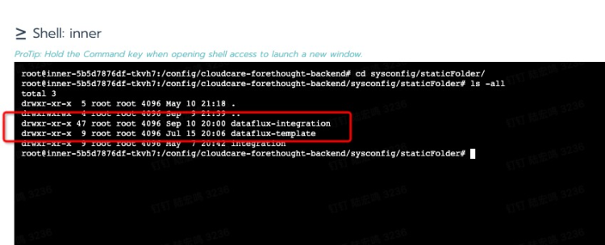

# FAQ

## 1 How to Update Various Offline Packages Manually
This section describes how to manually update the **view template package**, **metric dictionary**, **official Pipeline package** in an offline environment without upgrading the guance version.
### 1.1 How to Update the View Template Package in an Offline Environment 

1.Download the Latest View Template Package: 

[https://gitee.com/dataflux/dataflux-template](https://gitee.com/dataflux/dataflux-template)

2.Upload to Container Persistence: 

The upload directory is in the persistent storage directory corresponding to the /config/cloudcare-forethought-backend/sysconfig/staticFolder directory mounted by the forethought-core => inner container. The upload directory structure is as follows: 



3.Enter the forethought-core => inner container to the default working directory: /config/cloudcare-forethought-backend

4.Execute the Python command to enter the Python environment:


5.Execute the following two Python commands:

from forethought.tasks.timed_sync_integration import execute_update_integration
execute_update_integration()

**The following prompt indicates successful execution:**


### 1.2 How to Update Metrics Dictionary json in Offline Environment

1.Download the latest metrics dictionary JSON file

[https://static.guance.com/datakit/measurements-meta.json](https://static.guance.com/datakit/measurements-meta.json)

2.Upload to container persistence

上传目录为forethought-core => inner 容器挂载的 /config/cloudcare-forethought-backend/sysconfig/staticFolder/metric 目录对应的持久化存储目录中，文件名为 metric_config.json ，上传的目录结构如下：


### 1.3 How to Update the Official Pipeline Library in Offline Environment

1.Download the latest metrics dictionary JSON file

[https://static.guance.com/datakit/internal-pipelines.json](https://static.guance.com/datakit/internal-pipelines.json)

2.Upload to container persistence

The upload directory is in the persistent storage directory corresponding to the /config/cloudcare-forethought-backend/sysconfig/staticFolder/ metric directory mounted by the forethought-core => inner container. The file name is metric_config.json, and the upload directory structure is as follows:


## 2 There is a problem in the initial installation. What should I do if I need to clean it up and reinstall it?
**Note: If there is a problem during the initial installation and you need to eliminate the reinstallation scene, please confirm carefully before performing the following cleaning steps!**

If installation problems occur, you need to remove them all and reinstall them. And you need to clean up the following three places before you can reinstall the Guance from Launcher:
### 2.1 Clean up the installed Guance application service
To clean up various Guance application services installed in Kubernetes, you can enter the Launcher container on the operation and maintenance operator and execute the cleaning script provided by Launcher:
```
kubectl exec -it launcher-xxxxxxxx-xxx -n launcher /bin/bash
```
**launcher-xxxxxxxx-xxx is your launcher service pod name!**
When you enter the container, you can see the k8s-clear.sh（version after 1.47.103 , this script is in the /config/tools directory) script that comes with the Launcher service. Executing this script will clean up all the resources of Guance application service and k8s:


### 2.2 Cleaning up automatically created databases in MySQL
You can enter the Launcher container, which comes with the MySQL client tool, and connect to Guance MySQL instance using the following command:
```
mysql -h <mysql 实例 host> -u root -P <mysql 端口> -p  
```
You need to use MySQL administrator account to connect. After connecting, execute the following 6 MySQL database and user cleaning commands:
```
drop database df_core;
drop user df_core;
drop database df_message_desk;
drop user df_message_desk;
drop database df_func;
drop user df_func;
```
### 2.3 Cleaning up Automatically Created Users in InfuxDB
Using the infux client tool, connect to InfuxDB and execute the following two user cleanup commands:
```
drop user user_wr;
drop user user_ro;
```
## 3 Deployment Considerations
### 3.1 After deployment, can we manually modify the Kubernetes resources automatically generated by Setup?
**You can't modify manually**, because after the next new version is released, when you upgrade and install with Launcher, resources such as **Deployment, Service and Ingress** will be regenerated according to the configuration information filled in during installation (except Configmap, the information in Configmap configuration items can be modified manually at will, but random modification may cause abnormal program operation).

## 4 Stand-alone container Rancher Server certificate update
### 4.1 How to deal with certificates that have not expired
The rancher server works properly. After upgrading to Rancher v2.0.14+, v2.1.9+, v2.2.2+, the validity period of the certificate will be automatically checked, and if it is found that the certificate is about to expire, a new certificate will be automatically generated. Therefore, rancher Server running in a stand-alone container only needs to upgrade the rancher version to a version that supports automatic updating of ssl certificates before the certificate expires, and no other operations are needed.
### 4.2 What should I do if the certificate has expired
 The rancher server is not functioning properly. Even if you upgrade to Rancher v2.0. 14 +, v2.1. 9 +, v2.2. 2 +, you may be prompted with a certificate error. If this happens, you can handle it by doing the following:

1.Upgrade the rancher version to v2.0.14+, v2.1.9+ and v2.2.2+ normally;

2.Execute the following orders:

- 2.0 or 2.1 version

```shell
docker exec -ti <rancher_server_id>mv /var/lib/rancher/management-state/certs/bundle.json /var/lib/rancher/management-state/certs/bundle.json-bak
```

- 2.2 +

```shell
docker exec -ti <rancher_server_id>mv /var/lib/rancher/management-state/tls/localhost.crt /var/lib/rancher/management-state/tls/localhost.crt-bak
```

- 2.3 +

```shell
 docker exec -ti <rancher_server_id>mv /var/lib/rancher/k3s/server/tls /var/lib/rancher/k3s/server/tlsbak
 
 # Execute both sides, the first time is used to apply for a certificate, and the second time is used to load the certificate and start
 docker restart <rancher_server_id>
```

- 2.4 +

​       a. exec to rancher server

```shell
kubectl --insecure-skip-tls-verify -n kube-system delete secrets k3s-serving
kubectl --insecure-skip-tls-verify delete secret serving-cert -n cattle-system
rm -f /var/lib/rancher/k3s/server/tls/dynamic-cert.json
```

​      b. restart rancher-server

```shell
docker restart <rancher_server_id>
```

​      c. Execute the following command to refresh the parameters

```shell
curl --insecure -sfL https://server-url/v3
```

3.restart Rancher Server container

```shell
docker restart <rancher_server_id>
```
## 5 The rancher server certificate has expired and cannot handle k8s cluster processing
If the cluster certificate has expired, you cannot rotate the certificate even if you upgrade to Rancher v2.0.14, v2.1.9, and later. Rancher is through the Agent to update the certificate if the certificate expires will not be able to connect with the Agent.
### 5.1 Solutions
You can manually set the time of nodes and adjust the time back. Because the Agent only communicates with the K8S master and the Rancher Server, if the Rancher Server certificate does not expire, then only the K8S master node time needs to be adjusted.
Adjustment command:
```shell
# Turn off ntp synchronization or the time will be updated automatically
timedatectl set-ntp false
# Modify Node Time
timedatectl set-time '2019-01-01 00:00:00'
```

Then upgrade Rancher Server and wait until the certificate rotation is complete before synchronizing the time back.
```shell
timedatectl set-ntp true
```
Check the validity period of the certificate
```shell
openssl x509 -in /etc/kubernetes/ssl/kube-apiserver.pem -noout -dates
```

## 6 Why can't you see the created DataWay in the foreground
### 6.1 Common Cause Analysis

-       The Dataway service does not function properly after being deployed to the server.
-       Data service configuration file error, not configured for correct listening, workspace token information.
-       The dataway service is running incorrectly, which can be located by looking at the dataway log.
-       The server where Dataway is deployed cannot communicate with the kodo service. (Including the correct parsing of the df-kodo service that the dataway server did not add to the hosts)
-       kodo service exception, which can be confirmed by viewing kodo service log.
-       The-df-kodo ingress service is not configured correctly. The specific performance is that it cannot be accessed `http|https://df-kodo.<xxxx>:<port>`
# 7 Why can't you use the dial test service
## 7.1 Cause analysis

-       The deployed Guance application is in an offline environment, and the physical node network environment cannot leave the network. (More common)
-       Self-built detection node network anomaly.
-       Regional vendor network exception.
-       Error in creating dialing test task.
