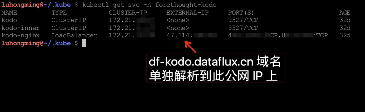

# Launcher Service Installation and Configuration

## Product Introduction
   Used to deploy the <<< custom_key.brand_name >>> WEB application. Follow the steps guided by the Launcher service to complete the installation and upgrade of <<< custom_key.brand_name >>>.


## Keywords

| **Term** | **Description** |
| --- | --- |
| Launcher | Used to deploy the <<< custom_key.brand_name >>> WEB application. Follow the steps guided by the Launcher service to complete the installation and upgrade of <<< custom_key.brand_name >>>. |
| Operations Machine | A machine that has kubectl installed and is on the same network as the target Kubernetes cluster. |
| Installation Machine | A machine used to access the Launcher service via a browser to complete the guided installation of <<< custom_key.brand_name >>>. |
| hosts File | The hosts file is a system file without an extension. Its main function is to save the mapping relationship between domain names and IPs. |

## Prerequisites

[Infrastructure Deployment](basic-env-install.md#basic-install) must be completed.

## 1. Launcher Installation

???+ warning "Note"
     To deploy Launcher, ensure your rbac permission is `cluster-admin`, otherwise, deploying Launcher will result in errors.
     If you are in an offline network environment, refer to [<<< custom_key.brand_name >>> Offline Package Download and Import](get-guance-images.md#offline-image) for deployment.

=== "Helm"

    - Installation
    
      ```shell
      helm install launcher launcher --repo https://pubrepo.<<< custom_key.brand_main_domain >>>/chartrepo/launcher -n launcher \
        --create-namespace  \
        --set ingress.hostName=<Hostname>,storageClassName=<StorageClass>
      ```
    
    ???+ warning "Note"
    
        `<Hostname>` is the Launcher ingress domain name, `<StorageClass>` is the storage class name. You can get it by executing `kubectl get sc`.
    
        ```
        helm install launcher launcher --repo https://pubrepo.<<< custom_key.brand_main_domain >>>/chartrepo/launcher -n launcher \
           --create-namespace  \
           --set ingress.hostName="launcher.dataflux.cn",storageClassName=df-nfs-storage        
        ```
       
    - Uninstalling Launcher
    
    ```shell
    helm uninstall launcher -n launcher
    ```
    
    ???+ warning "Note"
        Do not uninstall Launcher unless there is an abnormal situation after successful installation.


=== "YAML"

    - YAML Installation
    
       Download Launcher YAML from: https://static.<<< custom_key.brand_main_domain >>>/launcher/launcher.yaml
     
       Save the above YAML content as **launcher.yaml** and place it on the **Operations Machine**, then replace the variable parts within the document:
    
       - Replace {{ launcher_image }} with the latest Launcher application image address, which can be obtained from the [Deployment Image](changelog.md) documentation.
       - Replace {{ domain }} with the main domain, e.g., dataflux.cn.
       - Replace {{ storageClassName }} with the storage class name, e.g., alicloud-nas.
    
       Resources configured with a default storage class will display `default`. Refer to the following figure:
    
       
    
       Execute the following **kubectl** command on the **Operations Machine** to import the **Launcher** service:
       ```shell
       kubectl apply -f ./launcher.yaml
       ```
    
    - YAML Uninstallation
    
      ```shell
      kubectl delete -f ./launcher.yaml
      ```
    
    ???+ warning "Note"
         Do not uninstall Launcher unless there is an abnormal situation after successful installation.

## 2. Resolving Launcher Domain Name to Launcher Service
Since the Launcher service is used for deploying and upgrading <<< custom_key.brand_name >>>, it does not need to be publicly accessible. Therefore, do not resolve the domain name to the public network. Instead, simulate domain name resolution by binding hosts on the **Installation Machine** in /etc/hosts and add the domain name binding for **launcher.dataflux.cn**

=== "Cloud Infrastructure Deployment"
    ???+ note "/etc/hosts"
         ```shell
         8.XX.176.XX  launcher.dataflux.cn
         ```
    - How to Obtain IP
      ```shell
      kubectl get svc -n kube-system
      ```
      

=== "Self-hosted Infrastructure Deployment"
    ???+ note "/etc/hosts"
     ```shell
     192.168.100.104   launcher.dataflux.cn
     ```

    - How to Obtain IP
    
      [Deploy Proxy](infra-kubernetes.md#agency-install)

## 3. Application Installation Guide {#deploy-steps}
Access **launcher.dataflux.cn** in the browser on the **Installation Machine** and follow the guided steps to complete the installation configuration.
### 3.1 Database Configuration

- The database connection address must use an internal network address.
- The account must be an administrator account because it needs to initialize multiple sub-application databases and database access accounts.


### 3.2 Cache Service Configuration
- You can choose not to enable it. If not enabled, the default cache service will be used.
- If enabled, fill in the Redis connection address, supporting standalone mode, proxy mode, and master-slave mode of Redis clusters.


### 3.3 Time Series Engine Configuration

=== "GuanceDB"
     - Input GuanceDB's insert and select
          

=== "InfluxDB"
     - The InfluxDB connection address must use an internal network address.
          - The account must be an administrator account because it needs to initialize DB and RP information.
          

### 3.4 Log Engine Configuration

=== "OpenSearch"

     - The connection address must use an internal network address.
     - The account must be an administrator account.

=== "ElasticSearch"
     - The connection address must use an internal network address.
     - The account must be an administrator account.


### 3.5 Other Settings

- Initial admin account name and email for the <<< custom_key.brand_name >>> management backend (default password is **admin**, it is recommended to change the default password immediately after login).
- Internal network IP of cluster nodes (automatically retrieved, verify if correct).
- Main domain and subdomain configurations for each sub-application. Default subdomains are as follows, modify according to needs:
   - dataflux 【**User Frontend**】
   - df-api 【**User Frontend API**】
   - df-management 【**Management Backend**】
   - df-management-api 【**Management Backend API**】
   - df-websocket 【**Websocket Service**】
   - df-func 【**Func Platform**】
   - df-openapi 【OpenAPI】
   - df-static-res 【**Static Resource Site**】
   - df-kodo 【**kodo**】

???+ warning "Note"

     The df-kodo service can optionally use an internal SLB. If DataWay and kodo are on the same internal network, choose to use the internal network during installation.

- TLS domain certificate configuration


### 3.6 Installation Information

Summarize and display the information entered previously. If any information is incorrect, return to the previous step to make changes.


### 3.7 Application Configuration File

The installation program will automatically initialize the application configuration template based on the provided installation information. However, you still need to check all application templates individually and modify personalized application configurations. Specific configuration instructions can be found on the installation interface.

Confirm everything is correct, then submit to create the configuration file.


### 3.8 Application Image

- Select the correct **shared storage**, i.e., the **storage class** name created in the previous steps.
- The application image will be automatically filled based on the selected **Launcher** version, no modification is needed. Confirm everything is correct, then start **creating the application**.


### 3.9 Application Status

This section lists the startup status of all application services. This process requires downloading all images, which may take several minutes to tens of minutes. Once all services have successfully started, it indicates that the installation is complete.

**Note: During the service startup process, you must stay on this page without closing it until you see the prompt "version information written successfully" and no error window pops up, indicating a successful installation!**


### 3.10 Domain Resolution

Resolve all subdomains except **df-kodo.dataflux.cn** to the public IP address of the SLB or the edge node ingress address:

- dataflux.dataflux.cn
- df-api.dataflux.cn
- df-management.dataflux.cn
- df-management-api.dataflux.cn
- df-openapi.dataflux.cn
- df-func.dataflux.cn
- df-static-res.dataflux.cn

<!-- === "Cloud Infrastructure Deployment"

    After service installation is complete, the cluster will automatically create a public SLB for the **kodo** service. You can use the command `kubectl get svc -n forethought-kodo` to view the EXTERNAL-IP of the kodo-nginx service. The **df-kodo.dataflux.cn** subdomain should be resolved separately to this SLB's public IP, as shown in the figure below:
    
    
    
    This SLB needs to configure an HTTPS certificate. Upload the required certificate to the SLB console and modify the SLB listener protocol to Layer 7 HTTPS. DataWay defaults to reporting data using the HTTPS protocol.
    
    ???+ warning "Note"
         
         For specific methods of accessing services through the SLB, refer to: [https://www.alibabacloud.com/help/en/doc-detail/86531.htm](https://www.alibabacloud.com/help/en/doc-detail/86531.htm)
         Edit the kodo-nginx deploy YAML file and add the following annotations:
         
         ```yaml
         service.beta.kubernetes.io/alibaba-cloud-loadbalancer-cert-id: 1642778637586298_17076818419_1585666584_-1335499667 ## Use the actual certificate ID from the console ##
         service.beta.kubernetes.io/alibaba-cloud-loadbalancer-force-override-listeners: '"true"'  ## Force override existing listeners ##
         service.beta.kubernetes.io/alibaba-cloud-loadbalancer-id: lb-k2j4h4nlg2vgiwi9jyga6   ## Load balancer instance ID ## (specify an existing slb instance)
         service.beta.kubernetes.io/alibaba-cloud-loadbalancer-protocol-port: '"https:443"'  ## Protocol type ##
         ```

=== "Self-hosted Infrastructure Deployment"

    Since local Kubernetes clusters cannot use LoadBalancer services, you need to use an edge node ingress.
     
    Download [kodo-ingress.yaml](kodo-ingress.yaml) and execute the command to install.
    ```shell
    kubectl apply -f kodo-ingress.yaml
    ```
    
    After configuration, you can deploy haproxy or nginx services on machines outside the cluster for domain proxy. For how to proxy, read [Deploy Proxy](proxy-install.md) -->

## 4. Installing DataWay (Optional) {#dataway-install}

After successful deployment, you can install a DataWay by clicking the settings icon in the top-right corner and selecting 【Install Data Gateway】.

Enter the DataWay name and binding address, click 【One-click Install】, and a success message will appear after installation.

You can also use other methods to [install DataWay](dataway-install.md).

## 5. Post-Installation

After successful deployment, refer to the manual [How to Start Using](how-to-start.md).

If issues occur during installation and you need to reinstall, refer to the manual [Maintenance Manual](faq.md).

## 6. Very Important Step!!!

After completing the above steps, <<< custom_key.brand_name >>> is fully installed. Verify everything is correct, and perform a very important step: take the Launcher service offline to prevent accidental access that could disrupt application configuration. On the **Operations Machine**, execute the following command to set the number of replicas for the Launcher service pod to 0:

```shell
kubectl patch deployment launcher \
-p '{"spec": {"replicas": 0}}' \
-n launcher
```