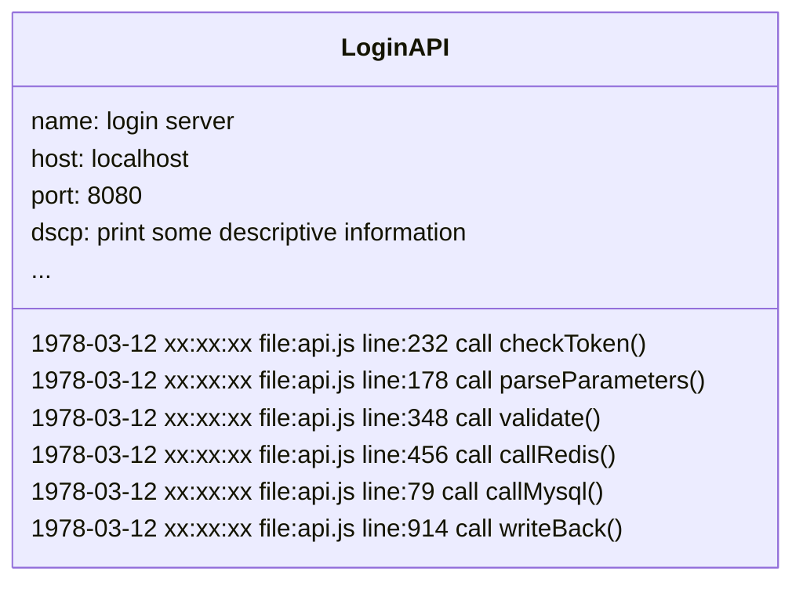
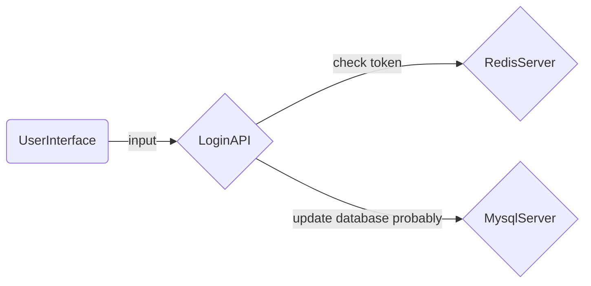

Program logs are the breadcrumbs of code execution, and following these breadcrumbs not only helps find hidden bugs :fontawesome-solid-bug: but more importantly, continuous program logs provide a way to make the process of program execution observable.

## Starting with Logs {#log}

> Only log files

Before trace systems emerged, the only way to obtain system operation status was through local logs. In fact, before trace systems, logging services went through several generations of different types of products.

By directing standard output and standard error output to a local file and leveraging the magic of operating systems, ideally we can obtain an endless stream of program execution logs. As long as the system does not crash, there are no single-point failures, and no processes interrupt your file write stream, you can always get a file that records the execution process of a process and search for events you care about in a very large file.

## Before Traceability {#befor}

> Log servers

The importance of program logs led to the creation of independent log servers. Yes, no need to worry about SPoF anymore; log servers continuously record program logs sent by processes at fixed ports.

In the early stages of log servers, their working methods were more like file servers, except the interface changed from the terminal to a browser, and searchable logs evolved from a single program to multiple programs. However, the recorded logs remained isolated records of process execution sequences. For example, the following simulates logs on a login server.

From log text, you can only see isolated program events, making it difficult to understand the program's operational state from a single execution document. In the later stages of file servers, specialized UIs for log viewing and a series of program runtime environment parameters appeared. This phase's log service became more like a database service built on log files, allowing smoother searching for program events you care about.

## Trace Systems {##tracing}

> The rise of observability

A trace system is not just a higher-level logging service; it doesn't even belong to the logging category. But it is the true breadcrumb. Trace systems generate execution state data structures (Spans) during process execution. As processing flows step by step, many Spans connect in order to form the current process's trace (Tracing). Multiple processes connected in call order form the observable execution state of the current system.

Still using a fictional login service as an example:

The above diagram only shows the trace graph produced by the trace system under multi-process conditions. In reality, within the trace system, you can also see the state of each execution process like logs. If you want, you can customize the fields in the reported state data structure (Span) and give them meaning. Trace systems are not used for debugging ("of course, bugs cannot hide in trace systems"), but they provide detailed depictions of system operations to identify system issues, thus offering a positive feedback mechanism to drive version iterations and continuously improve the system.

Trace systems mainly solve two layers of problems:

- How to collect state data

Based on the technology stack implemented by the monitored system, common [trace system solutions](datakit-tracing-introduction.md#sln) on the market provide both automatic and manual data collection methods. By monitoring the program's runtime, such as NodeJS, JAVA, C#, etc., all systems based on this technology stack can achieve automatic system tracing. At the same time, trace systems provide Tracing Libraries for all technology stacks, allowing us to introduce dependencies into projects and perform full-manual system tracing with simple code editing.

- How to organize state data

The natural caller-callee relationship during program execution means that all trace systems define state data structures in a parent-child relationship. Using ParentID and ID to link the Spans generated by the caller and the callee. Within the same process, different invocation processes (including threads in concurrent environments) pass contexts containing the caller's ID to connect the parent and child processes. Between different processes, the caller sends contexts containing its own ID across processes (via network or inter-process communication channels) to link the parent and child processes.

## Trace System Solutions {#sln}

Application Performance Monitoring (APM) capabilities in the market are indispensable for trace systems. Below is a brief introduction to some common solutions available on the market.

[DataDog](https://docs.datadoghq.com/tracing/){:target="_blank"}

: Currently the most comprehensive APM solution provider, offering monitoring and deep visualization capabilities for production environments. It provides ready-to-use performance monitoring dashboards for web services, message queues, databases, etc., to monitor all program events. Trace data can seamlessly correlate across services and containers to sessions, logs, system profiles, comprehensive detection, networks, processes, and system base metrics sets. In DataDog, you can directly pinpoint the code causing slow traces due to system bottlenecks during investigations.

[Jaeger](https://www.jaegertracing.io/docs/){:target="_blank"}

: Jaeger is an open-source distributed trace system inspired by Dapper and OpenZipkin, released by Uber Technologies. It is particularly suitable for monitoring systems based on microservices architecture and offers the following capabilities:
: - Distributed context propagation
: - Distributed transaction monitoring
: - Root cause analysis capability
: - Service dependency analysis
: - Performance optimization
: If interested in Jaeger, refer to Uber's technical team's [internal practices](https://www.uber.com/blog/distributed-tracing/){:target="_blank"}.

[OpenTelemetry](https://opentelemetry.io/docs/){:target="_blank"}

: OpenTelemetry (OTEL) is an open-source application visualization framework developed based on third-party trace protocols, providing capabilities such as detection, generation, collection, and pumping of monitoring data like trace chains, metric sets, logs, etc. As an industry standard, it is natively supported by many service providers.

[SkyWalking](https://skywalking.apache.org/docs/){:target="_blank"}

: SkyWalking is an open-source APM system that provides monitoring, tracing, diagnosis, and other capabilities for distributed cloud-native systems. Its core capabilities include:
: - Server-side metric set analysis
: - Root cause analysis capability
: - Service topology analysis
: - Service dependency analysis
: - Slow service discovery
: - Performance optimization
: - Cache monitoring, read/write performance, and slow access discovery
: - Database monitoring, slow query discovery
: - Message queue performance monitoring
: - Browser performance monitoring, root tracing capability
: - Infrastructure monitoring supporting mainstream cloud providers
: - System alerts

[Zipkin](https://zipkin.io/pages/quickstart.html){:target="_blank"}

: Zipkin is a distributed trace system that collects timestamped data to complete system monitoring and discover service-level system issues. Zipkin provides an integrated solution for data collection and querying, allowing you to jump directly from logs to traces in Zipkin's UI via a TraceID and provides retrieval capabilities based on various data.

[Datakit](<<< homepage >>>/datakit/datakit-tracing/){:target="_blank"}

: Unlike the aforementioned trace systems, Datakit does not generate any program execution state data (Span) or alter the data organization form. Datakit listens on network ports to receive trace data from major mainstream trace systems. Datakit’s trace module not only provides out-of-the-box capabilities but is almost zero-configured, allowing users to seamlessly transition from other trace systems to Datakit.

: Datakit is a trace data processing & analysis network service. As a network application, Datakit has the following characteristics:

: - Datakit can handle high-load traffic data continuously. Using multi-path local caching technology, Datakit can maintain low CPU load even when facing flood-level trace data.
: - Datakit can work continuously in a high-concurrency network request environment. It uses access policies and thread pools to handle high-concurrency network requests while keeping CPU load low.
: - Datakit can seamlessly integrate with multiple mainstream trace systems currently on the market and is continuously expanding.

: As an analytical computing tool, Datakit has the following features:

: - Highly configurable flexibility. You can use Datakit's trace data capabilities without configuration or customize various trace computing capabilities provided by Datakit, including sampling, rare trace picking, resource closure, etc., through simple configurations.
: - Efficient and distributed consistent sampling algorithms.
: - Various front-end data processing Filters meet daily data processing needs.
: - Back-end Pipeline support allows you to customize data using powerful Pipeline scripts provided by Guance before sending it to the center.

## Conclusion {#conclude}

Trace systems provide multi-dimensional, deep visualization capabilities for system execution states. They change system maintenance and development forms, significantly reducing development and operations costs while providing various analytical tools to discover system bottlenecks and offer valuable clues for subsequent system version iterations.
