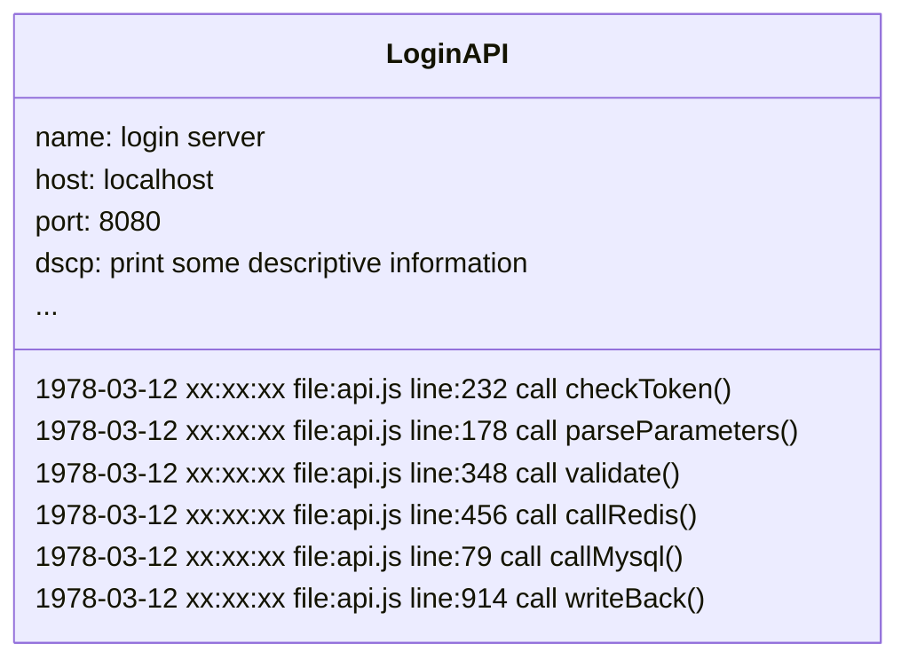
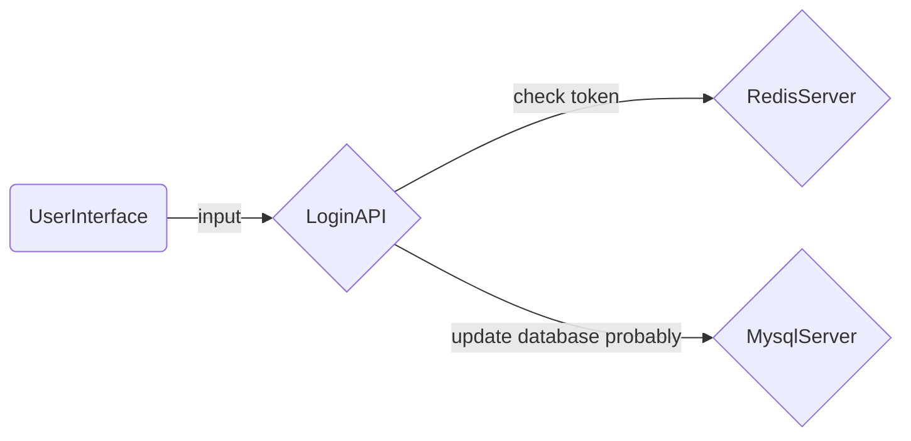

Program logs are the breadcrumbs of the code execution process; finding these breadcrumbs not only helps to locate hidden bugs in the code :fontawesome-solid-bug:, but more importantly, continuous program log tracing provides a way to make the program execution process observable.

## Starting with Logs {#log}

> Only log files

Before tracing systems appeared, our only way to obtain system operational status was through local logs. In fact, before tracing systems, log services went through several generations of different product iterations.

By directing standard output and standard error output to a local file and leveraging the power of the operating system, ideally we can get an unbroken stream of program execution logs. As long as the system doesn't crash, there are no single-point errors, and no processes interrupt your file write stream, you will always have a record of the process execution and be able to search for events of interest within very large files.

## Before Traceability {#befor}

> Log servers

The importance of program logs has led to the creation of independent log servers. Yes, you no longer need to worry about SPoF. Log servers continuously record program logs sent by processes on fixed ports.

In the early stages of log servers, their mode of operation was more like that of file servers, except the interface changed from the terminal to the browser, and the logs available for retrieval expanded from a single program to multiple programs. However, the recorded logs were still those piles of process execution order records, as simulated below for a login server's logs.

In the log text, you can only see isolated program events, and it is difficult to understand the state of program operations from just an execution document. In the later stages of file servers, specialized UIs for log viewing and a series of program runtime environment status parameters appeared. At this stage, log services became more like database services built on log files, allowing you to search for program events of interest more smoothly.

## Tracing Systems {##tracing}

> The rise of observability

Program tracing systems are not advanced log services and do not even belong to the log category, but they are real breadcrumbs. Tracing systems generate execution state data structures (Spans) during the process execution. As the processing flow progresses step by step, numerous Spans are connected according to their execution order, forming the current process' trace (Tracing). Multiple processes connected according to their invocation order form the observable execution state of the current system.

Still using a fictional login service as an example:

The above diagram only shows the trace diagrams produced by tracing systems in multi-process environments. In fact, in tracing systems, you can also see the state of each execution process like in logs. If you wish, you can customize every field in the reported state data structure (Span) and assign them meaning. Tracing systems are not used for debugging ("of course, bugs cannot hide in tracing systems"), but rather provide a positive feedback mechanism by thoroughly depicting the system's operational state to identify system issues and thereby drive iterative improvements in the system.

Tracing systems primarily address two levels of problems:

- How to collect status data

Based on the technology stack implemented by monitored systems, common [tracing system solutions](datakit-tracing-introduction.md#sln) in the market offer both automatic and manual data collection methods. By monitoring the program runtime, system tracing can be fully automated for systems based on technologies such as NodeJS, JAVA, C#, etc. Additionally, tracing systems provide Tracing Libraries for all technology stacks so that we can achieve full manual system tracing by introducing dependencies into projects and making simple code edits.

- How to organize status data

The natural caller-callee relationship in program execution causes all tracing systems in the market to define status data structures in parent-child relationships. ParentID and ID associate the Spans generated by callers and callees. In the same process, different invocation processes (including threads under concurrent environments) connect the parent and child processes by passing contexts containing the caller ID. Between different processes, the caller sends contexts containing its own ID between different processes (via networks or pipes, etc., which allow cross-process communication) to associate the parent and child processes.

## Tracing System Solutions {#sln}

Application performance monitoring (APM) capabilities in the market could be said to be indispensable. Below is a brief introduction to several common solutions in the market.

[DataDog](https://docs.datadoghq.com/tracing/){:target="_blank"}

: Currently the most comprehensive APM solution provider, offering monitoring and deep visualization capabilities for programs in production environments. It provides out-of-the-box performance monitoring dashboards for network services, message queues, databases, etc., to monitor all program events. Tracing chain data can be seamlessly associated across services and containers with sessions, logs, system writes, comprehensive detection, networks, processes, and system basic metrics sets. In DataDog, you can directly locate the code causing slow chains due to system bottlenecks while investigating an issue.

[Jaeger](https://www.jaegertracing.io/docs/){:target="_blank"}

: Jaeger is an open-source distributed tracing system inspired by Dapper and OpenZipkin, released by Uber Technologies. It is especially suitable for monitoring systems based on microservice architectures and provides the following capabilities:
: - Distributed context propagation
: - Distributed transaction monitoring
: - Root cause analysis capability
: - Service dependency analysis
: - Performance optimization
: If interested in Jaeger, you can refer to Uber Tech Team's [internal practices](https://www.uber.com/blog/distributed-tracing/){:target="_blank"}.

[OpenTelemetry](https://opentelemetry.io/docs/){:target="_blank"}

: OpenTelemetry (OTEL) is an open-source program visualization framework developed based on third-party tracing protocols, providing detection, generation, collection, and pumping of monitoring data such as tracing chains, metric sets, logs, etc. As an industry standard, it is natively supported by many service providers.

[SkyWalking](https://skywalking.apache.org/docs/){:target="_blank"}

: SkyWalking is an open-source APM system that provides monitoring, tracing, diagnostics, and other capabilities for distributed cloud-native systems. Core capabilities include:
: - Analysis of server-side metric sets
: - Root cause analysis capability
: - Service topology analysis
: - Service dependency analysis
: - Slow service discovery
: - Performance optimization
: - Cache monitoring, read/write performance, and slow access discovery
: - Database monitoring, slow query discovery
: - Message queue performance monitoring
: - Browser performance detection, root tracing capability
: - Infrastructure monitoring supporting mainstream cloud providers
: - System alerts

[Zipkin](https://zipkin.io/pages/quickstart.html){:target="_blank"}

: Zipkin is a distributed tracing system that collects timestamped data to complete system monitoring and discover service-level system issues. Zipkin provides an integrated solution for collecting and querying data, allowing you to jump directly from logs to traces in Zipkin's UI based on a TraceID and offers diverse data-based search capabilities.

[Datakit](https://docs.guance.com/datakit/datakit-tracing/){:target="_blank"}

: Unlike the aforementioned tracing systems, Datakit itself does not produce any program execution state data (Span) nor alters the data organization form. Datakit listens on network ports to receive trace data sent by major mainstream tracing systems. Datakit's tracing module not only provides out-of-the-box capabilities but is almost zero-configuration. Users can seamlessly transition to Datakit from any other tracing system without friction.

: Datakit is a link data processing & analysis network service. As a network application, Datakit has the following characteristics:

: - Datakit can continuously handle high volumes of traffic data. Using multi-path local caching technology, Datakit maintains low CPU load even when handling flood-level tracing data.
: - Datakit can operate continuously in high-concurrency network request environments. Datakit uses access policies and thread pools to handle high-concurrency network requests and keeps CPU load within a lower range.
: - Datakit can seamlessly integrate with various mainstream tracing systems currently on the market and continues to expand.

: As an analytical computation tool, Datakit has the following characteristics:

: - Highly flexible configurability. You can use Datakit’s tracing data capabilities with zero configuration or customize them with simple configurations to enable features such as sampling, rare link picking, and resource closure.
: - Efficient and distributed consistent sampling algorithms.
: - Various front-end data processing Filters meet daily data processing needs.
: - Back-end Pipeline support allows you to leverage [Guance's powerful Pipeline scripts](https://docs.guance.com/logs/pipelines/text-processing/){:target="_blank"} to customize data before sending it to the center.

## Summary {#conclude}

Tracing systems provide multi-dimensional, deep visualization capabilities of system execution states. While changing system maintenance and development forms, they significantly reduce development and operations costs and offer various analytical tools to discover system bottlenecks, providing valuable clues for subsequent system version iterations.