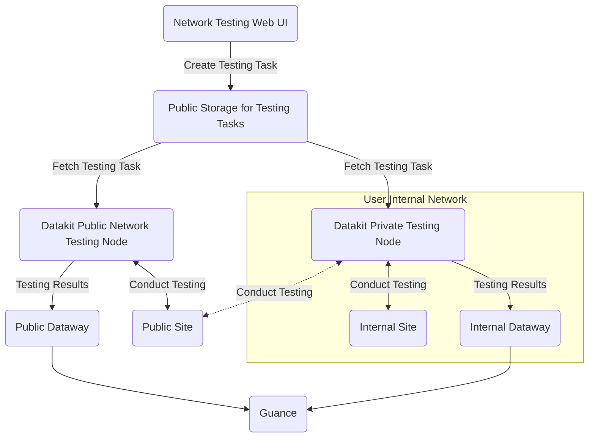

:fontawesome-brands-linux: :fontawesome-brands-apple: :material-kubernetes: :material-docker:

---

This collector is for collecting network testing results. All testing data generated will be reported to Guance.

## Configuration {#config}

<!-- markdownlint-disable MD046 -->
=== "HOST Installation"

    For private testing node deployment, you need to [create a private testing node on the Guance page](../synthetic-tests/self-node.md). After creation, fill in the relevant information from the page into `conf.d/network/dialtesting.conf`:

    Navigate to the `conf.d/network` directory under the DataKit installation directory, copy `dialtesting.conf.sample` and rename it to `dialtesting.conf`. An example is as follows:
    
    ```toml
        
    [[inputs.dialtesting]]
      # We can also configure a JSON path like "file:///your/dir/json-file-name"
      server = "https://dflux-dial.guance.com"
    
      # [require] node ID
      region_id = "default"
    
      # if server are dflux-dial.guance.com, ak/sk required
      ak = ""
      sk = ""
    
      # The interval to pull the tasks.
      pull_interval = "1m"
    
      # The timeout for the HTTP request.
      time_out = "30s"
    
      # The number of the workers.
      workers = 6
    
      # Collect related metrics when job execution time error interval is larger than task_exec_time_interval
      task_exec_time_interval = "5s"
     
      # Stop the task when the task failed to send data to dataway over max_send_fail_count.
      max_send_fail_count = 16
    
      # The max sleep time when send data to dataway failed.
      max_send_fail_sleep_time = "30m"
    
      # The max number of jobs sending data to dataway in parallel. Default 10.
      max_job_number = 10
    
      # The max number of job chan. Default 1000.
      max_job_chan_number = 1000
    
      # Disable internal network task.
      disable_internal_network_task = true
    
      # Disable internal network cidr list.
      disabled_internal_network_cidr_list = []
    
      # Custom tags.
      [inputs.dialtesting.tags]
      # some_tag = "some_value"
      # more_tag = "some_other_value"
      # ...
    ```

    After configuration, [restart DataKit](../datakit/datakit-service-how-to.md#manage-service).

=== "Kubernetes"

    You can inject the collector configuration via [ConfigMap](../datakit/datakit-daemonset-deploy.md#configmap-setting) or [configure ENV_DATAKIT_INPUTS](../datakit/datakit-daemonset-deploy.md#env-setting) to enable the collector.

    You can also modify the configuration parameters using environment variables (you need to add it as a default collector in ENV_DEFAULT_ENABLED_INPUTS):

    - **ENV_INPUT_DIALTESTING_ENV_INPUT_DIALTESTING_DISABLE_INTERNAL_NETWORK_TASK**
    
        Whether to allow internal network address/service testing. Default is not allowed.
    
        **Field Type**: Boolean
    
        **Collector Configuration Field**: `disable_internal_network_task`
    
        **Example**: `true`
    
        **Default Value**: `false`
    
    - **ENV_INPUT_DIALTESTING_ENV_INPUT_DIALTESTING_DISABLED_INTERNAL_NETWORK_CIDR_LIST**
    
        List of CIDR addresses prohibited from testing.
    
        **Field Type**: List
    
        **Collector Configuration Field**: `disabled_internal_network_cidr_list`
    
        **Example**: `["192.168.0.0/16"]`
    
        **Default Value**: `-`
    
    - **ENV_INPUT_DIALTESTING_ENV_INPUT_DIALTESTING_ENABLE_DEBUG_API**
    
        Prohibit testing debug API (default prohibition).
    
        **Field Type**: Boolean
    
        **Collector Configuration Field**: `env_input_dialtesting_enable_debug_api`
    
        **Example**: `false`
    
        **Default Value**: `false`

---

???+ attention

    Currently, only Linux testing nodes support "route tracking," with tracking data saved in the [`traceroute`](dialtesting.md#fields) field of related metrics.
<!-- markdownlint-enable -->

### Testing Node Deployment {#arch}

Below is the network deployment topology diagram for testing nodes, showing two types of testing node deployment methods:

- Public Network Testing Nodes: Directly use the globally deployed testing nodes by Guance to monitor **public** service operations.
- Private Network Testing Nodes: If you need to test services within your **internal network**, you must deploy **private** testing nodes yourself. Of course, if the network allows, these private testing nodes can also be used to test services on the public network.

Regardless of whether it's a public network testing node or a private testing node, both can create testing tasks via the Web interface.



## Logs {#logging}


### `http_dial_testing`

- Tags


| Tag | Description |
|  ----  | --------|
|`city`|The name of the city|
|`country`|The name of the country|
|`datakit_version`|The DataKit version|
|`dest_ip`|The IP address of the destination|
|`df_label`|The label of the task|
|`internal`|The boolean value, true for domestic and false for overseas|
|`isp`|ISP, such as `chinamobile`, `chinaunicom`, `chinatelecom`|
|`method`|HTTP method, such as `GET`|
|`name`|The name of the task|
|`node_name`|The name of the node|
|`owner`|The owner name|
|`proto`|The protocol of the HTTP, such as 'HTTP/1.1'|
|`province`|The name of the province|
|`status`|The status of the task, either 'OK' or 'FAIL'|
|`status_code_class`|The class of the status code, such as '2xx'|
|`status_code_string`|The status string, such as '200 OK'|
|`url`|The URL of the endpoint to be monitored|

- Metrics List


| Metric | Description | Type | Unit |
| ---- |---- | :---:    | :----: |
|`config_vars`|The configuration variables of the task|string|-|
|`fail_reason`|The reason that leads to the failure of the task|string|-|
|`message`|The message string which includes the header and the body of the request or the response|string|-|
|`response_body_size`|The length of the body of the response|int|B|
|`response_connection`|HTTP connection time|float|μs|
|`response_dns`|HTTP DNS parsing time|float|μs|
|`response_download`|HTTP downloading time|float|μs|
|`response_ssl`|HTTP ssl handshake time|float|μs|
|`response_time`|The time of the response|int|μs|
|`response_ttfb`|HTTP response `ttfb`|float|μs|
|`seq_number`|The sequence number of the test|int|count|
|`status_code`|The response code|int|-|
|`success`|The number to specify whether is successful, 1 for success, -1 for failure|int|-|
|`task`|The raw task string|string|-|


### `tcp_dial_testing`

- Tags


| Tag | Description |
|  ----  | --------|
|`city`|The name of the city|
|`country`|The name of the country|
|`datakit_version`|The DataKit version|
|`dest_host`|The name of the host to be monitored|
|`dest_ip`|The IP address|
|`dest_port`|The port of the TCP connection|
|`df_label`|The label of the task|
|`internal`|The boolean value, true for domestic and false for overseas|
|`isp`|ISP, such as `chinamobile`, `chinaunicom`, `chinatelecom`|
|`name`|The name of the task|
|`node_name`|The name of the node|
|`owner`|The owner name|
|`proto`|The protocol of the task|
|`province`|The name of the province|
|`status`|The status of the task, either 'OK' or 'FAIL'|

- Metrics List


| Metric | Description | Type | Unit |
| ---- |---- | :---:    | :----: |
|`config_vars`|The configuration variables of the task|string|-|
|`fail_reason`|The reason that leads to the failure of the task|string|-|
|`message`|The message string includes the response time or fail reason|string|-|
|`response_time`|The time of the response |int|μs|
|`response_time_with_dns`|The time of the response, which contains DNS time|int|μs|
|`seq_number`|The sequence number of the test|int|count|
|`success`|The number to specify whether is successful, 1 for success, -1 for failure|int|-|
|`task`|The raw task string|string|-|
|`traceroute`|The json string fo the `traceroute` result|string|-|


### `icmp_dial_testing`

- Tags


| Tag | Description |
|  ----  | --------|
|`city`|The name of the city|
|`country`|The name of the country|
|`datakit_version`|The DataKit version|
|`dest_host`|The name of the host to be monitored|
|`df_label`|The label of the task|
|`internal`|The boolean value, true for domestic and false for overseas|
|`isp`|ISP, such as `chinamobile`, `chinaunicom`, `chinatelecom`|
|`name`|The name of the task|
|`node_name`|The name of the node|
|`owner`|The owner name|
|`proto`|The protocol of the task|
|`province`|The name of the province|
|`status`|The status of the task, either 'OK' or 'FAIL'|

- Metrics List


| Metric | Description | Type | Unit |
| ---- |---- | :---:    | :----: |
|`average_round_trip_time`|The average time of the round trip(RTT)|float|μs|
|`average_round_trip_time_in_millis`|The average time of the round trip(RTT), deprecated|float|ms|
|`config_vars`|The configuration variables of the task|string|-|
|`fail_reason`|The reason that leads to the failure of the task|string|-|
|`max_round_trip_time`|The maximum time of the round trip(RTT)|float|μs|
|`max_round_trip_time_in_millis`|The maximum time of the round trip(RTT), deprecated|float|ms|
|`message`|The message string includes the average time of the round trip or the failure reason|string|-|
|`min_round_trip_time`|The minimum time of the round trip(RTT)|float|μs|
|`min_round_trip_time_in_millis`|The minimum time of the round trip(RTT), deprecated|float|ms|
|`packet_loss_percent`|The loss percent of the packets|float|-|
|`packets_received`|The number of the packets received|int|count|
|`packets_sent`|The number of the packets sent|int|count|
|`seq_number`|The sequence number of the test|int|count|
|`std_round_trip_time`|The standard deviation of the round trip|float|μs|
|`std_round_trip_time_in_millis`|The standard deviation of the round trip, deprecated|float|ms|
|`success`|The number to specify whether is successful, 1 for success, -1 for failure|int|-|
|`task`|The raw task string|string|-|
|`traceroute`|The `json` string fo the `traceroute` result|string|-|


### `websocket_dial_testing`

- Tags


| Tag | Description |
|  ----  | --------|
|`city`|The name of the city|
|`country`|The name of the country|
|`datakit_version`|The DataKit version|
|`df_label`|The label of the task|
|`internal`|The boolean value, true for domestic and false for overseas|
|`isp`|ISP, such as `chinamobile`, `chinaunicom`, `chinatelecom`|
|`name`|The name of the task|
|`node_name`|The name of the node|
|`owner`|The owner name|
|`proto`|The protocol of the task|
|`province`|The name of the province|
|`status`|The status of the task, either 'OK' or 'FAIL'|
|`url`|The URL string, such as `ws://www.abc.com`|

- Metrics List


| Metric | Description | Type | Unit |
| ---- |---- | :---:    | :----: |
|`config_vars`|The configuration variables of the task|string|-|
|`fail_reason`|The reason that leads to the failure of the task|string|-|
|`message`|The message string includes the response time or the failure reason|string|-|
|`response_message`|The message of the response|string|-|
|`response_time`|The time of the response|int|μs|
|`response_time_with_dns`|The time of the response, include DNS|int|μs|
|`sent_message`|The sent message |string|-|
|`seq_number`|The sequence number of the test|int|count|
|`success`|The number to specify whether is successful, 1 for success, -1 for failure|int|-|
|`task`|The raw task string|string|-|


### `multi_dial_testing`

- Tags


| Tag | Description |
|  ----  | --------|
|`city`|The name of the city|
|`country`|The name of the country|
|`datakit_version`|The DataKit version|
|`df_label`|The label of the task|
|`internal`|The boolean value, true for domestic and false for overseas|
|`isp`|ISP, such as `chinamobile`, `chinaunicom`, `chinatelecom`|
|`name`|The name of the task|
|`node_name`|The name of the node|
|`owner`|The owner name|
|`province`|The name of the province|
|`status`|The status of the task, either 'OK' or 'FAIL'|

- Metrics List


| Metric | Description | Type | Unit |
| ---- |---- | :---:    | :----: |
|`config_vars`|The configuration variables of the task|string|-|
|`fail_reason`|The reason that leads to the failure of the task|string|-|
|`last_step`|The last number of the task be executed|int|-|
|`message`|The message string which includes the header and the body of the request or the response|string|-|
|`response_time`|The time of the response|int|μs|
|`seq_number`|The sequence number of the test|int|count|
|`steps`|The result of each step|string|-|
|`success`|The number to specify whether is successful, 1 for success, -1 for failure|int|-|
|`task`|The raw task string|string|-|


### `traceroute` {#traceroute}

`traceroute` is the JSON text of "route tracking" data. The entire data is an array object, where each element records one routing probe situation. An example is as follows:

```json
[
    {
        "total": 2,
        "failed": 0,
        "loss": 0,
        "avg_cost": 12700395,
        "min_cost": 11902041,
        "max_cost": 13498750,
        "std_cost": 1129043,
        "items": [
            {
                "ip": "10.8.9.1",
                "response_time": 13498750
            },
            {
                "ip": "10.8.9.1",
                "response_time": 11902041
            }
        ]
    },
    {
        "total": 2,
        "failed": 0,
        "loss": 0,
        "avg_cost": 13775021,
        "min_cost": 13740084,
        "max_cost": 13809959,
        "std_cost": 49409,
        "items": [
            {
                "ip": "10.12.168.218",
                "response_time": 13740084
            },
            {
                "ip": "10.12.168.218",
                "response_time": 13809959
            }
        ]
    }
]
```

**Field Description:**

| Field       | Type          | Description                        |
| :---       | ---           | ---                         |
| `total`    | number        | Total number of probes                  |
| `failed`   | number        | Number of failures                    |
| `loss`     | number        | Failure percentage                  |
| `avg_cost` | number        | Average latency (μs)                |
| `min_cost` | number        | Minimum latency (μs)                |
| `max_cost` | number        | Maximum latency (μs)                |
| `std_cost` | number        | Standard deviation of latency (μs)              |
| `items`    | Array of Items | Information about each probe (see below `items` field description) |

**`items` Field Description**

| Field            | Type   | Description                        |
| :---            | ---    | ---                         |
| `ip`            | string | IP address, or `*` if failed |
| `response_time` | number | Response time (μs)                |

## Testing Collector Self-Metric Collection {#metric}

The testing collector exposes [Prometheus metrics](../datakit/datakit-metrics.md). To report these metrics to Guance, you can collect them using the [DataKit collector](dk.md), with reference configurations as follows:

```toml
[[inputs.dk]]
  ......

  metric_name_filter = [
  
  ### others...
  
  ### dialtesting
  "datakit_dialtesting_.*",

  ]

  ........

```