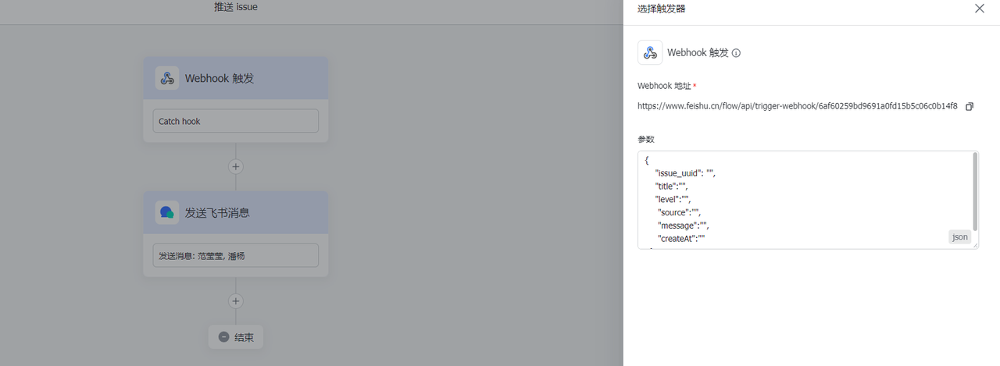
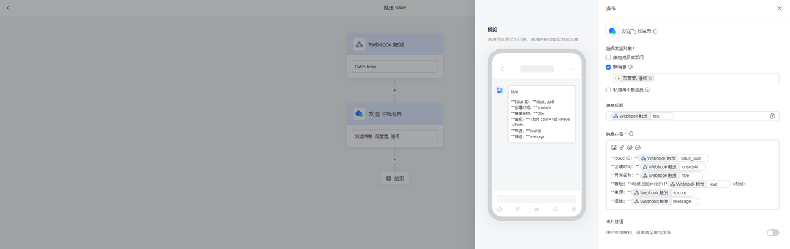
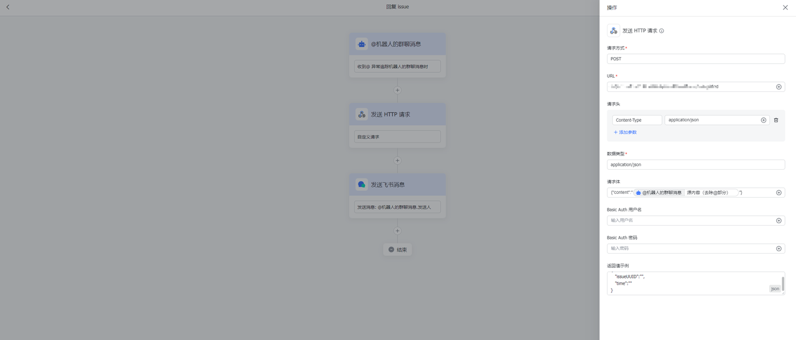
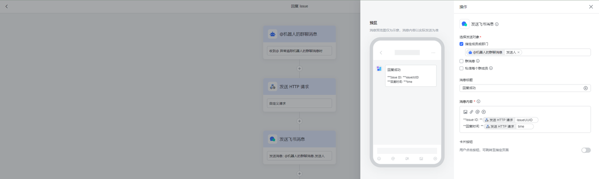
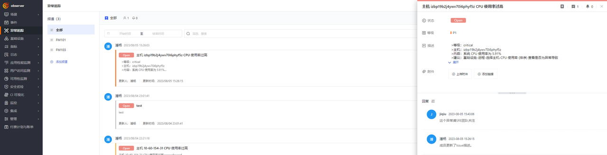

<!-- markdownlint-disable MD025 -->

# Lark and Exception Tracking Integration

<!-- markdownlint-enable -->

To get new issues from exception tracking more timely and conveniently, we can create a Lark, DingTalk or WeChat Work bot in the internal group to receive new issue alerts from exception tracking, or new reply alerts. This can help us handle issues in a timely manner. We can also quickly respond to issues by @bot, which can improve our exception handling efficiency.


## Configuration {#config}

### Preparation

1. Get the [API Key](https://docs.guance.com/management/api-key/) of the workspace for tracking issues in Observability Cloud.
2. Create a [Lark bot assistant application](https://www.feishu.cn/hc/zh-CN/articles/495678957203-如何使用机器人应用).
3. Deploy a [Dataflux Func Observability Cloud Special Edition](https://func.guance.com/#/).


### Deployment Process
<!-- markdownlint-disable MD013 -->
#### Write a rule for the Lark bot to receive issue information
<!-- markdownlint-enable -->

Since Lark does not directly provide an outgoing dialogue mode bot application, we need to implement a similar dialogue function through multiple bot application processes.


First, we need a process to capture new issues or new reply information


We can trigger the bot's message push process by calling Lark's webhook when our listening script detects a new issue record or reply



We can capture some parameters in our Issue as input parameters for the bot to send Lark messages by configuring the Webhook trigger



We can write the message style we want to present in markdown, and refer to the parameters we configured above in webhook to present the message

#### Write listening script

After configuring the rule for receiving issues, we need to write a script in the already installed and configured Dataflux Func to get new messages and send them to the Lark bot via webhook.

First, we need to introduce some constants, such as the OpenAPI address for getting new Issues, API Key, etc.

```Python
import requests
import time
import json
from datetime import datetime, timedelta

# Increment 1 minute, get the time 1 minute ago
one_minute_ago = datetime.now() - timedelta(minutes=1)
one_minute_ago_time = int(one_minute_ago.timestamp())
# Current timestamp
current_time = int(time.time())
# Lark webhook
feishu_webhook_url = "https://www.feishu.cn/flow/api/trigger-webhook/6af60259bd9691a0fd1xxxxxxx"
# Observability Cloud OpenAPI address
base_url = 'https://openapi.guance.com'
channel_list_url = base_url + '/api/v1/channel/quick_list'
issue_list_url = base_url + '/api/v1/issue/list'
# Observability Cloud API key
df_api_key = '5K3IcvtWbSZ2inxxxxxxxxxxx'
```

After introducing the constants we need, we need two methods to complete the acquisition of new issues. The first step is to understand the display logic of exception tracking. In the exception tracking module, all issues will be managed by channels, but all newly created issues will appear in the **All** channel. So first we need a method to get all channel lists to find out the **All Channel** we want to listen to  

```Python
# Get channel list
def get_channel_list(df_api_key, channel_list_url):
    # Parameters to be sent
    params = {
        'DF-API-KEY': df_api_key,
        'Content-Type': 'application/json;charset=UTF-8'
    }

    try:
        # Send GET request
        response = requests.get(channel_list_url, headers=params)

        # Check response status code
        if response.status_code == 200:
            # Parse JSON response (if applicable)
            channel_list = response.json()["content"]
            channels = []
            # Process response data
            # print("Response:", data)
            for channel in channel_list:
                data = {
                    "id": channel["id"],
                    "name": channel["name"],
                    "uuid": channel["uuid"]
                }
                channels.append(data)
            return channels
        else:
            print("Request failed with status code:", response.status_code)

    except requests.exceptions.RequestException as e:
        print("Request error:", e)
```

After obtaining the Channel_UUID we need, we can find the newly added Issue in the current channel through the channel ID. At the same time, when we get the new issue, we can also send it to our Lark bot's webhook

```Python
# Get issue list and send Lark message
def get_issue_list_to_feishu(df_api_key, issue_list_url, channelUUID, feishu_webhook_url):
    # Parameters to be sent
    headers = {
        'DF-API-KEY': df_api_key,
        'Content-Type': 'application/json;charset=UTF-8'
    }

    body = {
        'channelUUID': channelUUID,
        'startTime': one_minute_ago_time,
        'endTime': current_time,
    }

    try:
        # Send GET request
        response = requests.post(issue_list_url, headers=headers, data=json.dumps(body))

        # Check response status code
        if response.status_code == 200:
            # Parse JSON response (if applicable)
            issue_lists = response.json()['content']
            if len(issue_lists):
                for issue in issue_lists:
                    headers = {
                        'Content-Type': 'application/json',
                    }
                    data = {
                        "issue_uuid": issue["uuid"],
                        "title": issue["name"],
                        "level": issue["level"],
                        "source": issue["resource"],
                        "message": issue["description"],
                        "createAt": datetime.fromtimestamp(issue["createAt"]).strftime('%Y-%m-%d %H:%M:%S')
                    }
                    try:
                        response = requests.post(feishu_webhook_url, headers=headers, data=json.dumps(data))
                        response.raise_for_status()
                        print("Message sent successfully to Lark")
                    except requests.exceptions.HTTPError as errh:
                        print(f"Http Error: {errh}")
                    except requests.exceptions.ConnectionError as errc:
                        print(f"Error Connecting: {errc}")
                    except requests.exceptions.Timeout as errt:
                        print(f"Timeout Error: {errt}")
                    except requests.exceptions.RequestException as err:
                        print(f"OOps: Something Else {err}")
        else:
            print("Request failed with status code:", response.status_code)

    except requests.exceptions.RequestException as e:
        print("Request error:", e)
```

Finally, we need a main method that can configure scheduled tasks to complete the task of getting new Issues automatically

```Python
# Main method
@DFF.API('Get issue and send to Lark')
def main():
    channel_list = get_channel_list(df_api_key, channel_list_url)
    print(f"channel_list: {channel_list}")
    for channel in channel_list:
        if channel["name"] == "default":
            get_issue_list_to_feishu(df_api_key, issue_list_url, channel["uuid"], feishu_webhook_url)
```

After writing the script, we need to create automatic triggering tasks for the script we just wrote in [Management / Automatic Trigger Configuration], and select the **main method: Get issue and send to Lark** as the execution function. After configuring Crontab to execute once every minute, click Save to complete the creation of the task.

<!-- markdownlint-disable MD013 -->
#### Receive new issues in Lark and configure the reply process
<!-- markdownlint-enable -->

After configuring the task, we can click Execute to trigger the task immediately, or trigger it automatically when there is a new issue.

When there is a new Issue in exception tracking, we can get a new Issue reminder in the Lark group where we configured the bot application.


At this time, if we want to reply to this Issue record, we need to configure another Lark bot application's reply Issue rule


The trigger condition for this rule is when we need to reply to the Issue message, the action of @bot is triggered. We can configure this rule to be effective in the specified group master, or configure the specified trigger words and other conditions


After configuring the bot trigger rule, we need to create our reply message rule. Since we need to parse the IssueID in the reply message, we need an API service as a transit to send the add comment request to OpenAPI



> Since the original message will carry @bot, you need to choose **source message (remove @ part)** when selecting parameters

We can verify whether our comments are added successfully by filling in the return example of the API



When the comment is sent successfully, we can send a notification of successful message sending to the message sender from the return parameters we just obtained

#### Write a transit script to send comments

Since we need to parse the sent messages, we need to create an API service in Dataflux Func using the authorization link function. After receiving the messages and parsing them, we send a request to add comments to OpenAPI, and add the returned `Json` structure to confirm the successful message.

```Python
import requests
import time
import json
from datetime import datetime, timedelta


# Observability Cloud API key
df_api_key = '5K3IcvtWbSZ2in4ujU07xxxxxxxxxx'
# Observability Cloud OpenAPI address
base_url = 'https://openapi.guance.com'
create_issue_reply_url = base_url + '/api/v1/issue/reply/create'


@DFF.API('Create_Issue_Reply')
def create_issue_reply(content):
    print(f"conntent: {content}")
    param_list = content.split('#')
    issueUUID = param_list[1]
    content = param_list[2]
    # Parameters to be sent
    headers = {
        'DF-API-KEY': df_api_key,
        'Content-Type': 'application/json;charset=UTF-8'
    }

    body = {
        'issueUUID': issueUUID,
        'content': content,
        'extend': {}
    }

    try:
        # Send GET request
        response = requests.post(create_issue_reply_url, headers=headers, data=json.dumps(body))
        print("repsonse: ",response.json())
        # Check response status code
        if response.status_code == 200:
            # Parse JSON response (if applicable)
            result = response.json()['content']
            return {
                "issueUUID": issueUUID,
                "time": datetime.fromtimestamp(result["updateAt"]).strftime('%Y-%m-%d %H:%M:%S')
            }
        else:
            print("Request failed with status code:", response.status_code)

    except requests.exceptions.RequestException as e:
        print("Request error:", e)
```

After writing the API script, we need to open the API service as the receiving end of the Lark webhook HTTP request through [Management / Authorization Link]


Since we need to parse parameters in transit, we need to follow the specified rules when @bot sends messages to successfully send messages. The way here is `#issueUUID#message content`. When we get the correct parameters, we can send the reply content to OpenAPI


When the message is successfully sent, we can get data from our own configured return structure for notification


You can also view the content of our reply message in Studio
