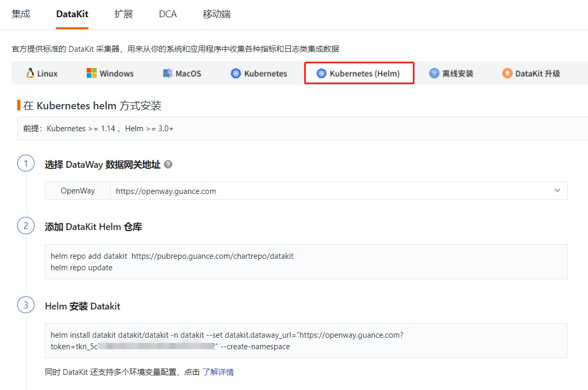
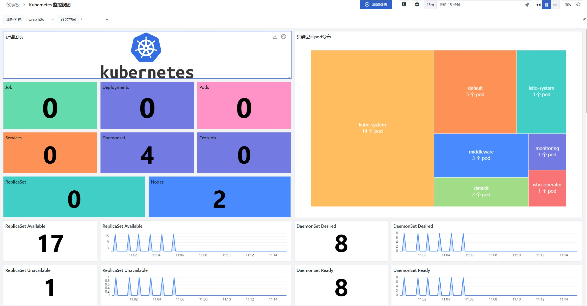

<!-- markdownlint-disable MD025 -->
# Collect Huawei Cloud CCE Metrics Data Using <<< custom_key.brand_name >>>
<!-- markdownlint-enable -->

<<< custom_key.brand_name >>> supports monitoring the operation status and service capabilities of various resources in CCE, including CONTAINERS, Pods, Services, Deployments, Clusters, Nodes, Replica Sets, Jobs, Cron Jobs, etc. You can install `DataKit` in Kubernetes via DaemonSet to complete data collection for Kubernetes resources. Finally, you can monitor the operation status of various Kubernetes resources in real-time through <<< custom_key.brand_name >>>.

## Configuration {#config}

### Preparation

- Create a <<< custom_key.brand_name >>> account
- Create a Huawei Cloud CCE cluster

### Deployment Process

There are two methods to install `DataKit` via DaemonSet in Kubernetes:

- Helm installation
- YAML installation

#### **Helm Installation**

##### **Prerequisites**

- Kubernetes >= 1.14
- Helm >= 3.0+

##### 1. Add `Datakit` Helm Repository

To install the `Datakit` collector using Helm, you need to first install Helm on your server. After installing Helm, add the Datakit Helm repository.

```Bash
helm repo add datakit https://pubrepo.<<< custom_key.brand_main_domain >>>/chartrepo/datakit 
helm repo update
```

> After adding the `Datakit` Helm repository, you must run `helm repo update` to update the local repository.


##### 2. Download the `Datakit` chart

```Bash
# Download datakit chart
helm pull datakit/datakit
# Extract 
tar xvf datakit-1.14.2.tgz
```


##### 3. Customize `Datakit` Installation Parameters

Uncomment ENV_NAMESPACE under extraEnvs and modify the cluster name.

```YAML
extraEnvs:
#  - name: ENV_NAMESPACE # electoral
#    value: k8s
```

Change it to

```YAML
extraEnvs:
  - name: ENV_NAMESPACE # electoral
    value: cluster_name_k8s=hwcce-k8s
  - name: ENV_GLOBAL_ELECTION_TAGS
    value: cluster_name_k8s=hwcce-k8s
```

##### 4. Helm Install `Datakit`

Modify the token data in `datakit.dataway_url`.

```Bash
helm install datakit -n datakit -f datakit/values.yaml datakit --set datakit.dataway_url="https://openway.<<< custom_key.brand_main_domain >>>?token=tkn_1661b3cb5fc442719eae064edb979b5d" --create-namespace
```

The token can be obtained from the "Integration" - "Datakit" section of the <<< custom_key.brand_name >>> workspace.



After replacing the token, execute the Helm installation of Datakit.


##### 5. Check Deployment Status

After the Datakit installation is complete, you can check the deployment status by running `helm -n datakit ls`.


##### 6. View and Analyze Collected K8S Data in the <<< custom_key.brand_name >>> Workspace

If the `DataKit` deployment status is normal, you can view and analyze the collected K8S data in the "Infrastructure" - "Containers" section of the <<< custom_key.brand_name >>> workspace.


##### 7. Add Dashboard

After the K8S data is collected normally, you can create a new dashboard in the "Scenarios" - "Dashboards" - "Create Dashboard" section of the <<< custom_key.brand_name >>> workspace, search for the Kubernetes monitoring view, and see the following dashboard.



#### YAML Installation

##### 1. Download YAML File

Before enabling Kubernetes resource collection, use a terminal tool to log in to the server and execute the following script command to download the yaml file.

```Bash
wget https://static.<<< custom_key.brand_main_domain >>>/datakit/datakit.yaml
```


##### 2. Modify `datakit.yaml` File

Edit the configuration of the data gateway `dataway` in the `datakit.yaml` file, replace the `token` with the workspace's `token`.

``` yaml
1.  - name: ENV_DATAWAY
2.    value: https://openway.<<< custom_key.brand_main_domain >>>?token=<your-token> # Insert the actual dataway address here
```

Add environment variable `ENV_NAMESPACE` and set the cluster name; the name can be customized, for example, set it as `hwcce_k8s`:

``` yaml
1. - name: ENV_NAMESPACE 
     value: hwcce_k8s # Insert the cluster name here
```

Add the environment variable `ENV_GLOBAL_ELECTION_TAGS`, and set tags to distinguish the cluster for election-related metrics:

``` yaml
1. - name: ENV_GLOBAL_ELECTION_TAGS
2.   value: cluster_name_k8s=hwcce_k8s # Insert the cluster name here
```

Modify the environment variable `ENV_GLOBAL_TAGS`, and set global tags for non-election-related metrics:

``` yaml
1. - name: ENV_GLOBAL_TAGS
2.   value: host=__datakit_hostname,host_ip=__datakit_ip,cluster_name_k8s=hwcce_k8s # Add the cluster_name_k8s cluster name here
```

The `token` can be obtained from the "Integration" - "Datakit" section of the <<< custom_key.brand_name >>> workspace.


After replacing and modifying, save the `datakit.yaml` file.


##### 3. Install YAML File

After modifying the data gateway in the `datakit.yaml` file, use the command `kubectl apply -f datakit.yaml` to install the yaml file, where `datakit.yaml` is the filename, and should match the filename you saved.


##### 4. Check Datakit Running Status

After installing the yaml file, a `datakit` DaemonSet deployment will be created. You can check the running status of `datakit` by running the command `kubectl get pod -n datakit`.


##### 5. View and Analyze Collected K8S Data in the <<< custom_key.brand_name >>> Workspace


##### 6. Add Dashboard

After the K8S data is collected normally, you can create a new dashboard in the "Scenarios" - "Dashboards" - "Create Dashboard" section of the <<< custom_key.brand_name >>> workspace, search for the Kubernetes monitoring view, and see the following dashboard.

